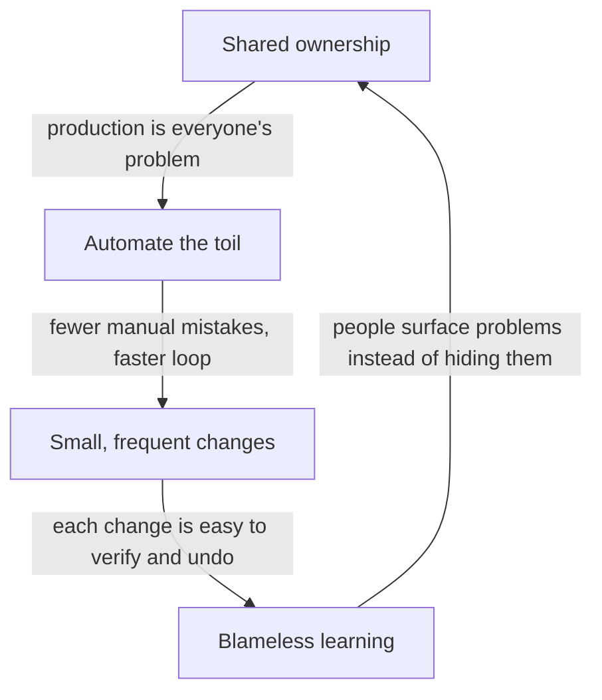

# The Culture Underneath

We've torn down the wall ([Phase 1](01-not-a-team.md)) and seen the loop that replaces it ([Phase 2](02-the-loop.md)). But here's the thing nobody can sell you: you can buy every tool and draw the loop on every whiteboard and still not be "doing DevOps." Underneath the loop is a set of *habits* — a culture — and that's the part that actually makes it work.

⚠️ **The single most important thing in this whole guide:** **DevOps is not a job title or a tool.** You cannot hire one "DevOps engineer," buy one "DevOps platform," and declare victory — that usually just renames the ops team and rebuilds the wall with a shinier sign on it. DevOps is a way a *whole team* works together, and the four habits below are what that looks like in practice.

## Habit 1: Shared ownership

**What it actually is.** Everyone on the team owns the *whole* loop — build, test, ship, *and* run — not just their slice of it. There is no "that's the ops team's job" and no "I just write the code."

**What it does in real life.** When production breaks, the team doesn't ask "whose fault is this?" — they ask "how do we fix it, together?" The developer who wrote the feature and the person who knows the servers both have the responsibility *and* the access to help. Nobody throws a problem over a wall, because there's no wall and no "other side."

**Why this is the foundation.** Every other habit grows out of this one. You only bother automating deployment if deployment is *your* problem too. You only care about observing production if you're the one who'll be paged. Shared ownership is what makes the rest of DevOps something people actually *want* to do, instead of a process imposed on them.

## Habit 2: Automation over toil

**What it actually is.** A bias toward making the computer do repetitive work, rather than doing it by hand over and over. The enemy here has a name: **toil**.

📝 **Terminology.** *Toil* = manual, repetitive operational work that has to be done but doesn't get better as you do it — copying files to a server by hand, manually restarting a service, clicking through the same release checklist every week. (The term was popularized by Google's Site Reliability Engineering practice.)

**What it does in real life.** The first time you deploy by hand, it's fine. The fiftieth time, it's a soul-draining ritual where one mistyped command takes down the site. So a DevOps team writes a script — and then a pipeline — that does the deploy automatically, the same way every time. The effort goes into building the automation *once*, instead of doing the toil *forever*.

**Why this is more than laziness.** Automating toil isn't just about saving time (though it does). Machines don't get tired, distracted, or sloppy at 2am. Every piece of toil you automate is a class of human mistake you've eliminated. That's why automation is a *safety* practice as much as a speed one — it's the same reason it powered the loop in Phase 2.

## Habit 3: Small, frequent changes

**What it actually is.** Shipping many tiny changes, often, instead of saving up a huge pile of changes for one big, rare release.

**What it does in real life.** Instead of "the big Q3 release" with six months of changes bundled together, the team ships small improvements continuously — sometimes many times a day. Each release contains a little change, not a mountain of them.

**Why smaller is genuinely safer.** This feels backwards at first — surely releasing *more often* means *more* risk? It's the opposite, and the reason is simple: when something breaks after a release, you have to find what caused it.

```text
   BIG, RARE RELEASE                  SMALL, FREQUENT RELEASES
   ┌───────────────────────┐         ┌────┐ ┌────┐ ┌────┐ ┌────┐
   │ 300 changes at once    │         │ 1  │ │ 1  │ │ 1  │ │ 1  │
   └───────────────────────┘         └────┘ └────┘ └────┘ └────┘
   something broke. which               something broke right
   of the 300 did it?                   after this one. found it.
   (hours of hunting)                   (seconds)
```

When a release has one change and something breaks right after, you know exactly what caused it. When a release has three hundred changes, you're hunting through all of them. Small changes also mean less to undo — rolling back one tiny change is easy; unwinding a six-month mega-release is a nightmare. Frequent shipping isn't recklessness; it's how you keep each step small enough to stay safe.

## Habit 4: Blameless learning

**What it actually is.** When something goes wrong, the team treats it as a chance to learn how the *system* let it happen — not as a hunt for a person to punish.

**What it does in real life.** After an outage, the team writes up what happened in a **blameless postmortem**: a calm, honest account of the timeline, the cause, and what they'll change so it can't happen the same way again. The question is never "who broke it?" It's "what about our system, our tests, or our process made this failure possible — and how do we fix *that*?"

📝 **Terminology.** *Blameless postmortem* = a written review of an incident that focuses on systemic causes and improvements, deliberately avoiding individual blame, so people feel safe telling the full truth about what happened.

**Why blame is poison.** This isn't about being nice for its own sake. If people get punished for mistakes, they *hide* mistakes — and you can't fix what you can't see. Blame teaches a team to cover up, point fingers, and stop taking risks. Blameless learning teaches a team to surface problems early and fix them at the root — the cultural fuel for the whole feedback loop from Phase 2, since feedback only makes you safer if people feel safe acting on it honestly.

🪖 **War story.** Somewhere right now, someone junior just ran a command that took down production, and their stomach is in their shoes. On a blame culture, that's a career-ending day and a lesson learned: never admit anything. On a DevOps culture, the response is "okay, walk us through it — and *why was it even possible* for one command to do that?" The fix isn't firing the person; it's adding a safeguard so the *next* tired human can't make the same mistake. That difference is the whole ballgame.

## Putting it together

These four habits aren't a checklist you complete — they're a way of thinking that reinforces itself:



💡 **Key point.** DevOps is a **culture**, made real by shared ownership, automating toil, shipping small and often, and learning without blame. The tools and pipelines serve that culture — they don't replace it. A team with the culture and crude tools is doing DevOps; a team with perfect tools and a wall down the middle is not.

**Why this saves you later.** When you're evaluating a job, a team, or your own organization, you'll see past the label. "We have a DevOps team" tells you almost nothing. "Developers here own their services in production, we deploy small changes many times a week, and our postmortems are blameless" tells you everything. Now you know which questions actually matter.

## Recap

1. **DevOps is not a job title or a tool** — it's a culture a whole team lives, not a box on an org chart or a product you buy.
2. **Shared ownership:** everyone owns the whole loop, build through run; there's no wall to throw problems over.
3. **Automation over toil:** make the computer do the repetitive operational work, eliminating both effort and human error.
4. **Small, frequent changes:** many tiny releases are safer than rare giant ones — easier to verify, easier to undo.
5. **Blameless learning:** treat failures as lessons about the system, not crimes by a person, so problems get surfaced and fixed at the root.

That's DevOps — the way of working, the loop, and the culture underneath it. The natural next step is the machinery that automates the loop in practice: the pipelines that build, test, and ship your code on every change. That's [What CI/CD Does](/guides/what-cicd-does), and once you've read it, [Testing in CI](/guides/testing-in-ci) shows how the "test" stage of the loop actually runs.

---

[← Guide overview](_guide.md) · [Phase 1: Not a Team, a Way of Working →](01-not-a-team.md)
