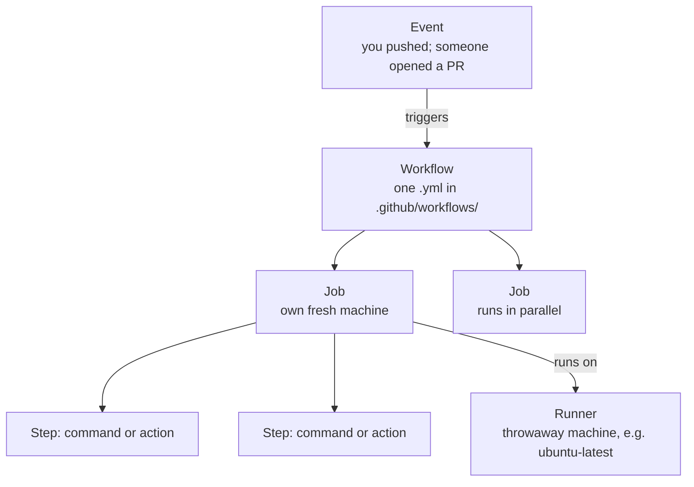

# The Anatomy of a Workflow

A workflow file looks intimidating the first time: a wall of indented YAML with words like `on`, `jobs`, `runs-on`, `uses`, `steps`. The instinct is to copy one from Stack Overflow, change a line until the check goes green, and never look at it again — that works right up until it breaks, and then you're editing a config you don't understand, at the worst possible moment.

So before a single line of YAML, let's install the mental model. There are really only five ideas. Once they click, every workflow you ever read is just those five ideas in a slightly different arrangement.

## The five ideas, top to bottom

**What it actually is.** A GitHub Actions pipeline is a chain of nested things, each living inside the one above it:



Read it as a sentence: *an **event** triggers a **workflow**, which contains one or more **jobs**, each of which runs a list of **steps** on a fresh **runner**.* That's the whole model. Now let's give each word a real definition.

## 1. The event — what wakes the pipeline up

**What it actually is.** An event is a thing that happens in your repository: a push, a pull request being opened, a tag being created, a scheduled time arriving, or someone clicking a "Run" button. The event is the *trigger* — nothing runs until one fires.

**What it does in real life.** In the YAML, the event lives under the key `on`. The two you'll use constantly:

```yaml
on:
  push:
    branches: [main]
  pull_request:
```

*What just happened:* You told GitHub two things: run this workflow whenever someone pushes commits to `main`, and run it whenever someone opens or updates a pull request (against any branch). That `pull_request` trigger is the one producing the green check or red X you see on PRs — the pipeline runs against the proposed change *before* anyone merges it.

📝 **Terminology.** `push` and `pull_request` are *event types*. There are many (`schedule`, `workflow_dispatch` for a manual button, `release`, and more), but these two cover the everyday "test my code when it changes" job.

## 2. The workflow — the file itself

**What it actually is.** A workflow is one YAML file living in the special folder `.github/workflows/`. GitHub watches that folder; any `.yml` or `.yaml` file in it is a workflow it will run when the matching event fires.

**Why people get this wrong.** People assume the *filename* matters, or that there's one magic workflow per repo. Neither is true — you can have ten workflow files (`ci.yml`, `lint.yml`, `deploy.yml`), each independent with its own `on:` triggers. The `name:` field at the top is just the label you see in the Actions tab; the filename is yours to choose.

```yaml
name: CI
on:
  push:
    branches: [main]
  pull_request:
```

*What just happened:* This is the top of a workflow file. `name: CI` is what shows up in GitHub's Actions tab. The `on:` block (from idea 1) says when it runs. Everything after this will be the actual work.

## 3. The job — a unit of work on its own machine

**What it actually is.** A job is a named group of steps that run together on *one fresh machine*. The most important and most surprising fact about a job:

💡 **Key point.** Every job starts on a brand-new, empty machine that is thrown away when the job finishes. Nothing you do in one job survives to the next unless you explicitly pass it along. The runner has no memory of your last run, your laptop, or any other job.

**Why people get this wrong.** Newcomers assume the runner is "their computer in the cloud" with their code already on it. It isn't — it's a blank Ubuntu (or Windows, or macOS) box with common tools pre-installed and *nothing of yours*. That's exactly why the first step in almost every job is "check out my code": you have to fetch it onto the empty machine. (That step is the star of Phase 2.)

**What it does in real life.** A job declares which kind of machine it wants with `runs-on`:

```yaml
jobs:
  test:
    runs-on: ubuntu-latest
    steps:
      - ...
```

*What just happened:* You declared one job, named `test` (the name is yours to pick). `runs-on: ubuntu-latest` asks GitHub for a fresh Ubuntu Linux machine — that's the **runner**. The `steps:` list (next) is the actual work this job does.

📝 **Terminology.** A **runner** is the machine that executes a job. GitHub-hosted runners (`ubuntu-latest`, `windows-latest`, `macos-latest`) are free for public repos and metered for private ones. Each is spun up clean for your job and destroyed after.

When you have multiple jobs, they run **in parallel** by default — each on its own separate machine. That's great for speed (lint and test at the same time) but it's the second half of why jobs can't see each other's files: they're literally different computers running at once.

## 4. The step — one thing, done in order

**What it actually is.** A step is a single unit inside a job. Steps run *one at a time, top to bottom*, on the same machine. A step is one of exactly two things:

- **A `run:` step** — a shell command you write yourself, e.g. `run: npm test`.
- **A `uses:` step** — a prebuilt, shareable action someone published, e.g. `uses: actions/checkout@v4`.

```yaml
    steps:
      - uses: actions/checkout@v4          # a prebuilt action
      - run: echo "Hello from the runner"  # a shell command
```

*What just happened:* Two steps, run in order on the same runner. The first *uses* a published action (we'll meet `actions/checkout` properly next phase — it copies your repo onto the machine). The second *runs* a plain shell command. Mix and match these two kinds and you can describe almost any pipeline.

📝 **Terminology.** An **action** (singular) is a reusable, packaged step — like a function someone else wrote that you call with `uses:`. "GitHub Actions" (the product) is the system that runs them. Yes, the naming is confusing; everyone trips on it once.

## 5. Putting the words together

Here's the smallest complete, valid workflow — all five ideas in one file:

```yaml
name: CI
on: [push]                        # EVENT: run on every push
jobs:                             # the WORKFLOW's jobs
  greet:                          # one JOB named "greet"
    runs-on: ubuntu-latest        # its RUNNER
    steps:                        # its STEPS, in order
      - run: echo "Pipeline is alive"
```

*What just happened:* On every push, GitHub provisions a fresh Ubuntu runner, runs the single job `greet`, which runs its single step: printing a line. It's useless work, but it's a *real* pipeline — and you can now name every part of it. Everything in Phase 2 is this same skeleton with more useful steps hung on it.

## ⚠️ The gotcha that bites everyone: indentation

YAML decides structure entirely by indentation, using **spaces, never tabs**. A step nested one level too shallow or one level too deep is a *different meaning* to YAML, and the error message you get is rarely "your indentation is wrong" — it's something cryptic about an unexpected key.

```text
jobs:
  test:                  ← 2 spaces:  "test" is a job
    runs-on: ubuntu-latest   ← 4 spaces:  a setting OF the test job
    steps:                   ← 4 spaces:  also a setting OF the test job
      - run: npm test        ← 6 spaces:  an item IN the steps list
```

The rule of thumb: each level of nesting is **two more spaces** than its parent, and a list item starts with `- ` (dash, space). Configure your editor to show whitespace and to insert spaces when you press Tab. We'll hit this again in Phase 2, because it's the single most common reason a brand-new workflow won't even start.

## Recap

1. An **event** (push, pull_request, …) under `on:` triggers everything.
2. A **workflow** is one YAML file in `.github/workflows/`.
3. A **job** runs on a fresh, throwaway **runner** and remembers nothing.
4. **Steps** run in order on that machine; each is a `run:` command or a `uses:` action.
5. Jobs run in parallel by default; YAML structure is set by **space** indentation.

You can now read any workflow as "event → jobs → steps on a runner." Next, we'll build a real one that actually tests your project.

---

[← Guide overview](_guide.md) · [Phase 2: Building It Up →](02-building-it-up.md)
