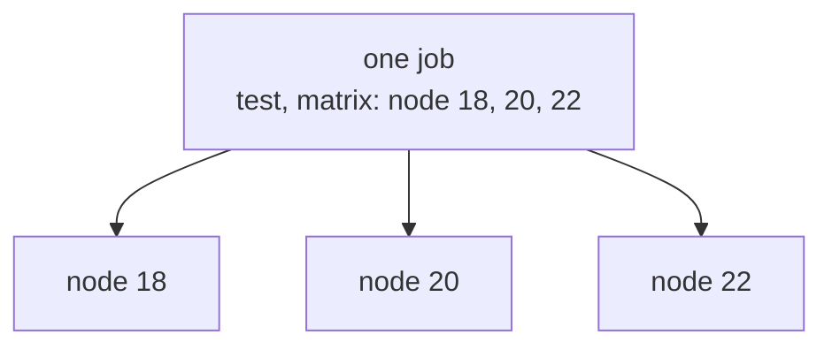
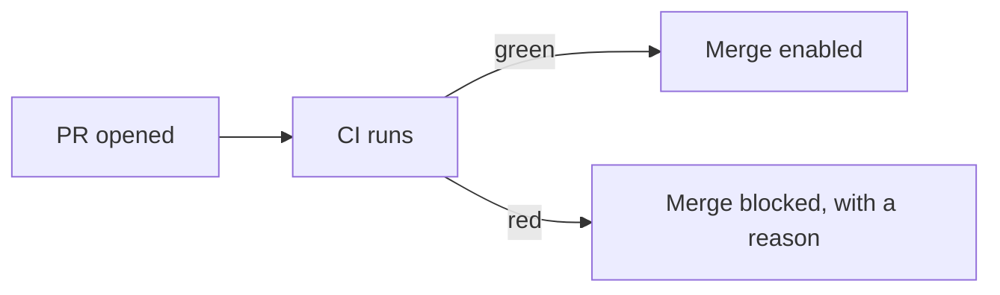

# Beyond the Basics

The pipeline from Phase 2 works, but left as-is it has two everyday frustrations and one real risk. The frustration: it re-downloads every dependency from scratch on every run, which is slow, and it only tests one language version, letting version-specific bugs slip through. The risk: a red pipeline doesn't actually *stop* anyone from merging unless you tell GitHub to enforce it.

This phase fixes all three, and adds the one thing every real project eventually needs - a way to use a password or API token in CI without leaking it. Each piece is a small, self-contained addition to the same `ci.yml` you already understand.

## Caching - stop re-downloading the same packages

**What it actually is.** Every run starts on a fresh runner, so `npm ci` downloads all your dependencies from scratch - every time. A **cache** lets the runner save those downloaded packages after one run and restore them at the start of the next, skipping the slow download when nothing changed.

**What it does in real life.** For the common languages, the `setup-*` actions have caching built in - you don't even need a separate step. Add one input:

```yaml
      - name: Set up Node.js
        uses: actions/setup-node@v4
        with:
          node-version: "20"
          cache: "npm"
```

*What just happened:* Adding `cache: "npm"` tells the setup action to cache npm's download store, keyed on your `package-lock.json`. If the lockfile hasn't changed on the next run, it restores the cache instead of re-downloading, so `npm ci` is much faster. Change a dependency and the lockfile changes, the key changes, and it correctly fetches fresh. (The same input exists as `cache: "pip"` on `setup-python`, and `setup-go` caches by default.)

💡 **Key point.** A cache is a *speed optimization, never a correctness dependency*. Your pipeline must produce the same result whether the cache hit or missed - caching only changes how *fast* a step runs, not *what* it does. If a run ever behaves differently because of a cache, something is wrong.

⚠️ **Gotcha.** Don't reach for the lower-level `actions/cache` action to hand-roll dependency caching until the built-in `cache:` input genuinely can't cover your case. The built-in version handles the cache key (the lockfile hash) for you; a hand-rolled key that's too loose will serve stale packages, and one that's too tight never hits. Start with the built-in.

## A build matrix - test several versions at once

**What it actually is.** Suppose your project must work on Node 18, 20, and 22. You could write three near-identical jobs - tedious and easy to let drift. A **matrix** is a way to say "run this one job once per value in a list," and GitHub generates the copies for you, running them in parallel.

**What it does in real life.**

```yaml
jobs:
  test:
    runs-on: ubuntu-latest
    strategy:
      matrix:
        node-version: ["18", "20", "22"]
    steps:
      - uses: actions/checkout@v4
      - uses: actions/setup-node@v4
        with:
          node-version: ${{ matrix.node-version }}
          cache: "npm"
      - run: npm ci
      - run: npm test
```

*What just happened:* `strategy.matrix.node-version` lists three versions. GitHub expands this one job into three parallel jobs - one per version - each on its own runner. The expression `${{ matrix.node-version }}` is how a step reads the current value; in the first copy it's `"18"`, in the second `"20"`, in the third `"22"`. You wrote the job once; you got three real test runs.



📝 **Terminology.** `${{ ... }}` is GitHub Actions **expression** syntax - a small templating language for reading context like `matrix`, `github`, and (next) `secrets`. Anything inside the double braces is evaluated by GitHub before the step runs.

The matrix view in the Actions tab now shows three results. If only Node 18 fails, you've learned something precise and valuable: your code relies on something newer, and you know it *before* a user on Node 18 finds out for you.

## Secrets - passwords your pipeline needs but must never leak

**What it actually is.** Sometimes a CI step needs a credential - a token to publish a package, an API key for an integration test. You can't write that token into `ci.yml`, because the file is in your repo for anyone with access to read. A **secret** is an encrypted value you store in GitHub's settings; the workflow can use it at run time, but it's never written in your code.

**What it does in real life.** You add the secret once in the repo UI (Settings → Secrets and variables → Actions → New repository secret), then read it in the workflow with the `secrets` context:

```yaml
      - name: Run integration tests
        run: npm run test:integration
        env:
          API_TOKEN: ${{ secrets.API_TOKEN }}
```

*What just happened:* `${{ secrets.API_TOKEN }}` pulls the stored secret and hands it to the step as an environment variable named `API_TOKEN`. Your test code reads it from the environment (e.g. `process.env.API_TOKEN`), exactly as it would read any env var - but the value lives encrypted in GitHub, not in the repo.

⚠️ **Gotcha - secrets are masked in logs, but don't tempt fate.** GitHub automatically redacts known secret values in the run log, replacing them with `***`. That's a safety net, not a license - **never deliberately print a secret**: no `echo $API_TOKEN`, no dumping it for debugging. Masking only catches the *exact* stored value; if your code transforms it (base64-encodes it, embeds it in a URL, splits it across lines), the transformed form can slip through unredacted. Treat a secret like a live wire: use it, never look directly at it.

⚠️ **Gotcha - secrets don't flow to fork pull requests.** For security, workflows triggered by a `pull_request` from a *forked* repo do **not** receive your secrets - otherwise any stranger could open a PR that exfiltrates your tokens. If your integration tests need a secret, they'll be skipped or empty on fork PRs by design; that's the system protecting you, not a bug. For a fuller walkthrough of storing and rotating credentials, see [Secrets Management](/guides/secrets-management).

## Required checks - make red actually mean "stop"

**What it actually is.** Here's the surprise that catches teams off guard: by default, a red pipeline is *advisory*. The X shows up on the PR, but GitHub will still happily let someone click Merge. To make CI a real gate, turn on a **branch protection rule** (or **ruleset**) that marks your CI check as **required** - then merging is blocked until it's green.

**What it does in real life.** This is a repository setting, not YAML. In Settings → Branches (or Settings → Rules → Rulesets), add a rule for your `main` branch and enable *"Require status checks to pass before merging,"* then select your CI check (it appears in the list by name once it has run at least once).



*What just happened:* You connected the pipeline's verdict to the merge button. Now a red run physically prevents the merge, and a contributor sees *why* they're blocked. This is the moment CI stops being decorative and starts protecting `main` - the entire point of running tests on every PR.

⚠️ **Gotcha - required check names come from the job, not the workflow.** The check you select is named after the *job* (and, in a matrix, each generated variant - e.g. `test (18)`, `test (20)`, `test (22)`). If you later rename a job, its required-check entry effectively disappears and the protection silently stops applying to it. After renaming a job, revisit the branch protection rule and re-select the check.

## Recap

1. **Caching** (`cache: "npm"` on the setup action) skips re-downloading unchanged dependencies - speed only, never correctness.
2. **A matrix** (`strategy.matrix`) runs one job once per version in parallel; read the value with `${{ matrix.* }}`.
3. **Secrets** (`${{ secrets.NAME }}`) inject credentials safely; they're masked in logs, but never print them, and they don't reach fork PRs.
4. **Required checks** (branch protection) turn a red run into an actual merge block - without them, CI is only advice.
5. Required-check names track the **job name**, so renaming a job can quietly disable its protection.

That's a complete, fast, trustworthy CI pipeline - and, more importantly, you understand every line of it. The natural next step is the *CD* half: taking a green build and shipping it. That's a guide of its own, because deployment carries its own set of "oh no" moments worth treating with the same care.

---

[← Phase 2: Building It Up](02-building-it-up.md) · [Guide overview](_guide.md)

**Related:** [What CI/CD Does](/guides/what-cicd-does) · [Testing in CI](/guides/testing-in-ci) · [Secrets Management](/guides/secrets-management)
