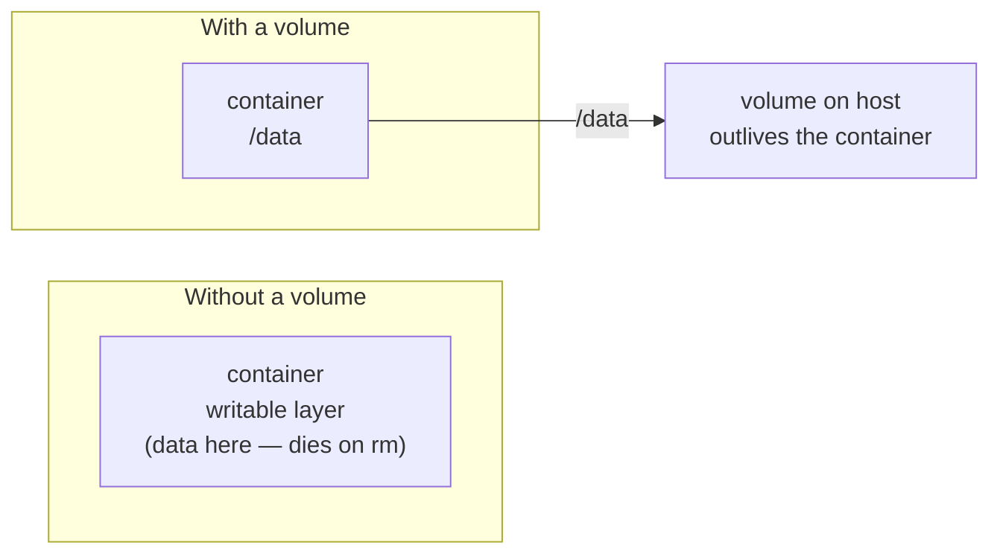

# Volumes & the Gotchas

Here's where the calm picture from Phase 1 — "a container is a running instance, not a little computer" —
turns into something you have to act on. Because containers are *instances*, anything they wrote vanishes
when they're removed. That's not a bug; it's the design. This phase shows you where to keep data that must
survive, how to feed config in cleanly, and the handful of traps that catch nearly everyone — each named
before it can ruin your afternoon.

## Cheat-card: symptom → calm fix

Arrived here mid-problem? Find your symptom, then read the matching section below.

| Symptom | Likely cause | Calm fix |
|---|---|---|
| Data gone after `docker rm` / restart | Wrote to the container's throwaway layer | Mount a **volume** for that path — see *Containers are ephemeral* |
| "It works in the container but I can't reach the port" | Forgot `-p`, or wrong `HOST:CONTAINER` order, or app bound to `127.0.0.1` | See *The unpublished port* |
| Image is enormous (hundreds of MB / GBs) | Heavy base image, build tools left in, files copied in | See *The huge image* |
| A secret you set is still in the image | Baked in with `ENV` / `COPY` at build time — it's in a layer forever | See *Secrets in layers* |
| Config differs per environment but it's hardcoded | Values baked into the image | Pass **environment variables** at run time — see *Config goes in env vars* |

## Containers are ephemeral — volumes are how data survives

**What's actually happening.** Recall from Phase 1 that a running container gets a thin **writable layer**
on top of the frozen image. Every file the app creates — uploaded images, a database's data, logs — lands
in that writable layer. And that layer belongs to the container, so when the container is removed, the
layer is removed with it. The data is *gone*.



**What a volume actually is.** A **volume** is storage that lives *outside* the container's lifecycle —
managed by Docker on the host — and is mounted into the container at a path you choose. The app writes to
that path as normal, but the bytes land in the volume, which survives the container being stopped,
removed, and replaced.

📝 **Terminology.** *Volume* — Docker-managed persistent storage you attach to a container. There's also a
*bind mount*, which maps a specific folder from your host machine into the container (handy in development,
so editing a file on your laptop shows up live inside the container — the exact thing Phase 1 said
wouldn't happen *unless you mount it in*).

Run a database with a named volume so its data outlives the container:

```console
$ docker run -d --name db \
    -v pgdata:/var/lib/postgresql/data \
    -e POSTGRES_PASSWORD=secret \
    postgres:16
a7c3e9f1b2d4...
```

*What just happened:* `-v pgdata:/var/lib/postgresql/data` created (or reused) a named volume `pgdata` and
mounted it at the path Postgres stores its data. Now you can `docker rm -f db` and start a fresh `postgres`
container pointing at the same `pgdata` volume, and your tables are still there. Confirm the volume exists
independently:

```console
$ docker volume ls
DRIVER    VOLUME NAME
local     pgdata
```

*What just happened:* the volume is listed as its own object, not tied to the container. That separation is
the whole point — the container is disposable, the volume is not.

💡 **Key point.** Treat containers as throwaway. Any data that must survive a restart belongs in a
**volume**, never in the container's writable layer. If you ever think "I'll just keep it inside the
container," that's the moment the data is one `docker rm` away from gone.

## Config goes in environment variables, not into the image

**The problem.** You want the *same image* to run in development, staging, and production — that's the
reproducibility promise. But those environments need different database URLs, API keys, and feature flags.
If you bake those values into the image, you've made three different images and lost the promise.

**The fix.** Pass configuration in at *run time* with `-e` (you already saw `-e POSTGRES_PASSWORD=secret`
above). The image stays generic; the environment is supplied when the container starts.

```console
$ docker run -d --name web \
    -e DATABASE_URL=postgres://db:5432/app \
    -e LOG_LEVEL=info \
    -p 8080:3000 \
    my-app:1.0
```

*What just happened:* the app reads `DATABASE_URL` and `LOG_LEVEL` from its environment at startup. The
same `my-app:1.0` image runs everywhere; only the `-e` values change per environment. (When you have many
of these, you graduate to an `--env-file` or to Compose — that's the [next guide](/guides/docker-compose-for-real-projects).)

## The gotchas everyone hits

### The unpublished port

This is the most common "but it works in the container!" moment, so it earns first place. Three distinct
causes wear the same disguise — the app runs fine inside, but you can't reach it from your machine:

1. **You forgot `-p` entirely.** `EXPOSE` in the Dockerfile is only documentation (Phase 2). Without
   `-p HOST:CONTAINER` on `docker run`, no port is published. Check `docker ps` — an empty `PORTS` column
   is the tell.
2. **You reversed the mapping.** `-p` is `HOST:CONTAINER`. If your app listens on 3000 inside, it's
   `-p 8080:3000`, not `-p 3000:8080`. Backwards, and you'll connect to a port nothing is listening on.
3. **The app bound to `127.0.0.1` inside the container.** A program listening on `localhost` *inside* the
   container is only reachable from inside that container — Docker's port forwarding can't reach it. The
   app must listen on `0.0.0.0` (all interfaces) for `-p` to work. This one is sneaky because the Docker
   command is correct; the app's own config is the problem.

```console
$ docker ps
CONTAINER ID   IMAGE        STATUS         PORTS     NAMES
3f9a2c1b7e4d   my-app:1.0   Up 4 seconds             web
```

*What just happened:* the `PORTS` column is empty — nothing is published. That's cause #1. Stop the
container and re-run it with `-p 8080:3000`, and the mapping will appear.

### The huge image

⚠️ **Gotcha.** Reach for a full `ubuntu` or default `node` base "to be safe" and your image balloons to
hundreds of megabytes or more — slow to push, slow to pull, slow to deploy. Two habits keep it lean:

- **Start from a slim base.** `node:20-slim` or `-alpine` variants, `python:3.12-slim`, etc., ship far
  less than the full image. (Verify a variant's contents before committing to it — `alpine` uses a
  different C library that occasionally trips up native dependencies.)
- **Don't ship your build tools.** Compilers, dev dependencies, and caches don't belong in the final
  image. The standard fix is a **multi-stage build** (build in one stage, copy only the finished
  artifact into a clean final stage) — worth looking up once your image matters.

A `.dockerignore` file (like `.gitignore`) keeps `node_modules`, `.git`, and local junk out of the build
context entirely, so they're never copied in.

### Secrets in layers

⚠️ **Gotcha — this one is genuinely dangerous.** Anything you put into the image at *build time* becomes a
permanent layer, and **layers are not erased by deleting the file in a later step.** If you `COPY` a
private key in, or hardcode a password with `ENV` in the Dockerfile, that secret is baked into the image's
history. Anyone who can pull the image can extract it from the layers — even if a later instruction
"removes" it, because the earlier layer still holds it.

The rule that keeps you safe: **secrets are run-time input, never build-time content.** Pass them with
`-e` (or a secrets manager / Compose secrets) when the container *starts* — exactly like the config above —
so they live in the running container's environment, not frozen into a distributable image.

## Recap

1. Containers are **ephemeral**: the writable layer dies with the container. Use a **volume** (`-v`) for
   any data that must survive.
2. A **volume** is host-managed storage mounted into the container; it outlives the container and shows up
   in `docker volume ls`.
3. **Config and secrets go in at run time** via `-e` environment variables — keeps one image usable
   everywhere, and keeps secrets out of the image.
4. The traps: the **unpublished port** (forgot `-p`, reversed `HOST:CONTAINER`, or app bound to
   `127.0.0.1`), the **huge image** (slim base + don't ship build tools), and **secrets in layers**
   (never bake them in).

You can now reason about a single container end to end — build it, run it, reach it, persist it, and avoid
the traps. The next step up is orchestrating *several* containers together — a web app, its database, and
a cache, defined in one file and started with one command. That's [Docker Compose for Real
Projects](/guides/docker-compose-for-real-projects). And when it's time to put a container on a real
server, see [Deploying to a VPS](/guides/deploying-to-a-vps).

---

[← Phase 2: The Dockerfile & Layers](02-the-dockerfile-and-layers.md) · [Guide overview](_guide.md)
