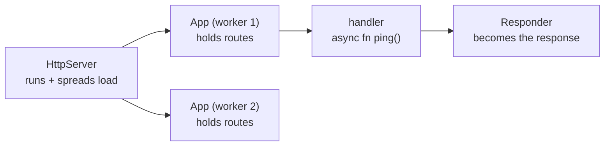

# What actix-web Is & Your First Server

You know [Rust](/guides/rust-from-zero) and want something fast and production-proven on the web. That's
actix-web's corner: one of the oldest Rust frameworks, a perennial TechEmpower top finisher, and the
mature, batteries-included sibling to [axum](/guides/axum-from-zero) — routing, extractors, middleware,
websockets, and JSON all in the box.

The name comes from an **actor** framework it grew out of, but day to day you write plain `async fn`
handlers and never touch an actor — the heritage powers internals, not your code. (If "web framework"
itself is fuzzy, [What a Framework Even Is](/guides/what-a-framework-even-is) covers the ground first.)

> 📝 This guide teaches the **framework**, not the language. It assumes you're comfortable with Rust —
> ownership, traits, `Result`, `async`/`await`. actix-web compiles and runs as a normal Rust program, so
> examples come with the commands to build and run them.

## The mental model: three pieces

Almost everything in actix-web hangs off three nouns.

📝 An **`App`** holds your **routes** (and later, shared state). You build it by chaining `.route(...)`
calls — the blueprint of your service: "a `GET /ping` goes here, a `POST /articles` goes there."

📝 An **`HttpServer`** **runs** copies of that `App`. It opens the socket, accepts connections, and spreads
the work across **worker threads** — and here's the twist that trips people up later: it builds a *separate
`App` per worker*. More on that in a moment.

📝 A **handler** is an **`async fn`** whose return value becomes the response, because it returns something
that implements the **`Responder`** trait. That's actix-web's version of axum's `IntoResponse` — the return
type *is* the response.

Say it once so it sticks: **an `App` holds routes, an `HttpServer` runs copies of the `App` across workers,
and each handler is an `async fn` returning a `Responder`.** That sentence is the spine of every actix-web
service you'll ever write.



*One idea:* the server runs many copies of your app at once, and a request flows into one of them, hits the
matching handler, and the handler's return value flows back out as the response.

## Your first server

First, add the dependency. From inside your Cargo project:

```bash
cargo add actix-web
```

*What just happened:* `cargo add actix-web` pulls in the framework and writes it into your `Cargo.toml`
under `[dependencies]`. Unlike axum, there's no separate `cargo add tokio` — actix-web ships its own
runtime (built on Tokio) and re-exports the macro you need. One crate, and you're ready.

Now the smallest server that does something real. Put this in `src/main.rs`:

```rust
use actix_web::{web, App, HttpServer, Responder, HttpResponse};

async fn ping() -> impl Responder {
    HttpResponse::Ok().body("pong")
}

#[actix_web::main]
async fn main() -> std::io::Result<()> {
    HttpServer::new(|| {
        App::new().route("/ping", web::get().to(ping))
    })
    .bind(("127.0.0.1", 8080))?
    .run()
    .await
}
```

*What just happened:*
- `async fn ping() -> impl Responder` is the **handler**. It returns `HttpResponse::Ok().body("pong")` — a
  `200 OK` with body `pong`. `impl Responder` means "some type that knows how to become a response"; Phase 3
  covers the rest.
- `#[actix_web::main]` rewrites `async fn main` to start actix-web's runtime — the counterpart to axum's
  `#[tokio::main]`. Rust's real `main` can't be `async` on its own.
- `HttpServer::new(|| { ... })` takes a **closure that builds an `App`**. `App::new().route("/ping",
  web::get().to(ping))` registers one route: `GET /ping` runs `ping`. Read it as "for GET, call `ping`" —
  there's also `web::post()`, `web::put()`, `web::delete()`.
- `.bind(("127.0.0.1", 8080))?` opens the socket; binding can fail, so `?` propagates the error, which is
  why `main` returns `std::io::Result<()>`.
- `.run().await` starts the accept loop and blocks, handing each request to a worker's `App`.

Build and run it like any Rust binary:

```bash
cargo run
```

actix-web prints a couple of startup lines and then waits for requests. Leave it running, and in another
terminal hit the route:

```bash
curl 127.0.0.1:8080/ping
```

```console
$ curl 127.0.0.1:8080/ping
pong
```

*What just happened:* `curl` sent a `GET /ping`. The server routed it into one of its worker `App`s, matched
the route to your `ping` handler, called it, and the returned `HttpResponse` came back as the response body
— `pong`. A working, multi-threaded HTTP server in about a dozen lines.

## The catch worth flagging now: the closure runs *per worker*

Look again at `HttpServer::new(|| { App::new()... })`. That closure isn't called once. actix-web spawns
multiple **worker threads** (by default, one per CPU core) and calls your closure **once on each worker**
to build that worker's own `App`. You end up with several independent `App`s running side by side.

⚠️ Fine for the toy above — building a couple of routes a few times costs nothing. But the moment you want
**shared state** (a database pool, a cache, a counter), creating it *inside* the closure backfires: each
worker gets its own separate copy, and they never see each other's data. That's why state in actix-web goes
through a special wrapper instead — file away the shape of the problem for now.
[Phase 4: Shared State with web::Data](04-shared-state.md) solves it properly with `web::Data<T>`.

## The running example: an articles API

We won't keep returning `pong`. Across this guide we'll grow one real service — a small **articles API** —
and the core of it is a single type: an article with an id, a title, and a body.

```rust
struct Article {
    id: u32,
    title: String,
    body: String,
}
```

*What just happened:* the `Article` struct is a plain type for now — three fields, no traits. Phase 3
derives `Serialize`/`Deserialize` on it so actix-web can turn it into JSON and parse it from a request
body, the moment it becomes a real API resource.

Next: routing in earnest — multiple methods, scopes for grouping routes, and the extractors (`Path`,
`Query`, `Json`) that pull pieces out of the incoming request.

## Recap

- **actix-web** is the mature, fast, batteries-included Rust framework — a perennial TechEmpower leader and
  the closest peer to [axum](/guides/axum-from-zero). Its **actor** heritage powers internals, not your code.
- **Mental model:** an **`App`** holds routes, an **`HttpServer`** runs copies of it across worker threads,
  and a **handler** is an `async fn` returning a **`Responder`**.
- **First server:** `cargo add actix-web` (bundles its own runtime, no separate Tokio install), build the
  `App` inside `HttpServer::new(|| ...)`, register `web::get().to(handler)`, then `.bind(...)?.run().await`.
  `#[actix_web::main]` lets `main` be async.
- **`HttpServer::new`'s closure runs once per worker** — each worker builds its own `App`, so shared state
  can't live inside it. `web::Data` fixes that in Phase 4.
- **Run with `cargo run`, test with `curl`** — the handler's `HttpResponse` is exactly what the client gets.
- **Throughline:** an `App` of routes, run by an `HttpServer`, handlers returning a `Responder` — grown into
  one **articles API** across the guide.

## Quick check

Three questions on the ideas that have to stick — the three-piece model, what the handler returns, and the
per-worker closure:

```quiz
[
  {
    "q": "In actix-web's mental model, what is the relationship between App and HttpServer?",
    "choices": [
      "App holds the routes; HttpServer runs copies of that App across worker threads",
      "HttpServer holds the routes; App runs them on a single thread",
      "They are the same type with two names",
      "App is the database and HttpServer is the cache"
    ],
    "answer": 0,
    "explain": "An App is the blueprint of routes (and later state). An HttpServer opens the socket and runs copies of that App across worker threads, handing each request to one of them."
  },
  {
    "q": "What does the `ping` handler's return value become, and why is its type `impl Responder`?",
    "choices": [
      "The HTTP response, because any type implementing Responder knows how to become one",
      "A log line printed to the server console",
      "An argument passed to the next handler",
      "Nothing — you must call a separate send() function"
    ],
    "answer": 0,
    "explain": "A handler's return value is the response. `impl Responder` means 'some type that implements the Responder trait', so actix-web knows how to turn it into a full HTTP response. HttpResponse is one such type."
  },
  {
    "q": "Why does `HttpServer::new` take a closure rather than a single built App?",
    "choices": [
      "Because the closure is called once per worker thread, so each worker builds its own App",
      "Because closures are faster to compile than structs",
      "Because the App must be rebuilt on every incoming request",
      "Because Rust forbids passing a struct to a function"
    ],
    "answer": 0,
    "explain": "actix-web spawns multiple workers and calls the closure once on each to build that worker's own App. That's why shared state can't live inside the closure — each worker would get a separate copy. Phase 4's web::Data solves it."
  }
]
```

---

[Guide overview](_guide.md) · [Phase 2: Routing & Extractors →](02-routing-and-extractors.md)
