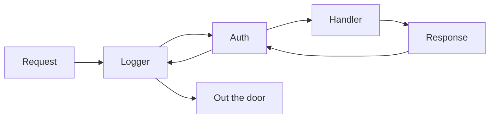

# Middleware

The mental model that carries the whole phase: **middleware in actix-web wraps your service.** Take your `App` (or a `web::scope`) and call `.wrap(...)`, which tucks your routes inside a new outer layer. A request travels inward through each wrapper before it reaches your handler, and the response travels back out through the same wrappers in reverse.

Picture an onion: each layer can look at the request on the way in, decide whether to keep going, and look at the response on the way out. That "on the way out" half is the payoff - one piece of middleware wraps the *entire* round trip. Logging, compression, auth, CORS all live in that wrapper.

> 📝 This is the same idea you'll meet in almost every web framework. If you've read the [axum guide](/guides/axum-from-zero), its `.layer()` is actix-web's `.wrap()` - the shape differs, the picture is identical. More on that contrast at the end.

We'll keep growing the **articles API** from the earlier phases. By the end it'll log every request and turn away anyone without an auth header.

## Where middleware fits

A request to your articles API doesn't hit `list_articles` directly - it passes through whatever you've wrapped around the `App`:



The diagram is the entire concept. Everything that follows - the built-ins, the ordering rule that trips people up, your own custom middleware - is just *what* you put in those boxes and *which order* they sit in.

## The built-ins you'll reach for first

You rarely write middleware from scratch. actix-web ships the common ones in `actix_web::middleware`; the most useful is **`Logger`**, which logs every request: method, path, status, and time taken.

```rust
use actix_web::{middleware::Logger, web, App, HttpServer};

#[actix_web::main]
async fn main() -> std::io::Result<()> {
    env_logger::init_from_env(env_logger::Env::new().default_filter_or("info"));

    HttpServer::new(|| {
        App::new()
            .wrap(Logger::default())
            .route("/articles", web::get().to(list_articles))
    })
    .bind(("127.0.0.1", 8080))?
    .run()
    .await
}
```

*What just happened:* `.wrap(Logger::default())` wrapped the whole `App` in a logging layer. Every request to `/articles` now gets logged on arrival and on response, without touching `list_articles`. The catch: `Logger` *emits* log records, but something has to *print* them - that's `env_logger::init_from_env(...)`. Skip it and the logs go nowhere; the middleware isn't broken, nobody's listening.

> ⚠️ `Logger` produces nothing visible on its own. A logging facade (`env_logger`, `tracing-subscriber`, etc.) must be initialized once at startup. Missing logs almost always means a missing subscriber, not missing middleware.

Other built-ins drop in the same way:

```rust
use actix_web::middleware::{Compress, NormalizePath};

App::new()
    .wrap(Compress::default())              // gzip/brotli responses automatically
    .wrap(NormalizePath::trim())            // /articles/ and /articles both match
    .route("/articles", web::get().to(list_articles))
```

*What just happened:* `Compress` negotiates response compression from `Accept-Encoding` and compresses the body; `NormalizePath::trim()` strips trailing slashes so a stray `/articles/` still hits `/articles`. `DefaultHeaders` stamps headers like `X-Version` onto every response. Same move every time: construct it, hand it to `.wrap()`.

> 💡 **CORS lives in a separate crate.** Cross-origin headers aren't in `actix-web` core - add the **`actix-cors`** crate and wrap a `Cors`:
> ```rust
> use actix_cors::Cors;
>
> App::new()
>     .wrap(Cors::default().allow_any_origin())
>     .route("/articles", web::get().to(list_articles))
> ```
> `Cors::default()` is locked down on purpose (it allows almost nothing) - you opt into origins, methods, and headers explicitly with builder calls like `.allowed_origin("https://example.com")`. That strictness is a feature: you say exactly who's allowed in.

## ⚠️ The wrap-order rule everyone trips on

The single most confusing thing about actix-web middleware, so read it twice.

**Middleware runs as a stack. The LAST `.wrap()` you register is the OUTERMOST layer** - it runs *first* on the way in and *last* on the way out.

```rust
App::new()
    .wrap(Logger::default())   // registered first  → INNER
    .wrap(Compress::default()) // registered last   → OUTER, runs first
    .route("/articles", web::get().to(list_articles))
```

*What just happened:* even though `Logger` is written above `Compress`, `Compress` is the outermost wrapper because it was registered last. On the way in, the order is `Compress → Logger → handler`; on the way out it reverses. Read a stack of `.wrap()` calls **from the bottom up** to see the order a request actually travels.

Order changes behavior: to have `Logger` record the *final, compressed* response, `Compress` must be the outer layer (registered after `Logger`), exactly as above. Get it backwards and your logs describe a response that no longer matches what went over the wire. When middleware "isn't seeing" what you expect, suspect the order first.

## Writing your own with from_fn

When no built-in does what you need, the easy modern path (actix-web 4.4+) is **`middleware::from_fn`**, which turns a plain `async fn` into middleware. Your function receives the incoming `ServiceRequest` and a `Next` (the rest of the chain), and either calls `next.call(req).await` to continue or returns early to short-circuit.

Here's a timing middleware that logs how long each request took:

```rust
use actix_web::middleware::{from_fn, Next};
use actix_web::body::MessageBody;
use actix_web::dev::{ServiceRequest, ServiceResponse};
use actix_web::Error;

async fn timing(
    req: ServiceRequest,
    next: Next<impl MessageBody>,
) -> Result<ServiceResponse<impl MessageBody>, Error> {
    let start = std::time::Instant::now();
    let res = next.call(req).await?;     // run the rest of the chain
    log::info!("{} {:?}", res.status(), start.elapsed());
    Ok(res)
}

// App::new().wrap(from_fn(timing))
```

*What just happened:* `from_fn(timing)` wraps `timing` into middleware you can `.wrap()`. `next.call(req).await?` hands control inward to the rest of the chain and gives back the `ServiceResponse`. Everything before that call runs on the way *in*; everything after runs on the way *out* - why we grab `start` before and log `elapsed()` after. One function straddles the whole round trip, like the onion picture.

Now an auth gate that rejects any request missing an `Authorization` header *before* it reaches a handler:

```rust
use actix_web::middleware::{from_fn, Next};
use actix_web::body::MessageBody;
use actix_web::dev::{ServiceRequest, ServiceResponse};
use actix_web::error::ErrorUnauthorized;
use actix_web::Error;

async fn require_auth(
    req: ServiceRequest,
    next: Next<impl MessageBody>,
) -> Result<ServiceResponse<impl MessageBody>, Error> {
    if req.headers().get("Authorization").is_none() {
        return Err(ErrorUnauthorized("missing Authorization header"));
    }
    next.call(req).await
}

// App::new().wrap(from_fn(require_auth))
```

*What just happened:* we inspect `req.headers()` first. If `Authorization` is absent, we return `Err(ErrorUnauthorized("..."))` - `next.call` is **never reached**, the handler never runs, and a `401 Unauthorized` goes straight back out. Otherwise we fall through to `next.call(req).await`. That early `return Err(...)` is the short-circuit - the whole point of middleware that can refuse a request.

> 💡 `from_fn` covers the vast majority of needs. For *stateful* middleware - something that holds its own data and must initialize per-worker - actix-web also exposes the lower-level **`Transform`** trait, implemented by hand with two structs plus `poll_ready` and `call`. Heavier and rarely necessary; reach for it only when `from_fn` genuinely can't carry the state you need.

## Same idea, different shape: actix-web vs axum/tower

If you've used [axum](/guides/axum-from-zero), none of this is new - only the spelling changed.

| | actix-web | axum / tower |
|---|---|---|
| Attach | `.wrap(thing)` | `.layer(thing)` |
| Custom | `middleware::from_fn` | `middleware::from_fn` |
| Continue | `next.call(req).await` | `next.run(req).await` |
| Ordering | last `.wrap()` = outermost | last `.layer()` = outermost |

*What just happened:* axum leans on tower's `Layer` abstraction, so its middleware also works with HTTP clients and gRPC; actix-web's is its own thing, tuned to actix-web. Different ecosystems, identical mental model - wrap the service, run the chain as a stack, short-circuit when you must. Learn it once, it transfers.

## Recap

- **Middleware wraps your service** - attach it with **`.wrap(...)`** on an `App` or a `web::scope`; the chain runs as a stack of onion layers around your handler.
- **Built-ins** live in `actix_web::middleware`: **`Logger`** (pair it with `env_logger` or no logs print), **`Compress`**, **`NormalizePath`**, **`DefaultHeaders`**. **CORS** comes from the separate **`actix-cors`** crate via `Cors::default()...`.
- ⚠️ **The order rule:** the **last** `.wrap()` registered is the **outermost** - runs first on the way in, last on the way out. Read a `.wrap()` stack bottom-up.
- **`middleware::from_fn`** turns an `async fn(ServiceRequest, Next)` into custom middleware: call `next.call(req).await` to continue, or return `Err(ErrorUnauthorized(...))` to short-circuit before the handler runs.
- The heavier **`Transform`** trait exists for stateful middleware, but `from_fn` handles most cases - the pattern mirrors axum/tower's `.layer()`.

## Quick check

```quiz
[
  {
    "q": "How do you attach middleware to an actix-web App?",
    "choices": [".layer(...) on the App", ".wrap(...) on the App or a web::scope", ".use(...) on the HttpServer", "A middleware: field in the App config"],
    "answer": 1,
    "explain": "actix-web middleware wraps the service: you attach it with .wrap(...) on an App or a web::scope. (.layer() is axum/tower's spelling of the same idea.)"
  },
  {
    "q": "You write `.wrap(Logger::default()).wrap(Compress::default())`. Which one is the OUTERMOST layer (runs first on the way in)?",
    "choices": ["Logger, because it's written first", "Compress, because the last .wrap() is the outermost", "Neither - order is undefined", "Both run at the same time"],
    "answer": 1,
    "explain": "Middleware runs as a stack: the LAST .wrap() registered (Compress here) is the outermost, so it runs first on the way in and last on the way out. Read a .wrap() stack from the bottom up."
  },
  {
    "q": "In a from_fn middleware, how do you reject a request so the handler never runs?",
    "choices": ["Call next.call(req).await as usual", "Return early with an Err, e.g. Err(ErrorUnauthorized(\"...\")), instead of calling next.call", "Panic inside the function", "Return Ok with an empty ServiceResponse"],
    "answer": 1,
    "explain": "Returning early - for example Err(ErrorUnauthorized(\"...\")) - short-circuits the chain before next.call is ever reached, so the handler never runs and the error response goes straight back out."
  }
]
```

[← Phase 4: Shared State with web::Data](04-shared-state.md) · [Guide overview](_guide.md) · [Phase 6: A REST API with Error Handling →](06-rest-api-and-errors.md)