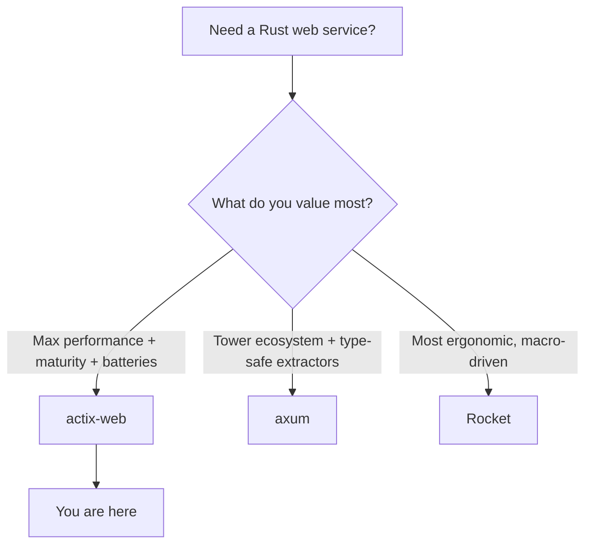

# Where to Go Next

Look back at the ground you covered. You can stand up an `App` and run it across worker threads with `HttpServer`, route a request to a handler, pull pieces out of it with extractors like `Path`, `Query`, `Json`, and `web::Data`, return anything that implements `Responder`, share a store across every worker without a single global, wrap the whole thing in middleware, build full CRUD, and turn errors into clean responses with the `ResponseError` trait — then test it with `actix_web::test` and tune it for production. That is a real REST API, not a toy.

The quieter win: the shape underneath actix-web is the same shape you'll find in every serious Rust web framework — an **`App`** of routes, run by an **`HttpServer`**, with handlers that **extract from the request and return a `Responder`**. Learn it once and you can read the others on sight. This last phase is the map: where actix-web sits among its neighbors, the layer you'll almost certainly add next, the root worth knowing, and one concrete thing to go build.

## actix-web vs the field

You now know enough to choose a framework *on purpose* rather than by reputation. The good news in Rust: the big three are all production-grade and all fast. The differences are about *feel* and *what you build on*, not whole different universes.



A line on each:

- **actix-web** — the mature, batteries-included heavyweight, consistently at or near the **top of the performance benchmarks**. It carries a long track record, a deep feature set (websockets, sessions, and more, all in the box), and the `web::Data` state and `ResponseError` patterns you just learned. If raw throughput, maturity, and "it's all already here" matter most, this is your pick. (You are here.)
- **axum** — the newer option from the Tokio team, tower-native and driven by the **type system**: plain `async fn` handlers, extractors as arguments, `IntoResponse` returns. Its quiet superpower is the **tower** middleware ecosystem — what you write is reusable, and gRPC via tonic shares the same abstraction. See [axum From Zero](/guides/axum-from-zero).
- **Rocket** — the most **ergonomic** of the three, leaning hard on macros (`#[get("/")]` attributes and friends) to make handler code wonderfully concise. If you want the least ceremony and the most readable routes, you'll like its style. See [Rocket From Zero](/guides/rocket-from-zero).

> 💡 How to pick: reach for **actix-web** when you want maximum performance, maturity, and a big feature set out of the box (websockets included). Reach for **axum** when you want the tower ecosystem and type-safe extractors. Reach for **Rocket** when you want concise, approachable, macro-driven code.

📝 Notice how much these three have *converged*. Whichever you opened, you'd be writing the same thing: extract from the request, return a responder. The mental model transfers almost entirely, so picking one is far less of a fork-in-the-road than it looks. None of them is "the best" — the senior instinct is asking "best for *this* job?" and answering honestly. You have the pieces for that now.

## The layer you'll add next: a real database

Every API in this guide kept its books in memory — perfect for learning, useless in production, since a restart wipes the data. The very next thing almost every real actix-web service grows is a **database**.

Worth knowing up front: Rust has **no single default ORM** the way some ecosystems do. You get to choose, and the three common answers each have a clear personality.

- **`sqlx`** — not an ORM at all, but the most popular companion. You write **raw SQL**, and a macro checks your queries **against a real database at compile time** — so a typo'd column name is a build error, not a 500 at 3am. It's fully async, which fits actix-web cleanly.
- **SeaORM** — a proper **async ORM** built on top of sqlx, for when you want entities, relations, and a query builder rather than hand-written SQL.
- **Diesel** — the **mature, established** ORM, with a rich type-safe query DSL. Its roots are more sync-flavored, which is worth knowing if everything else in your stack is async.

The reassuring bit: your handlers barely change. Remember Phase 4, where you dropped a store into `web::Data` and pulled it out with the `web::Data<T>` extractor? That investment pays off here — a **`sqlx::PgPool`** (a Postgres connection pool) drops straight into that same `web::Data` slot. Your handlers still extract the pool, run a query, and return something that implements `Responder`. You're swapping the bottom layer — the store — not rewriting the top.

> 💡 Don't forget what's already in the box: **websockets** are one of actix-web's long-standing strengths. The day you want live updates — a chat feed, a dashboard that pushes — you won't reach for a separate crate; it's right there in the framework you already know.

## The root: Tokio

actix-web doesn't float in the air. Underneath it, like every async Rust web framework, sits **Tokio** — the async runtime that actually drives your `async fn`s, schedules the work across those worker threads, and handles the I/O. Every `.await` in your handlers ultimately answers to it.

You don't need to study Tokio to ship. But the day you want to understand *why* an extractor can pause and resume, or how those workers really share a pool, that's the floor dropping away so you can see all the way down. See [Tokio: The Async Runtime](/guides/tokio-the-async-runtime).

## What to build

Reading more won't make this stick — building one real thing will. Here's the assignment, deliberately concrete.

Take the **articles API** you grew across this guide and carry it all the way home:

- **Swap the in-memory store for sqlx + Postgres** so the articles survive a restart. Drop a `PgPool` into `web::Data`, write a few compile-checked queries, and watch your handlers stay almost exactly as they were.
- **Add JWT (or session) auth middleware** so each request proves who it is, and articles belong to a user. This is the middleware pattern from Phase 5, aimed at a real job.
- **Wire up `tracing`** for observability, so you can actually see what your service is doing under load — and add a few metrics while you're there.
- **Tidy up config** so secrets, the database URL, and the port come from the environment, not hardcoded values.
- **Deploy it** somewhere you can hit from your phone.

If the articles API feels too familiar, build something small and new end to end instead — a **URL shortener**, a **notes API**, or a tiny **live chat** that finally puts actix's websockets to use. Same muscles either way: routes, extractors, state, middleware, errors, tests, deploy. Finishing one project completely teaches more than three more tutorials would.

## The honest close

actix-web was never magic. Strip it back and it's a handful of ideas you now understand completely: an **`App`** of routes, run by an **`HttpServer`**, with handlers that **extract from the request and return a `Responder`** — wrapped in middleware, error-handled with `ResponseError`, sitting on Tokio.

That's mature, fast Rust, and you can read the machine now. You can build a real service on actix-web and, more importantly, reason about it when it misbehaves. Go finish the articles API, give it a real database, lock it behind auth, light it up with tracing, deploy it, and show someone. You're ready.

## Recap

1. **You can ship a real actix-web API** — routed, extracted, responded, state-shared with `web::Data`, middleware-wrapped, error-handled with `ResponseError`, tested, and tuned for production.
2. **Choose a framework on purpose** — actix-web for maximum performance, maturity, and batteries (websockets included), axum for the tower ecosystem and type-safe extractors, Rocket for concise macro-driven code. They've largely converged, so the mental model transfers.
3. **A database is the next layer, and Rust has no single default** — sqlx (compile-checked raw SQL), SeaORM (async ORM), or Diesel (mature ORM). A `sqlx::PgPool` drops into the `web::Data` slot from Phase 4, so your handlers barely change.
4. **Lean on what's in the box** — actix-web's websockets are a real strength when you need live updates.
5. **Tokio is the root** — the async runtime driving every `.await` and every worker; learn it to remove the last of the magic.
6. **Build and finish one thing** — carry the articles API to sqlx + Postgres, JWT auth, tracing, real config, and a deploy.

## Quick check

Three decisions to take with you as you leave this guide:

```quiz
[
  {
    "q": "You want maximum performance, a long production track record, and websockets already built in. Which framework fits on purpose?",
    "choices": [
      "Rocket, because it uses the most macros",
      "actix-web, the mature, batteries-included benchmark leader",
      "axum, because it's the newest",
      "None of them support websockets"
    ],
    "answer": 1,
    "explain": "actix-web is the mature, batteries-included heavyweight at or near the top of the benchmarks, with websockets in the box. Pick axum for the tower ecosystem, Rocket for concise macro-driven code."
  },
  {
    "q": "What is the honest situation with ORMs in Rust for an actix-web API?",
    "choices": [
      "actix-web ships its own official ORM you must use",
      "There's no single default — sqlx (compile-checked raw SQL), SeaORM (async ORM), and Diesel (mature ORM) are the common choices",
      "Only Diesel works with async Rust",
      "Rust web apps can't use a database"
    ],
    "answer": 1,
    "explain": "Rust has no single default ORM. sqlx checks raw SQL at compile time, SeaORM is an async ORM on top of it, and Diesel is the mature, more sync-flavored ORM. You choose based on the job."
  },
  {
    "q": "You're swapping the in-memory store for sqlx + Postgres. Why do your handlers barely change?",
    "choices": [
      "Because actix-web rewrites handlers automatically when you add a database",
      "Because a sqlx::PgPool drops into the same web::Data slot from Phase 4, so handlers still extract it, query, and return a Responder",
      "Because you have to abandon web::Data and use globals instead",
      "They don't — every handler must be rewritten from scratch"
    ],
    "answer": 1,
    "explain": "Phase 4's web::Data pattern pays off: a PgPool goes into web::Data just like the in-memory store did. Handlers still extract the pool with web::Data<T>, run a query, and return a Responder — the bottom layer changes, the top stays."
  }
]
```

---

[← Phase 7: Testing & Production](07-testing-and-production.md) · [Guide overview](_guide.md)
