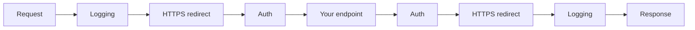

# The Middleware Pipeline

Back in the overview I told you ASP.NET Core stands on two pillars. Phase 4 covered one of them — dependency injection. This phase is the other one, and once it clicks, an enormous amount of the framework stops looking like magic.

Here's the mental model, and it's worth slowing down for because everything else hangs off it.

**Every incoming request travels through an ordered chain of small pieces of code called middleware.** Each piece gets a chance to look at the request on the way *in*, then it hands control to the next piece down the chain, and finally it gets a chance to look at the response on the way *back out*. It's an onion: the request goes inward layer by layer to reach your endpoint, and the response unwinds outward through those same layers in reverse.

That "in, then back out" shape is the single most important thing to hold onto. A middleware isn't a one-shot handler — it wraps everything after it.



> 💡 The chain isn't a metaphor the framework invented for teaching — under the hood it really is a stack of nested functions, each holding a reference to the next one as a `RequestDelegate`. We stay at the using-it level here. The machinery beneath (the `RequestDelegate` type, and Kestrel handing requests in) is the roots guide [The ASP.NET Pipeline & Kestrel](/guides/the-aspnet-pipeline-and-kestrel).

## `Use`, `Run`, and `Map`

You build the pipeline in `Program.cs` by adding middleware to your `WebApplication` (the `app` variable). There are three verbs you'll reach for.

**`app.Use`** adds a middleware that *may* call the next one. It receives the request `context` and a `next` delegate. You do your work, you `await next(context)` to run the rest of the pipeline, and then you do more work after it returns. This is the onion in code. Here's a timing-and-logging middleware on our products API — it stamps how long every request took:

```csharp
var builder = WebApplication.CreateBuilder(args);
var app = builder.Build();

app.Use(async (context, next) =>
{
    var start = DateTime.UtcNow;
    await next(context);              // run the rest of the pipeline
    var ms = (DateTime.UtcNow - start).TotalMilliseconds;
    app.Logger.LogInformation("{Method} {Path} -> {Status} in {Ms}ms",
        context.Request.Method, context.Request.Path, context.Response.StatusCode, ms);
});

app.MapGet("/products", () => new[] { new { Id = 1, Name = "Keyboard" } });

app.Run();
```

*What just happened:* the lambda runs once per request. Everything before `await next(context)` happens on the way in (we grab a start time). `await next(context)` runs *all* the middleware and the endpoint below us — `/products` actually returns its data during that await. Then control comes back to us and everything after the await runs on the way out, when we know the status code and elapsed time. One middleware, both edges of the onion.

**`app.Run`** adds a *terminal* middleware. It takes only the `context` — no `next` — because it's the end of the line. Whatever it writes is the response, and nothing after it runs:

```csharp
app.Run(async context =>
{
    await context.Response.WriteAsync("Nothing here.");
});
```

*What just happened:* `Run` has no way to pass control onward, so it always produces the response itself. You'll use it far less than `Use` — mostly as a catch-all at the very bottom of the pipeline. The name is the giveaway: `Use` participates in the chain, `Run` ends it.

**`app.Map`** branches the pipeline based on the request path. Anything matching the prefix gets its own little sub-pipeline:

```csharp
app.Map("/admin", admin =>
{
    admin.Run(async context =>
        await context.Response.WriteAsync("Admin area"));
});
```

*What just happened:* requests starting with `/admin` peel off into the branch and run only what's configured inside it; everything else flows past untouched. There's also `app.MapWhen(predicate, branch)` when you need to branch on something other than a path — say, the presence of a header or a query string value. `Map` is for "this whole slice of the app behaves differently."

## ⚠️ Order matters — a lot

This is where people get burned, so read it twice. **Middleware runs in the exact order you add it.** The first one you register is the outermost layer of the onion; the last is closest to your endpoint. Move two lines and you can silently break security or error handling.

Why does it bite so hard? Because the built-in middleware *depends* on running in a particular order. Authorization can't decide whether to allow a request until authentication has figured out *who* the request is from. Routing has to match an endpoint before authorization can read that endpoint's `[Authorize]` rules. So there's a canonical order, and it's not negotiable:

```csharp
app.UseExceptionHandler("/error");   // outermost — must wrap everything to catch errors
app.UseHttpsRedirection();           // bounce http -> https early
app.UseStaticFiles();                // serve files before hitting routing/auth

app.UseRouting();                    // figure out WHICH endpoint matches
app.UseAuthentication();             // WHO is this request? (reads tokens/cookies)
app.UseAuthorization();              // is this WHO allowed to hit that endpoint?

app.MapGet("/products", () => Results.Ok("listing products"));   // endpoints last
```

*What just happened:* the exception handler goes first so it wraps every later layer — only an outer layer can catch what an inner layer throws. `UseRouting` runs before the auth pair because authorization needs to know which endpoint was selected to read its permissions. `UseAuthentication` always precedes `UseAuthorization` — you must establish identity before you can check permissions. And the endpoints come last, after auth has had its say. The rule of thumb that covers most mistakes: **put auth before the endpoints it protects.** If `UseAuthorization` lands after your `MapGet`, the endpoint runs before anyone checks permissions, and your `[Authorize]` rules do nothing.

> 📝 Minimal API apps wire a lot of this up implicitly — call `app.UseAuthentication()`/`app.UseAuthorization()` and the framework slots `UseRouting` in for you. But the *ordering law* is the same whether it's implicit or you spell it out. When something auth-related behaves strangely, the order of these lines is the first place to look.

## Short-circuiting: when *not* calling `next` is the point

A middleware that calls `next` is a pass-through. A middleware that **doesn't** call `next` ends the request right there and sends a response — this is called **short-circuiting**, and it's not a bug, it's a primary tool.

This is exactly how auth, caching, and rate-limiting reject requests early without wasting work on the endpoint. Here's a hand-rolled API-key gate in front of our products API:

```csharp
app.Use(async (context, next) =>
{
    if (context.Request.Headers["X-Api-Key"] != "secret-123")
    {
        context.Response.StatusCode = 401;                 // Unauthorized
        await context.Response.WriteAsync("Missing or bad API key.");
        return;                                            // <-- no next(): pipeline stops here
    }

    await next(context);   // key is good — let the request continue inward
});

app.MapGet("/products", () => Results.Ok(new[] { "Keyboard", "Mouse" }));
```

*What just happened:* when the key is wrong we set a 401, write a message, and `return` — we never call `next`, so the request never reaches `/products`. The endpoint does zero work for a request that was never going to be allowed. When the key is good, `await next(context)` lets it flow onward as normal. That fork — "reject now, or pass it down" — is the entire job of authentication and authorization middleware, just with real tokens instead of a hardcoded string. (You'll see the real, built-in version in [Phase 7: Authentication & Authorization](07-auth.md); don't ship a hardcoded key like this one.)

## Writing a reusable middleware

The inline lambdas are perfect for small things. When a middleware grows, or you want to reuse it, pull it into a class. The convention is a constructor that takes the `RequestDelegate next`, plus an `InvokeAsync(HttpContext)` method:

```csharp
public class RequestTimingMiddleware
{
    private readonly RequestDelegate _next;
    private readonly ILogger<RequestTimingMiddleware> _logger;

    public RequestTimingMiddleware(RequestDelegate next, ILogger<RequestTimingMiddleware> logger)
    {
        _next = next;
        _logger = logger;
    }

    public async Task InvokeAsync(HttpContext context)
    {
        var start = DateTime.UtcNow;
        await _next(context);                               // pass control down
        var ms = (DateTime.UtcNow - start).TotalMilliseconds;
        _logger.LogInformation("{Path} took {Ms}ms", context.Request.Path, ms);
    }
}

// In Program.cs, where you'd otherwise call app.Use(...):
app.UseMiddleware<RequestTimingMiddleware>();
```

*What just happened:* this is the exact same onion as our first lambda, just in class form. The `RequestDelegate next` the constructor receives *is* "the rest of the pipeline" — calling `_next(context)` is the same as `await next(context)` was earlier. Notice `ILogger` arriving through the constructor: middleware classes get their dependencies via the DI you learned in Phase 4. `app.UseMiddleware<T>()` registers it at whatever point in the order you place that line — so all the ordering rules above still apply.

## Recap

- A request flows through an **ordered chain of middleware** — each runs on the way *in*, calls `next` to go deeper, and runs again on the way *out*. Think onion. This is one of ASP.NET Core's two pillars; DI is the other.
- **`app.Use`** adds middleware that may call `next`; **`app.Run`** is terminal (never calls `next`); **`app.Map`/`MapWhen`** branch the pipeline on a path or condition.
- **Order is the law.** Middleware runs in registration order. The canonical built-in order is `UseExceptionHandler` (and `UseHttpsRedirection`) early, then `UseRouting` → `UseAuthentication` → `UseAuthorization` → endpoints. Put auth before the endpoints it protects.
- **Not calling `next` short-circuits** the pipeline — the request gets a response immediately and never reaches the endpoint. That's how auth, caching, and rate-limiting reject early.
- For anything beyond a small lambda, write a middleware **class** (`RequestDelegate next` in the constructor, `InvokeAsync(HttpContext)`) and register it with `app.UseMiddleware<T>()`. It gets DI like any other service.
- The machinery underneath — the `RequestDelegate` and Kestrel — lives in [The ASP.NET Pipeline & Kestrel](/guides/the-aspnet-pipeline-and-kestrel).

Quick gut-check before moving on:

```quiz
[
  {
    "q": "What is the difference between app.Use and app.Run?",
    "choices": [
      "Use runs only in development; Run runs only in production",
      "Use may call next to continue the pipeline; Run is terminal and never calls next",
      "Use is for GET requests; Run is for POST requests",
      "There is no difference — they are aliases"
    ],
    "answer": 1,
    "explain": "app.Use receives a next delegate and can pass control onward; app.Run is the end of the chain and always produces the response itself."
  },
  {
    "q": "Why must UseAuthentication be added before UseAuthorization?",
    "choices": [
      "Alphabetical order is required by the compiler",
      "Authorization decides who the user is, then Authentication checks permissions",
      "You must establish WHO the request is from before you can check WHAT they're allowed to do",
      "It doesn't matter — middleware order is ignored for auth"
    ],
    "answer": 2,
    "explain": "Authentication establishes identity; authorization checks permissions against that identity. Order matters because middleware runs in the order you register it."
  },
  {
    "q": "A middleware sets a 401 status and returns WITHOUT calling next. What happens?",
    "choices": [
      "The request still reaches the endpoint, which overrides the 401",
      "The pipeline short-circuits — the request never reaches the endpoint and the 401 response is sent",
      "ASP.NET Core throws an exception because next is required",
      "The request restarts from the top of the pipeline"
    ],
    "answer": 1,
    "explain": "Not calling next short-circuits the pipeline: the response is sent immediately and inner middleware/endpoints never run. This is exactly how auth rejects requests early."
  }
]
```

[← Phase 4: Dependency Injection](04-dependency-injection.md) · [Guide overview](_guide.md) · [Phase 6: Building a REST API →](06-building-a-rest-api.md)