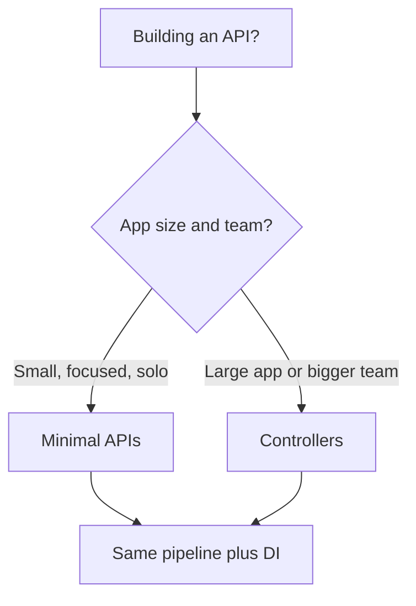

# Where to Go Next

Take stock of what you can actually do now. You can stand up a minimal API server, route requests with path and query parameters, group routes, bind and validate request bodies into types, register services and pull them in through dependency injection, write your own middleware and place it correctly in the pipeline, build full CRUD with proper status codes, lock endpoints behind JWT auth, and prove the whole thing works with `WebApplicationFactory` integration tests before shipping. That's a real REST API, not a toy.

And here's the quieter win. You didn't only learn a framework — you internalized the two pillars it's built on. A request flows through a **middleware pipeline**, an ordered chain where each piece can act on the way in and the way back out. Your code receives its collaborators through **dependency injection** instead of newing them up. Hold those two ideas and the rest of ASP.NET Core — routing, binding, auth, caching — is detail hanging off them. That's why you can reason about the framework when something misbehaves at 2am instead of guessing.

So this last phase isn't more endpoints. It's the map: one design choice you'll meet on every project, the ecosystem around the framework, the roots underneath it, and one concrete thing to go build.

## Minimal APIs vs controllers

Everything in this guide used **minimal APIs** — `MapGet`, `MapPost`, lambdas, lean and direct. A genuinely good default for a focused API. But you'll also meet the older, heavier sibling: **MVC controllers**, classes decorated with `[ApiController]` and attribute routing. Both run on the exact same pipeline and DI container you already understand. This isn't two frameworks — it's two front doors into one.



What controllers buy you as an app grows: automatic model validation (an invalid body returns a `400` with no manual checks), filters for cross-cutting concerns, and conventions that keep a large codebase consistent across a team. A controller action looks like this:

```csharp
[ApiController]
[Route("products")]
public class ProductsController : ControllerBase
{
    private readonly IProductService _service;
    public ProductsController(IProductService service) => _service = service;

    [HttpGet("{id:int}")]
    public IActionResult Get(int id)
    {
        var product = _service.Find(id);
        return product is null ? NotFound() : Ok(product);
    }
}
```

Notice it's the same constructor injection and the same `IProductService` from Phase 4 — only the shape around it changed.

> 💡 You don't have to choose all-or-nothing: you can mix minimal APIs and controllers in the same app. Pick by size and team — minimal APIs for small, focused services; controllers when an app or team grows large enough to want the structure and automatic validation. Neither is "more advanced" — they're aimed at different sizes of problem.

## The .NET web ecosystem

Your API doesn't live alone. A few neighbors you'll reach for next:

- **EF Core — the data layer.** Every example in this guide stored products in memory, which vanishes on restart. Real services persist. [EF Core](/guides/efcore-from-zero) is .NET's default ORM: define your `Product` as an entity, point it at SQLite or Postgres, and create/read/update/delete calls become real database operations. Here's the payoff from Phase 6 keeping the repository separate from the endpoints — swap the in-memory store for an EF Core one and the endpoints don't change at all. For lighter, hand-written SQL instead of a full ORM, **Dapper** maps query results to objects with very little ceremony.
- **Blazor — a C# front-end.** If you'd rather not jump to a JavaScript framework, [Blazor](/guides/blazor-from-zero) lets you build interactive web UIs in C#, sharing models with your API. Or pair this API with React, Vue, or anything else — it's just HTTP.
- **SignalR and gRPC — beyond request/response.** When you need real-time push (chat, live dashboards, notifications), **SignalR** gives you websockets without the plumbing. When you need fast, typed service-to-service calls, **gRPC** (`Grpc.AspNetCore`) is the tool. Both sit on the same host you already know.

📝 None of these is mandatory, and none replaces what you learned. They're layers you add when a project needs them — each slotting into the pipeline-and-DI model you already carry.

## The roots underneath

For the deepest understanding — the kind that makes performance tuning and weird production bugs make sense — go down a level. [The ASP.NET Pipeline & Kestrel](/guides/the-aspnet-pipeline-and-kestrel) takes apart the web server that actually accepts the socket connection and the request pipeline that everything in this guide rode on. You've been using both the whole time; this guide shows you their gears. It's optional, but it's where "I use ASP.NET Core" becomes "I understand ASP.NET Core."

## What to build

Reading more won't make this stick. Finishing one real thing will. Here's the assignment, deliberately concrete.

Take the **products API** you grew across this guide and carry it all the way home:

- **Swap the in-memory repository for EF Core + a real database** so products survive a restart. Endpoints stay; the store changes. ([EF Core From Zero](/guides/efcore-from-zero) walks the persistence part.)
- **Add JWT auth or ASP.NET Core Identity** so each request proves who it is — the Phase 7 pattern, applied for real.
- **Generate OpenAPI/Swagger docs** (built-in OpenAPI or `Swashbuckle`) so other people, and future you, can read the contract.
- **Wire up logging and a little observability** to see what the service does in production.
- **Add output caching or rate limiting** with the built-in middleware when ready — both drop straight into the pipeline.
- **Deploy it** somewhere you can hit from your phone.

If the products API feels too familiar, build something small and new end to end instead — a URL shortener or a notes API. Same muscles: routes, binding, a service, middleware, auth, tests, deploy. Finishing one project completely teaches more than three more tutorials would.

Here's the honest close. ASP.NET Core was never magic. A request travels a **middleware pipeline** to an endpoint, and your code gets its services handed to it through **dependency injection**. That's the whole framework, and you understand it now. Go give the products API a real database, lock it behind auth, deploy it, and show someone. You're ready.

## Recap

1. **You can ship a real ASP.NET Core API** — minimal APIs, routing, binding and validation, DI, custom middleware, full CRUD, JWT auth, and integration tests — and understand *why* each piece works, because the two pillars are clear.
2. **Minimal APIs vs controllers is a size choice, not a skill ladder** — both run on the same pipeline and DI; minimal APIs for focused services, controllers for larger apps/teams (automatic `400`, filters, conventions). You can mix them.
3. **The ecosystem layers onto what you know** — EF Core (or Dapper) for data, Blazor for a C# UI, SignalR for real-time, gRPC for service-to-service — each slotting into pipeline + DI.
4. **The roots are there when you want them** — the pipeline and Kestrel turn "I use it" into "I understand it."
5. **Build and finish one thing** — carry the products API to EF Core + a real DB, real auth, Swagger, logging, caching, and a deploy. Or build a small URL shortener / notes API end to end.

## Quick check

Three decisions to take with you as you leave this guide:

```quiz
[
  {
    "q": "Your team is starting a large API and wants automatic 400-on-invalid, filters, and consistent conventions across many endpoints. Which approach fits best?",
    "choices": [
      "Minimal APIs, always, regardless of size",
      "MVC controllers, which add automatic model validation, filters, and conventions for larger apps and teams",
      "A completely different framework, since ASP.NET Core can't do this",
      "gRPC, because it's the only option for large apps"
    ],
    "answer": 1,
    "explain": "Controllers ([ApiController] + attribute routing) give automatic model validation, filters, and conventions that suit larger apps and teams. Minimal APIs are leaner and great for focused services. Both run on the same pipeline, and you can even mix them."
  },
  {
    "q": "You replace the Phase 6 in-memory repository with an EF Core + database one. What mostly changes?",
    "choices": [
      "Every endpoint must be rewritten from scratch",
      "Only the repository swaps to EF Core; the endpoints stay the same because the data access was kept separate",
      "You must abandon minimal APIs and move to controllers",
      "Nothing — ASP.NET Core persists data to a database automatically"
    ],
    "answer": 1,
    "explain": "Because Phase 6 kept the repository separate from the endpoints, swapping the in-memory store for an EF Core one leaves the endpoints unchanged. You replace the bottom layer, not the top."
  },
  {
    "q": "Which pairing of tool to job is correct in the .NET web ecosystem?",
    "choices": [
      "Blazor for service-to-service RPC, SignalR for the database",
      "EF Core (or Dapper) for data, Blazor for a C# front-end, SignalR for real-time, gRPC for service-to-service",
      "gRPC for building the UI, EF Core for websockets",
      "Dapper for real-time push, SignalR for object-relational mapping"
    ],
    "answer": 1,
    "explain": "EF Core is the default ORM (Dapper for lightweight SQL mapping), Blazor builds C# web UIs, SignalR handles real-time/websockets, and gRPC handles typed service-to-service calls. Each layers onto the same pipeline + DI model."
  }
]
```

---

[← Phase 8: Testing & Production](08-testing-and-production.md) · [Guide overview](_guide.md)
