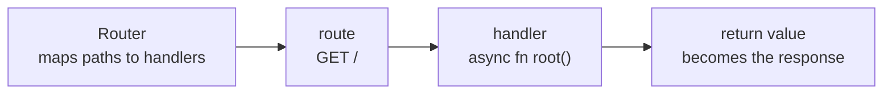

# What axum Is & Your First Server

You know [Rust](/guides/rust-from-zero) and want to put something on the web. The Rust web ecosystem
looks intimidating from outside - async, runtimes, crates named hyper and tower. axum's pitch: make that
disappear and leave you writing ordinary Rust.

Here's what makes axum different from frameworks in other languages: it leans on **Rust's type system**
instead of macros or magic strings. A handler is a plain `async fn` - no `#[route("/users")]` annotation,
no decorator, no registration macro. You write a normal function, and axum figures out how to call it from
its argument and return types. See that, and the rest of the framework stops looking clever and starts
looking obvious.

💡 This platform - The Missing Manual - runs on axum. It comes from the **Tokio** team and sits on two
layers you'll meet later: **hyper** (the HTTP implementation) and **tower** (the shared middleware
abstraction). You don't need either to start - axum is a thin, ergonomic skin over crates the whole
async-Rust world shares, not a walled garden. (New to what a framework buys you over raw sockets? See
[What a Framework Even Is](/guides/what-a-framework-even-is).)

## The mental model: a Router maps paths to handlers

Before any code, hold one picture in your head - it's the whole framework.

📝 A **`Router`** maps **paths** to **handlers**. You build it once at startup, registering routes on it,
and hand it to the server to run.

📝 A **handler** is an **`async fn` whose return value becomes the response**. Return a `&'static str` and
axum sends it as text. Return a `String`, same thing. Return JSON, and it serializes it and sets the
header for you. The return type *is* the response - axum knows how to turn it into one because it
implements a trait called **`IntoResponse`** (more on that in Phase 3).

A handler's *arguments* are the other half: **extractors** that pull pieces out of the request (path,
query string, JSON body) - the star of the next two phases. Your first server's handler takes none.



*One idea:* a request comes in, the Router matches it to a route, calls that route's handler, and
whatever the handler returns is sent back. Every endpoint you build flows along that arrow.

## Your first server

First, add the two dependencies. From inside your Cargo project:

```bash
cargo add axum
cargo add tokio --features full
```

*What just happened:* `cargo add axum` pulls in the framework. `cargo add tokio --features full` adds the
async runtime axum runs on, with everything enabled (TCP listener, multi-threaded scheduler, macros). Both
now sit in `Cargo.toml`.

Now the smallest server that does something real. Put this in `src/main.rs`:

```rust
use axum::{routing::get, Router};

async fn root() -> &'static str {
    "Hello from axum"
}

#[tokio::main]
async fn main() {
    let app = Router::new().route("/", get(root));
    let listener = tokio::net::TcpListener::bind("0.0.0.0:3000").await.unwrap();
    axum::serve(listener, app).await.unwrap();
}
```

*What just happened:* walk it from the top - 
- `async fn root() -> &'static str` is the **handler**. It takes no arguments and returns a string slice.
  Because `&'static str` implements `IntoResponse`, axum knows how to send it back as a `200 OK` with that
  text as the body. No annotation on the function - it's a plain `async fn`.
- `#[tokio::main]` is the one macro you'll use. It rewrites your `async fn main` so it can run on the Tokio
  runtime - Rust's `main` can't normally be `async`, and this bridges that gap (more on *why* below).
- `Router::new().route("/", get(root))` builds the **Router** and registers one route: a `GET` request to
  `/` runs the `root` handler. `get` comes from `axum::routing` - there's a `post`, `put`, `delete`, and
  so on for the other methods. We name the finished router `app`.
- `TcpListener::bind("0.0.0.0:3000")` opens a socket on port 3000. The `.await` waits for the bind to
  finish (it's an async operation), and `.unwrap()` says "if binding fails, crash" - fine for now; Phase 7
  handles errors properly.
- `axum::serve(listener, app).await` is the engine starting. It takes the listener and your router and
  runs the accept loop forever, handing each incoming request to the router. It blocks here until you stop
  the program.

Run it like any Rust binary:

```bash
cargo run
```

axum prints nothing by default and just waits for requests. Leave it running, and in another terminal hit
the route:

```bash
curl localhost:3000
```

```console
$ curl localhost:3000
Hello from axum
```

*What just happened:* `curl` sent a `GET /`. The Router matched it to your `root` handler, called it, and
the handler's return value - `"Hello from axum"` - came back as the response body. A working HTTP server
in a dozen lines, and not one of them is a macro-decorated route.

## Why async, and why a runtime?

Why is `root` `async fn`, and why does it need Tokio at all? Short version:

📝 A web server spends most of its life *waiting* - for a request, a database answer, another service.
**Async** lets one thread juggle thousands of those waits instead of blocking a whole OS thread per one.
That's how a small server handles many connections concurrently.

But Rust's `async`/`await` is just *syntax* - it describes work that can pause and resume, nothing more.
Something has to actually *drive* that work: poll paused tasks, wake them when ready, spread them across
threads. That's a **runtime**, and in axum's world it's **Tokio** - which is why `#[tokio::main]` wraps
your `main` and starts it. You don't need to understand Tokio's internals to use axum, but
[Tokio: The Async Runtime](/guides/tokio-the-async-runtime) removes the rest of the mystery.

## The running example: a books API

We won't keep returning `"Hello from axum"` - across this guide we'll grow one real service: a small
**books API**, built around one type:

```rust
struct Book {
    id: u32,
    title: String,
    author: String,
}
```

*What just happened:* we declared the `Book` struct the rest of the guide builds on - for now, a plain
struct. In Phase 3 we'll derive `Serialize`/`Deserialize` on it so axum can turn it into JSON going out and
parse it from a request body coming in - that's how a struct becomes a real API resource. You've now met
the cast: **`Router`**, **handler**, **return value** as response, and **`Book`**, which we'll spend the
next eight phases turning into a proper REST API.

Next: routing - methods, path/query parameters (your first extractors), and nesting routers so a growing
API doesn't sprawl into one giant list.

## Recap

- **axum leans on Rust's type system, not macros.** A handler is a plain `async fn` - no route
  annotations, no decorators. axum calls it based on its argument and return types.
- **The mental model is one sentence:** a **`Router`** maps paths to handlers, and a handler is an
  **`async fn` whose return value becomes the response** (because that value implements `IntoResponse`).
  Its arguments - the extractors - come in Phases 2–3.
- **A first server is small:** `cargo add axum` and `cargo add tokio --features full`, build a
  `Router::new().route("/", get(root))`, bind a `TcpListener`, and call `axum::serve(listener, app)`. Run
  with `cargo run`, test with `curl`.
- **`#[tokio::main]` starts the runtime** so your `async main` can run. axum is async because servers
  spend their lives waiting, and **Tokio** is the runtime that drives that async work.
- **axum sits on Tokio plus hyper/tower** - it's a thin, ergonomic layer, not a walled garden. This very
  platform runs on it.
- **The throughline:** Router → handler → return value → response. We'll grow one **books API** along
  that arrow for the rest of the guide.

## Quick check

Three questions on the ideas that have to stick - what makes axum different, the Router/handler model,
and how a first server fits together:

```quiz
[
  {
    "q": "What makes an axum handler different from route definitions in many other frameworks?",
    "choices": [
      "It's a plain async fn with no route annotation - axum calls it based on its argument and return types",
      "It must be decorated with a #[route] macro that declares its path and method",
      "It has to be registered in a global config file before it can be called",
      "It must return a special Response object built by hand every time"
    ],
    "answer": 0,
    "explain": "axum leans on Rust's type system instead of macros. A handler is an ordinary async fn; you wire it to a path with Router::new().route(...), and axum figures out how to call it and how to turn its return value into a response."
  },
  {
    "q": "In `Router::new().route(\"/\", get(root))`, what does the return value of the `root` handler become?",
    "choices": [
      "The HTTP response sent back to the client, because the return type implements IntoResponse",
      "A log line printed to the server console",
      "An argument passed into the next handler in the chain",
      "Nothing - you must call a separate function to send the response"
    ],
    "answer": 0,
    "explain": "A handler's return value becomes the response. Types like &'static str, String, and Json<T> implement IntoResponse, so axum knows how to turn them into a full HTTP response automatically."
  },
  {
    "q": "Why does the first server use `#[tokio::main]` and depend on Tokio?",
    "choices": [
      "Tokio is the async runtime that drives axum's async work; #[tokio::main] starts it so main can be async",
      "Tokio is a database that axum requires to store routes",
      "Tokio compiles the handlers to machine code at startup",
      "Tokio is only needed in production, never during local development"
    ],
    "answer": 0,
    "explain": "Rust's async/await is just syntax - something has to poll and wake paused tasks. That's the runtime, Tokio. #[tokio::main] starts the runtime and lets your main function be async, which axum::serve needs."
  }
]
```

---

[Guide overview](_guide.md) · [Phase 2: Routing & Extractors →](02-routing-and-extractors.md)
