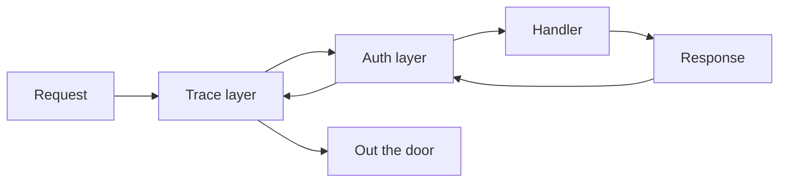

# Middleware with Tower

Here's the mental model, and it's the whole phase: **middleware in axum is a tower `Layer` that wraps your entire service.** You don't register it into a special hook list the way you might in Express or Flask. Instead, you take your `Router` and call `.layer(...)`, which returns a *new* service with the old one tucked inside, like a Russian doll. A request travels inward through each wrapper to reach your handler, and the response travels back out through the same wrappers in reverse.

That single picture — onion layers around your handler — explains why ordering works the way it does, why a logging layer sees both the request *and* the response, and why the same layers you use here also work with HTTP clients and gRPC services.

> 📝 The deep machinery — what a `Service` trait actually is, how `Layer` composes them, why this is *poll*-based — lives in the roots guide, [hyper & tower](/guides/hyper-and-tower). You don't need it to be productive here. This phase is the *applied* view: how to reach for layers in a real axum app. When the abstraction feels like magic and you want to dispel it, that guide is where to go.

We'll keep building the **books API** from earlier phases — the one with shared state holding our books. By the end it'll log every request and reject anyone without an auth header.

## Where middleware fits

A request to your books API doesn't hit your handler directly. It passes through the layers you've wrapped around the router:



Each layer can inspect or modify the request on the way in, decide whether to keep going, and inspect or modify the response on the way out. That "on the way out" half is what makes middleware powerful — a single layer wraps the *whole* request/response round trip.

## Ready-made layers from tower-http

You rarely write middleware from scratch. The **`tower-http`** crate ships the layers almost every web service needs — request logging, CORS, timeouts, compression — all as tower layers that drop straight into axum.

Add it with the features you want:

```bash
cargo add tower-http --features trace,cors,timeout
```

The most useful one to start with is **`TraceLayer`**, which logs every request and response using the `tracing` crate. Let's wrap it around the books router:

```rust
use axum::{routing::get, Router};
use tower_http::trace::TraceLayer;

let app = Router::new()
    .route("/books", get(list_books))
    .with_state(state)
    .layer(TraceLayer::new_for_http());
```

*What just happened:* `.layer(TraceLayer::new_for_http())` wrapped the entire router in a logging layer. Now every request to `/books` gets logged when it arrives and when its response is produced — latency included — without touching the `list_books` handler at all. (You'll also need a `tracing` subscriber initialized at startup for the logs to actually print, e.g. `tracing_subscriber::fmt::init();` — `TraceLayer` *emits* events; the subscriber *displays* them.)

That's the entire pattern for ready-made middleware: add the crate, construct the layer, hang it off `.layer()`. `CorsLayer` and `TimeoutLayer` work exactly the same way.

## Stacking layers with ServiceBuilder

A real service needs several layers at once. You *could* chain `.layer()` calls, but tower gives you **`ServiceBuilder`** for grouping them cleanly:

```rust
use std::time::Duration;
use tower::ServiceBuilder;
use tower_http::{timeout::TimeoutLayer, trace::TraceLayer};

let app = Router::new()
    .route("/books", get(list_books))
    .with_state(state)
    .layer(
        ServiceBuilder::new()
            .layer(TraceLayer::new_for_http())
            .layer(TimeoutLayer::new(Duration::from_secs(10))),
    );
```

*What just happened:* `ServiceBuilder::new()` starts an empty stack; each `.layer()` adds one. The whole stack gets applied to the router in one `.layer()` call. Tracing runs first (outermost), so it logs every request including ones that later time out; the timeout sits just inside it, aborting any handler that runs longer than 10 seconds.

### ⚠️ The layer-ordering rule everyone trips on

Ordering is the single most confusing thing about tower middleware, so read this twice.

When you chain bare `.layer()` calls on a `Router`, layers apply **bottom-up / outside-in** — the **last** `.layer()` you add becomes the **outermost** wrapper, meaning it runs **first** on the way in:

```rust
// inner.layer(A).layer(B)  →  B wraps A wraps handler
// Request order:  B → A → handler
let app = router
    .layer(layer_a)   // inner
    .layer(layer_b);  // OUTER — runs first
```

`ServiceBuilder` flips this to read the intuitive way: layers run **top-to-bottom as written**. The first `.layer()` in the builder is the outermost:

```rust
// Request order:  first → second → handler  (reads top-down ✓)
ServiceBuilder::new()
    .layer(first)    // OUTER — runs first
    .layer(second);  // inner
```

*What just happened:* both snippets compose layers, but they read in **opposite directions**. This is exactly why `ServiceBuilder` exists — for more than one or two layers, prefer it so the source order matches the execution order. When you see a bare `.layer().layer()` chain, remember to read it from the bottom up.

## Writing custom middleware with from_fn

When no off-the-shelf layer does what you need, the easy path is **`axum::middleware::from_fn`**. It turns a plain `async fn` into a layer. The function receives the incoming `Request` and a `Next` (the rest of the chain), and either short-circuits with a response or calls `next.run(req).await` to continue.

Here's an auth gate for the books API that rejects requests with no `authorization` header:

```rust
use axum::{
    extract::Request,
    http::StatusCode,
    middleware::{self, Next},
    response::Response,
};

async fn require_auth(req: Request, next: Next) -> Result<Response, StatusCode> {
    if req.headers().get("authorization").is_none() {
        return Err(StatusCode::UNAUTHORIZED);
    }
    Ok(next.run(req).await)
}

let app = Router::new()
    .route("/books", get(list_books))
    .with_state(state)
    .layer(middleware::from_fn(require_auth))
    .layer(TraceLayer::new_for_http());
```

*What just happened:* `from_fn(require_auth)` wraps `require_auth` into a layer. On each request, if the `authorization` header is missing, the function returns `Err(StatusCode::UNAUTHORIZED)` and the handler **never runs** — the `401` goes straight back out. Otherwise `next.run(req).await` hands control to the inner service (eventually `list_books`) and passes its response back. Note the ordering: `TraceLayer` is added *last*, so it's outermost and logs even the rejected `401`s — usually what you want.

> 💡 Need state inside your middleware — a database pool, an API-key set, the `AppState` from [Phase 4: Shared State](04-shared-state.md)? Use **`from_fn_with_state`** instead. You pass the state when building the layer, and your function takes a `State<T>` extractor as its first argument, exactly like a handler does.

## Why "it's all tower" is the real payoff

Step back and notice what you *didn't* learn: an axum-specific middleware API. There isn't one. `TraceLayer`, `TimeoutLayer`, `CorsLayer`, and your `from_fn` gate are all plain tower `Layer`s.

> 💡 Because they're tower, **the same layers work outside axum entirely.** A `TimeoutLayer` can wrap an HTTP *client* so outbound calls time out. A tracing or retry layer can wrap a gRPC service. The middleware skill you just built transfers to the whole tower ecosystem — that's the dividend of a framework that leans on a shared abstraction instead of inventing its own. The full `Service`/`Layer` story, including how to write a `Layer` by hand when `from_fn` isn't enough, is in [hyper & tower](/guides/hyper-and-tower).

## Recap

- **Middleware in axum is a tower `Layer` that wraps your whole service** — you add it with `.layer(...)` on the `Router`, like nesting dolls around your handler.
- **`tower-http`** ships the common layers — `TraceLayer` (request logging via `tracing`), `CorsLayer`, `TimeoutLayer`, compression — added with `cargo add tower-http --features ...` and dropped straight onto `.layer()`.
- **`ServiceBuilder`** groups multiple layers cleanly and, crucially, reads **top-to-bottom** (outermost first) — the opposite of bare chained `.layer()` calls, which read **bottom-up**.
- **`axum::middleware::from_fn`** turns an `async fn(Request, Next)` into custom middleware: return an `Err`/response to short-circuit, or `next.run(req).await` to continue. Use **`from_fn_with_state`** when it needs `State`.
- Because everything is tower, **the same layers work with HTTP clients, gRPC, and other tower services** — see [hyper & tower](/guides/hyper-and-tower).

## Quick check

```quiz
[
  {
    "q": "In axum, what IS middleware, mechanically?",
    "choices": ["A special hook registered on the Router", "A tower Layer that wraps your service, added with .layer()", "A macro applied to each handler", "A function listed in a middleware: config field"],
    "answer": 1,
    "explain": "axum has no dedicated middleware API — middleware is a tower Layer that wraps the whole service, attached via .layer() on the Router."
  },
  {
    "q": "You write `router.layer(a).layer(b)` with bare chained calls. Which layer runs FIRST on an incoming request?",
    "choices": ["a, because it's written first", "b, because the last .layer() is the outermost", "Neither — order is undefined", "Both run simultaneously"],
    "answer": 1,
    "explain": "With bare chained .layer() calls, layers apply bottom-up: the last one added (b) is outermost and runs first. ServiceBuilder flips this to read top-down."
  },
  {
    "q": "In a `from_fn` middleware, how do you reject a request so the handler never runs?",
    "choices": ["Call next.run(req).await as usual", "Return an Err (or a response) instead of calling next.run", "Throw a panic", "Return Ok(()) with no body"],
    "answer": 1,
    "explain": "Returning early — e.g. Err(StatusCode::UNAUTHORIZED) — short-circuits the chain; the response goes straight back out and next.run is never called, so the handler doesn't execute."
  }
]
```

[← Phase 4: Shared State](04-shared-state.md) · [Guide overview](_guide.md) · [Phase 6: Building a REST API →](06-building-a-rest-api.md)