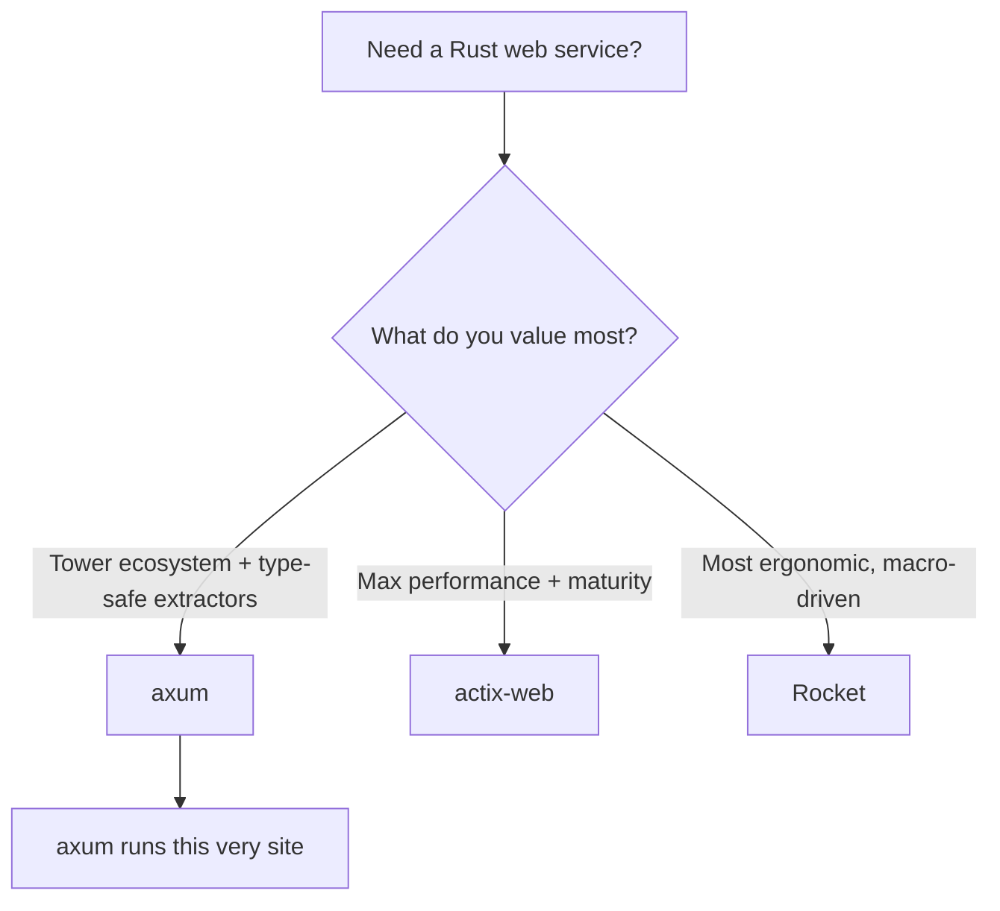

# Where to Go Next

Stop for a second and look at what you can actually do now. You can stand up an axum server on Tokio, route a request to a handler, pull pieces out of it with extractors like `Path`, `Query`, `Json`, and `State`, return any type that implements `IntoResponse`, share a store across handlers without a single global, wrap the whole thing in tower middleware, build full CRUD, handle errors with a custom type and the `?` operator, and test it with `oneshot` before shipping it with graceful shutdown. That is a real REST API, not a toy.

And here is the quieter win. Because axum leans on Rust's type system instead of macros, you did not only learn a framework — you learned how one fits together. A **`Router`** maps paths to handlers. A handler is **an `async fn` whose arguments extract from the request and whose return value becomes the response.** Tower **layers** wrap it. There was no hidden magic to memorize, which means when something breaks at 2am, you can reason your way out of it from the compiler's complaints.

So this last phase is not more handlers. It is the map: where axum sits among the other Rust web frameworks, the layer you will almost certainly add next, the roots worth learning, and one concrete thing to go build.

## axum vs the field

You now know enough to choose a framework *on purpose* rather than by reputation. The good news in Rust: the big three are all production-grade and all fast. The differences are about *feel* and *what you build on*, not whole different universes.



A line on each:

- **axum** — the modern default, from the Tokio team. It is tower-native and driven by the type system: plain `async fn` handlers, extractors as arguments, `IntoResponse` returns. Its quiet superpower is the **tower** ecosystem — middleware you write for axum is reusable, and gRPC via **tonic** shares the same tower `Service` abstraction. This is the framework serving the page you are reading. (You are here.)
- **actix-web** — the mature, batteries-included heavyweight, and consistently at or near the **top of the performance benchmarks**. It has its own actor-flavored history and a deep feature set. If raw throughput and a long track record matter most, this is your pick. See [actix-web From Zero](/guides/actix-web-from-zero).
- **Rocket** — the most **ergonomic** of the three, leaning hard on macros (`#[get("/")]` attributes and friends) to make handler code wonderfully concise and approachable. If you want the least ceremony and the most readable routes, you will like its style. See [Rocket From Zero](/guides/rocket-from-zero).

> 💡 How to pick: reach for **axum** when you want the tower ecosystem and type-safe extractors (and a clean path to gRPC via tonic, since it shares tower). Reach for **actix-web** when you want maximum performance and a mature, batteries-included framework. Reach for **Rocket** when you want concise, approachable, macro-driven code.

📝 None of these is "the best." They are aimed at slightly different priorities, and all three will happily run a serious service. The senior instinct is not memorizing a winner — it is asking "best for *this* job?" and answering honestly. You have the pieces for that now.

## The layer you'll add next: a real database

Every API in this guide kept its books in memory. That is perfect for learning and useless in production — restart the server and the data is gone. The very next thing almost every real axum service grows is a **database**.

Here is the part worth knowing up front: Rust has **no single default ORM** the way some ecosystems do. You get to choose, and the three common answers each have a clear personality.

- **`sqlx`** — not an ORM at all, but the most popular companion to axum. You write **raw SQL**, and a macro checks your queries **against a real database at compile time** — so a typo'd column name is a build error, not a 500 in production. It is fully async, which fits axum's world cleanly.
- **SeaORM** — a proper **async ORM** built on top of sqlx, for when you want entities, relations, and a query builder rather than hand-written SQL.
- **Diesel** — the **mature, established** ORM, with a rich type-safe query DSL. It is more sync-flavored in its roots, which is worth knowing if everything else in your stack is async.

The reassuring bit: your handlers barely change. Remember Phase 4, where you put a store into `State` with `with_state` and pulled it out with the `State<T>` extractor? That investment pays off here. A **`sqlx::PgPool`** (a Postgres connection pool) drops straight into that same `State` slot. Your handlers still extract the pool, run a query, and return something that implements `IntoResponse`. You are swapping the bottom layer — the store — not rewriting the top.

## The roots: tokio, hyper, and tower

axum is small because it stands on three things you have been using all along, sometimes without naming them. Learning those roots is how you remove the *last* of the magic.

- **Tokio** is the async runtime — the thing that actually drives your `async fn`s, schedules tasks, and handles the I/O. Every `.await` in your handlers ultimately answers to it. See [Tokio: The Async Runtime](/guides/tokio-the-async-runtime).
- **hyper** is the HTTP implementation axum is built on, and **tower** is the universal middleware abstraction — the `Service` and `Layer` traits behind every layer you added in Phase 5. See [hyper & tower](/guides/hyper-and-tower).

You do not need these to ship. But the day you want to understand *why* an extractor works, or write a tower layer that does something no crate offers, these two guides are where the floor drops away and you see all the way down.

## What to build

Reading more will not make this stick. Building one real thing will. So here is the assignment, and it is deliberately concrete.

Take the **books API** you grew across this guide and carry it all the way home:

- **Swap the in-memory store for sqlx + Postgres** so the books survive a restart. Drop a `PgPool` into `State`, write a few compile-checked queries, and watch your handlers stay almost exactly as they were.
- **Add JWT (or session) auth middleware** so each request proves who it is, and books belong to a user. This is the tower middleware pattern from Phase 5, aimed at a real job.
- **Wire up `tracing`** for observability, so you can actually see what your service is doing under load (the `tower-http` trace layer you met in Phase 5 plugs straight in).
- **Generate API docs** with OpenAPI via **utoipa**, so other people — and future you — can read the contract.
- **Tidy up config** so secrets, the database URL, and the port come from the environment, not hardcoded values.
- **Deploy it** somewhere you can hit from your phone, with the graceful shutdown from Phase 8 wired up.

If the books API feels too familiar, build something small and new end to end instead — a **URL shortener** or a **notes API**. Same muscles: routes, extractors, state, layers, errors, tests, deploy. The point is finishing one project completely, which teaches more than three more tutorials would.

## The honest close

axum was never magic. Strip it back and it is a handful of ideas you now understand completely: a **`Router`** that sends a request to an **`async fn` whose arguments extract from it and whose return value becomes the response**, all wrapped in **tower layers** — and that is plain Rust, checked by the compiler, sitting on tokio and hyper.

That is why you can read the machine now. You can build a real service on axum and, more importantly, reason about it when it misbehaves. Go finish the books API, give it a real database, lock it behind auth, light it up with tracing, deploy it, and show someone. You are ready.

## Recap

1. **You can ship a real axum API** — routed, extracted, responded, state-shared, layered with tower, error-handled, tested, and deployed — and you understand *why* each piece works, because axum hides nothing behind macros.
2. **Choose a framework on purpose** — axum for the tower ecosystem and type-safe extractors (this site runs on it), actix-web for maximum performance and maturity, Rocket for concise, ergonomic macro-driven code.
3. **A database is the next layer, and Rust has no single default** — sqlx (compile-checked raw SQL), SeaORM (async ORM), or Diesel (mature ORM). A `sqlx::PgPool` drops right into the `State` slot from Phase 4, so your handlers barely change.
4. **Learn the roots to remove the last magic** — tokio (the runtime), hyper (the HTTP layer), and tower (the `Service`/`Layer` middleware abstraction your layers were built on).
5. **Build and finish one thing** — carry the books API to sqlx + Postgres, JWT auth, tracing, OpenAPI docs, real config, and a deploy. Or build a small URL shortener / notes API end to end.

## Quick check

Three decisions to take with you as you leave this guide:

```quiz
[
  {
    "q": "You want type-safe extractors and a reusable middleware ecosystem, with a clean path to gRPC via tonic later. Which framework fits on purpose?",
    "choices": [
      "Rocket, because it uses the most macros",
      "axum, which is tower-native with type-system-driven extractors",
      "actix-web, because it's the fastest",
      "None of them support middleware"
    ],
    "answer": 1,
    "explain": "axum is tower-native and driven by the type system, so its middleware is reusable and tonic shares the same tower Service abstraction. Pick actix-web for max performance, Rocket for concise macro-driven code."
  },
  {
    "q": "What is the honest situation with ORMs in Rust for an axum API?",
    "choices": [
      "axum ships its own official ORM you must use",
      "There's no single default — sqlx (compile-checked raw SQL), SeaORM (async ORM), and Diesel (mature ORM) are the common choices",
      "Only Diesel works with async Rust",
      "Rust web apps can't use a database"
    ],
    "answer": 1,
    "explain": "Rust has no single default ORM. sqlx checks raw SQL at compile time, SeaORM is an async ORM on top of it, and Diesel is the mature, more sync-flavored ORM. You choose based on the job."
  },
  {
    "q": "You're swapping the in-memory store for sqlx + Postgres. Why do your handlers barely change?",
    "choices": [
      "Because axum rewrites handlers automatically when you add a database",
      "Because a sqlx::PgPool drops into the same State slot from Phase 4, so handlers still extract it, query, and return an IntoResponse",
      "Because you have to abandon State and use globals instead",
      "They don't — every handler must be rewritten from scratch"
    ],
    "answer": 1,
    "explain": "Phase 4's State pattern pays off: a PgPool goes into State just like the in-memory store did. Handlers still extract the pool with State<T>, run a query, and return something that implements IntoResponse — the bottom layer changes, the top stays."
  }
]
```

---

[← Phase 8: Testing & Production](08-testing-and-production.md) · [Guide overview](_guide.md)
