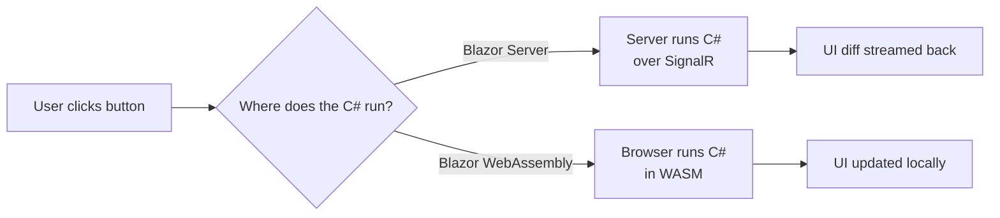

# What Blazor Is (Server vs WebAssembly)

You know [C#](/guides/csharp-from-zero) - classes, awaited tasks, events. For years there was an
invisible wall: when the work moved to the browser, you put C# down and picked up JavaScript. Two
languages, two ecosystems, two mental models for one app. **Blazor tears that wall down.** It lets you
build the front-end - buttons, forms, live-updating lists - in the same C# you already write on the
server.

That's the pitch in one line: Blazor is Microsoft's answer to React, Vue, and Angular, except in C#
instead of JavaScript. It's a [framework](/guides/what-a-framework-even-is) - it runs the show and
calls *your* code at the right moments - hosted by [ASP.NET Core](/guides/aspnet-core-from-zero), the
same engine that serves your APIs. Same language top to bottom, same types flowing from database to
button click.

## The one mental model to hold

Before any code, hold these two ideas - everything else in this guide hangs off them.

💡 **First: the UI is a tree of components that re-render when their state changes.** A component is a
self-contained chunk of UI - a counter, a product card, a whole page - that owns some data (its
*state*) and knows how to draw itself. When that data changes, the component redraws. You don't reach
into the page and manually update text; you change a variable and Blazor figures out what needs to
change on screen. If you've seen React or Vue, this is the same idea wearing C# clothes.

💡 **Second: you choose *where* the C# runs.** This is unique to Blazor, and it's the big decision of
the whole framework. Your component code can run on the **server** (and stream UI updates to the
browser) or inside the **browser itself** via WebAssembly. The component code is *identical* either
way - what changes is where the work happens and what trade-offs you accept.

Hold those: *tree of components that re-render on state change*, and *you pick where the C# executes*.

## Meet a component

Here's the "hello world" of Blazor - a counter. It lives in a file called `Counter.razor`. The
`.razor` extension is how you know you're looking at a component.

```razor
<h1>Counter</h1>
<p>Count: @count</p>
<button @onclick="Increment">Click me</button>

@code {
    private int count = 0;
    private void Increment() => count++;
}
```

*What just happened:* a component is two things stacked together - **markup** on top, a **`@code`
block** on the bottom. The top half looks like ordinary HTML, because it mostly is. The bottom half is
plain C#: a field `count` and a method `Increment`.

The magic is the `@`. Wherever you write `@count` in the markup, Blazor drops in the *current value* of
that C# field, so the page shows "Count: 0". `@onclick="Increment"` wires the browser's click event
straight to your C# method - no `addEventListener`, no JavaScript. When the user clicks, `Increment`
runs, `count` goes up by one, and - the key part - **because the state changed, Blazor re-renders the
component and the displayed number updates automatically.** You changed a variable; the framework did
the rest.

That loop - *state changes → component re-renders* - is the heartbeat of every Blazor app you'll
ever build.

## Where does that C# run? Server vs WebAssembly

Now the big decision. That `Counter` component has to execute its C# *somewhere*. Blazor gives you
two homes for it, and they trade off in opposite directions.

📝 **Blazor Server** - the component's C# runs **on the server**. When the user clicks the button, the
click travels over a live **SignalR** connection to the server, `Increment` runs there, and Blazor
streams just the tiny UI diff back to patch the page.

- ✅ Tiny initial download (the browser only gets a thin script, not a runtime). Full server access - 
  your component can touch the database or server-only secrets directly.
- ⚠️ Needs a **constant connection**. Every interaction is a round trip to the server, so there's
  latency per click, and the app stops working if the connection drops.

📝 **Blazor WebAssembly (WASM)** - a complete .NET runtime is shipped *to the browser*, and your
component's C# runs **client-side**, right there on the user's machine.

- ✅ No per-click server round trip - clicks are handled locally and feel instant. Works **offline**
  once loaded. The server is free to be a plain API.
- ⚠️ **Larger initial download** (you're shipping a .NET runtime). Runs inside the browser sandbox,
  so it can't reach the database directly - it calls an API like any other front-end.

Here's the mental picture of the two paths a click can take:



*One idea:* same component, same click handler - the only difference is whether the C# executes on
the server (and streams the result back) or inside the browser. That's the entire Server-vs-WASM
distinction in one diagram.

📝 **The modern shape (.NET 8).** You no longer pick one model for the *whole* app up front. .NET 8
unified them into a single **Blazor Web App** project where you set a **render mode** *per component*:
`InteractiveServer` (server), `InteractiveWebAssembly` (browser), or `InteractiveAuto` (start on the
server for a fast first load, then switch to WebAssembly for later visits). There's also plain
**static server rendering (SSR)** for components that just display data. The crucial part: **the
component code you write is the same across all of them** - the render mode decides *where* it runs,
not *what* you write.

## Create and run your first app

Enough theory - let's get one running. The .NET SDK ships a template:

```bash
dotnet new blazor -o MyApp
cd MyApp
dotnet run
```

*What just happened:* `dotnet new blazor` scaffolded a complete Blazor Web App named `MyApp` - project
file, a few starter components (including a `Counter` much like the one above), and the ASP.NET Core
host that serves it. `dotnet run` compiled it and started a local web server; open the URL it prints
(something like `https://localhost:5001`) and you'll see a working app, counter and all. For the
browser-only flavor, `dotnet new blazorwasm` scaffolds a standalone WebAssembly project - but the
unified `blazor` template is the modern default, so start there.

⚠️ The first `dotnet run` can feel slow - it restores packages and compiles the whole project. That's
a one-time cost; later runs are quick, and the dev server reloads as you edit.

Throughout this guide we'll grow one running example: a small **products** UI. It starts as a simple
counter, then becomes a list of products that - by Phase 7 - loads its data from a real API. Build
along in your `MyApp` project and you'll have a working mini-app by the end, not just snippets.

## Recap

1. **Blazor builds interactive web UIs in C# instead of JavaScript** - it's Microsoft's answer to
   React/Vue/Angular, hosted by [ASP.NET Core](/guides/aspnet-core-from-zero).
2. **A Blazor app is a tree of components that re-render when their state changes.** You change a
   C# variable; the framework redraws what needs redrawing. You never patch the DOM by hand.
3. **A component is markup + a `@code` block** in a `.razor` file. `@count` renders a field's value;
   `@onclick="Method"` wires a browser event to your C#.
4. **The big choice is where the C# runs.** **Blazor Server** runs it on the server over a live
   SignalR connection (small download, full server access; needs a constant connection, latency per
   click). **Blazor WebAssembly** ships a .NET runtime to the browser and runs it client-side (works
   offline, no round trips; larger initial download, sandbox limits).
5. 📝 **.NET 8 unified both** into a Blazor Web App with per-component **render modes**
   (`InteractiveServer`, `InteractiveWebAssembly`, `InteractiveAuto`, plus static SSR) - and the
   component code is the *same* across all of them.
6. **Create with `dotnet new blazor`, run with `dotnet run`.** We'll grow one products UI across the
   guide, starting from a counter.

## Quick check

Three questions on the ideas that have to stick - what a component is, the re-render loop, and the
Server-vs-WebAssembly trade-off:

```quiz
[
  {
    "q": "What is the core mental model of a Blazor app?",
    "choices": [
      "A tree of components that re-render when their state changes; you choose where the C# runs",
      "A single HTML file that you manually update with JavaScript on every event",
      "A set of stored procedures that run only inside the database",
      "A collection of CSS files compiled into a desktop application"
    ],
    "answer": 0,
    "explain": "Blazor's UI is a tree of self-contained components. When a component's state (its C# data) changes, the framework re-renders it automatically. The hosting choice - Server or WebAssembly - decides where that C# executes."
  },
  {
    "q": "In Blazor Server, where does a component's C# run when the user clicks a button?",
    "choices": [
      "On the server; the click goes over a SignalR connection and the UI diff is streamed back to the browser",
      "Entirely in the browser via a downloaded .NET runtime, with no server involved",
      "In the database engine as a trigger",
      "It doesn't run anywhere - Blazor Server is static HTML only"
    ],
    "answer": 0,
    "explain": "Blazor Server keeps the C# on the server. The click travels over a live SignalR connection, your code runs server-side, and Blazor streams the small UI diff back to patch the page. That's why it needs a constant connection and has per-click latency."
  },
  {
    "q": "Compared to Blazor Server, what is the main trade-off of Blazor WebAssembly?",
    "choices": [
      "Larger initial download (it ships a .NET runtime) but no per-click server round trip and it works offline",
      "It requires writing the component in JavaScript instead of C#",
      "It cannot run any C# at all in the browser",
      "It has a smaller download but always needs a constant server connection"
    ],
    "answer": 0,
    "explain": "WebAssembly ships a .NET runtime to the browser, so the first load is larger. In return, the C# runs client-side: interactions are handled locally (no round trip) and the app keeps working offline once loaded. The component code itself is identical to Server."
  }
]
```

---

[Guide overview](_guide.md) · [Phase 2: Components & Razor →](02-components-and-razor.md)
