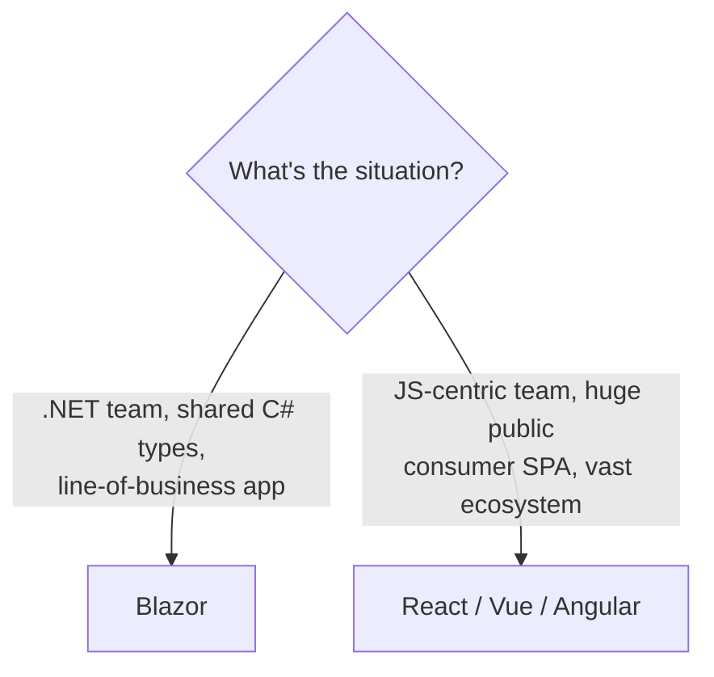

# Where to Go Next

Stop and look at what you can actually do now. Build a **component** in a `.razor` file, mix markup with C# in an `@code` block, and have it re-render when its state changes. **Bind** inputs with `@bind`, wire up **events** with `@onclick`, hook into the **lifecycle** with `OnInitialized` and `OnParametersSet`, and nudge a re-render with `StateHasChanged`. Build **forms** with `EditForm` and validation, pass data between components with `[Parameter]` and `EventCallback`, share state through a DI service, and `@inject` an `HttpClient` to **load real data from an API**.

That's not a toy. That's interactive web UI - written in C#, with the same language, types, and tooling you already use on the server. You read the machine now.

So this last phase isn't more attributes to memorize. It's the map: where Blazor sits next to the JavaScript frameworks, a recap of the render modes so you choose them on purpose, the libraries you'll reach for next, and one concrete thing to build.

## Blazor vs the JavaScript frameworks

You'll get asked this, probably in an interview: "Why Blazor instead of React?" The real answer isn't "Blazor is better." It's "they're aimed at different teams and different jobs." This is the same lens [What a Framework Even Is](/guides/what-a-framework-even-is) taught - pick the tool that fits the work, not the loudest one.



Here's the straight breakdown:

- **Where Blazor wins.** You build the UI in **C#** - the same language, model classes, and validation attributes shared with your backend. For a .NET team, that's enormous: no context-switching to a separate JS toolchain, no duplicating types in TypeScript, one debugger across the whole stack. For internal tools and **line-of-business apps**, Blazor is a genuinely strong, productive choice.
- **Where a JS framework wins.** React, Vue, and Angular have a **far larger ecosystem** - more components, more hiring pool, more Stack Overflow answers. Blazor WebAssembly ships a .NET runtime to the browser, so its **initial download is larger** than a typical JS bundle. For a heavy **public-facing consumer SPA** where first-load size is critical, or a team that already lives and breathes JavaScript, a JS framework often fits better.

💡 Notice what's *not* on either list: "and the other one is bad." Both build UIs from the same core idea - a tree of components that re-render when their data changes. Learn that idea here, and you've already learned the hard part of any of them.

## Render modes: choose per page (.NET 8)

Back in Phase 1 you met Server vs WebAssembly. Modern .NET (8 and onward) turned that into a **per-page decision** instead of a whole-app one, and it's worth holding the four options clearly because picking deliberately is most of the skill:

- **Static SSR** - the page renders to HTML on the server once, with no interactivity. Fast, cheap, great for content. No event handlers wired up.
- **InteractiveServer** - interactivity runs on the server; UI updates stream to the browser over a live **SignalR** connection. Tiny download, but every click needs a round-trip, and it needs a steady connection.
- **InteractiveWebAssembly** - the C# runs **in the browser** on the .NET runtime. Works offline, no per-click round-trip, but pays that larger initial download.
- **InteractiveAuto** - uses Server for the **first** load (fast startup), then quietly switches to **WebAssembly** for later visits once the runtime is cached. The "best of both" default for many apps.

📝 The tradeoff is always the same triangle: **download size vs latency vs offline**. A marketing page wants static SSR. A live dashboard behind a login is happy on InteractiveServer. An app that must work on a flaky connection wants WebAssembly. You don't have to pick one for the whole app - that's the point.

## Libraries you'll reach for

You don't have to hand-build every button and dialog. The Blazor ecosystem has mature **component libraries** - ready-made, styled UI components (data grids, date pickers, modals, charts):

- **MudBlazor** - popular, Material-design-flavored, free and open source.
- **Radzen** - a big free component set with an optional paid design studio.
- **Fluent UI Blazor** - Microsoft's own, matching the Fluent/Windows look.
- **Telerik UI for Blazor** - a polished commercial suite for teams that want vendor support.

For **state** in larger apps, the DI state-service pattern from Phase 6 carries you a long way. When an app grows complex enough that you want stricter, more traceable state changes, **Fluxor** brings a Redux-style store (actions, reducers, a single state tree) to Blazor. Reach for it when "where did this value change?" stops being obvious.

## What to build next

Reading more won't make this stick. Building one real thing will - here's the assignment, deliberately concrete.

Build a small **CRUD app** - create, read, update, delete - end to end:

- A **Blazor UI** for listing, adding, editing, and deleting records (you already have every piece: components, forms, validation, `HttpClient`).
- An **ASP.NET Core API** behind it to serve and persist the data, with **EF Core** talking to a database. Blazor and ASP.NET Core are designed to pair - [ASP.NET Core From Zero](/guides/aspnet-core-from-zero) is the other half of this stack: the host that serves your app and the APIs it calls.
- Add **authentication** so users sign in and see their own data.
- Drop in a **component library** (start with MudBlazor) so it looks finished without you styling every pixel.
- And **choose your render modes on purpose** - a public landing page as static SSR, the authenticated app pages as InteractiveAuto. Make the choice, and be able to explain it.

That single project exercises nearly everything you learned, plus the backend it leans on, and finishing it teaches you more than three more tutorials would.

And remember the throughline that's run under every phase: a Blazor app is a **tree of components that re-render when their state changes**, written in **C#**, and you choose **where that C# runs**. That's it. That's the whole mental model - and you don't just recognize it now, you build with it. Go ship the CRUD app, deploy it, and show someone. You're ready.

## Recap

1. **You can build interactive web UIs in C#** - components and Razor, binding, events and lifecycle, forms and validation, component communication and shared state, and calling APIs with injected `HttpClient`. That's a real front-end skill, not a toy.
2. **Blazor vs the JS frameworks is about fit, not winners** - Blazor shines for .NET teams and line-of-business apps (shared C# language, types, tooling); React/Vue/Angular win on ecosystem size and for heavy public SPAs where WASM's larger initial download hurts.
3. **Render modes are a per-page choice (.NET 8)** - static SSR, InteractiveServer (SignalR), InteractiveWebAssembly, and InteractiveAuto (Server first, then WASM). Pick deliberately along the download-size vs latency vs offline tradeoff.
4. **Lean on libraries** - component sets like MudBlazor, Radzen, Fluent UI, and Telerik for ready-made UI; the DI state-service pattern for state, with Fluxor (Redux-style) when an app gets big.
5. **Build one CRUD app and finish it** - Blazor UI on an ASP.NET Core + EF Core backend, add auth, add a component library, choose render modes on purpose. That project cements the whole guide.

## Quick check

Three decisions to take with you as you leave this guide:

```quiz
[
  {
    "q": "A .NET team is building an internal line-of-business app and wants to share their model classes and validation between server and UI. Which choice fits the reasoning best?",
    "choices": [
      "React, because it always has a smaller bundle",
      "Blazor, because the UI is C# and shares language, types, and tooling with the backend",
      "Angular, because line-of-business apps require TypeScript",
      "It makes no difference; all frameworks are interchangeable"
    ],
    "answer": 1,
    "explain": "Blazor's big win for a .NET team is building the UI in C#, sharing the same language, model types, and tooling with the backend. For a heavy public consumer SPA or a JS-centric team, a JS framework may fit better instead."
  },
  {
    "q": "You want fast first-load startup, but also offline capability and no per-click server round-trips on later visits. Which .NET 8 render mode is designed for exactly that?",
    "choices": [
      "Static SSR",
      "InteractiveServer",
      "InteractiveAuto",
      "There is no mode that does both"
    ],
    "answer": 2,
    "explain": "InteractiveAuto uses Server for the first load (fast startup) and switches to WebAssembly afterward once the runtime is cached, giving you quick startup plus offline-capable, round-trip-free interactivity later."
  },
  {
    "q": "You want ready-made, styled UI components (data grids, date pickers, dialogs) instead of hand-building them in Blazor. What do you reach for?",
    "choices": [
      "Fluxor",
      "A component library like MudBlazor, Radzen, or Fluent UI Blazor",
      "SignalR",
      "EditForm"
    ],
    "answer": 1,
    "explain": "Component libraries (MudBlazor, Radzen, Fluent UI Blazor, Telerik) give you ready-made UI components. Fluxor is for Redux-style state management, not UI widgets."
  }
]
```

---

[← Phase 7: Calling APIs & Dependency Injection](07-calling-apis-and-di.md) · [Guide overview](_guide.md)
