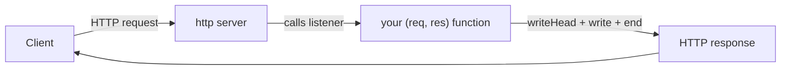

# The node:http Mental Model

Here's the thing nobody tells you before they hand you Express: Node already has a complete web server,
built right in. No `npm install`, no dependencies — it's the **`node:http`** module, and it can listen on
a port, accept connections, parse requests, and write responses all on its own. Express and Fastify don't
replace it. They *wrap* it. This is the **roots** guide, and the payoff is real: once you've built a small
API with only `node:http`, `app.get(...)` stops being magic, because you'll have written the thing it's
hiding.

> 📝 This is a **roots** guide. It assumes you know **JavaScript**/Node — functions, callbacks,
> `async`/`await` ([JavaScript From Zero](/guides/javascript-from-zero)) — and basic **HTTP**: methods,
> status codes, headers ([HTTP, Explained](/guides/http-explained)). It's the JS parallel to the Go
> [net/http roots guide](/guides/web-services-with-only-net-http), and it reads best before or alongside
> [Express](/guides/express-from-zero) so you can see exactly what a framework adds. Examples run with `node`.

## The whole model is one function

Before any code, hold the picture in your head — then the code is just names attached to ideas you already
have. The entire `node:http` server is this: you create a server and hand it **one function**. Node calls
that function — the **request listener** — once for every request that arrives. Its signature is
`(req, res)`: `req` is the incoming request, `res` is the response you're going to write back.

That's the whole architecture, and here's the sentence to carry through the rest of the guide:

💡 **`createServer` calls your `(req, res)` listener for every request; routing and middleware are code
*you* write.** There is no built-in router that maps `/messages` to a function. There is no built-in
middleware chain. Node hands you the raw request and a blank response, and the rest is yours. (Don't worry
— you'll build a router in Phase 3 and middleware in Phase 4, and they're smaller than you'd think.)



*What just happened:* a client sends a request; the server Node built for you accepts it and calls your
one listener with two arguments. Your function reads what it needs from `req`, sets a status and headers on
`res`, writes a body, and ends the response. Node ships it back. Notice there's nothing between the server
and your function — no routing layer deciding *which* function to call, because there's only ever one.
Branching to different behavior per URL is something you add.

## The smallest server that works

Now the picture in code. This is a complete Node program — a server that answers every request with a line
of plain text.

```javascript
const http = require('node:http');

const server = http.createServer((req, res) => {
  res.writeHead(200, { 'Content-Type': 'text/plain' });
  res.end('Hello from node:http');
});

server.listen(3000, () => console.log('listening on http://localhost:3000'));
```

*What just happened:* four moving parts, top to bottom —

- `require('node:http')` pulls in the built-in module. The `node:` prefix says "this is a core module, not
  a package from `node_modules`" — no install needed, it's part of Node.
- `http.createServer((req, res) => { ... })` builds the server and registers your **request listener** in
  one move. That arrow function is the `(req, res)` function from the mental model — Node will call it for
  every incoming request. `createServer` *returns* the server; it doesn't start it yet.
- Inside the listener, `res.writeHead(200, { ... })` sets the **status code** (200 = OK) and the response
  **headers** — here, telling the client the body is plain text. Then `res.end('Hello from node:http')`
  writes the body and **closes** the response.
- `server.listen(3000, ...)` is what actually starts the server: bind to port 3000 and begin accepting
  connections. The callback runs once, when the server is up — handy for a "ready" log.

⚠️ You **must** call `res.end()`. It's the signal that the response is complete — without it, Node keeps the
connection open waiting for more, and the client sits there spinning until it times out. A request that
"hangs forever" in Node is, nine times out of ten, a code path that forgot to call `res.end()`. Make ending
the response a reflex.

Run it and hit it from another terminal:

```bash
node server.js
# in another terminal:
curl localhost:3000
# Hello from node:http
```

*What just happened:* `node server.js` starts the program; it stays running, holding port 3000, because
`server.listen` keeps the process alive. `curl` opens a connection and sends `GET /`, Node calls your
listener with that request, your function writes the headers and body and ends, and curl prints what came
back. That's a web server with zero dependencies.

## `req` and `res`: two streams, opposite directions

Those two arguments aren't plain objects with all the data sitting ready inside them. They're **streams** —
and which direction they flow is the key to understanding them.

📝 **`req`** is an `IncomingMessage`, and it's a **readable** stream — data flows *from* the client *to*
you. Some of it is available immediately as properties: `req.method` (`'GET'`, `'POST'`, ...), `req.url`
(the path and query string, like `/messages?limit=10`), and `req.headers` (an object of the request
headers). But the **body** — the JSON a client POSTs, say — isn't a property. It arrives as a stream of
chunks you read over time. That's why reading a request body takes a few lines instead of one; Phase 2 is
where we do it properly.

📝 **`res`** is a `ServerResponse`, and it's a **writable** stream — data flows *from* you *to* the client.
You set the status and headers (`res.writeHead(...)`, or `res.statusCode` / `res.setHeader(...)`), then you
`res.write(...)` body chunks if you want, and finally `res.end(...)` to flush and close. `res.end()` can
also take a final chunk, which is why the tiny server above wrote its whole body in one `end()` call.

💡 The stream nature matters more than it looks right now. It's why Node can start sending a response before
the whole thing is built, and why it can handle a huge upload without loading it all into memory. We lean on
that in Phase 2 (reading bodies) and again in Phase 6 (streaming responses). For now, the takeaway is just
the shape: **`req` carries the request *in*, `res` carries the response *out*, and both are streams.**

## Where the frameworks fit — and what we'll build

Here's the reveal that justifies the whole guide. When you reach for Express later, you are not escaping
`node:http` — you're sitting on top of it.

💡 **Express, Fastify, and friends are conveniences over exactly this `(req, res)` model.** Under the hood,
an Express app *is* a request listener you hand to `http.createServer`; `app.get('/messages', ...)` is
their router doing the `req.method` / `req.url` switch you'd otherwise write by hand, and `app.use(...)` is
their formalized version of "call this function before the handler." Nicer ergonomics, real conveniences —
but the request still enters through a server, and something still writes to `res`. The skeleton is the one
you just met. ([Express From Zero](/guides/express-from-zero) walks that mapping in full.)

To keep this concrete instead of abstract, the rest of the guide builds one small thing the whole way
through: a **messages** service. The data is deliberately tiny — each message is just an object:

```javascript
const message = { id: 1, text: 'Hello from node:http' };
```

*What just happened:* nothing yet — that's only the shape of the data our API will serve. Over the next
phases we'll read requests and write it back as JSON (Phase 2), route by method and path (Phase 3), wrap
handlers with middleware (Phase 4), and grow it into a full CRUD REST API with no framework at all
(Phase 5). Every step is the same one idea: Node calls your `(req, res)` function, and you do the rest.

## Recap

1. Node ships a complete HTTP server in the built-in **`node:http`** module — no install, no dependencies.
   Express and Fastify are conveniences layered over it.
2. **`http.createServer((req, res) => {...})`** builds a server and registers your single **request
   listener**; Node calls that one function for every request. `server.listen(port)` starts it.
3. The mental model, all the way down: **`createServer` calls your `(req, res)` listener per request, and
   routing plus middleware are code you write** — there is no built-in router or middleware.
4. **`req`** (`IncomingMessage`) is a *readable* stream carrying the request in — `req.method`, `req.url`,
   `req.headers`, and a body that streams in chunks. **`res`** (`ServerResponse`) is a *writable* stream you
   set a status/headers on, then write and end.
5. ⚠️ You must call **`res.end()`**, or the request hangs until it times out — ending the response is the
   "I'm done" signal.
6. We'll build a **messages** service (`{ id, text }`) on the bare standard library across the guide.

## Quick check

Three questions on the ideas that have to stick before Phase 2:

```quiz
[
  {
    "q": "What does http.createServer take as its argument?",
    "choices": [
      "One request listener function, (req, res), that Node calls for every request",
      "A list of routes mapping URLs to handlers",
      "A middleware chain to run in order",
      "The port number to listen on"
    ],
    "answer": 0,
    "explain": "createServer takes a single (req, res) listener and returns a server. Node calls that one function for every incoming request. There is no built-in routing or middleware — you write those yourself. The port goes to server.listen(), not createServer."
  },
  {
    "q": "Why might a node:http request 'hang forever' with no response?",
    "choices": [
      "The handler never called res.end(), so Node keeps the connection open",
      "createServer was given two listeners instead of one",
      "req is a writable stream and can't be read",
      "The status code was set to 200 instead of 204"
    ],
    "answer": 0,
    "explain": "res.end() signals that the response is complete. If a code path forgets to call it, Node holds the connection open waiting for more, and the client spins until it times out. Always end the response."
  },
  {
    "q": "What are req and res in the request listener?",
    "choices": [
      "req is a readable stream (the request in); res is a writable stream (the response out)",
      "Both are plain objects with all data preloaded as properties",
      "req is writable and res is readable",
      "They are the same object passed twice for convenience"
    ],
    "answer": 0,
    "explain": "req (IncomingMessage) is readable — method/url/headers are properties, and the body streams in as chunks. res (ServerResponse) is writable — you set status and headers, then write and end. Request flows in, response flows out."
  }
]
```

---

[Guide overview](_guide.md) · [Phase 2: Handling Requests & Responses →](02-requests-and-responses.md)
