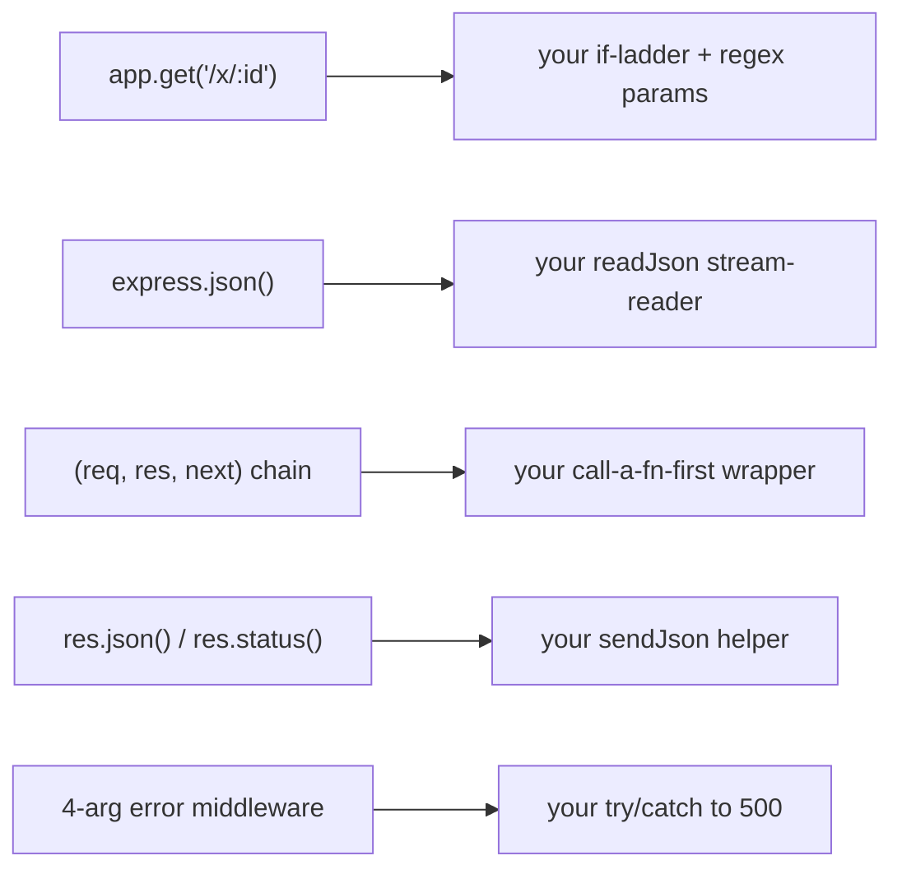

# What Express Adds

Stop and look at what you pulled off. You built a real JSON REST API - a server, a router that switches
on method and path, body parsing that drains a stream into an object, middleware as plain functions
running before your handler, async handlers, streaming, a try/catch that turns thrown errors into a 500,
and a server that shuts down without dropping in-flight requests. And you did it with one import:
`node:http`. No framework docs, no magic - just `createServer` and the `(req, res)` function you hand it.

That was the whole point. The frameworks people reach for - [Express](/guides/express-from-zero),
[Fastify](/guides/fastify-from-zero) - are not a different universe. They're conveniences stacked on the
exact skeleton you now hold in your hands. So this last phase is the payoff: we point your new X-ray
vision at Express and watch the "magic" turn back into machinery you can already name.

## Mapping the magic back to the mechanism

💡 Here's the line worth reading slowly: every "feature" Express advertises is a convenience over
something you wrote by hand in this guide. Once you've seen the bare version, `app.get(...)` stops being
a spell.



Reading that left to right, in plain words:

- **Routing.** Your method-plus-path `if`-ladder and hand-rolled regex for `:id` params (Phase 3) become
  `app.get('/messages/:id', handler)` - Express matches the method, matches the path, parses the param,
  and hands you `req.params.id`. Same job you did by hand, done for you.
- **Body parsing.** Your `readJson` that listened for `data` chunks and `end`, then `JSON.parse`d the
  buffer (Phase 2), becomes one line: `app.use(express.json())`. After that, `req.body` is already the
  parsed object by the time your handler runs.
- **Middleware.** Your "call a function before the handler" idea (Phase 4) becomes the formal
  `(req, res, next)` chain. You call `next()` to pass control along; Express runs the chain for you,
  in order, and lets any link short-circuit by sending a response instead of calling `next()`.
- **Response helpers.** Your `sendJson` that set the status, set `Content-Type`, and wrote
  `JSON.stringify(...)` (Phase 2) becomes `res.status(201).json(obj)`. Same three steps, one fluent call.
- **Error handling.** Your try/catch that caught a thrown error and wrote a 500 (Phase 6) becomes a
  special **4-argument** middleware, `(err, req, res, next)`, that Express routes errors to. And in
  **Express 5**, errors thrown from `async` handlers are auto-forwarded to it - no more wrapping every
  handler in try/catch.

That covers Express. 💡 So "Express" really is the sum of the small conveniences you already wrote,
plus one thing you couldn't build in a weekend: a huge **middleware ecosystem** - `cors`, `helmet`,
session and auth packages, rate limiters, and on and on. [Fastify](/guides/fastify-from-zero) sits on the
same `node:http` foundation and adds two things of its own on top: **schema-based validation** and a focus
on **speed**. Different ergonomics, identical skeleton underneath.

## Do I even need a framework?

📝 Let me be direct, because a roots guide that pretends you must reach for a framework would be lying to
you: a lot of the time, plain `node:http` is genuinely fine.

For a tiny service, a one-off script, or learning, the standard library is a real answer - zero
dependencies, full control, nothing to upgrade or audit, and you understand every line because you wrote
it. You shipped a working CRUD API without installing anything - not a toy; for a small surface it's a
legitimate choice.

So when do you reach for a framework? When the job grows:

- **Many routes, real middleware, a team, a long-lived app** - reach for **[Express](/guides/express-from-zero)**.
  Once you have dozens of endpoints, the routing, body parsing, and error plumbing you hand-rolled turn
  into boilerplate you'd be rewriting in every file. A framework removes that boilerplate (and the bugs
  that hide in it) and hands you an ecosystem for the things you don't want to write yourself, like CORS,
  security headers, and auth.
- **You want validation and raw throughput** - look at **[Fastify](/guides/fastify-from-zero)**, which
  adds JSON-schema validation and serialization speed on the same foundation.

That's the plain decision. Not "always use a framework," and not "frameworks are bloat" - match the tool
to the size of the job. (The Go world has the exact same conversation; see the parallel roots guide,
[Web Services With Only net/http](/guides/web-services-with-only-net-http).)

## Where to go from here

You're now in the rare, comfortable spot of being able to pick a framework with your eyes open instead of
cargo-culting a tutorial. Two small moves will lock it in:

1. **Re-read your Express phase with these mappings in hand.** Go back through
   [Express From Zero](/guides/express-from-zero) and, for each feature, name the bare version you built
   here. `app.get` → your if-ladder. `express.json()` → your `readJson`. `next` → your call-before-handler.
   `res.json` → your `sendJson`. The framework will read as `node:http` with the boilerplate filed off.
2. **Build one small thing twice.** Write a two-route service with plain `node:http`, then write the
   same service with Express. Feeling the delta yourself - what got shorter, what got safer - teaches
   more than any comparison table.

## The skeleton was always one function

Here's the line to carry out of this whole guide: `http.createServer` calls your `(req, res)` function
once per request, and everything else - routing, middleware, parsing, responses - is code. You wrote
that code. Express and Fastify write it for you and add an ecosystem, but the bones are identical.

You didn't learn one framework. You learned the foundation under *all* of them. Open the source of any
Node web codebase now - an Express app, a Fastify service, or some no-framework server at your job - and
you'll find the same `(req, res)` skeleton you built by hand. You can read all of it.

## Recap

1. **Express is conveniences over node:http, not a separate world.** Routing, body parsing, middleware,
   response helpers, and error handling each map to something you wrote in this guide.
2. **The mappings:** `app.get('/x/:id')` is your if-ladder plus regex params; `express.json()` is your
   `readJson`; the `(req, res, next)` chain is your call-a-function-first idea; `res.status().json()` is
   your `sendJson`; the 4-arg error middleware is your try/catch-to-500 (and Express 5 auto-forwards async errors).
3. **What you can't build in a weekend is the ecosystem** - `cors`, `helmet`, auth, rate limiting - which
   is the real reason to reach for Express. Fastify adds schema validation and speed on the same foundation.
4. **For a tiny service, a script, or learning, plain node:http is genuinely fine** - zero deps, full
   control. For real apps with many routes, middleware, and a team, a framework removes boilerplate and bugs.
5. **The skeleton is always `http.createServer` calling your `(req, res)` function** - learn it once and
   you can read any Node web codebase, framework or not.

## Quick check

One last check - the mappings that turn Express from magic into mechanism:

```quiz
[
  {
    "q": "In Express, what does express.json() correspond to in the bare node:http server you built?",
    "choices": [
      "Your readJson helper that drained the request stream and JSON.parsed the body",
      "Your method-and-path if-ladder router",
      "Your sendJson response helper",
      "The http.createServer call itself"
    ],
    "answer": 0,
    "explain": "express.json() is body-parsing middleware: it does the stream-draining and JSON.parse you hand-wrote in Phase 2, then puts the result on req.body before your handler runs."
  },
  {
    "q": "What is Express middleware, mechanically, relative to what you wrote in Phase 4?",
    "choices": [
      "The same call-a-function-before-the-handler idea, formalized as a (req, res, next) chain Express runs for you",
      "A second http.Server running alongside the first",
      "A browser-side library with no server role",
      "A database connection pool"
    ],
    "answer": 0,
    "explain": "Your Phase 4 'call a function before the handler' is exactly Express middleware. Express formalizes it as (req, res, next): you call next() to continue, or send a response to short-circuit the chain."
  },
  {
    "q": "When is reaching for Express most justified over plain node:http?",
    "choices": [
      "When you have many routes, real middleware, a team, and want an ecosystem like cors/helmet/auth",
      "Whenever you need to respond with JSON at all, since node:http can't do it",
      "Only when you cannot use the standard library for licensing reasons",
      "Never - node:http and Express are identical in every way"
    ],
    "answer": 0,
    "explain": "For a tiny service or learning, plain node:http is fine. Express earns its keep on real apps: it removes routing/parsing/error boilerplate and gives you a huge middleware ecosystem. Fastify adds schema validation and speed on the same foundation."
  }
]
```

---

[← Phase 6: Async, Streams & Structure](06-async-streams-structure.md) · [Guide overview](_guide.md)
