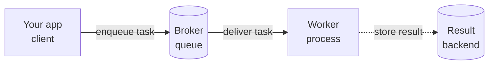

# What Celery Is & Why

Picture a user clicking "Sign up." Your code creates an account, then tries to send a welcome email
through a third-party mail service that takes four or five seconds to respond. The user sits there
watching a frozen page, waiting on an email *they aren't even reading yet*. Worse: the web worker
handling their request is stuck too, unable to serve anyone else until that mail call returns.

The fix is one idea: **do the slow part later, in the background, and answer the user right now.**
Celery is the tool most Python apps reach for to make that happen. By the end of this phase you'll
have the mental model — the four moving pieces and why they're separate — so the hands-on setup in
later phases makes sense instead of feeling like magic incantations.

## The problem — some work is too slow for a request

📝 **The core tension.** A web request should be *fast* — measured in milliseconds. But plenty of
real work isn't: sending an email, generating a PDF report, processing an uploaded video, calling a
sluggish third-party API. Do that work *inline* (right there in the request handler) and two bad
things happen at once: the user waits for the whole thing to finish, and your web worker is tied up
the entire time, unable to handle other requests.

Here's the painful version — work done inline:

```python
# views.py — the SLOW way
def signup(request):
    user = create_user(request.data)
    send_welcome_email(user)      # blocks ~5s waiting on the mail service
    return Response({"status": "ok"})   # user has been staring at a spinner the whole time
```

*What just happened:* `send_welcome_email(user)` runs *before* the `return`. Python won't move past
that line until the mail service answers, so the response is held hostage for five seconds. Multiply
that by a busy signup hour and your web workers spend most of their time waiting, not working.

Now the fix — hand the slow work off and return immediately:

```python
# views.py — the BACKGROUND way
def signup(request):
    user = create_user(request.data)
    send_welcome_email.delay(user.id)   # enqueue it; returns instantly
    return Response({"status": "ok"})    # user gets a snappy response right away
```

*What just happened:* `.delay(...)` doesn't *run* the email code — it drops a "please send this email"
message onto a queue and returns in microseconds. The response goes back to the user immediately. The
actual sending happens moments later, in a different process, while your web worker has already moved
on to the next request. (Don't worry about `.delay` or why we pass `user.id` instead of `user` yet —
those are later phases. For now, just notice the *shape*: enqueue, return, run-later.)

💡 **The reframe.** The slow work didn't get faster. You stopped *waiting* for it. That single shift —
from "do it now while the user waits" to "schedule it and answer now" — is the entire point of a task
queue.

## What Celery is

📝 **Celery** — a distributed task queue for Python. You define ordinary Python functions as **tasks**,
your application **enqueues** them when it wants them run, and separate **worker** processes pick them
up and execute them asynchronously. You write the function once; Celery handles getting it onto a queue,
delivering it to a worker, running it, and (optionally) reporting back.

⚠️ **"Asynchronous" here is not asyncio.** This trips up nearly everyone coming from `async`/`await`.
In Celery, "asynchronous" means the work runs in a *different process* — often on a *different machine*
— not on the same event loop a moment later. It's not about concurrency within one Python process; it's
about handing work off to an entirely separate program that runs it independently. If you've read
[Python from Zero](/guides/python-from-zero), this is a different axis from generators or coroutines
entirely: those keep one process busy efficiently, Celery spreads work across many processes.

## The four pieces — the mental model

This is the model to burn into memory. Everything else in Celery is detail hanging off these four parts:

📝 **(1) The client (your app)** enqueues a task — "run `send_welcome_email` with this argument."
📝 **(2) The broker** (usually Redis or RabbitMQ) is the middleman that *holds the queue* of task
messages until a worker is ready for them.
📝 **(3) The workers** are separate processes that pull tasks off the broker and actually execute the
Python code.
📝 **(4) The result backend** (optional) stores each task's return value and status, so the client can
later ask "is it done? what did it return?"



That broker in the middle is exactly the **message queue** idea from
[Webhooks & Message Queues](/guides/webhooks-and-message-queues): a producer drops a message, the queue
holds it, a consumer picks it up when ready. Celery is essentially a polished, Python-native layer built
on top of that pattern — it gives the message a name (`send_welcome_email`), serializes the arguments,
and runs the matching function on the other side. If the queue concept feels shaky, that guide is worth
a detour first; everything here sits on top of it.

The result backend is the one piece you can often skip. For fire-and-forget jobs like sending an email,
you don't care about a return value — you enqueue it and forget it. You only need a result backend when
your app wants to *check on* a task later (e.g. "is the report ready to download yet?").

## It's separate processes — that's the whole trick

💡 **The realization that makes Celery click:** your web app and your workers are *different programs*.
They don't share memory. They don't call each other's functions. They communicate *only* through the
broker — by passing messages. Your web app says "here's a task" into the broker; a worker, possibly on
another server entirely, picks it up later.

That separation is exactly why Celery is powerful:

- **It scales by adding workers.** Drowning in `generate_report` jobs? Start three more worker processes
  (or spin up another machine running workers). They all pull from the same broker. The web app doesn't
  change at all.
- **It survives restarts.** Deploy new web code, and the tasks already sitting in the broker are still
  there — a worker grabs them whenever it's ready. The queue is a buffer between the two halves.

But that same separation is *why the next two phases exist*. Because the worker is a different process
that didn't run your web code, it can't see your in-memory objects — so arguments have to be
**serialized** (turned into data) to travel through the broker. That's why we passed `user.id` (a plain
integer) earlier and not the `user` object itself. Configuration, serialization, and "how does the
worker even find my tasks" all flow from this one fact: *they're separate processes talking through a
broker.*

## Where it fits — and the alternatives

In a real stack, your web framework does the fast part of a request and hands the slow part to Celery:

- A [FastAPI](/guides/fastapi-from-zero), Django, or Flask view receives the request, does the quick
  database work, enqueues the heavy job (`generate_report.delay(...)`), and returns. Celery workers,
  running as a totally separate deployment, chew through the queue in the background.

💡 **What about built-in background tasks?** FastAPI has `BackgroundTasks`, Flask has extensions, and
all of them let you run a little work *after* sending the response. For genuinely light, best-effort,
fire-and-forget things ("log this, nobody will miss it if it's lost"), that's fine and far simpler — no
broker to run. But the moment you need work that is **reliable** (survives a crash and gets retried),
**scalable** (spread across many workers), or **scheduled** (run nightly, run in an hour), those
in-process helpers run out of road. That's the territory of a real task queue like Celery — and it's
exactly where we're headed.

Next phase, we stop talking in diagrams and actually stand up the two pieces that make all this real:
the **broker** and a **worker**.

## Recap

1. Some work (emails, reports, uploads, slow API calls) is too slow to run inside a web request. Doing
   it inline makes the user wait *and* ties up your web worker.
2. The fix is to do that work in the **background** and return to the user immediately — "schedule it
   and answer now" instead of "do it now while they wait."
3. 📝 **Celery** is a distributed task queue for Python: define tasks, enqueue them from your app, and
   separate **worker** processes run them. "Asynchronous" here means *different processes*, not asyncio.
4. The mental model is **four pieces**: client (enqueues) → **broker** (holds the queue) → **worker**
   (runs it) → optional **result backend** (stores return value/status).
5. 💡 Your app and the workers are **separate processes** talking only through the broker. That's why
   Celery scales (add workers) and why serialization and config matter (next phases).
6. Web frameworks hand heavy jobs to Celery. Built-in background tasks suit light fire-and-forget work,
   but reliable, scalable, or scheduled background work calls for a real task queue.

## Quick check

Make sure the core model stuck before we start wiring things up:

```quiz
[
  {
    "q": "Why is sending a welcome email *inline* inside a signup request a problem?",
    "choices": [
      "Email can't be sent from Python at all without a queue",
      "The user waits for the slow email to finish, and the web worker is tied up the whole time",
      "Inline code always crashes the web server",
      "It uses more memory than a background task"
    ],
    "answer": 1,
    "explain": "Running slow work inline holds the response hostage until it finishes, and blocks that web worker from serving anyone else. Moving it to the background lets you answer the user immediately and free the worker."
  },
  {
    "q": "In Celery's mental model, what is the BROKER responsible for?",
    "choices": [
      "Running your task's Python code",
      "Storing each task's return value so the client can check on it",
      "Holding the queue of task messages until a worker is ready to pick them up",
      "Rendering the web response sent back to the user"
    ],
    "answer": 2,
    "explain": "The broker (Redis/RabbitMQ) is the middleman that holds task messages in a queue. Workers run the code, the result backend stores return values, and the broker just buffers and delivers the messages between them."
  },
  {
    "q": "When Celery docs say a task runs 'asynchronously,' what do they mean?",
    "choices": [
      "It runs in a separate worker process, often on a different machine",
      "It runs later on the same asyncio event loop using await",
      "It runs faster than normal code",
      "It runs only when the user refreshes the page"
    ],
    "answer": 0,
    "explain": "In Celery, asynchronous means the work happens in a different process entirely — handed off through the broker — not on the same event loop via async/await. It's about spreading work across processes, not concurrency within one."
  }
]
```

---

[Guide overview](_guide.md) · [Phase 2: The Broker & Worker →](02-the-broker-and-worker.md)
