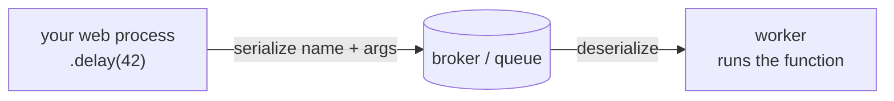

# Defining & Calling Tasks

Here's the mental model to hold onto before we touch any code: **a task is a function you've agreed to run somewhere else.** You define it in your code, you call it from your web process, but the body actually executes inside a worker — a separate program, possibly on a different machine. Everything weird about Celery comes from that one fact. The function and the call live in two different worlds, and a message has to travel between them.

In Phase 2 you stood up a broker and a worker and watched them shake hands. Now we make them earn their keep: defining real work like `send_welcome_email(user_id)` and `generate_report(...)`, then handing it off so your web request can return without waiting.

## Defining a task

📝 You turn an ordinary function into a Celery task by decorating it. That's the whole ceremony.

```python
# tasks.py
from .celery_app import app

@app.task
def send_welcome_email(user_id):
    user = User.objects.get(id=user_id)
    send_email(
        to=user.email,
        subject="Welcome aboard!",
        body=render_welcome(user),
    )
```

*What just happened:* The `@app.task` decorator **registered** this function with your Celery app under a name (by default, the dotted path like `tasks.send_welcome_email`). Registration is the important word — Celery now knows this function exists and can look it up by name later. The body is plain Python; nothing about it is special. The catch is *where* it runs: when a task fires, this code executes **in the worker process**, not in your web process. The web side only ever sends a message saying "run the task named `send_welcome_email` with this argument."

💡 If you're in a project with many task modules (or a framework like Django), reach for `@shared_task` instead of `@app.task`. It registers the task without needing to import your concrete `app` object, which keeps your task files from depending on app-creation order. Same idea, fewer import headaches.

```python
from celery import shared_task

@shared_task
def generate_report(account_id, month):
    rows = query_usage(account_id, month)
    pdf = render_pdf(rows)
    store_report(account_id, month, pdf)
```

*What just happened:* `generate_report` is registered the same way, but it didn't have to import `app`. Whichever Celery app is active picks it up. For app-style projects this is the friendlier default, and it's why you'll see it everywhere in real codebases.

## Calling it: `.delay()`

Now the part that trips up every newcomer at least once. There are two ways to "call" a task, and they do completely different things.

📝 `send_welcome_email.delay(user_id)` does **not** run the function. It packages up the task name and arguments, drops that message on the broker, and returns **immediately** — handing you back an `AsyncResult` (a receipt you can check later; that's Phase 4). The worker picks the message up and runs the body whenever it gets to it.

⚠️ `send_welcome_email(user_id)` — no `.delay` — runs the function **right now, inline, in your current process.** No broker, no worker, no queue. It's just a normal Python call. This is the classic mistake: someone forgets `.delay`, the email sends synchronously inside the web request, the request blocks, and they wonder why Celery "isn't doing anything." Celery never saw it.

Here's the contrast inside a web view:

```python
# views.py
def signup(request):
    user = create_user(request.POST)

    # WRONG: runs the email send inside the request — user waits for SMTP
    # send_welcome_email(user.id)

    # RIGHT: enqueue it and move on
    send_welcome_email.delay(user.id)

    return redirect("/welcome")  # returns instantly; email goes out later
```

*What just happened:* The `.delay(user.id)` line returns in microseconds because all it did was push a tiny message onto the broker. The HTTP response goes back to the user immediately, and some worker sends the actual email a moment later — outside the request/response cycle entirely. The commented-out direct call would have blocked `signup` until the SMTP handshake finished, which is exactly the latency you adopted Celery to avoid. **The rule:** if you want it to run in the worker, you must use `.delay()` (or `.apply_async()`). A bare call always stays inline.

## `.apply_async()` for options

`.delay()` is deliberately minimal — it's shorthand for "send these args, use all the defaults." When you need more control, reach for its longer sibling.

📝 `.apply_async()` takes the arguments as a list (and/or `kwargs` dict) plus a pile of options: `countdown` (wait N seconds before running), `eta` (run at a specific datetime, once), `queue` (route to a named queue), `priority`, retry settings, and more.

```python
from datetime import datetime, timedelta

# Run 60 seconds from now, on the dedicated "reports" queue
generate_report.apply_async(
    args=[account_id, "2026-06"],
    countdown=60,
    queue="reports",
)

# Or schedule it for a specific moment
generate_report.apply_async(
    args=[account_id, "2026-06"],
    eta=datetime(2026, 7, 1, 9, 0),
)
```

*What just happened:* The first call still enqueues immediately and returns an `AsyncResult` just like `.delay()` did — but the worker holds the message for 60 seconds (`countdown`) before executing, and the message is routed to the `reports` queue so a report-only worker can pick it up instead of competing with email tasks. The second uses `eta` to pin execution to a wall-clock time. Note the shape: positional task arguments go inside `args=[...]`, and Celery's own options sit alongside them. That separation is the whole reason `.apply_async()` exists. For the everyday case with no options, `generate_report.delay(account_id, "2026-06")` is the exact same thing, just terser.

## Arguments must be serializable

This is the gotcha that bites hardest, so let's be blunt about it.

⚠️ Whatever you pass to a task gets **serialized** — by default to JSON — so it can be written into a broker message, travel across the network, and be **deserialized** by a worker in a different process. That means your arguments (and return values) must be simple, JSON-friendly data: numbers, strings, booleans, lists, dicts. You **cannot** pass a live database model object, an open file handle, a database connection, a request object, or anything else that only makes sense inside the process that created it.

💡 The fix is a one-liner habit: **pass an id, not the object.** Hand the task the primitive, and let the task re-load whatever it needs on the worker side.

```python
# WRONG: a model instance can't be JSON-serialized,
# and even if it could, it'd be a stale snapshot by the time the worker runs.
# send_welcome_email.delay(user)

# RIGHT: pass the id; the task fetches a fresh User inside the worker.
send_welcome_email.delay(user.id)
```

*What just happened:* Passing `user` asks Celery to cram a whole `User` object into a JSON message, which either errors outright or (with a permissive serializer) ships a frozen copy that's already drifting out of date. Passing `user.id` ships a single integer. Look back at the task body in the first example — its very first line is `User.objects.get(id=user_id)`, re-loading a **fresh** copy inside the worker, in the worker's own process, with the worker's own database connection. That's why tasks take ids: the object that exists in your web process does not exist in the worker, so you give the worker the key to go find its own.

## How it travels

Let's zoom out and trace one task end to end, because once you see the pipe, every rule above stops feeling arbitrary.

💡 When you call `send_welcome_email.delay(42)`:

1. Celery looks up the **registered name** of the task (`tasks.send_welcome_email`) and serializes that name plus the args `[42]` into a message.
2. The message lands on the **broker** (the queue).
3. A **worker** pulls the message off the queue, deserializes it, finds the function registered under that name, and calls it with `42`.
4. The body runs in the worker, fetches the user, sends the email.



📝 Notice what crosses the wire: a **name** and some **plain data** — never the function itself, never live objects. That's the whole reason arguments must be serializable, and the reason both sides have to agree on the task's name (which is why the worker must import the same task code your web process does).

This also tells you how to *shape* a good task: keep it a **thin entry point** that does one unit of work. Take an id, load what you need, do the job. Resist stuffing five responsibilities into one task — small tasks are easier to retry, route, and reason about. And naturally the next question is "okay, the worker ran it — how do I get the result back?" That `AsyncResult` we kept brushing past is the answer, and it's exactly what Phase 4 is about.

## Recap

- A function becomes a task by decorating it with `@app.task` (or `@shared_task`); that **registers** it by name, and its body runs **in the worker**, not your web process.
- `.delay(args)` enqueues the task and returns an `AsyncResult` immediately — calling the function **without** `.delay` runs it **inline**, bypassing Celery entirely. That's the most common beginner mistake.
- `.apply_async(args=[...], ...)` is the full-control version: `countdown`, `eta`, `queue`, `priority`, and more. `.delay()` is its shorthand for the common case.
- Arguments and return values are **serialized** (JSON by default) to cross the broker, so pass simple data — **an id, not a model object, file, or request.** Let the task re-load the object on the worker side.
- A task call ships a **name + plain data** to the broker; a worker deserializes it and runs the registered function. Keep each task a thin entry point doing one unit of work.

## Quick check

```quiz
[
  {
    "q": "What does send_welcome_email.delay(user_id) actually do?",
    "choices": [
      "Runs the function immediately in the current process",
      "Sends a message to the broker and returns right away, so a worker runs it later",
      "Blocks until the worker finishes and returns the email"
    ],
    "answer": 1,
    "explain": ".delay() enqueues the task and returns an AsyncResult immediately; the worker runs the body later. A bare call (no .delay) is what runs inline."
  },
  {
    "q": "Why should you pass user.id instead of the user object to a task?",
    "choices": [
      "It's shorter to type",
      "Arguments are serialized to cross the broker, so pass simple data and let the task re-load a fresh object in the worker",
      "Celery automatically converts objects to ids for you"
    ],
    "answer": 1,
    "explain": "Args are serialized (JSON by default) to travel through the broker. A live model object can't be serialized meaningfully, so you pass the id and the worker fetches a fresh copy."
  },
  {
    "q": "You need a task to run 60 seconds from now on a specific queue. Which call do you use?",
    "choices": [
      "task.delay(arg)",
      "task(arg)",
      "task.apply_async(args=[arg], countdown=60, queue=\"reports\")"
    ],
    "answer": 2,
    "explain": ".apply_async() exposes options like countdown, eta, queue, and priority. .delay() is only the shorthand for the no-options common case."
  }
]
```

---

[← Phase 2: The Broker & Worker](02-the-broker-and-worker.md) · [Guide overview](_guide.md) · [Phase 4: Results & State →](04-results-and-state.md)
