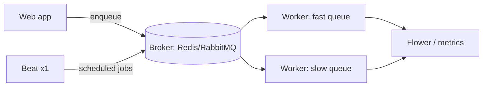

# Production: Scaling, Monitoring & Pitfalls

Here's the mental model for this whole phase: **everything you've learned so far makes Celery *work*; this phase makes it *survive production*.** A toy Celery setup and a rock-solid one run the exact same code. The difference is entirely operational - how you scale it, whether you can see what it's doing, and whether you've sidestepped the handful of traps that bite everyone once. Think of this as a field guide you'll come back to, not a tutorial you read once.

You've got tasks, retries, idempotency, results, and schedules. Now let's keep all of that healthy when real traffic hits it.

## Scaling: more workers, more queues

📝 **The first lever is running more workers.** Every worker process you start connects to the same broker and drains the same queue. Start a second worker - on the same box or a different machine - and the two of them split the pending work between them, no coordination needed. That's the beauty of the broker-in-the-middle shape from [The Broker & Worker](02-the-broker-and-worker.md): scaling out is "add more consumers." You also have the per-worker `--concurrency` knob to run more tasks inside each process. Roughly: `--concurrency` scales *one* machine up; more worker processes scale *out* across machines.

📝 **The second, more important lever is routing different work to different queues.** By default everything lands in one queue called `celery`, and every worker drains it. That's fine until the day a flood of slow `generate_report` jobs piles up - now your quick `send_welcome_email` tasks are stuck behind them, and welcome emails go out an hour late. The fix is to give slow work its own queue with its own dedicated workers, so the two never compete.

```python
# celeryconfig.py - route tasks to named queues by name
task_routes = {
    "tasks.send_welcome_email": {"queue": "fast"},
    "tasks.charge_payment":     {"queue": "fast"},
    "tasks.generate_report":    {"queue": "slow"},
}
```

*What just happened:* we declared a routing table. Now when your app enqueues `generate_report`, Celery drops that message into the `slow` queue instead of the default; the quick tasks go to `fast`. Nothing else in your task code changes - routing is pure configuration. The messages are now *sorted*; the next step is putting workers on each pile.

```bash
# A pool of workers dedicated to quick jobs
celery -A tasks worker --queues=fast --concurrency=8 -n fast@%h

# A separate worker (or pool) for the heavy reports
celery -A tasks worker --queues=slow --concurrency=2 -n slow@%h
```

*What just happened:* we started **two independent worker pools**, each told via `--queues` which queue to drain. The `fast` pool ignores the `slow` queue entirely, so a backlog of reports can never starve your emails. We also gave each a distinct node name with `-n` (`%h` expands to the hostname) so they show up as separate workers in monitoring. 💡 This single pattern - a `fast` queue and a `slow`/reports queue with dedicated workers - solves the most common "Celery feels laggy under load" complaint in production.

## Monitoring: you can't see tasks otherwise

⚠️ Background tasks fail in the dark. There's no user watching a spinner, no 500 page, no red toast. When `send_welcome_email` throws on the tenth retry, *nothing visible happens* - the email never arrives, and you find out when a customer complains next week. This is the exact danger called out in [Retries & Error Handling](05-retries-and-error-handling.md): a silently-failing task is worse than a failing web request, because a failing request at least screams.

📝 **Flower is the first tool to reach for** - a web dashboard built specifically for Celery. You run it as one more process pointed at your broker:

```bash
celery -A tasks flower --port=5555
```

*What just happened:* we started Flower, which connects to the same broker, listens to Celery's event stream, and serves a dashboard at `http://localhost:5555`. Open it and you can see your workers (online/offline, tasks each is running), live task throughput, success and failure rates, and a searchable list of recent tasks with their args, runtime, and tracebacks - the "is anything on fire?" view you were missing.

📝 Flower is the convenient dashboard, but for real production you also want **the three pillars of observability** wired into your existing stack: structured **logs** from each task (use Celery's task logger so every line is tagged with the task name and id), **metrics** (task counts, failure rate, runtime histograms, and crucially **queue depth**) scraped into something like Prometheus, and **traces** that follow a request from your web app into the task it spawned. Full picture in [Observability: Logs, Metrics & Traces](/guides/observability-logs-metrics-traces) - Flower answers "right now," metrics + alerting answer "tell me *before* it's a problem."

💡 The line to internalize: **if you can't see your queue depth and your failure rate, you're flying blind.** A queue that's slowly growing instead of draining is the earliest, clearest signal that you're under-provisioned - but only if something is watching it.

## The pitfall cheat-card

These are the traps that get nearly everyone exactly once. Keep this table handy; when something's mysteriously broken, scan the symptom column first.

| Symptom | Cause | Fix |
|---|---|---|
| Task never runs (silent) | Broker down / wrong broker URL / no worker started / task not imported | Check the broker first (Phase 2): is it up, does the URL match, is a worker connected to that queue? |
| `EncodeError` / pickling error, or task gets stale data | Passing a model object as an argument | Pass an **id**, re-fetch inside the task (Phase 3) |
| Task runs *inline*, blocking the request | Called the function directly instead of `.delay()`/`.apply_async()` | Use `.delay(...)` to enqueue (Phase 3) |
| Double charge / duplicate effect | Non-idempotent task retried or redelivered | Make the task **idempotent** with an idempotency key (Phase 5) |
| Worker hangs / deadlocks | Calling `.get()` on a result *inside* a task or web request | Don't block on results inside tasks; chain or restructure (Phase 4) |
| Scheduled job fires twice | Two Beat processes running | Run **exactly one** Beat (Phase 6) |
| Broker memory bloat / slow enqueues | A giant argument (whole file, huge list) sent through the broker | Pass a reference (id, S3 key); keep messages tiny |

Three of these deserve a closer look because they're the ones people argue with:

- ⚠️ **Task never runs, no error.** This is the number-one Celery mystery, and the instinct is to debug your *code*. Don't - the code never ran. The message went into a queue nobody is draining (broker down, wrong URL, or no worker on that queue). Check the broker and worker before the task body.
- ⚠️ **Passing a model object.** It feels natural to write `send_welcome_email.delay(user)`. But the arguments get **serialized** into a message and may run seconds or minutes later - by then the object is stale, and rich objects often can't be serialized at all. Pass `user.id` and re-fetch fresh inside the task.
- ⚠️ **A giant task argument.** Every argument travels through the broker as part of the message. Shove a 20 MB CSV in there and you bloat broker memory, slow every enqueue, and risk hitting message-size limits. Upload the blob somewhere, pass the key, let the task fetch it.

## Worker reliability

A few knobs keep workers from being their own worst enemy. Brief, but each one has saved a production system.

📝 **Time limits stop runaway tasks.** A task stuck in an infinite loop or a hung network call will occupy a worker slot forever. Two settings cap that:

```python
# celeryconfig.py
task_soft_time_limit = 50   # raise SoftTimeLimitExceeded - task can clean up
task_time_limit      = 60   # hard kill the worker process at 60s, no questions
```

*What just happened:* `task_soft_time_limit` raises a catchable `SoftTimeLimitExceeded` inside the task at 50 seconds, giving it a chance to release a lock or log something; `task_time_limit` is the hard backstop - at 60 seconds Celery kills the child process outright. Together they guarantee no single task can wedge a worker indefinitely.

📝 Two more worth setting:

- `worker_max_tasks_per_child = 1000` - recycle each child process after 1000 tasks. If a task slowly leaks memory (a common C-extension reality), this caps the damage by restarting the process before it bloats.
- `worker_prefetch_multiplier` - how many messages a worker grabs *ahead* of what it's running. The default (4) is great for many short tasks but terrible for long ones: a worker can hoard several slow jobs while siblings sit idle. ⚠️ **For long-running tasks, set `worker_prefetch_multiplier = 1`** so each worker takes one job at a time and work spreads evenly.

## Deployment shape

💡 Step back and look at what a production Celery deployment actually *is* - a small set of long-running processes:



The pieces: **the broker** (Redis or RabbitMQ), **N worker processes** routed by queue and run under a supervisor or in containers so they restart if they die, **exactly one Beat process** if you schedule anything (Phase 6), and **Flower plus metrics** for visibility. That's the whole production footprint.

And the operating discipline, in one breath: **keep tasks small and idempotent, route work by queue, set time limits, run one Beat, and monitor your failure rate and queue depth.** 💡 The difference between "Celery is flaky and we don't trust it" and "Celery is rock-solid, we forget it's even there" is not the library - it's exactly this checklist. Same code, different operations.

## Recap

- **Scale out** by running more worker processes (all draining the same broker) and **scale up** each with `--concurrency`; the bigger win is **routing** slow work to its own queue with dedicated workers so a flood of reports can't starve quick emails.
- Background tasks **fail silently** - use **Flower** for a live dashboard and wire structured logs, metrics (queue depth, failure rate), and traces into your stack ([Observability](/guides/observability-logs-metrics-traces)). If you can't see queue depth and failure rate, you're blind.
- The **pitfall cheat-card**: a silent no-op means check the broker; pass an **id** not a model object; use `.delay()` not a direct call; make retried tasks **idempotent**; don't `.get()` inside a task; run **one** Beat; keep arguments tiny.
- **Reliability knobs**: `task_time_limit`/`task_soft_time_limit` kill runaways, `worker_max_tasks_per_child` recycles memory-leaking workers, and `worker_prefetch_multiplier = 1` spreads long tasks evenly.
- A production deployment is just a **broker + N workers (by queue) + one Beat + Flower/metrics** - and the discipline around it is what makes Celery rock-solid instead of flaky.

## Quick check

```quiz
[
  {
    "q": "A flood of slow report jobs keeps delaying your quick welcome emails. What's the standard fix?",
    "choices": [
      "Increase max_retries on the email task",
      "Route slow and fast work to separate queues, each with its own dedicated workers",
      "Switch the broker from Redis to RabbitMQ"
    ],
    "answer": 1,
    "explain": "Put slow jobs on their own queue with dedicated workers so they run in a separate lane. Quick tasks on the fast queue never wait behind a backlog of reports."
  },
  {
    "q": "Why is monitoring (Flower, metrics, alerts) considered non-optional for production Celery?",
    "choices": [
      "It makes tasks run faster",
      "Background tasks fail silently - with no user watching, you only know about failures and growing queues if something is actively watching",
      "Celery refuses to start workers without a dashboard attached"
    ],
    "answer": 1,
    "explain": "A failed task screams to no one. Without visibility into failure rate and queue depth, problems stay invisible until a customer complains."
  },
  {
    "q": "Your tasks run for several minutes each, but work bunches up on some workers while others sit idle. Which setting helps?",
    "choices": [
      "Set worker_prefetch_multiplier = 1 so each worker takes one long task at a time",
      "Set task_time_limit = 1 to kill tasks faster",
      "Set worker_max_tasks_per_child = 1 to recycle after every task"
    ],
    "answer": 0,
    "explain": "The default prefetch lets a worker hoard several queued jobs ahead of time - fine for short tasks, bad for long ones. Setting it to 1 makes each worker grab one job at a time so long tasks spread evenly."
  }
]
```

---

[← Phase 6: Scheduled Tasks with Celery Beat](06-scheduled-tasks-celery-beat.md) · [Guide overview](_guide.md) · [Phase 8: Where to Go Next →](08-where-to-go-next.md)