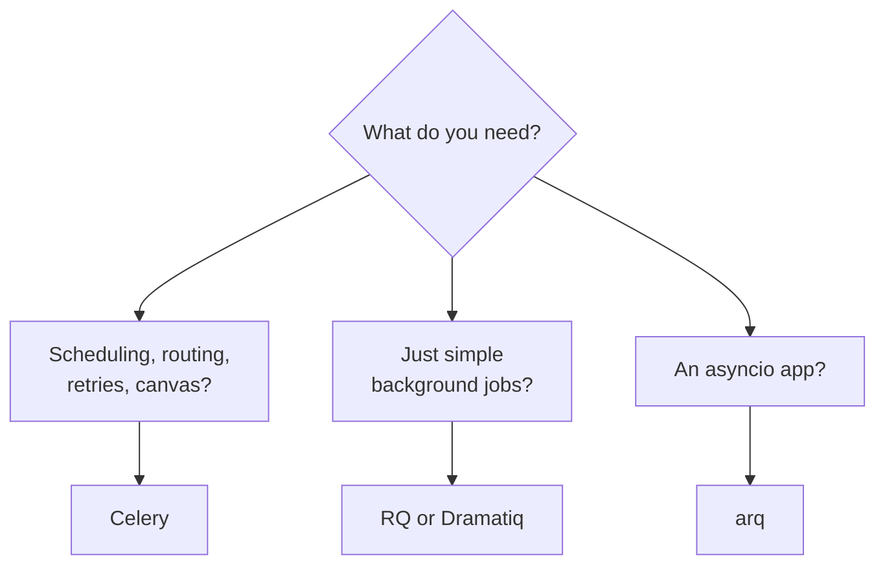

# Where to Go Next

Take a second and look at what you can actually do now. Define a task, hand it off with `.delay()`, and watch a separate worker pick it up off the broker. Track its state through a result backend with `AsyncResult`, retry it sanely when a flaky API blinks, schedule it to run every night with Beat, and scale a fleet of workers while watching the whole thing breathe in Flower. None of that is a toy — it's the shape of real production background work.

And the part that makes it *yours* is that you understand the model underneath. Every quirk, every config knob, every confusing error traces back to one picture: **your app puts a message on a broker, a worker pulls it off and runs it, and a result backend optionally remembers what happened.** App → broker → worker → result. Hold those four pieces and Celery stops being intimidating.

So this last phase isn't more decorators. It's where Celery meets the web frameworks you already use, a pattern for stitching tasks into workflows, an honest look at when *not* to reach for Celery, and what to build next.

## How it plugs into your web framework

💡 You'll almost never run Celery alone. It lives next to a web app, and the division of labor is always the same: **the web request enqueues a task and returns immediately; a worker runs it later.** The request stays fast; the slow work happens off to the side.

The wiring differs a little per framework:

- **[Django](/guides/django-from-zero)** — the most paved road. The `django-celery-results` and `django-celery-beat` packages store results and schedules in your database, and you write tasks with `@shared_task` so they don't depend on importing your Celery app directly. A view calls `send_report.delay(user.id)` and returns.
- **[Flask](/guides/flask-from-zero)** — create the Celery app inside your **app factory** and use a custom `ContextTask` base so tasks run inside a Flask application context (config, DB session, extensions). After that it's the same `.delay()` from a route.
- **[FastAPI](/guides/fastapi-from-zero)** — no special integration to learn. Import your task and call `.delay()` straight from an endpoint. FastAPI's built-in `BackgroundTasks` covers light fire-and-forget work; Celery is what you graduate to when the job is heavy, retryable, or scheduled.

The pattern underneath never changes. The framework is the front desk that takes the order; the workers are the kitchen out back.

## Canvas: composing tasks into workflows

📝 So far every task has been a lone job. But real work often comes in steps — fetch the data, *then* transform it, *then* email the result. Celery has a vocabulary for stitching tasks together called **canvas**, and three pieces cover most of it:

- **`chain`** — run tasks in sequence, passing each result into the next. (Fetch → process → notify.)
- **`group`** — run many tasks in parallel and collect their results. (Thumbnail 100 images at once.)
- **`chord`** — a group *plus* a callback that fires once every task in the group finishes. (Process all the rows, then send one summary.)

A tiny chain reads almost like a sentence:

```python
from celery import chain

# Run these in order; each result flows into the next task.
workflow = chain(fetch_data.s(url), clean_data.s(), save_report.s())
workflow.delay()
```

That `.s()` is a **signature** — a task plus its arguments, packaged up so Celery can wire it into the pipeline instead of running it right now. This is only a taste; canvas goes deeper. But the moment you catch yourself chaining tasks by hand with one task calling `.delay()` on the next, that's your cue to reach for it.

## Celery vs the alternatives, honestly

Celery is the standard, and it earned that spot — it's powerful and feature-rich. But "standard" doesn't mean "always right." All that power comes with heavier configuration, and for a modest job it can feel like bringing a forklift to carry a grocery bag. Here's the honest landscape:



- **Celery** — the full toolbox: scheduling, routing, retries, canvas, multiple brokers. Reach for it when you actually need those features. The cost is configuration.
- **RQ (Redis Queue)** — simpler and smaller, Redis-only. Genuinely lovely for modest needs where Celery's machinery is more than the job warrants.
- **Dramatiq** — simpler than Celery but with solid, sensible defaults out of the box. A strong middle ground.
- **arq** — async-native, built for `asyncio` apps. If your codebase is already `async def` all the way down, arq fits the grain.
- **Cloud queues & framework built-ins** — managed services like **AWS SQS** handle the broker for you, and tools like FastAPI's `BackgroundTasks` cover the lightest fire-and-forget work with no extra infrastructure at all.

💡 The honest rule: reach for **Celery when you need its features** — scheduling, routing, retries, canvas. Reach for **RQ or Dramatiq when you want simpler**. There's no shame in picking the smaller tool; the best background queue is the one your team can actually operate at 3 a.m.

## What to build — and one last thing

The fastest way to make all of this stick is to wire it into something real. Two projects, both small enough to finish:

1. **Move email off the request.** Take a web app you've got and pull email-sending into a Celery task. Add a `retry` so a flaky mail provider doesn't lose a signup. Then add a **nightly digest** with Beat, and watch all of it run in Flower. That single project exercises tasks, retries, scheduling, and monitoring — most of this guide in one go.
2. **Report generation with a status endpoint.** Kick off a slow report as a task, return its task ID, and add an endpoint that checks `AsyncResult` so the front end can poll for "pending → in progress → done." That's the result-backend story made tangible.

When you want the canonical reference, the **official Celery documentation** is the place to go — start with its *"First Steps with Celery"* tutorial, which walks the broker-and-worker setup from scratch and is maintained by the people who build it.

And remember the through-line: background work was never magic. It's a hand-off through a broker you now understand. The job leaves your request, lands on a queue, gets picked up by a worker, and its outcome gets remembered — every "it just happens in the background" is that one shape, wearing different clothes. You can read what's underneath now, build on top of it, and reason about it when it breaks. Go move something slow off the request path and watch it run.

## Recap

1. **You can do the whole job now** — define, call, retry, schedule, scale, and monitor tasks — and you understand the app → broker → worker → result model that ties it all together.
2. **Celery lives next to a web framework** — Django (`django-celery-*`, `@shared_task`), Flask (app-factory init with a `ContextTask`), FastAPI (`.delay()` straight from an endpoint). The web app enqueues; workers run.
3. **Canvas composes tasks** — `chain` for sequences, `group` for parallel work, `chord` for a callback after a group finishes. Use signatures (`.s()`) to wire them together.
4. **Pick the right tool honestly** — Celery for its full feature set, RQ or Dramatiq when you want simpler, arq for async apps, and cloud queues or built-ins for light work.
5. **Build one thing and finish it** — move email-sending to a task with a retry and a nightly Beat digest, or build a report task with an `AsyncResult` status endpoint. Background work is a hand-off through a broker you now understand.

## Quick check

Test yourself on the decisions that matter most as you leave this guide:

```quiz
[
  {
    "q": "In a web app using Celery, what does the web request itself do with a heavy task?",
    "choices": [
      "It runs the task inline and waits for the result before responding",
      "It enqueues the task on the broker and returns immediately, while a worker runs it later",
      "It blocks until a worker confirms the task finished",
      "It schedules the task with Beat so it runs the next night"
    ],
    "answer": 1,
    "explain": "The pattern is always the same: the web app enqueues the task (for example with .delay()) and returns fast; a separate worker process picks it up off the broker and runs it later."
  },
  {
    "q": "You need to run three tasks in sequence, passing each result into the next. Which canvas primitive fits?",
    "choices": [
      "group, because it runs tasks together",
      "chord, because it adds a callback",
      "chain, because it runs tasks in order and passes results along",
      "AsyncResult, because it tracks status"
    ],
    "answer": 2,
    "explain": "chain runs tasks in sequence and feeds each result into the next. group runs tasks in parallel, and chord is a group plus a callback that fires when the whole group finishes."
  },
  {
    "q": "Your app has modest background needs and already runs on Redis. When is it reasonable NOT to reach for Celery?",
    "choices": [
      "Never — Celery is the standard, so it's always the right choice",
      "When you want something simpler; a lighter tool like RQ or Dramatiq may fit better",
      "Only if you stop using a broker entirely",
      "Only when you have no scheduled jobs at all, ever"
    ],
    "answer": 1,
    "explain": "Celery is powerful but heavier to configure. Reach for it when you need its features (scheduling, routing, retries, canvas); reach for RQ or Dramatiq when you want simpler. Picking the smaller tool is a legitimate choice."
  }
]
```

---

[← Phase 7: Production: Scaling, Monitoring & Pitfalls](07-production-scaling-monitoring.md) · [Guide overview](_guide.md)
