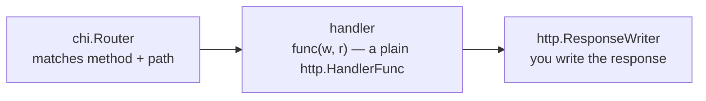

# What chi Is

You know [Go](/guides/go-from-zero), and you already like `net/http`. Maybe you've read the
[net/http roots guide](/guides/web-services-with-only-net-http) and thought: this is fine, honestly —
clean types, no magic, the standard library does the work. There's only one thing that gets old fast:
telling `/articles/42` apart from `/articles` means hand-rolling a router, and the stdlib mux historically
made that more painful than it should be. That's the one gap.

chi fills exactly that gap and nothing more. It's a lightweight, idiomatic router whose entire philosophy
is **stay 100% compatible with `net/http`**. Where [Gin](/guides/gin-from-zero) and Echo hand you their
own context object to learn — `*gin.Context`, `echo.Context`, with their own JSON helpers and their own way
of doing everything — chi hands you back the standard library. A chi handler is a plain `http.HandlerFunc`.
chi middleware is a plain `func(http.Handler) http.Handler`. A chi router *is* an `http.Handler`. There's no
new request object to memorize, because there isn't one.

## The mental model: chi adds a router and gets out of the way

Hold this one idea and the whole framework follows from it.

📝 **chi adds a router to the standard library and then steps aside.** It doesn't wrap your handlers in
anything, doesn't give you a special context. It matches an incoming method + path to one of *your* plain
`net/http` handlers, fills in URL parameters the stdlib mux long lacked, and calls your function with the
same `w http.ResponseWriter, r *http.Request` you'd write anyway.



*One idea:* the router is the only chi-specific thing in the picture. On either side of it — the handler you
write, the response you send — it's the standard library all the way down. Compare that mermaid box to Gin's
(which has a `gin.Context` doing the response work) and the difference is the whole pitch.

## Your first server

First, pull chi into your module. From inside your Go project:

```bash
go get github.com/go-chi/chi/v5
```

*What just happened:* `go get` downloaded chi and recorded it in your `go.mod`/`go.sum`. Note the `/v5` —
chi uses Go's versioned module paths, so the import path carries the major version. That one command is the
whole install.

Now the smallest server that does something real. Create a file called `main.go`:

```go
package main

import (
    "net/http"

    "github.com/go-chi/chi/v5"
)

func main() {
    r := chi.NewRouter()
    r.Get("/ping", func(w http.ResponseWriter, req *http.Request) {
        w.Write([]byte("pong"))
    })
    http.ListenAndServe(":3000", r)
}
```

*What just happened:* line by line —
- `chi.NewRouter()` creates the **router** and returns a `chi.Router`. We name it `r`.
- `r.Get("/ping", ...)` registers a **route**: when a `GET` arrives for `/ping`, run the function we pass.
  That function is the **handler**, and its signature — `func(w http.ResponseWriter, req *http.Request)` —
  is the *exact* shape of a plain `http.HandlerFunc`. No chi types in it at all.
- `w.Write([]byte("pong"))` writes the response body using the standard `http.ResponseWriter` — same call
  you'd make with no framework.
- `http.ListenAndServe(":3000", r)` starts the server on port 3000 — and here's the key move: the second
  argument to the stdlib's `ListenAndServe` is the handler, and we pass `r`. **The router *is* the handler.**
  Because a chi router satisfies the `http.Handler` interface, you hand it straight to the standard library.
  There's no `r.Run()` wrapper to learn.

Run it like any Go program:

```bash
go run main.go
```

Leave it running, and in another terminal hit the route:

```bash
curl localhost:3000/ping
```

```console
$ curl localhost:3000/ping
pong
```

*What just happened:* `go run` compiled and started your program; `http.ListenAndServe` brought up the
server and blocked, waiting for requests. `curl` sent a `GET /ping`, chi's router matched it to your route,
called your plain handler, and the handler wrote `pong` back. A working server, and the only chi-specific
line is `chi.NewRouter()`.

## Why "compatible with net/http" is the whole point

It's tempting to read "compatible with the standard library" as a modest, boring feature. It isn't — it's
the reason to pick chi.

💡 Because everything in that server is a stdlib type, **what you learn here transfers straight to plain
net/http** ([the net/http roots guide](/guides/web-services-with-only-net-http)) and back again. Learn to
write a chi handler and you've learned to write an `http.HandlerFunc`. Learn chi middleware and you've
learned `func(http.Handler) http.Handler`, the standard middleware shape.

💡 And it runs in the other direction too: **any stdlib-compatible middleware works with chi unchanged.**
The whole ecosystem of `func(http.Handler) http.Handler` wrappers — CORS handlers, request loggers,
auth middleware written for raw `net/http` — drops into a chi router with no adapter, because chi never
asked them to speak a special dialect.

⚠️ The flip side, worth naming on day one: chi gives you *less* out of the box than Gin or Echo. There's no
`c.JSON(200, ...)` one-liner waiting for you — you'll reach for `encoding/json` and write the response the
standard way. That's a deliberate trade: a little more typing for zero magic and total portability. If
you'd rather the framework do more of the boring parts, [Gin](/guides/gin-from-zero) is the guide to read.

## The running example: an articles API

We won't keep writing throwaway `/ping` routes. Across this guide we'll grow one real service: a small
**articles API**. The core is a single type — an article with an id, a title, and a body:

```go
type Article struct {
    ID    int    `json:"id"`
    Title string `json:"title"`
    Body  string `json:"body"`
}
```

*What just happened:* we declared the `Article` struct the whole guide builds on. Those `json:"..."`
**struct tags** tell `encoding/json` what to call each field on the wire — so `Title` becomes `"title"` in
the JSON, not `"Title"`. They do real work in both directions. Here's the type returning itself through a
plain chi handler:

```go
r.Get("/articles/sample", func(w http.ResponseWriter, req *http.Request) {
    a := Article{ID: 1, Title: "What chi Is", Body: "chi is just a router."}
    w.Header().Set("Content-Type", "application/json")
    json.NewEncoder(w).Encode(a)
})
```

*What just happened:* the handler built an `Article`, set the `Content-Type` header by hand, and used the
standard `json.NewEncoder(w).Encode(a)` to serialize it straight to the response writer. No framework
helper doing this — it's stdlib JSON, exactly as you'd write it without chi. Hit it and you get clean JSON
back:

```console
$ curl localhost:3000/articles/sample
{"id":1,"title":"What chi Is","body":"chi is just a router."}
```

That two-line JSON dance is what Gin folds into `c.JSON`. Phase 4 wraps it in a small helper of our own so
you write it once, not in every handler — but it stays stdlib underneath. By the end of the guide, this
grows into full create/read/update/delete over a real collection of articles. For now you've met the cast:
a **router**, a **route**, a plain **handler**, and the **`Article`** we'll spend the next phases turning
into a proper REST API. Next up: routing — methods, `{id}` URL params, and sub-routers.

## Recap

- **chi is a lightweight, idiomatic Go router** whose whole philosophy is staying 100% compatible with
  `net/http`. Install it with `go get github.com/go-chi/chi/v5` (note the `/v5`).
- **The mental model:** chi adds a router to the standard library and gets out of the way. A chi handler is
  a plain `http.HandlerFunc`, chi middleware is a plain `func(http.Handler) http.Handler`, and a chi router
  *is* an `http.Handler` — there's no special context object to learn.
- **A first server is tiny:** `chi.NewRouter()` makes the router, `r.Get(path, handler)` registers a route,
  and you serve it with the standard library — `http.ListenAndServe(":3000", r)`, because the router is the
  handler. Run with `go run main.go`, test with `curl`.
- **net/http-compatibility is the point, not a footnote:** your skills transfer straight to plain `net/http`,
  and any stdlib-compatible middleware works with chi unchanged — no framework-specific adapters.
- **The trade-off:** chi gives you less out of the box (no `c.JSON` one-liner — you use `encoding/json`
  directly). That's deliberate: less magic, total portability.
- **The running example** is an **articles API** built on the `Article{ID, Title, Body}` struct, which the
  rest of the guide turns into full CRUD.

## Quick check

Three questions on the ideas that have to stick — what chi is, the "just a router" philosophy, and how a
first server fits together:

```quiz
[
  {
    "q": "What is a chi route handler, in terms of types?",
    "choices": [
      "A plain http.HandlerFunc — func(w http.ResponseWriter, r *http.Request), the same signature as raw net/http",
      "A function that takes a special *chi.Context argument",
      "A method on a struct that chi generates for you",
      "A function returning (string, error) that chi serializes automatically"
    ],
    "answer": 0,
    "explain": "chi's whole philosophy is staying compatible with net/http. A chi handler is just a plain http.HandlerFunc — there is no special context object like Gin's *gin.Context or Echo's echo.Context. You write w http.ResponseWriter, r *http.Request exactly as you would without a framework."
  },
  {
    "q": "In `http.ListenAndServe(\":3000\", r)`, why can you pass the chi router `r` as the second argument?",
    "choices": [
      "Because a chi router IS an http.Handler, so the standard library serves it directly",
      "Because chi monkey-patches ListenAndServe to accept its own type",
      "Because r is secretly converted to a string route table",
      "Because ListenAndServe ignores its second argument when it is a chi router"
    ],
    "answer": 0,
    "explain": "A chi router satisfies the http.Handler interface, so it plugs straight into the standard library's http.ListenAndServe. The router IS the handler — that is why there is no special r.Run() wrapper to learn; you use the stdlib function you already know."
  },
  {
    "q": "Which is a real consequence of chi staying compatible with net/http?",
    "choices": [
      "Any stdlib-compatible middleware (func(http.Handler) http.Handler) works with chi unchanged",
      "chi handlers must be rewritten to run under plain net/http",
      "chi ships a c.JSON one-liner so you never touch encoding/json",
      "chi requires its own special middleware format that other libraries must adopt"
    ],
    "answer": 0,
    "explain": "Because chi uses standard types, the whole ecosystem of func(http.Handler) http.Handler middleware — loggers, CORS, auth — drops in with no adapter. The trade-off is the opposite of a c.JSON helper: chi gives you less out of the box, so you use encoding/json directly."
  }
]
```

---

[Guide overview](_guide.md) · [Phase 2: Routing, URL Params & Sub-routers →](02-routing-and-subrouters.md)
