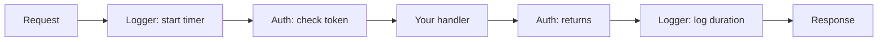

# Middleware the Standard Way

Here's the thing most tutorials bury: chi doesn't have a middleware *system*. It has the
`net/http` middleware pattern, and a couple of helpers for plugging it in. That's the whole
story. If you've ever seen middleware in a Go codebase that uses no framework at all, you've
already seen chi middleware — same signature, same idea.

So before we touch `r.Use`, let's get the mental model rock-solid, because once it clicks the
rest is mechanical.

## The mental model: a function that wraps a handler

📝 **Middleware is a function that takes one `http.Handler` and returns a new `http.Handler`.**
The new handler does some work, then calls the original. That's it. The type, written out, is:

```go
func(next http.Handler) http.Handler
```

Read that slowly. You receive `next` — the handler that *would* have run. You hand back a
*different* handler. Inside that new handler, you decide when (or whether) to call
`next.ServeHTTP(w, r)`. Everything before that call happens on the way *in*; everything after
happens on the way *out*. You're wrapping a present in a slightly bigger box.

This is the exact pattern from the [net/http roots guide](/guides/web-services-with-only-net-http) —
chi invented none of it. A chi router *is* an `http.Handler`, a chi handler *is* an
`http.HandlerFunc`, and chi middleware *is* a plain net/http wrapper. The payoff at the end of
this phase: any middleware written for stdlib works with chi unchanged.

Picture the request falling through layers and climbing back out:



*What just happened:* the request travels *down* through each middleware to your handler, then
the call stack unwinds *back up* through them. The Logger that started a timer on the way in is
the one that prints the duration on the way out, because it's the outermost wrapper.

## Writing one

Let's write the classic: a request logger. We want to time how long each request takes and
print the method, path, and duration.

```go
package main

import (
	"log"
	"net/http"
	"time"
)

func Logger(next http.Handler) http.Handler {
	return http.HandlerFunc(func(w http.ResponseWriter, r *http.Request) {
		start := time.Now()
		next.ServeHTTP(w, r)
		log.Printf("%s %s %v", r.Method, r.URL.Path, time.Since(start))
	})
}
```

*What just happened:* `Logger` takes `next` and returns a brand-new `http.HandlerFunc`. Inside,
we record `start`, then call `next.ServeHTTP(w, r)` to run the rest of the chain (other
middleware, then the actual route handler). Only after `next` returns do we log — so
`time.Since(start)` captures the full request duration. The line **before** `next.ServeHTTP`
runs on the way in; the line **after** runs on the way out.

⚠️ If you forget to call `next.ServeHTTP(w, r)`, the request stops dead at your middleware — the
handler never runs and the client gets an empty response. Sometimes that's intentional (an auth
middleware rejecting a request writes a 401 and *deliberately* doesn't call `next`). But an
accidental missing call is one of the most common middleware bugs. If a route mysteriously
returns nothing, check that every middleware in the chain actually calls `next`.

## Registering: `Use`, `With`, and sub-routers

Writing the function is half the job. Now you tell chi where to apply it. Three ways:

### `r.Use` — for everything below it

```go
func main() {
	r := chi.NewRouter()

	r.Use(Logger) // applies to every route registered after this line

	r.Get("/articles", listArticles)
	r.Get("/articles/{id}", getArticle)

	http.ListenAndServe(":3000", r)
}
```

*What just happened:* `r.Use(Logger)` adds `Logger` to this router's stack. Every route
registered **after** the `Use` call — both `/articles` routes here — runs through `Logger`
first. You can call `Use` multiple times; they stack in order, the first `Use` being the
outermost layer.

⚠️ **Order matters, and `Use` must come before the routes it should wrap.** chi *panics* at
startup if you call `Use` after you've already registered routes on the same router. This is a
feature, not an annoyance: it stops you from silently shipping middleware that doesn't run.
Group your `Use` calls at the top of each router.

### `r.With` — for one route (or a few)

Sometimes you want middleware on a single endpoint, not the whole router. `With` returns a
temporary router carrying that middleware, and you chain a route off it:

```go
r.With(RequireAuth).Post("/articles", createArticle)
```

*What just happened:* `RequireAuth` wraps **only** the `POST /articles` route. The `GET` routes
above are untouched. `With` is inline and doesn't mutate the parent router — perfect for
"this one mutating endpoint needs auth, the reads don't."

### Sub-routers — middleware scoped to a group

From the previous phase you know `Route` and `Mount` create sub-routers. Middleware applied
inside a sub-router only affects that group:

```go
r.Route("/admin", func(admin chi.Router) {
	admin.Use(RequireAuth) // only /admin/* routes get this
	admin.Get("/stats", adminStats)
	admin.Delete("/articles/{id}", deleteArticle)
})
```

*What just happened:* `RequireAuth` is registered on the `admin` sub-router, so it guards
`/admin/stats` and `/admin/articles/{id}` but nothing else. This is how you carve out a
protected section without sprinkling `With` on every line. The public article routes outside
this block stay open.

## chi's built-in middleware

You don't have to write the common ones — chi ships a battle-tested set in
`github.com/go-chi/chi/v5/middleware`. The greatest hits:

```go
import (
	"time"

	"github.com/go-chi/chi/v5"
	"github.com/go-chi/chi/v5/middleware"
)

func main() {
	r := chi.NewRouter()

	r.Use(middleware.RequestID)              // tags each request with a unique ID
	r.Use(middleware.RealIP)                 // sets r.RemoteAddr from X-Forwarded-For etc.
	r.Use(middleware.Logger)                 // structured request logging
	r.Use(middleware.Recoverer)              // catches panics, returns 500 instead of crashing
	r.Use(middleware.Timeout(60 * time.Second)) // cancels the request context after 60s

	r.Get("/articles", listArticles)

	http.ListenAndServe(":3000", r)
}
```

*What just happened:* five lines buy you request IDs, real client IPs behind a proxy, request
logging, panic recovery, and a timeout. `middleware.Recoverer` is the one you'll be most
grateful for in production — without it, a single nil-pointer panic in a handler takes down the
whole server; with it, that request gets a clean 500 and the server keeps serving everyone else.

💡 Order is deliberate here too: put `RequestID` and `RealIP` near the top so the ID and IP are
available to everything below (including `Logger`). `Recoverer` should sit high enough to catch
panics from your handlers, but it's commonly placed right after the logging setup. There's also
`middleware.AllowContentType(...)`, `middleware.StripSlashes`, and many more — skim the package
when you have a real need.

## Passing data down with `context`

Middleware often computes something — the authenticated user, a request-scoped DB transaction —
that the handler needs. You don't reach for a global or a framework-specific bag. You use the
standard library's `context`, carried on the request itself.

The pattern: in the middleware, attach a value with `context.WithValue`, then call `next` with a
copy of the request that carries the new context via `r.WithContext`. The handler reads it back
with `r.Context().Value(...)`.

```go
type contextKey string

const userKey contextKey = "user"

func RequireAuth(next http.Handler) http.Handler {
	return http.HandlerFunc(func(w http.ResponseWriter, r *http.Request) {
		token := r.Header.Get("Authorization")
		if token == "" {
			http.Error(w, "unauthorized", http.StatusUnauthorized)
			return // note: we do NOT call next — the request stops here
		}

		user := lookupUser(token) // pretend this validates the token
		ctx := context.WithValue(r.Context(), userKey, user)
		next.ServeHTTP(w, r.WithContext(ctx))
	})
}

func createArticle(w http.ResponseWriter, r *http.Request) {
	user := r.Context().Value(userKey).(string)
	log.Printf("article created by %s", user)
	// ... do the work ...
}
```

*What just happened:* `RequireAuth` checks the `Authorization` header. No token? It writes a 401
and `return`s — deliberately skipping `next`, so the handler never runs. With a token, it stashes
the user on the request context and passes a request carrying that context to `next`. Downstream,
`createArticle` pulls the user back out. The two functions never call each other directly; the
context is the courier.

📝 A small but real detail: `userKey` is a custom `contextKey` type, not a bare string. Context
keys should be an unexported custom type so two packages can't accidentally collide on the same
string key. We'll go deeper on context values and the cleaner "typed getter" pattern in Phase 6 —
this is the minimum to make middleware-to-handler data flow work.

💡 Because all of this is plain `net/http` — the wrapper signature, the context, `r.WithContext` —
any middleware written for the standard library drops into chi with zero changes. Need CORS? Grab
`github.com/go-chi/cors` or any stdlib-compatible CORS package and `r.Use` it like anything else.
That compatibility is chi's entire pitch, and middleware is where you feel it most.

## Recap

- Middleware is a plain net/http `func(next http.Handler) http.Handler` that wraps `next` and
  decides when to call `next.ServeHTTP(w, r)`. chi adds no special type.
- Work **before** `next.ServeHTTP` runs on the way in; work **after** runs on the way out.
  Skipping `next` (e.g. an auth rejection) stops the chain.
- `r.Use` applies middleware to all routes registered after it; `r.With(mw)` scopes it to one
  route; sub-router `Use` scopes it to that group. ⚠️ `Use` must come before routes or chi panics.
- chi's built-ins (`Logger`, `Recoverer`, `RequestID`, `RealIP`, `Timeout`) cover the essentials —
  `Recoverer` especially keeps a panicking handler from taking down the server.
- Pass request-scoped data with `context.WithValue` + `r.WithContext`, read it via
  `r.Context().Value(...)`. Any stdlib-compatible middleware works with chi unchanged.

## Quick check

```quiz
[
  {
    "q": "What is the type signature of chi middleware?",
    "choices": ["func(w http.ResponseWriter, r *http.Request)", "func(next http.Handler) http.Handler", "chi.Middleware interface", "func(c *chi.Context)"],
    "answer": 1,
    "explain": "chi uses the standard net/http pattern: a function that takes the next handler and returns a new wrapping handler. No chi-specific type is involved."
  },
  {
    "q": "What happens if you call r.Use after registering routes on the same router?",
    "choices": ["The middleware silently doesn't run", "chi panics at startup", "It applies to all routes anyway", "It only applies to the next route added"],
    "answer": 1,
    "explain": "chi panics if Use is called after routes on the same router. This protects you from shipping middleware that wouldn't wrap those routes. Declare Use before the routes it should cover."
  },
  {
    "q": "How does a middleware pass a computed value (like the authenticated user) down to the handler?",
    "choices": ["A global variable", "chi.SetValue(r, key, val)", "context.WithValue plus next.ServeHTTP(w, r.WithContext(ctx))", "Adding a field to the http.ResponseWriter"],
    "answer": 2,
    "explain": "You attach the value to the request context with context.WithValue, then pass a request carrying that context via r.WithContext. The handler reads it with r.Context().Value(key)."
  }
]
```

[← Phase 2: Routing, URL Params & Sub-routers](02-routing-and-subrouters.md) · [Guide overview](_guide.md) · [Phase 4: Requests & Responses with the Standard Library →](04-requests-and-responses.md)
