# Where to Go Next

Stop for a second and look at the pile of things you can do now. You can route requests and pull `{id}` params, compose sub-routers with `Route` and `Mount`, stack middleware as plain `func(http.Handler) http.Handler` wrappers, decode and encode JSON with nothing but the standard library, and build, structure, and test a full REST API for the articles resource. That's a real service, not a toy.

And here's the quieter win, the one that outlasts this guide. Because chi is *barely a framework* — a router and a middleware helper, both built from standard pieces — you didn't only learn chi. You learned idiomatic `net/http`. Your handlers are `http.HandlerFunc`. Your middleware is the standard wrapper shape. Your router *is* an `http.Handler`. Strip chi out and most of what you wrote still makes sense, because it was standard-library code the whole time. That knowledge doesn't expire when the framework does.

So this last phase isn't more handlers. It's the map: where chi sits among the other Go web frameworks, an honest word about a recent change to the standard library that affects the whole pitch, the layer you'll almost certainly add next, and one concrete thing to go build.

## chi vs the field

The good news in Go: these frameworks are far more alike than the JavaScript world's are. They nearly all sit on `net/http`, they all do routing, params, and middleware. The differences are about *feel*, not different universes.

```mermaid
flowchart TD
  Start[Need a Go web service?] --> Pure{Want stdlib purity?}
  Pure -- "Yes, and richer routing/middleware" --> Chi[chi]
  Pure -- "Yes, and the case is simple" --> Std[net/http alone]
  Pure -- "No, want batteries" --> Style{Handler style?}
  Style -- "Context helpers" --> Gin[Gin]
  Style -- "Return an error" --> Echo[Echo]
```



A line on each:

- **chi** — minimal and proudly so, a router that stays *pure* `net/http`. Handlers are plain `http.HandlerFunc`, middleware is the standard `func(http.Handler) http.Handler`, and there's no special context to learn. Nothing to unlearn, nothing locked in. (You're here.)
- **Gin** — the most popular, the biggest ecosystem, the most Stack Overflow answers. Handlers take a `*gin.Context` and write to it. Reach for it when you want batteries and the largest community. See [Gin From Zero](/guides/gin-from-zero).
- **Echo** — close to Gin in spirit, with one stylistic twist worth knowing: its handlers *return* an `error` (`func(c echo.Context) error`) instead of writing failures into a context, and it ships a bit more built-in middleware. If you like that style, you'll like Echo. See [Echo From Zero](/guides/echo-from-zero).
- **The standard library alone** — for many services, plain `net/http` is genuinely enough now (more on that below). See [Web Services With Only net/http](/guides/web-services-with-only-net-http).

> 💡 How to pick: reach for **chi** when you want stdlib purity *plus* its router and middleware ergonomics — sub-router composition, richer path patterns, a clean middleware stack. Reach for **Gin** or **Echo** when you want batteries (binding, validation, more helpers) baked in. Reach for **plain net/http** when the service is simple and you'd rather not add a dependency at all.

📝 None of these is "the best." The senior instinct isn't memorizing a winner — it's asking "best for *this* job?" and being able to answer honestly. You have the pieces for that now.

## The honest part: Go 1.22 changed the math

Here's the thing a guide that respects you has to say out loud. chi's headline advantage, for years, was routing — the standard `http.ServeMux` couldn't match a method, couldn't capture path params, so you reached for a router. **Go 1.22 closed a lot of that gap.**

The standard mux now understands method-and-path patterns and captures path values:

```go
mux := http.NewServeMux()
mux.HandleFunc("GET /articles/{id}", func(w http.ResponseWriter, r *http.Request) {
    id := r.PathValue("id") // the captured {id}, no library needed
    fmt.Fprintf(w, "article %s", id)
})
```

That's the exact problem chi was invented to solve, now in the standard library. So the honest question is: *do you even need chi?*

For a simple service — a handful of routes, basic params — the answer today is often **no**. Plain `net/http` will carry it, and the [net/http roots guide](/guides/web-services-with-only-net-http) shows how far that goes.

⚠️ But "the gap narrowed" is not "the gap closed." chi still earns its keep where the stdlib stays thin:

- **Middleware as a first-class stack.** `r.Use(...)`, per-route stacks, and a batteries-included set (request ID, real-IP, recoverer, structured logging) — the standard mux gives you none of that; you wire it by hand.
- **Sub-router composition.** `Route` and `Mount` let you build and nest whole routers, mount one under a path prefix, and give a subtree its own middleware. Hand-rolling that on `ServeMux` gets old fast.
- **Richer routing features** beyond the basics, plus a clean place for shared logic.

> 💡 The honest rule of thumb: **simple service → plain net/http is probably enough now. Real middleware needs or composed sub-routers → chi still wins** — and because chi *is* net/http underneath, you can start on the standard mux and adopt chi later without rewriting your handlers. That's the whole point of staying compatible.

## The layer you'll add next: a real database

Every API in this guide stored articles in memory. Perfect for learning, useless in production — restart the server and the data's gone. The next thing almost every real service grows is a **database**.

Here's the reassuring part: your handlers barely change. Remember how Phase 6 kept the HTTP logic separate from where data lived, behind a store? That pays off right here. The handler still decodes JSON, validates, calls the store, and writes a response. All that swaps underneath is the store — from a map to a database-backed one.

[GORM From Zero](/guides/gorm-from-zero) is the natural next read. GORM is Go's most popular ORM: define your `Article` struct, point it at SQLite (Postgres later), and your create/read/update/delete calls become real persistence. The Phase 5 handlers stay exactly the same — you're replacing the bottom layer, not rewriting the top.

## What to build

Reading more won't make this stick. Building one real thing will. So here's the assignment, and it's deliberately concrete.

Take the **articles API** you grew across this guide and carry it all the way home:

- **Swap the in-memory store for GORM + SQLite** so articles survive a restart. The handlers stay; the store changes. ([GORM From Zero](/guides/gorm-from-zero) walks the persistence part.)
- **Add auth middleware** so each request proves who it is — exactly the `func(http.Handler) http.Handler` pattern from Phase 3, applied to a real job.
- **Add request logging** (chi ships a logger and a recoverer; mount them and watch your service narrate itself).
- **Deploy it** somewhere you can hit from your phone.

If the articles API feels too familiar, build something small and new end to end instead — a **URL shortener** or a **notes API**. Same muscles: routes, sub-routers, a store, middleware, tests, deploy. Finishing one project completely teaches more than three more tutorials would.

## The honest close

chi was never magic — it was barely even a framework. A router and a middleware helper, both made of standard parts. That smallness was the lesson, not a limit. Because the framework hid almost nothing, what you actually learned was the **standard library**: `http.HandlerFunc`, `http.Handler`, the middleware wrapper, `context` values, `httptest`.

That's knowledge that outlives any framework. Go 1.22 can absorb half of chi's old job and you shrug, because you understand the layer underneath. Switch to Gin or Echo tomorrow and you'll read them faster, because you know what a router and a context and a middleware chain really are.

So go finish the articles API. Give it a database, lock it behind auth, watch the logs, deploy it, show someone. You're ready.

## Recap

1. **You can ship a real chi API** — routed, sub-routed, middleware-wrapped, JSON in and out with the stdlib, structured and tested. And since chi is barely a framework, you mostly learned idiomatic `net/http` along the way.
2. **Choose on purpose** — chi for stdlib purity *plus* router/middleware ergonomics; Gin or Echo for batteries (Echo if you like error-returning handlers); plain `net/http` when the case is simple.
3. **Go 1.22 narrowed chi's edge** — the standard `http.ServeMux` now matches `GET /articles/{id}` patterns and exposes `r.PathValue("id")`, so simple services often need no router at all.
4. **chi still wins on middleware and composition** — a first-class middleware stack plus `Route`/`Mount` sub-routers are where the standard mux stays thin; and because chi *is* net/http, you can adopt it later without rewriting handlers.
5. **A database is the next layer** — most services add one, and with the Phase 6 store separation in place your handlers barely change; swap the map for GORM + SQLite.
6. **Build and finish one thing** — carry the articles API to GORM, auth middleware, request logging, and a deploy. Finishing beats more tutorials.

## Quick check

Three decisions to take with you as you leave this guide:

```quiz
[
  {
    "q": "Since Go 1.22, why might a simple service not need chi at all?",
    "choices": [
      "Go 1.22 deleted net/http, so chi is the only option",
      "The standard http.ServeMux now matches method+path patterns like \"GET /articles/{id}\" and exposes params via r.PathValue, covering basic routing",
      "chi stopped being maintained in Go 1.22",
      "Go 1.22 added a built-in ORM that replaces routers"
    ],
    "answer": 1,
    "explain": "Go 1.22 improved the standard mux to match method+path patterns and read path values with r.PathValue, which was chi's main historical advantage. For simple routing, plain net/http is now often enough."
  },
  {
    "q": "Given the Go 1.22 update, where does chi still clearly earn its place?",
    "choices": [
      "Nowhere — chi is now obsolete",
      "Only for serving static files",
      "Its first-class middleware stack and sub-router composition with Route/Mount, which the standard mux doesn't give you",
      "Because it replaces net/http with a faster engine"
    ],
    "answer": 2,
    "explain": "The standard mux still leaves middleware and router composition to you. chi's first-class middleware stack and Route/Mount sub-routers are where it stays ahead — and since chi is net/http underneath, you can adopt it later without rewriting handlers."
  },
  {
    "q": "You're adding a real database to your articles API from Phase 6. What mostly changes?",
    "choices": [
      "Every handler must be rewritten from scratch",
      "Only the store layer swaps from an in-memory map to a GORM-backed one; the Phase 5 handlers stay the same",
      "You must abandon chi and switch to Gin",
      "Nothing — chi stores data in a database automatically"
    ],
    "answer": 1,
    "explain": "Because Phase 6 kept HTTP logic separate from where data lives, the handlers still decode, validate, call a store, and respond. You swap the store from a map to GORM + SQLite — the bottom layer changes, the handlers stay."
  }
]
```

---

[← Phase 6: Structuring & Testing](06-structure-and-testing.md) · [Guide overview](_guide.md)
