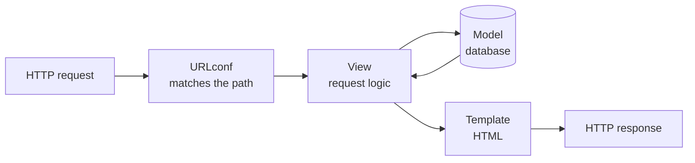

# What Django Is & Your First Project

You know [Python](/guides/python-from-zero). Now you want to build a *website* - not a bare JSON API,
but a real site with pages, a database behind them, user logins, and an admin screen to manage your
data. You could wire all of that together from small libraries, or reach for the framework that already
ships every one of those pieces in a single box: **Django**.

Django's whole personality comes from one bet: **most web apps need the same things, so the framework
should provide them and ask you to follow its conventions.** Database access, schema changes, an admin
panel, login, forms, HTML rendering - Django hands you all of it and a sensible way to arrange it. You
write less plumbing and more of *your* app. The price is learning Django's way of doing things - for a
full website, usually a bargain.

## Batteries included - what Django gives you for free

📝 **Django** - a high-level Python web framework that ships with, out of the box: an **ORM** (talk to
the database in Python instead of SQL), **migrations** (version-control your database schema), an
**admin** site (an auto-generated UI to manage your data), **auth** (users, passwords, permissions),
a **template** engine (HTML with placeholders), and a **forms** layer. "Batteries included" is the
official slogan, and it's literal.

The contrast with a micro-framework makes this concrete. [FastAPI](/guides/fastapi-from-zero) - the
sibling framework in this library - is lean and API-first: brilliant at turning your type hints into a
validated JSON API, but it deliberately stays out of your way on databases, admin screens, and HTML. You
bring those yourself, choosing each library. Django takes the opposite stance: it makes those choices
*for* you and bundles them, so a database-backed website with a login and an admin panel is a starting
point, not a shopping trip.

💡 **The trade, stated plainly.** Micro-frameworks give you fewer conventions to learn and total
freedom to assemble. Django gives you far more provided, in exchange for learning *its* conventions - 
where files go, what things are named, how the pieces connect. Neither is "better"; they fit different
jobs.

## The MTV pattern - Django's shape

Every Django app is organized around three roles. If you've heard of **MVC** (Model–View–Controller),
this is the same idea wearing different labels.

📝 **MTV** - **M**odel, **T**emplate, **V**iew.
- **Model** - your data and how it's stored (a `Post`, a `Comment`). This is the ORM layer.
- **View** - the logic for one request: it decides *what* to do, pulls the right data from the models,
  and picks a template. (Confusingly, this is what MVC calls the *controller*.)
- **Template** - the HTML with placeholders that turns data into a page. (This is what MVC calls the
  *view*.)

⚠️ **The naming trap.** Django's "view" is the controller; Django's "template" is the view. People
coming from other frameworks trip on this constantly. Don't fight it - just remember: in Django, a
**view is a Python function that handles a request**, and a **template renders HTML**.

Here's the full path a request takes through Django:



*One idea:* a request comes in, the **URLconf** matches its path to a **view**, the view asks the
**models** for data and feeds it to a **template**, and the rendered HTML goes back as the response.
Every Django page you ever build flows along that arrow. We'll wire up the URLconf and views next phase.

## Project vs app - the split everyone confuses

This is the single most common point of confusion for Django beginners, so let's nail it down first.

📝 **Project** - the whole website. It holds your settings, the root URL configuration, and ties
everything together. There is **one** project. 📝 **App** - a self-contained feature module *inside*
the project: a blog, a user-accounts system, a payments section. A project has **many** apps, and a
well-built app can even be reused across projects.

⚠️ **Don't conflate them.** Beginners routinely cram everything into the project or, worse, make one
giant app. The mental model: the **project** is the building; **apps** are the rooms, each with a clear
purpose. Our blog will live in an app called `blog`, inside a project called `mysite`.

You scaffold the project first, then add the app. Django ships two commands for exactly this:

```bash
# 1. Install Django into a virtual environment first
python -m venv venv
source venv/bin/activate        # Windows: venv\Scripts\activate
pip install django

# 2. Create the project (the whole site)
django-admin startproject mysite
cd mysite

# 3. Create the blog app (one feature inside the site)
python manage.py startapp blog
```

*What just happened:* `django-admin startproject mysite` generated the project skeleton - settings,
configuration, and the `manage.py` script. Then `python manage.py startapp blog` created a fresh app
folder with the empty files a feature needs: a place for models, views, and tests. Two different
commands: `django-admin` bootstraps the project from nothing; `manage.py` (which the project just gave
you) runs everything *after* that.

After both commands, your directory looks like this:

```text
mysite/                  ← project root (the building)
├── manage.py            ← the project's command-line tool
├── mysite/              ← project config package (settings + root URLs)
│   ├── __init__.py
│   ├── settings.py      ← all configuration lives here
│   ├── urls.py          ← root URLconf (request → view routing)
│   ├── asgi.py
│   └── wsgi.py
└── blog/                ← the blog app (a room)
    ├── __init__.py
    ├── admin.py         ← register models with the admin site
    ├── apps.py
    ├── migrations/      ← schema-change history lives here
    ├── models.py        ← your Post and Comment will go here
    ├── tests.py
    └── views.py         ← request-handling logic
```

*What just happened:* notice the repeated name. The outer `mysite/` is the project *folder*; the inner
`mysite/` is the config *package* that holds `settings.py` and the root `urls.py`. Your `blog/` app
sits beside it as a sibling. Every model, view, and template you write for the blog lives in `blog/` - 
keeping the feature in one tidy place, exactly the point of the project/app split.

## `manage.py` and runserver - driving the project

📝 **`manage.py`** - the auto-generated command-line tool for *your* project. It's how you run the dev
server, apply migrations, create admin users, open a shell, and run tests. Where `django-admin` is the
global Django command, `manage.py` is your project's own CLI, pre-wired to its settings.

Before Django knows your blog app exists, you have to introduce them. Open `mysite/settings.py` and add
the app to `INSTALLED_APPS`:

```python
# mysite/settings.py
INSTALLED_APPS = [
    "django.contrib.admin",
    "django.contrib.auth",
    "django.contrib.contenttypes",
    "django.contrib.sessions",
    "django.contrib.messages",
    "django.contrib.staticfiles",
    "blog",                         # ← our app, now registered
]
```

*What just happened:* `INSTALLED_APPS` is the list of apps Django activates for this project. The first
six are Django's own built-in apps - the admin, auth, sessions, and so on, all "batteries" you got for
free. Adding `"blog"` tells Django to load our app: discover its models, include its migrations, and let
it participate in the admin. ⚠️ Forgetting this line is a classic beginner bug - your models exist but
Django acts as if the app isn't there.

Now bring the site to life. Two commands carry you through almost every dev session:

```bash
python manage.py migrate        # set up the database tables Django needs
python manage.py runserver      # start the development web server
```

```console
$ python manage.py migrate
Operations to perform:
  Apply all migrations: admin, auth, contenttypes, sessions
Running migrations:
  Applying contenttypes.0001_initial... OK
  Applying auth.0001_initial... OK
  ... (more) ...
  Applying sessions.0001_initial... OK

$ python manage.py runserver
Watching for file changes with StatReloader
Performing system checks...

System check identified no issues (0 silenced).
Django version 5.x, using settings 'mysite.settings'
Starting development server at http://127.0.0.1:8000/
Quit the server with CTRL-BREAK.
```

*What just happened:* `migrate` created the database tables Django's built-in apps need (SQLite by
default, so there's nothing to install). `runserver` then started a lightweight development server on
`http://127.0.0.1:8000/`. Open that URL and you'll see Django's friendly rocket-ship welcome page - 
proof the project is alive. ⚠️ `runserver` is for development *only*, not real production traffic. The
reloader also means you can edit code and the server picks it up without a manual restart.

## Where Django fits

You've now seen what makes Django *Django*: a big box of provided parts, arranged in the MTV pattern,
split across one project and many apps. So when do you reach for it?

💡 **The clear split.** Reach for **Django** when you're building a **full web application** - 
server-rendered pages, a database behind them, user accounts, and especially when that free admin
panel saves you from hand-building a back-office UI. Reach for [FastAPI](/guides/fastapi-from-zero)
when you're building an **API** for other programs (or a JavaScript frontend) to consume, and you want
lean, async, type-hint-driven endpoints. (Django *can* build APIs too, via Django REST Framework - but
if API-first is the whole job, FastAPI is the more natural fit.)

There's a deeper idea here worth naming. Django is a textbook example of a **framework** in the sense
covered in [what a framework even is](/guides/what-a-framework-even-is): the classic *"don't call us,
we'll call you"* relationship. You don't write a main loop that calls Django; Django runs the show and
calls *your* code - your views, your models - at the right moments. That's the trade for all those
batteries: you live inside Django's shape.

Next, we make the request flow concrete. You'll write your first **URLconf** and **view** so that
hitting a path in the browser runs your Python and returns a real page.

## Recap

1. **Django is batteries-included:** ORM, migrations, admin, auth, templates, and forms ship in one
   box - you assemble far less than with a micro-framework like FastAPI.
2. **MTV** is Django's shape: **Model** (data/ORM) → **View** (request logic, picks data) → **Template**
   (HTML). It's MVC renamed - Django's "view" is the controller, its "template" is the view.
3. A request flows **URLconf → View → (Model + Template) → response**; the URLconf matches the path to
   a view, which pulls data and renders a template.
4. A **project** is the whole site (settings, config); an **app** is one feature module inside it. One
   project, many apps - don't conflate them. `django-admin startproject` then `manage.py startapp`.
5. **`manage.py`** is your project's CLI: `migrate` sets up tables, `runserver` starts the dev server.
   Register every app in **`INSTALLED_APPS`** or Django ignores it.
6. **Django for full web apps** (pages + admin + auth), **FastAPI for APIs** - and Django is a clean
   example of the "framework calls you" relationship.

## Quick check

Three questions on the ideas that have to stick - what Django is, the MTV roles, and the project/app
split:

```quiz
[
  {
    "q": "What does 'batteries included' mean for Django compared with a micro-framework like FastAPI?",
    "choices": [
      "Django ships an ORM, migrations, admin, auth, and templates in one box, so you assemble far less yourself",
      "Django runs faster because it is compiled to machine code",
      "Django works without any database at all",
      "Django requires no configuration of any kind, ever"
    ],
    "answer": 0,
    "explain": "Django bundles the common web-app pieces - ORM, migrations, admin, auth, templates, forms - so you write less plumbing. The trade is learning Django's conventions; FastAPI stays lean and lets you bring those pieces yourself."
  },
  {
    "q": "In Django's MTV pattern, what is a 'view'?",
    "choices": [
      "A Python function that handles a request - it picks data and chooses a template (the 'controller' in MVC terms)",
      "The HTML file with placeholders that renders the page",
      "The database table definition",
      "The file that lists installed apps"
    ],
    "answer": 0,
    "explain": "In Django, the view is the request-handling logic - what MVC calls the controller. The HTML with placeholders is the template. This naming swap trips up people from other frameworks."
  },
  {
    "q": "What's the difference between a Django project and a Django app?",
    "choices": [
      "A project is the whole site (settings, config); an app is one feature module inside it - one project, many apps",
      "They're two words for the same thing",
      "An app contains many projects",
      "A project is for the database and an app is for the templates"
    ],
    "answer": 0,
    "explain": "The project is the building (settings, root URLs); apps are the rooms, each a self-contained feature like 'blog' or 'accounts'. You scaffold the project with django-admin startproject, then add apps with manage.py startapp."
  }
]
```

---

[Guide overview](_guide.md) · [Phase 2: URLs & Views →](02-urls-and-views.md)
