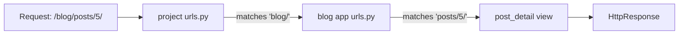

# URLs & Views

In Phase 1 you got a project running and met the **MTV** flow: a request comes in, a *view* handles it,
a *template* renders the result. This phase is about the first half of that journey — the part that turns
a URL someone typed into a specific chunk of your code, and that chunk into something the browser can show.

Here's the mental model to hold onto before any code: **a web request is just a string (a URL) arriving
at your server, and your job is to match that string to a function and have that function hand back a
response.** Django splits that into two clean jobs. *URL routing* answers "which function handles this
URL?" *Views* answer "what does that function actually do?" Everything in this phase is one of those two
jobs. Once you see the request flow as `URL → match → view → response`, Django's routing stops looking
like magic and starts looking like a lookup table with a function on the other end.

We'll build this around a blog. Our star is the `Post` — for now we'll just return simple text responses,
because templates (the pretty HTML part) come in Phase 5 and the actual `Post` data comes from the ORM in
Phase 3. Keeping responses plain here lets us focus on routing without distraction.

## The URLconf — Django's routing table

📝 **The URLconf** is just a Python file (`urls.py`) containing a list called `urlpatterns`. Each entry is
a `path(...)` call that says "if the URL looks like *this*, call *that* view." Django walks the list top to
bottom on every request and uses the **first** pattern that matches.

The clever part is that Django uses *two layers* of URLconf. The **project** has one `urls.py` (the front
door), and it `include()`s a separate `urls.py` from each **app**. That keeps routing modular: your blog
app owns all its own URLs, and the project just decides what prefix to mount them under. Move the app to
another project and its routes come with it.



Here's the **project** `urls.py` (created for you when you ran `startproject` — you add the `include` line):

```python
# myblog/urls.py  — the project-level URLconf (the front door)
from django.contrib import admin
from django.urls import path, include

urlpatterns = [
    path("admin/", admin.site.urls),
    path("blog/", include("blog.urls")),   # hand anything starting with blog/ to the blog app
]
```

*What just happened:* `urlpatterns` is the list Django checks for every incoming request. The `admin/`
line is what makes the admin site work (Phase 4). The line that matters here is
`path("blog/", include("blog.urls"))` — it says "for any URL beginning with `blog/`, strip that prefix and
let the `blog` app's own `urls.py` handle the rest." Django doesn't import the blog routes itself; it
*delegates*. The project never needs to know the blog's internal URLs.

Now the **app** `urls.py`. ⚠️ Unlike the project file, this one does **not** exist by default — you create
it yourself inside the app folder:

```python
# blog/urls.py  — the blog app's own URLconf
from django.urls import path
from . import views

urlpatterns = [
    path("posts/", views.post_list),              # /blog/posts/
    path("posts/<int:post_id>/", views.post_detail),  # /blog/posts/5/
]
```

*What just happened:* We imported the app's `views` module (the functions live there, next section) and
listed two routes. Because these are mounted under `blog/` by the project, the *full* URLs are
`/blog/posts/` and `/blog/posts/5/` — the app file only ever describes the part *after* its prefix. The
`<int:post_id>` bit is a captured parameter, which we'll unpack shortly. New developers forget to create
this file constantly and then wonder why nothing routes; if you get a 404 on a URL you "added," check that
the app `urls.py` exists and that the project actually `include()`s it.

💡 The convention is one `urls.py` per app, included by the project. It feels like extra ceremony for a
two-route blog, but it's the thing that keeps a 40-app project from collapsing into one unreadable routing
file.

## Function views — request in, response out

📝 **A view is a plain Python function that takes an `HttpRequest` as its first argument and returns an
`HttpResponse`.** That's the entire contract. Django builds the request object for you, calls your view,
and sends whatever you return back to the browser. No special base class, no registration — if it takes a
request and returns a response, it's a view.

Let's write the two views our `blog/urls.py` referred to. We'll keep the responses as bare text for now —
real HTML and real `Post` data arrive in later phases.

```python
# blog/views.py
from django.http import HttpResponse


def post_list(request):
    return HttpResponse("All blog posts will be listed here.")


def post_detail(request, post_id):
    return HttpResponse(f"You asked for post #{post_id}.")
```

*What just happened:* Both functions take `request` first — that's the `HttpRequest` Django hands every
view, carrying everything about the incoming call. `post_list` ignores it and returns a fixed message;
`post_detail` takes a second argument, `post_id`, and echoes it back. `HttpResponse("...")` wraps a string
into a proper HTTP response (status 200, with headers) that the browser can render. That round trip —
function called with a request, string wrapped in a response — *is* a working web page in Django. Visit
`/blog/posts/` after starting the dev server and you'll see the first message in your browser.

The flow in plain terms: Django matched the URL, looked up the view in your URLconf, called it with the
request, and shipped your returned response back. That's the whole `URL → view → response` loop running.

## URL parameters — capturing pieces of the path

A blog with a single post page is no blog. You need `/blog/posts/1/`, `/blog/posts/2/`, and so on, all
handled by *one* view that knows *which* post was asked for. That's what the angle-bracket syntax in the
URLconf does — it captures part of the URL and passes it to your view as an argument.

📝 `path("posts/<int:post_id>/", views.post_detail)` reads as: match `posts/`, then a run of digits, then a
slash. Capture those digits, convert them to an `int`, and pass them to the view under the name `post_id`.
The `int:` part is a **path converter** — it both restricts what matches (only digits) *and* controls the
Python type your view receives.

```python
# blog/urls.py
urlpatterns = [
    path("posts/", views.post_list),
    path("posts/<int:post_id>/", views.post_detail),
]

# blog/views.py
def post_detail(request, post_id):
    # post_id is already an int here — Django converted it
    return HttpResponse(f"Showing post #{post_id} (type: {type(post_id).__name__})")
```

*What just happened:* When a request for `/blog/posts/5/` comes in, Django matches the second pattern,
pulls `5` out of the URL, runs it through the `int` converter, and calls `post_detail(request, post_id=5)`.
Inside the view, `post_id` is the integer `5`, not the string `"5"` — the converter did the casting. Visit
`/blog/posts/5/` and you'll see `Showing post #5 (type: int)`. Try `/blog/posts/abc/` and you'll get a 404,
because `int:` refuses to match non-digits — the bad input never even reaches your view.

The common converters: `<int:x>` for whole numbers, `<str:x>` for a non-empty text segment (no slashes),
`<slug:x>` for slug strings like `my-first-post`, and `<uuid:x>` for UUIDs. The flow is always the same:
the URL pattern captures a typed value, and your view receives it as a named argument it can trust.

## The request and response objects

We've been treating `request` as a placeholder, but it's the most useful object in the view. 📝 **The
`HttpRequest` carries everything about the incoming call** — the HTTP method (`request.method`), query-string
data (`request.GET`), submitted form data (`request.POST`), the logged-in user (`request.user`), headers,
cookies, and more. On the way out, you return an `HttpResponse` (plain text/HTML), a `JsonResponse` (for
APIs), or — most often, once we have templates — the result of `render(...)`.

Here's a view that actually reads from the request. We'll let visitors filter posts with a query string
like `/blog/posts/?tag=python`:

```python
# blog/views.py
from django.http import HttpResponse


def post_list(request):
    tag = request.GET.get("tag")          # ?tag=python  ->  "python"; missing -> None
    if tag:
        body = f"Posts tagged '{tag}' (method: {request.method})"
    else:
        body = f"All posts (method: {request.method})"
    return HttpResponse(body)
```

*What just happened:* `request.GET` is a dict-like object holding the query string (the part after `?`).
Using `.get("tag")` instead of `request.GET["tag"]` means a *missing* `tag` returns `None` rather than
crashing — exactly what you want, since you can't assume the visitor supplied it. `request.method` is the
HTTP verb, `"GET"` for a normal page visit. Visit `/blog/posts/?tag=python` and you'll see the filtered
message; visit `/blog/posts/` and you'll see the catch-all. The request object is how your view *listens*;
the response is how it *answers*.

The other half of this is the not-found case. When someone asks for a post that doesn't exist, you owe them
an honest 404, not a 500 crash. Django ships a helper for exactly this — and it'll be your default the
moment we have a database in Phase 3:

```python
# blog/views.py  (sketch — Post arrives in Phase 3)
from django.shortcuts import get_object_or_404
from .models import Post


def post_detail(request, post_id):
    post = get_object_or_404(Post, id=post_id)   # found -> the Post; missing -> raises Http404
    return HttpResponse(f"Showing: {post.title}")
```

*What just happened:* `get_object_or_404` tries to fetch one `Post` with that `id`. If it exists, you get
the object back. If it doesn't, the helper raises `Http404`, and Django turns that into a proper 404 page
automatically — you never write the "if missing, build an error response" boilerplate yourself. ⚠️ This is
shown as a preview; it won't run until `Post` exists as a model (Phase 3). The pattern, though, is the one
you'll reach for in nearly every detail view you ever write.

## Named URLs & `reverse` — never hardcode a URL

There's one habit that quietly rots a codebase: writing URLs as literal strings all over your views and
templates. The day you decide `/blog/posts/5/` should become `/blog/articles/5/`, you have to hunt down
every place that string appears. Miss one, and you ship a broken link.

💡 Django's fix is to give each route a **name** and refer to it *by that name* instead of by its path. You
add `name=` to a `path(...)`, then build URLs with `reverse()` in Python or the `` tag in
templates. Change the URL pattern later and every reference updates itself, because nothing hardcoded the
path in the first place.

```python
# blog/urls.py
from django.urls import path
from . import views

urlpatterns = [
    path("posts/", views.post_list, name="post_list"),
    path("posts/<int:post_id>/", views.post_detail, name="post_detail"),
]
```

*What just happened:* We tagged each route with a `name`. The path strings (`"posts/"`,
`"posts/<int:post_id>/"`) are now an implementation detail; the rest of the codebase will refer to these
routes as `"post_list"` and `"post_detail"`, which are stable even if the paths change.

Now build a URL *from* a name instead of typing it:

```python
# blog/views.py
from django.urls import reverse
from django.http import HttpResponse


def post_list(request):
    # build the URL for post #5 by NAME, not by hardcoding "/blog/posts/5/"
    link = reverse("post_detail", args=[5])
    return HttpResponse(f"The URL for post 5 is: {link}")
```

*What just happened:* `reverse("post_detail", args=[5])` asks Django "what's the actual URL for the route
named `post_detail`, with `post_id=5`?" and gets back `/blog/posts/5/`. You never wrote that string. If you
later edit the pattern to `articles/<int:post_id>/`, this exact call starts returning `/blog/articles/5/`
with zero other changes. ⚠️ The bug this prevents is real and common: hardcoded URLs scattered across
views and templates that silently break when a path changes. Name your routes from day one — it costs one
keyword and saves you a link-hunt later. (In templates you'll use ``, which we'll
meet in Phase 5.)

💡 Step back and look at what you can now do: a URL arrives, the URLconf matches it (possibly across the
project-to-app `include` boundary), a view function runs with a trustworthy `request` and any captured
parameters, and it returns a response — referring to other URLs by name so nothing hardcodes a path. That's
the complete `URLconf → view → response` loop. The one thing still missing is *real data*: our views return
made-up strings because there's no `Post` in a database yet. That's the entire job of the next phase — the
ORM, where `Post` becomes a real model backed by a real table.

## Recap

1. 📝 **The URLconf** is `urlpatterns` — a list of `path(...)` entries in `urls.py` that Django checks top
   to bottom, using the first match to pick a view.
2. The **project** `urls.py` `include()`s each **app's** `urls.py`, keeping routing modular. The app file
   describes only the part of the URL after its mounted prefix — and you must create it yourself.
3. 📝 **A view** is a function taking an `HttpRequest` and returning an `HttpResponse`. That's the whole
   contract; no base class required.
4. **URL parameters** like `<int:post_id>` capture a typed segment from the path and pass it to the view as
   a named argument — and reject input of the wrong type with a 404 before your view runs.
5. 📝 The **request** carries method, `GET`/`POST` data, the user, and more; you return
   `HttpResponse`/`JsonResponse`/`render(...)`. `get_object_or_404` handles the missing-object case cleanly.
6. 💡 **Name your URLs** (`name=`) and build them with `reverse()`/`` — never hardcode paths, so a
   URL can change without breaking every link to it.

You now own the request half of MTV: a URL becomes a view becomes a response. Next, those views need real
data to return, which means modeling `Post` as a database table — the ORM, in Phase 3.

## Quick check

Test yourself on the one idea that ties this phase together — how a request finds its view and gets a
response:

```quiz
[
  {
    "q": "What is the minimum contract for a Django function view?",
    "choices": [
      "It takes an HttpRequest as its first argument and returns an HttpResponse",
      "It must subclass django.views.View and define a get() method",
      "It must be registered in settings.py before Django will call it",
      "It returns a template name as a string and Django renders it automatically"
    ],
    "answer": 0,
    "explain": "A view is just a function that accepts the HttpRequest Django passes in and returns an HttpResponse. No base class, no registration — the URLconf points at it and Django calls it."
  },
  {
    "q": "In the pattern `path(\"posts/<int:post_id>/\", views.post_detail)`, what does the `int:` part do?",
    "choices": [
      "Restricts the match to digits and passes post_id to the view as a Python int",
      "Only documents the expected type; the view still receives a string",
      "Limits post_id to a maximum of one integer digit",
      "Tells Django to look up the post in the database before calling the view"
    ],
    "answer": 0,
    "explain": "`int:` is a path converter. It both restricts what matches (only digits, so non-numbers 404 before the view runs) and converts the captured value, so the view receives an actual int."
  },
  {
    "q": "Why use `name=` on a path plus `reverse()`/`` instead of writing the URL string directly?",
    "choices": [
      "So you refer to routes by a stable name and the path can change without breaking every link",
      "Because hardcoded URL strings are not allowed in Django and will raise an error",
      "Because reverse() makes the page load faster than a literal URL",
      "Because named URLs are the only way to capture parameters from the path"
    ],
    "answer": 0,
    "explain": "Naming a route lets the rest of the code reference it by name. Change the pattern's path later and every reverse()/ call updates itself — no hunting for hardcoded strings that would otherwise silently break."
  }
]
```

---

[← Phase 1: What Django Is & Your First Project](01-what-django-is.md) · [Guide overview](_guide.md) · [Phase 3: Models & the ORM →](03-models-and-the-orm.md)
