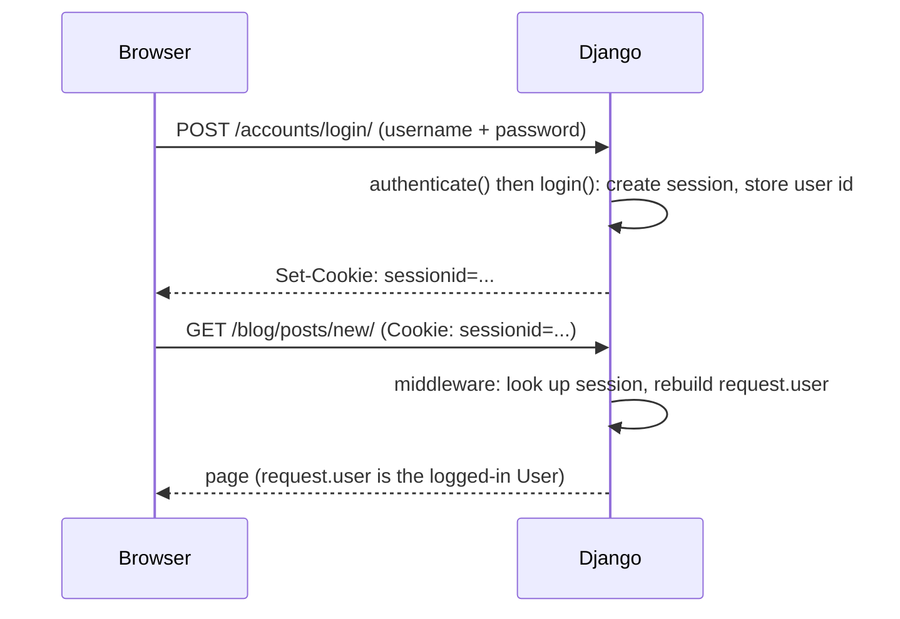

# Users, Auth & Sessions

By now your blog has posts, an admin, templates, and forms. There's one thing every real blog needs that
we've been quietly ignoring: knowing *who* is on the other end. Anonymous visitors should be able to read
posts, but only logged-in users should create them or leave comments. That's the entire job of this phase.

Here's the mental model to hold before any code, because it's the one thing that makes the rest fall into
place. Login is really **two separate questions, asked at two separate moments.** First, *who are you?* —
that's **authentication** (authN): proving identity, usually with a username and password. Second, *are you
allowed to do this?* — that's **authorization** (authZ): checking permissions once we already know who you
are. They sound like one idea ("logging in") but they're not, and Django gives you distinct tools for each.
If that split feels fuzzy, the dedicated guide [/guides/auth-vs-authz](/guides/auth-vs-authz) untangles it
properly; this phase shows how Django implements both.

The good news: you write almost none of this yourself. Django ships a complete auth system, and a big
reason teams reach for Django at all is that "users can sign up and log in" goes from a multi-week project
to an afternoon.

## The built-in auth system

📝 **`django.contrib.auth` is a full authentication system that comes turned on in every new project.** It
gives you a `User` model (a real database table for accounts), password hashing done correctly, login and
logout views, a permissions framework, and the session machinery that remembers a logged-in user across
requests. You don't install it or build it — it's already in `INSTALLED_APPS` when `startproject` runs, and
its tables were created the first time you ran `migrate` back in Phase 1.

Take the password part seriously, because it's the piece beginners most often get wrong by rolling their
own. ⚠️ **Django never stores a password as plain text.** When a user signs up, Django runs the password
through a one-way hash (PBKDF2 by default, with a per-user salt and many iterations) and stores only the
hash. At login it hashes the entered password and compares hashes — the original is never recoverable, even
by you. That is exactly how passwords *should* be stored, and getting it right by hand is a minefield; see
[/guides/how-passwords-are-stored](/guides/how-passwords-are-stored) for why. The lesson: let Django's auth
system own passwords. Don't touch the hash, don't write your own.

So the two halves map cleanly onto Django pieces: **authN** is the `User` model + login views + password
hashing; **authZ** is the permissions and the `@login_required`/permission checks we'll get to. Same login,
two jobs.

## The User model & `request.user`

📝 **The `User` model (`django.contrib.auth.models.User`) is just a Django model like your `Post`** — a
table with fields. The ones you'll use constantly: `username`, `password` (the hash, never the plain text),
`email`, plus the flags `is_active`, `is_staff` (can reach the admin), and `is_superuser` (can do
everything). It's an ORM model, so everything you learned in Phases 3 and 7 applies — you can query it,
filter it, relate your `Post` to it with a `ForeignKey`.

The part that ties auth into your views is one attribute. 📝 **Every request carries `request.user`** —
Django's auth middleware attaches it before your view runs. If someone is logged in, it's their `User`
object. If nobody is logged in, it's a special `AnonymousUser` instead of `None`, so you never have to
null-check it. Both kinds answer `.is_authenticated`: `True` for a real logged-in user, `False` for
`AnonymousUser`.

```python
# blog/views.py
from django.http import HttpResponse


def whoami(request):
    if request.user.is_authenticated:
        return HttpResponse(f"You are logged in as {request.user.username}.")
    return HttpResponse("You are browsing anonymously.")
```

*What just happened:* We read `request.user` without ever fetching it ourselves — the auth middleware put
it there. `is_authenticated` is the clean way to branch: it's `True` for a logged-in `User` and `False` for
the `AnonymousUser` that anonymous visitors get. Notice we never wrote `if request.user is None` — because
it's never `None`, the `AnonymousUser` stand-in means `request.user.username` and `request.user.is_authenticated`
are always safe to read. This `is_authenticated` check is the building block under everything else in this
phase.

## Login & logout

You could write a login view by hand, but you shouldn't — Django ships them. 📝 **`django.contrib.auth`
includes ready-made views (`LoginView`, `LogoutView`) and a URLconf you can wire in with one line.** Under
those views sit three functions you'll occasionally call directly: `authenticate(username, password)`
checks credentials and returns the `User` (or `None`), `login(request, user)` starts a session for them,
and `logout(request)` ends it.

Wire the built-in auth URLs into your project:

```python
# myblog/urls.py
from django.contrib import admin
from django.urls import path, include

urlpatterns = [
    path("admin/", admin.site.urls),
    path("blog/", include("blog.urls")),
    path("accounts/", include("django.contrib.auth.urls")),  # login/, logout/, password reset, etc.
]
```

*What just happened:* That last line mounts Django's entire auth URLconf under `/accounts/`. You instantly
get `/accounts/login/`, `/accounts/logout/`, and the password-reset flow — routes and views you didn't
write. `LoginView` expects a template at `registration/login.html`, so you supply the look and feel while
Django handles the credential-checking and session-starting logic.

Here's that minimal login template — a plain form posting back to the same login URL:

```html
<!-- templates/registration/login.html -->
<h1>Log in</h1>
<form method="post">
  
  {{ form.as_p }}
  <button type="submit">Log in</button>
</form>
```

*What just happened:* `LoginView` hands the template a ready-built `form` (username + password fields),
which `{{ form.as_p }}` renders — the same `Form` machinery from Phase 6. `` is mandatory
on any Django POST form; without it the submission is rejected. When the user submits valid credentials,
`LoginView` calls `authenticate` and `login` for you, starts the session, and redirects them onward. You
wrote markup; Django did the auth.

⚠️ **One decision to make on day one, not later: whether you need a custom user model.** If you'll ever
want to log in by email instead of username, or add fields to the account itself, set `AUTH_USER_MODEL` to
your own model *before your first migration*. Swapping the user model on a project that already has data and
tables pointing at the default `User` is genuinely painful — migrations, foreign keys, and third-party apps
all assume the original. The default `User` is fine for many blogs; just make the call deliberately at the
start rather than discovering the constraint after launch.

## Authorization: protecting views

Now the second question — *are you allowed?* This is where we lock down post creation and commenting so
only logged-in users can reach them.

📝 **`@login_required` is a decorator that gates a view behind being logged in.** Slap it on a function
view and Django checks `request.user.is_authenticated` before the view runs; anonymous visitors get
bounced to the login page (carrying a `?next=` so they return after logging in), and only authenticated
users get through.

```python
# blog/views.py
from django.contrib.auth.decorators import login_required
from django.shortcuts import render, redirect
from .forms import PostForm


@login_required
def post_create(request):
    if request.method == "POST":
        form = PostForm(request.POST)
        if form.is_valid():
            post = form.save(commit=False)
            post.author = request.user      # tie the new post to whoever is logged in
            post.save()
            return redirect("post_detail", post_id=post.id)
    else:
        form = PostForm()
    return render(request, "blog/post_form.html", {"form": form})
```

*What just happened:* The decorator runs *before* the view body. An anonymous visitor never reaches the
form — they're redirected to `/accounts/login/?next=/blog/posts/new/`, and after logging in they land back
on the create page. Inside the view we trust `request.user` is a real logged-in `User`, so
`post.author = request.user` safely stamps the post with its creator. This is authN (the decorator) and a
small piece of authZ (only logged-in users create) working together. The same pattern protects a
comment-submission view: decorate it, attach `comment.author = request.user`.

For class-based views (Phase 9) the equivalent is the `LoginRequiredMixin` — same effect, mixed into the
class instead of decorating a function.

Sometimes "logged in" isn't enough; you need "logged in *and* allowed to do this specific thing." That's
**permissions**. Django auto-creates add/change/delete/view permissions for every model, you can group them
(a "Editors" group), and you check them with `user.has_perm("blog.add_post")` or the
`@permission_required("blog.add_post")` decorator. The coarse flags `is_staff` and `is_superuser` are the
blunt instruments above that. Use the lightest tool the job needs: `@login_required` for "any user,"
permissions for "users with this capability," `is_staff` for "site admins."

Authorization shows up in templates too — you often want to *show* the "New post" link only to people who
can use it:

```html

  <a href="">Write a new post</a>
  <span>(you can publish)</span>

  <a href="">Log in to write</a>

```

*What just happened:* Django's template context makes `user` and `perms` available everywhere (via a
context processor that's on by default). `` hides the create link from
anonymous visitors, and `` checks a specific permission inline. ⚠️ Hiding a
link is UX, **not** security — a determined visitor can still type the URL. The real protection is the
`@login_required`/`@permission_required` on the *view*. Template checks make the UI honest; view decorators
make it safe. Always do both, and never rely on the template alone.

## Sessions under it all

Step back and ask the question this whole phase glosses over: HTTP forgets you between requests, so how
does Django know, on request #47, that you logged in back on request #3?

📝 **The answer is sessions, and it's the same mechanism you saw in the servlet world** — Django just wraps
it. On a successful `login()`, Django creates a **session** stored server-side (in your database by
default), generates a hard-to-guess session id, and sends it to the browser as a `sessionid` cookie. On
every later request the browser returns that cookie automatically; Django's middleware reads the id, looks
up the session, finds the stored user id, and *reconstructs* `request.user` for you. That's where
`request.user` actually comes from — it's not magic, it's a cookie-keyed lookup. If sessions as a concept
are still hazy, the bare mechanism is laid out in [/guides/the-servlet-api](/guides/the-servlet-api);
Django's `sessionid`/server-store model sits directly on that idea.



A few things to keep honest about session security, because the cookie is the keys to the account:

- ⚠️ **Serve over HTTPS** and set `SESSION_COOKIE_SECURE = True` so the session cookie never travels over
  plain HTTP where it could be sniffed. Django also marks it `HttpOnly` by default, keeping JavaScript from
  reading it.
- ⚠️ **Set a sensible session expiry** so an abandoned login on a shared computer doesn't stay valid
  forever. Django regenerates the session id on login, which blunts session-fixation attacks.
- ⚠️ **Let Django hash passwords** — never store or compare plain text. We said it earlier; it's worth
  repeating because it's the mistake with the worst blast radius.

💡 Look at what you got for the price of a few lines of wiring: real user accounts, correctly hashed
passwords, login/logout, per-view and per-permission access control, and a battle-tested session layer
underneath. That's a complete, secure auth system in roughly an afternoon — and it's precisely the kind of
"batteries included" that makes teams pick Django in the first place. Next phase we move from function
views to class-based views and the Django REST Framework, where `LoginRequiredMixin` and these same auth
ideas reappear with API-shaped ergonomics.

## Recap

1. 📝 **`django.contrib.auth` is a full auth system that's already on** — a `User` model, correct password
   hashing (PBKDF2), login/logout views, permissions, and sessions, all without you building them.
2. **AuthN vs authZ are two jobs:** authentication proves *who you are* (login + password hashing);
   authorization decides *what you're allowed to do* (`@login_required`, permissions, `is_staff`).
3. 📝 **`request.user` is on every request** — a logged-in `User` or an `AnonymousUser` (never `None`).
   Branch on `request.user.is_authenticated`.
4. **Wire login with `include("django.contrib.auth.urls")`** and a `registration/login.html` template;
   protect views with `@login_required` (or `LoginRequiredMixin` for CBVs) and permissions for finer
   control. Template checks like `` are UX, not security.
5. 📝 **Sessions are the mechanism underneath:** `login()` stores a server-side session and sets a
   `sessionid` cookie; middleware reads it each request to rebuild `request.user`. ⚠️ Use HTTPS, sensible
   expiry, and let Django hash passwords — never store plain text.

## Quick check

Test yourself on the ideas that have to stick — the authN/authZ split and how Django remembers a login:

```quiz
[
  {
    "q": "What does the @login_required decorator do to a function view?",
    "choices": [
      "Redirects anonymous visitors to the login page and only runs the view for authenticated users",
      "Hashes the user's password before the view runs",
      "Checks a specific permission like blog.add_post before allowing access",
      "Hides links to the view in templates for logged-out users"
    ],
    "answer": 0,
    "explain": "@login_required checks request.user.is_authenticated before the view body. Anonymous visitors are redirected to login (with ?next=); only logged-in users reach the view. Specific capabilities are permissions; hiding links is a template/UX concern, not view protection."
  },
  {
    "q": "After a user logs in, how does Django know on a later request that they're still logged in?",
    "choices": [
      "It stores a server-side session and sends a sessionid cookie; middleware reads the cookie each request to rebuild request.user",
      "It keeps the username in a global variable on the server",
      "It puts the plaintext password in a cookie and re-checks it every request",
      "HTTP keeps the connection open, so the server never forgets the user"
    ],
    "answer": 0,
    "explain": "login() creates a server-side session and sets a sessionid cookie. The browser returns the cookie automatically; Django's middleware looks up the session by id and reconstructs request.user. The cookie carries only the opaque id, never the password."
  },
  {
    "q": "Why is hiding a 'New post' link with  not enough to protect post creation?",
    "choices": [
      "Hiding the link is only UX — a visitor can still type the URL, so the view itself needs @login_required",
      "Template tags can't read request.user, so the check never runs",
      "Anonymous users can't render templates at all",
      "It is enough; no view-level check is needed once the link is hidden"
    ],
    "answer": 0,
    "explain": "A hidden link just removes the UI affordance; the URL still exists and can be requested directly. Real protection lives on the view (@login_required / @permission_required). Do both: template checks for honest UI, view decorators for actual security."
  }
]
```

---

[← Phase 7: The ORM, Deeper](07-the-orm-deeper.md) · [Guide overview](_guide.md) · [Phase 9: Class-Based Views & Django REST Framework →](09-class-based-views-and-drf.md)
