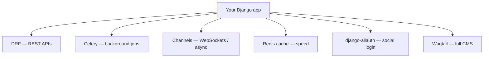

# Production & Where to Go Next

Stop for a second and look at the pile of things you can do now. You can lay out a Django project and its apps, route a URL to a view, model your data and migrate it into real tables, query that data through the ORM without writing SQL, manage it all through the famous auto-generated admin, render it with templates, accept and validate user input through forms with CSRF protection baked in, dodge the N+1 trap, log people in with the built-in auth system, and stand up a clean API on top of it with class-based views and Django REST Framework. And you can prove the whole thing works with Django's test framework.

That's not a toy. That's a real, database-backed, authenticated web application — and the reason it's *yours* is that you understand the **MTV structure** holding it together. Every "magic" thing Django did — the admin appearing, auth "just working," migrations writing themselves — fell out of one idea: your **models drive everything**, and conventions fill in the rest.

So this last phase isn't another subsystem. It's getting the thing onto the internet, the one checklist that bites everyone, an honest map of the ecosystem, and a clear answer to "what do I build now?"

## Deploying it — gunicorn, nginx, and static files

📝 All this time you've run `python manage.py runserver`. Here's the honest truth nobody says loudly enough on day one: **`runserver` is a development server only.** It's single-process, not hardened, and not built for real traffic. The Django docs themselves tell you never to use it in production. So the first move is swapping it out.

In production you run Django through a real **WSGI server** like **gunicorn** (or **uvicorn** if you're using Django's async support), with multiple worker processes so requests run in parallel:

```bash
# Your Django project ships a wsgi.py — point gunicorn at it:
gunicorn myproject.wsgi:application --workers 4 --bind 0.0.0.0:8000
```

⚠️ You don't expose gunicorn straight to the world. In front of it goes a **reverse proxy** like **nginx**, which handles TLS, buffers slow clients, serves files efficiently, and forwards the rest to your workers.

That brings us to the thing that trips up *every* first Django deploy: **static files**. In development, `runserver` quietly serves your CSS, JS, and images for you. In production it does not — Django is not a file server. You have to gather every static file into one place and let something else serve it:

```bash
# Collect CSS/JS/images from every app into STATIC_ROOT:
python manage.py collectstatic
```

Then serve that folder one of two common ways: **WhiteNoise** (a small package that lets gunicorn serve static files directly — perfect for simple deploys) or a proper **CDN / object storage** for bigger sites. And put your data on a **managed Postgres** instance, not the SQLite file you've been developing against.

The cleanest way to ship all of this as one unit is **Docker**, so the same image runs on your laptop and your server. Two other guides cover this territory end to end: [Ship Your Side Project](/guides/ship-your-side-project) walks the full deployment path, and [Docker Without the Magic](/guides/docker-without-the-magic) makes the container part stop feeling like incantations.

## The deploy security checklist

⚠️ This is the section that bites everyone exactly once. Django's defaults are tuned for *development convenience*, and a few of them are dangerous on the open internet. Walk this list every single time before you go live:

- **`DEBUG = False`.** With `DEBUG = True`, Django shows a full stack trace — including settings and snippets of your code — to anyone who triggers an error. Leaving it on in production is the classic Django security leak.
- **Set `ALLOWED_HOSTS`.** List the real domain(s) your site answers on. Django refuses requests with a `Host` header that isn't on the list. (When `DEBUG` is `False`, an empty `ALLOWED_HOSTS` means your site serves *nothing*.)
- **Load `SECRET_KEY` from the environment.** Never commit it to your repo. Read it from an env var so the real key lives only on the server.
- **Turn on the HTTPS settings.** `SECURE_SSL_REDIRECT`, `SESSION_COOKIE_SECURE`, and `CSRF_COOKIE_SECURE` push everything onto HTTPS and stop cookies from leaking over plain HTTP.
- **Run the built-in auditor:** `python manage.py check --deploy`. Django inspects your settings and warns you about exactly these issues. It's the cheapest safety net you have — run it before every deploy.

💡 You don't have to *memorize* this list. You have to remember that `check --deploy` exists and run it. Django will tell you what you missed.

## The ecosystem — where to go from here

Django is the trunk; the ecosystem is a set of well-maintained branches you bolt on when you need them. Each one is "add a capability by adding a package," the same move you already made with DRF:



- **DRF** — building APIs (you met it in Phase 9).
- **Celery** — heavy, retryable, or scheduled **background tasks**, fronted by a broker like Redis.
- **Channels** — **WebSockets** and async, for live updates and real-time features.
- **caching** — drop **Redis** in front of expensive views and queries when you need speed.
- **django-allauth** — **social login** (Google, GitHub, etc.) without hand-rolling OAuth.
- **wagtail** — a polished **CMS** built on Django when you need editable content pages.

💡 The pattern never changes: find the well-maintained package, add it to your project, follow its setup. You don't rebuild these by hand — that's the whole point of batteries-included.

## An honest framework map — and what to build

Django is a sharp tool for a particular shape of problem. Knowing when *not* to reach for it is part of knowing it well:

- **Django** when you want a **full web app** — an admin, auth, server-rendered pages, a mature ORM, a thousand conventions — or a solid API on top via DRF. If you'd otherwise rebuild half of Django by hand, use Django.
- **[FastAPI](/guides/fastapi-from-zero)** when you want a **lean, async API** and you're happy to assemble the rest yourself.
- **Flask** when the job is genuinely **tiny** — a small service or a quick prototype where Django's machinery is more than you need.

As for what to build: take the **blog** you've grown across this whole guide and carry it all the way home. Add real authentication, lean on the admin to manage content, expose a **DRF API** over the posts, write a **test suite** that covers the important paths — then **deploy it** with `DEBUG = False`, `collectstatic` run, and `check --deploy` clean. That one project exercises nearly everything you learned here.

When you want the canonical reference, the **official Django documentation and tutorial** are genuinely excellent — thorough, example-driven, and maintained by the people who build the framework. Bookmark them and reach for them often.

And remember the through-line: batteries-included was never magic. The admin, the auth, the migrations, the "it just appears" — every one of those came from the **model-driven conventions** you now understand from the inside. You can read what's underneath, build a real app on top, and reason about it when it breaks. Go finish the blog, ship it, and send someone the link. You're ready.

## Recap

1. **You can build and ship a real Django app** — database-backed, admin-managed, authenticated, tested, with a DRF API — and you understand the MTV structure underneath every piece.
2. **`runserver` is dev-only.** In production, run Django through gunicorn (or uvicorn for async) with multiple workers, behind a reverse proxy like nginx, ideally packaged in Docker.
3. **Serve static files properly.** Django doesn't serve static files in production — run `collectstatic` and hand them to WhiteNoise or a CDN, and use a managed Postgres database.
4. **Run the security checklist every deploy:** `DEBUG = False`, set `ALLOWED_HOSTS`, `SECRET_KEY` from env, HTTPS + secure-cookie settings, and `python manage.py check --deploy`.
5. **Grow with the ecosystem** — DRF for APIs, Celery for background jobs, Channels for WebSockets, Redis for caching, django-allauth for social login, Wagtail for a CMS. Add a capability by adding a package.
6. **Pick the right tool and finish one thing** — Django for full apps, FastAPI for lean async APIs, Flask for tiny services. Carry the blog to a deployed, authenticated, tested app. The magic was the model-driven conventions all along.

## Quick check

Test yourself on the decisions that matter most as you leave this guide:

```quiz
[
  {
    "q": "Why shouldn't you use `python manage.py runserver` in production?",
    "choices": [
      "It's a single-process development server, not hardened or built for real traffic — use a WSGI server like gunicorn behind nginx",
      "It only works on Linux",
      "It disables the Django admin",
      "It was removed in recent Django versions"
    ],
    "answer": 0,
    "explain": "runserver is for development only. In production you run Django through gunicorn (or uvicorn for async) with multiple workers, behind a reverse proxy like nginx."
  },
  {
    "q": "Your deployed site loads but all the CSS and images are missing (404s). What's the most likely cause?",
    "choices": [
      "DEBUG is set to True",
      "You didn't run `collectstatic` and configure something (WhiteNoise or a CDN) to serve static files — Django doesn't serve them in production",
      "ALLOWED_HOSTS is empty",
      "You forgot to run migrations"
    ],
    "answer": 1,
    "explain": "runserver quietly serves static files in development; production does not. You must run collectstatic and serve STATIC_ROOT via WhiteNoise or a CDN."
  },
  {
    "q": "Which command audits your settings for common production security problems before you deploy?",
    "choices": [
      "python manage.py migrate",
      "python manage.py collectstatic",
      "python manage.py check --deploy",
      "python manage.py runserver --prod"
    ],
    "answer": 2,
    "explain": "`check --deploy` inspects your settings and warns about issues like DEBUG=True, a missing ALLOWED_HOSTS, and insecure cookie settings. Run it before every deploy."
  }
]
```

---

[← Phase 10: Testing & Project Structure](10-testing-and-project-structure.md) · [Guide overview](_guide.md)