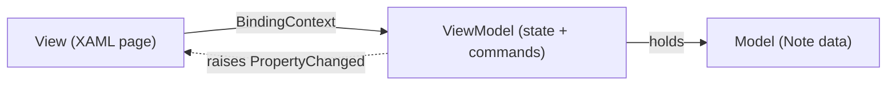

# The MVVM Pattern

In [Phase 3](03-controls-and-data-binding.md) you wired a control to a property with `{Binding}` and hit the wall everyone hits: you changed the property in code, and the screen didn't budge. The binding fired *once*, at startup, then went quiet. This phase is the fix - and the moment your notes app stops being a toy and starts being structured like a real app.

## The mental model: three roles, one rule

MVVM stands for **Model–View–ViewModel**. It sounds like architecture-astronaut jargon, but it's three plain ideas:

- **View** - your XAML page. It describes what's on screen. Nothing more.
- **ViewModel** - a plain C# class that holds the page's **state** (the data it shows) and its **commands** (what the buttons do). It knows nothing about XAML, buttons, or labels.
- **Model** - your actual data. For the notes app, that's a `Note` class with a `Title`.

The View binds to the ViewModel. You set the ViewModel as the page's `BindingContext`, and every `{Binding Title}` in the XAML reads from a `Title` property on the ViewModel. The arrows only point one way: **the View asks the ViewModel for data; the ViewModel never reaches up and touches the View.**

> 💡 The whole payoff is in that last sentence. Because the ViewModel has **no UI dependency**, you can create one in a unit test, call its `AddNote` command, and assert that the notes collection grew - no screen, no emulator, no tapping. A ViewModel you can test without a UI is the entire point of MVVM.



Hold "View shows, ViewModel decides, Model is the data" and everything below is detail.

## Why the screen didn't update: INotifyPropertyChanged

A binding isn't magic. When you write `{Binding Title}`, MAUI reads `Title` once and shows it. For MAUI to *re-read* it when the value changes, the object holding `Title` has to **announce the change** - the contract for that is an interface called `INotifyPropertyChanged`: one event, `PropertyChanged`, raised whenever a bound property's value changes.

Here's that contract done by hand, for a single `Title` property:

```csharp
using System.ComponentModel;

public class NoteViewModel : INotifyPropertyChanged
{
    private string _title = "";
    public string Title
    {
        get => _title;
        set
        {
            _title = value;
            PropertyChanged?.Invoke(this, new PropertyChangedEventArgs(nameof(Title)));
        }
    }

    public event PropertyChangedEventHandler? PropertyChanged;
}
```

*What just happened:* the setter doesn't only store the new value - it fires `PropertyChanged`, naming `Title` as the thing that changed. Any `{Binding Title}` in the XAML hears its name called and re-reads the property. That's the missing piece from Phase 3 - the binding wasn't broken, the object just never told anyone its value had moved.

That's a lot of ceremony for **one** property. A notes page with a title, a body, a "saving…" flag, and a selected note means writing that pattern four times - and one typo in a `nameof` gives a silent bug where the screen won't refresh for that field. Nobody writes it by hand anymore.

## The modern way: CommunityToolkit.Mvvm

`CommunityToolkit.Mvvm` is a small, official NuGet package that generates all that boilerplate at compile time using **source generators**. You add the package, inherit from `ObservableObject`, and annotate fields - the generator writes the properties and the `PropertyChanged` plumbing behind the scenes.

📝 You add it once per project: `dotnet add package CommunityToolkit.Mvvm`. The class must be `partial` so the generator can add the generated half.

Here's the real `NotesViewModel` for our app:

```csharp
using System.Collections.ObjectModel;
using CommunityToolkit.Mvvm.ComponentModel;
using CommunityToolkit.Mvvm.Input;

public partial class NotesViewModel : ObservableObject
{
    [ObservableProperty]
    private string newTitle = "";

    public ObservableCollection<Note> Notes { get; } = new();

    [RelayCommand]
    private void AddNote()
    {
        Notes.Add(new Note { Title = NewTitle });
        NewTitle = "";
    }
}
```

*What just happened:* three pieces of magic, none of which you had to write:

- `[ObservableProperty]` on the field `newTitle` generates a public property `NewTitle` (capital N) - *with* the getter, setter, and `PropertyChanged` notification from the hand-written version above. One line in; the generator writes fifteen.
- `ObservableCollection<Note>` is a list that *itself* raises change notifications. `Add` to it and any bound list on screen updates automatically. (A plain `List<Note>` would not.)
- `[RelayCommand]` on the method `AddNote` generates a public property `AddNoteCommand` of type `ICommand` - the thing your button binds to.

`ObservableObject` *is* the `INotifyPropertyChanged` implementation, and `[ObservableProperty]` *is* the verbose setter - both handed to you for free.

## Commands: buttons that talk to the ViewModel

In the old code-behind world, a button did its work through a `Clicked` event handler living next to the XAML:

```xml
<!-- The old way: logic lives in code-behind -->
<Button Text="Add" Clicked="OnAddClicked" />
```

That handler sits in the page's `.xaml.cs` file, tangling logic up with the View - exactly what MVVM separates. The MVVM way replaces the event with a **command binding**:

```xml
<VerticalStackLayout Padding="20" Spacing="10">
    <Entry Placeholder="New note title"
           Text="{Binding NewTitle}" />

    <Button Text="Add"
            Command="{Binding AddNoteCommand}" />

    <CollectionView ItemsSource="{Binding Notes}">
        <CollectionView.ItemTemplate>
            <DataTemplate>
                <Label Text="{Binding Title}" />
            </DataTemplate>
        </CollectionView.ItemTemplate>
    </CollectionView>
</VerticalStackLayout>
```

*What just happened:* the `Entry`'s text is two-way bound to `NewTitle`, so as the user types, the ViewModel's `NewTitle` updates live. The `Button`'s `Command` is bound to `AddNoteCommand` - generated from your `AddNote` method. Tap the button, the command runs `AddNote`, which adds a `Note` and clears `NewTitle`. The `CollectionView` shows a new row instantly and the `Entry` clears itself - no code-behind handler touched. The View describes; the ViewModel decides.

To connect the two, you set the page's `BindingContext` to the ViewModel - typically in the page's constructor:

```csharp
public partial class NotesPage : ContentPage
{
    public NotesPage()
    {
        InitializeComponent();
        BindingContext = new NotesViewModel();
    }
}
```

*What just happened:* every unqualified `{Binding ...}` on the page now resolves against this `NotesViewModel` instance - that one line is the wire between View and ViewModel. (In a larger app you'd inject the ViewModel through MAUI's dependency injection rather than `new` it here, but the idea is identical.)

## The one discipline that keeps it testable

⚠️ The most common MVVM mistake: the moment something is mildly inconvenient, you reach for a UI call inside the ViewModel. "I'll just pop a `DisplayAlert` to confirm the delete." Don't.

`DisplayAlert`, navigation, and other UI calls live on the *page*, not the ViewModel. The second your ViewModel calls `DisplayAlert`, it can no longer be constructed in a unit test - it depends on a live page - and you've thrown away the entire benefit. Same goes for stuffing logic back into code-behind: decisions living in `.xaml.cs` can't be tested either.

The rule of thumb:

- **State and decisions** → ViewModel. ("What notes exist? Is the title empty? Add this note.")
- **Showing a dialog, navigating, animating** → these are UI concerns. Keep them on the page, or hand the ViewModel a small injected *service* (like `IAlertService`) that you can swap for a fake in tests.

When you find yourself wanting UI in the ViewModel, that's the signal to extract a service - not to break the boundary. Guard it and your ViewModels stay the cheap-to-test core of your app.

## Recap

- **MVVM** splits a screen into three roles: the **View** (XAML, shows things), the **ViewModel** (plain C# holding state and commands), and the **Model** (your data). The View binds to the ViewModel via `BindingContext`.
- A binding only refreshes when the object **announces** changes through `INotifyPropertyChanged` - raising `PropertyChanged` in setters. That's why the Phase 3 screen wouldn't update.
- Doing that by hand is verbose and typo-prone. **CommunityToolkit.Mvvm** generates it: inherit `ObservableObject`, mark fields `[ObservableProperty]`, mark methods `[RelayCommand]`.
- Bind a button's `Command` to a generated command (`AddNoteCommand`) instead of writing a code-behind `Clicked` handler. Use `ObservableCollection<T>` so list changes show up automatically.
- Keep UI concerns (`DisplayAlert`, navigation) out of the ViewModel - that no-UI-dependency is what makes the ViewModel testable, and testability is the whole point.

## Quick check

```quiz
[
  {
    "q": "Your bound Label still shows the old value after you change the property in code. What's the most likely cause?",
    "choices": ["The XAML is malformed", "The property's setter doesn't raise PropertyChanged (the class doesn't implement INotifyPropertyChanged)", "You forgot to call InitializeComponent", "Bindings only work with strings"],
    "answer": 1,
    "explain": "A binding re-reads a property only when the object announces the change via PropertyChanged. Without INotifyPropertyChanged, the UI never hears about updates."
  },
  {
    "q": "What does [RelayCommand] on a method named AddNote generate?",
    "choices": ["A backing field named addNote", "A public ICommand property named AddNoteCommand that a Button can bind to", "An event handler in the code-behind", "Nothing - it's just documentation"],
    "answer": 1,
    "explain": "[RelayCommand] generates an ICommand property (method name + \"Command\"), so you bind Command=\"{Binding AddNoteCommand}\" instead of writing a Clicked handler."
  },
  {
    "q": "Why should a ViewModel avoid calling DisplayAlert directly?",
    "choices": ["DisplayAlert is deprecated in MAUI", "It makes the app slower", "It ties the ViewModel to a live UI, so it can no longer be unit-tested without a page", "Alerts can only be shown from XAML"],
    "answer": 2,
    "explain": "The point of MVVM is a ViewModel with no UI dependency. A direct DisplayAlert call requires a live page, which breaks testability. Inject a service instead."
  }
]
```

[← Phase 3: Controls & Data Binding](03-controls-and-data-binding.md) · [Guide overview](_guide.md) · [Phase 5: Navigation with Shell →](05-navigation-with-shell.md)
