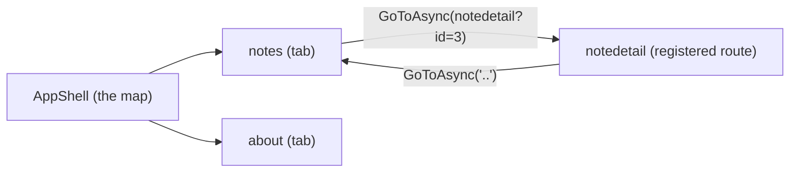

# Navigation with Shell

In [Phase 4](04-mvvm.md) your notes app got real structure: a `NotesViewModel` holding a list, a command to add a note, and a `CollectionView` showing the rows. But it's all stuck on one page. Tap a note and nothing happens. A real notes app needs a second screen — a detail page where you read and edit that one note — and a way to *get there* and *get back*. That's navigation, and in modern MAUI the answer has a name: **Shell**.

## The mental model: a map and an address bar

Here's the one idea to hold. Think of your app like a small website.

- **Shell is the site map.** In one file — `AppShell.xaml` — you declare the app's whole skeleton: which screens are top-level (the bottom tabs, the flyout menu) and what page each one shows. Anyone can open that file and see the shape of the app at a glance.
- **Routes are addresses.** Every screen has a short name, like `notes` or `notedetail`. To move, you don't construct a page and shove it onto a stack — you navigate to an *address* with `Shell.Current.GoToAsync("notedetail")`, the way a browser goes to a URL. Going back is the address `".."`, exactly like `cd ..` in a terminal.

So: **Shell declares the structure once; you move around it with URI-style routes.** Hold that and the rest is filling in names.



> 📝 There's an older model you'll see in tutorials and legacy apps: `NavigationPage` with `Navigation.PushAsync(new DetailPage())`. That's a literal stack of pages you push and pop. It still works and MAUI still supports it. But Shell is the modern, recommended approach — flyout and tabs are built in, and routes scale better than juggling a stack by hand. We'll build with Shell.

## AppShell.xaml: the map

When you create a MAUI app, the template already gives you an `AppShell.xaml`. Here's a focused version for our notes app — two tabs at the bottom, one for the notes list and one for an about page:

```xml
<Shell xmlns="http://schemas.microsoft.com/dotnet/2021/maui"
       xmlns:x="http://schemas.microsoft.com/winfx/2009/xaml"
       xmlns:local="clr-namespace:NotesApp"
       x:Class="NotesApp.AppShell">

    <TabBar>
        <ShellContent Title="Notes"
                      ContentTemplate="{DataTemplate local:NotesPage}"
                      Route="notes" />
        <ShellContent Title="About"
                      ContentTemplate="{DataTemplate local:AboutPage}"
                      Route="about" />
    </TabBar>

</Shell>
```

*What just happened:* `<Shell>` is the root of your whole app's navigation. The `<TabBar>` says "give me a bottom tab bar," and each `<ShellContent>` is one tab. `Title` is the label the user sees; `ContentTemplate="{DataTemplate local:NotesPage}"` tells Shell which page to render for that tab (wrapped in `DataTemplate` so the page is built lazily, only when the tab is first shown); and `Route="notes"` is that screen's address. Swap `<TabBar>` for `<FlyoutItem>` entries and you'd get a slide-out hamburger menu instead — same `ShellContent` children, different chrome. This one file *is* the structure of your app.

## Moving between screens: GoToAsync

Top-level tabs are reachable just by tapping them. But our detail page isn't a tab — it's a screen you reach by tapping a note. To go there in code, you ask Shell to navigate to its route:

```csharp
// Go forward to the detail screen
await Shell.Current.GoToAsync("notedetail");

// Go back to the previous screen (like the back button)
await Shell.Current.GoToAsync("..");
```

*What just happened:* `Shell.Current` is the running Shell instance — the app's one navigation map. `GoToAsync("notedetail")` looks up the route `notedetail` and pushes that page. The string `".."` means "up one" — it pops back to where you came from, the same as the hardware/title-bar back button. It's `async` because navigation can run page-creation and transition animations, so you `await` it.

But there's a catch, and it's the one everybody trips over. The `notes` and `about` routes work because they're declared in `AppShell.xaml`. `notedetail` is **not** in the Shell tree — it's a page you only visit on demand. Shell doesn't know that name yet.

> ⚠️ Navigate to a route Shell has never heard of and `GoToAsync` throws **"route not found"** at runtime. Tabs and flyout items register themselves; any *other* page you navigate to must be registered by hand first. This is the single most common Shell error.

You register detail routes once, typically in your `AppShell` constructor:

```csharp
public partial class AppShell : Shell
{
    public AppShell()
    {
        InitializeComponent();

        Routing.RegisterRoute("notedetail", typeof(NoteDetailPage));
    }
}
```

*What just happened:* `Routing.RegisterRoute` tells Shell, "when someone navigates to `notedetail`, build a `NoteDetailPage`." Now `GoToAsync("notedetail")` resolves instead of throwing. The rule of thumb: if a page is a tab or flyout item, it's already registered; if it's anything else (detail, edit, settings reached from a button), you register it. Do it once at startup and forget it.

## Passing parameters: which note?

Navigating to `notedetail` opens *a* detail page — but our app has many notes. We need to tell the detail page *which* note. Just like a web URL carries a query string (`?id=3`), Shell routes do too.

On the sending side, you append the data to the route. Imagine each `Note` now has an `Id`, and tapping a row runs this command in the ViewModel:

```csharp
[RelayCommand]
private async Task GoToDetail(Note note)
{
    if (note is null) return;
    await Shell.Current.GoToAsync($"notedetail?id={note.Id}");
}
```

*What just happened:* `$"notedetail?id={note.Id}"` builds an address like `notedetail?id=3` — the route name, then a `?id=` query parameter carrying that note's id. (Tip: a `CollectionView` can fire a command on tap via `SelectionChanged` or by wrapping each item's template in a tappable element; the point here is the navigation call, not the gesture.) The detail page now needs to *receive* that `id`.

On the receiving side, you decorate the page (or its ViewModel) with `[QueryProperty]`, which maps a query key to a property:

```csharp
using CommunityToolkit.Mvvm.ComponentModel;

[QueryProperty(nameof(NoteId), "id")]
public partial class NoteDetailViewModel : ObservableObject
{
    [ObservableProperty]
    private string noteId = "";

    partial void OnNoteIdChanged(string value)
    {
        // value is "3" — now load that note from your store
        LoadNote(value);
    }
}
```

*What just happened:* `[QueryProperty(nameof(NoteId), "id")]` wires the query key `"id"` from the URL to the `NoteId` property. When Shell navigates, it sets `NoteId = "3"` for you. Because `NoteId` is an `[ObservableProperty]` (from Phase 4's CommunityToolkit.Mvvm), the generator gives us an `OnNoteIdChanged` hook that fires the moment the value lands — a clean place to load that note. Note that query values arrive as **strings**, so you'll often `int.Parse` the id before looking it up.

That covers the common case. There's also a richer way when you need to pass a whole object instead of a flat id — a dictionary plus the `IQueryAttributable` interface:

```csharp
// Sending: pass the actual Note object, not just an id
await Shell.Current.GoToAsync("notedetail", new Dictionary<string, object>
{
    ["Note"] = note
});
```

```csharp
// Receiving: implement IQueryAttributable to pull it out
public partial class NoteDetailViewModel : ObservableObject, IQueryAttributable
{
    [ObservableProperty]
    private Note? note;

    public void ApplyQueryAttributes(IDictionary<string, object> query)
    {
        Note = query["Note"] as Note;
    }
}
```

*What just happened:* the dictionary lets you hand over real objects (here, the whole `Note`) instead of cramming everything into a string. `ApplyQueryAttributes` is called by Shell with that dictionary right after navigation, and you fish out your value by key. Use the query-string `?id=` style for simple values like an id (it's also link-friendly and survives app restarts); reach for the dictionary + `IQueryAttributable` when you genuinely need to pass an object you already have in hand.

💡 Both styles solve the same problem — "tell the next screen what to show." The query string is the default for ids; the dictionary is for objects. Don't overthink which: pass the id when you have an id, pass the object when you have the object.

## The whole flow, end to end

For our notes app, navigation now reads as one clean story: the list page shows `Notes`; tapping a row runs `GoToDetail(note)`, which navigates to `notedetail?id={note.Id}`; Shell builds `NoteDetailPage`, sets `NoteId` via `[QueryProperty]`, and the detail ViewModel loads and shows that note. Edit it, then `GoToAsync("..")` takes the user back to the list. One map, a handful of addresses, and a query string carrying the id — that's the entire navigation layer of a real app.

## Recap

- **Shell** (`AppShell.xaml`) declares your app's structure in one place: `<TabBar>`/`<FlyoutItem>` with `<ShellContent>` entries, each pointing at a page via `ContentTemplate` and naming an address with `Route`.
- **Navigate with routes**: `Shell.Current.GoToAsync("notedetail")` goes forward; `GoToAsync("..")` goes back. It's `async` — `await` it.
- **Register non-tab pages**: detail/edit pages that aren't in the Shell tree need `Routing.RegisterRoute("notedetail", typeof(NoteDetailPage))`, or `GoToAsync` throws "route not found".
- **Pass parameters** two ways: a query string `?id={note.Id}` received with `[QueryProperty(nameof(NoteId), "id")]` (values arrive as strings), or a dictionary received with `IQueryAttributable` when you need to hand over a whole object.
- The **older** `NavigationPage` + `PushAsync`/`PopAsync` stack model still exists; Shell is the modern, recommended approach with tabs, flyout, and URI routes built in.

## Quick check

```quiz
[
  {
    "q": "You call Shell.Current.GoToAsync(\"notedetail\") and get a runtime \"route not found\" error. What's the fix?",
    "choices": ["Add ?id= to the route string", "Register the route with Routing.RegisterRoute(\"notedetail\", typeof(NoteDetailPage))", "Make GoToAsync synchronous", "Move NoteDetailPage into a TabBar"],
    "answer": 1,
    "explain": "Pages that aren't ShellContent tabs/flyout items must be registered with Routing.RegisterRoute (usually in the AppShell constructor) before GoToAsync can resolve their route."
  },
  {
    "q": "How do you navigate back to the previous screen with Shell?",
    "choices": ["GoToAsync(\"back\")", "GoToAsync(\"..\")", "PopAsync()", "GoToAsync(\"/\")"],
    "answer": 1,
    "explain": "The route \"..\" means \"up one\" — it pops back to the previous screen, like a browser back button or cd .. in a terminal."
  },
  {
    "q": "You navigate with GoToAsync($\"notedetail?id={note.Id}\"). How does the detail ViewModel receive that id?",
    "choices": ["It reads Shell.Current.QueryString manually", "With [QueryProperty(nameof(NoteId), \"id\")] mapping the \"id\" key to a NoteId property", "The id is passed to the page constructor automatically", "It can't — query strings only work with web apps"],
    "answer": 1,
    "explain": "[QueryProperty(nameof(NoteId), \"id\")] maps the query key \"id\" to the NoteId property; Shell sets it during navigation. Values arrive as strings, so parse the id before lookup."
  }
]
```

[← Phase 4: The MVVM Pattern](04-mvvm.md) · [Guide overview](_guide.md) · [Phase 6: Data & Calling APIs →](06-data-and-apis.md)
