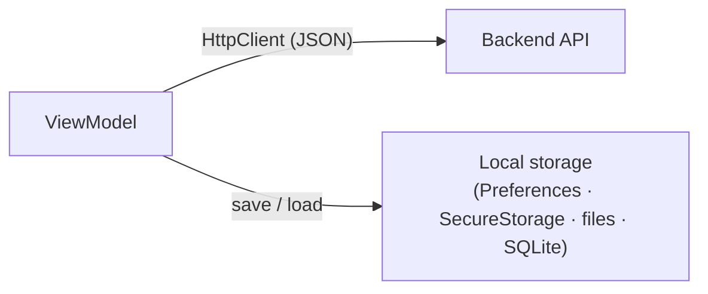

# Data & Calling APIs

Up to now the notes app has lived entirely in memory — add a note, and it's there until you close the app, at which point it evaporates. That's fine for learning bindings and commands, but no real app behaves that way. This phase gives the notes app a memory that survives a restart, and a way to reach the wider world.

## The mental model: two directions data flows

There are only two places your app's data can live, and an app worth shipping uses both:

- **Remote** — on a server somewhere, reached over the network with `HttpClient`. This is how your app talks to a backend (the kind you'd build in [ASP.NET Core](/guides/aspnet-core-from-zero)), syncs across a user's devices, or pulls down shared data.
- **Local** — on the device itself. This keeps the app feeling instant and working when the user walks into an elevator and loses signal.



The whole phase is learning *which tool* for each direction — and for local, there are four, sized from a single setting up to a full database. Hold "reach out with `HttpClient`, persist with the smallest local store that fits the data," and the rest is detail.

## Calling an API with HttpClient

C# has talked to HTTP APIs the same way for years: `HttpClient`. MAUI adds nothing new here — the skill transfers straight from ASP.NET Core, Blazor, or any console app you've written. The package worth knowing is `System.Net.Http.Json`, which turns a JSON response into your C# types in a single call.

Say the backend exposes notes at `https://api.example.com/notes`:

```csharp
using System.Net.Http.Json;

var http = new HttpClient();
List<Note>? notes = await http.GetFromJsonAsync<List<Note>>(
    "https://api.example.com/notes");

// Sending one back:
await http.PostAsJsonAsync("https://api.example.com/notes", newNote);
```

*What just happened:* `GetFromJsonAsync<List<Note>>` did three things in one line — made the GET request, read the response body, and deserialized the JSON into a `List<Note>` matching your model. `PostAsJsonAsync` runs the same play in reverse: serializes `newNote` to JSON and posts it. No manual `JsonSerializer`, no reading streams by hand.

📝 The property names on your `Note` class need to line up with the JSON field names (case-insensitive by default). If the API sends `"title"` and your class has `Title`, they match.

### Don't `new` it in the ViewModel — wrap it in a service

That raw snippet works, but dropping `new HttpClient()` and a hard-coded URL inside a ViewModel is exactly the boundary-breaking we warned against in [Phase 4](04-mvvm.md). The ViewModel should *ask* for notes, not know they come from `api.example.com` over HTTP. Wrap the call in a small service behind an interface:

```csharp
public interface INotesApi
{
    Task<List<Note>> GetNotesAsync();
    Task AddNoteAsync(Note note);
}

public class NotesApi : INotesApi
{
    private readonly HttpClient _http;
    public NotesApi(HttpClient http) => _http = http;

    public async Task<List<Note>> GetNotesAsync() =>
        await _http.GetFromJsonAsync<List<Note>>("notes") ?? new();

    public async Task AddNoteAsync(Note note) =>
        await _http.PostAsJsonAsync("notes", note);
}
```

*What just happened:* the URLs lost their host (`"notes"` instead of the full address) because the `HttpClient` will carry a base address, configured once in DI. The service depends on an injected `HttpClient` rather than newing its own — the same constructor-injection you've seen in ASP.NET Core. The ViewModel depends on `INotesApi`, never on `HttpClient`, so you can hand it a fake in a unit test.

Register both in `MauiProgram.cs`, the same DI container that wires up everything else:

```csharp
builder.Services.AddHttpClient<INotesApi, NotesApi>(client =>
    client.BaseAddress = new Uri("https://api.example.com/"));
```

*What just happened:* `AddHttpClient<INotesApi, NotesApi>` registered the service *and* gave it a properly managed `HttpClient` with the base address baked in. (`AddHttpClient` is the recommended way to hand out `HttpClient`s — it pools the underlying connections so you don't leak sockets, a real bug you'd hit `new`ing an `HttpClient` per request.) Now any ViewModel can take `INotesApi` in its constructor.

### Calling it from a command — with the mobile realities handled

Here's the ViewModel calling that service from a `[RelayCommand]`, with a loading flag (the Phase 4 pattern) and — crucially — error handling:

```csharp
[ObservableProperty]
private bool isBusy;

[RelayCommand]
private async Task LoadNotesAsync()
{
    if (IsBusy) return;
    IsBusy = true;
    try
    {
        var fromServer = await _notesApi.GetNotesAsync();
        Notes.Clear();
        foreach (var note in fromServer)
            Notes.Add(note);
    }
    catch (HttpRequestException)
    {
        await _alerts.ShowAsync("Couldn't reach the server. Check your connection.");
    }
    finally
    {
        IsBusy = false;
    }
}
```

*What just happened:* `IsBusy` flips on (bind it to an `ActivityIndicator` so the user sees a spinner), the `await` keeps the UI thread free while the network call is in flight, and the `try/catch` catches the call *failing* — which, on a phone, it routinely will.

⚠️ This is the part desktop and web developers underestimate. A mobile device is on a flaky network by default: signal drops in a tunnel, Wi-Fi hands off to cellular mid-request, a request hangs and times out. Three rules keep you out of trouble:

- **Never block the UI thread.** Always `async`/`await` network calls — a synchronous `.Result` will freeze the app and trigger an OS "not responding" kill.
- **Always expect failure.** Wrap calls in `try/catch` and show the user something human, not a stack trace.
- **Use HTTPS.** Plain HTTP is blocked by default on both iOS and Android for production traffic.

## The local storage tour: four tools, smallest to biggest

Now the offline half. MAUI gives you four built-in ways to persist data on the device. They aren't competitors — they're sized for different jobs, so reach for the *smallest* one that fits.

**1. `Preferences` — a single key/value, for settings.** Last-opened note id, a theme choice, "has the user seen the welcome screen." Stored in the platform's native settings store.

```csharp
Preferences.Set("theme", "dark");
var theme = Preferences.Get("theme", "light"); // "light" is the fallback
```

*What just happened:* one line in, one line out. The second argument to `Get` is the default returned when the key was never set, so first launch reads `"light"` instead of crashing. Use this for small, non-secret scalars only — it's not built for lists or objects.

**2. `SecureStorage` — encrypted key/value, for secrets.** An auth token, an API key, anything you'd be embarrassed to leave in plaintext. Same shape as `Preferences`, but the value is encrypted by the OS keychain — and the calls are `async`.

```csharp
await SecureStorage.SetAsync("token", jwt);
var token = await SecureStorage.GetAsync("token"); // null if not set
```

*What just happened:* the JWT went into the platform's secure enclave (iOS Keychain / Android KeyStore) rather than a plain settings file. ⚠️ Never put tokens or passwords in `Preferences` — that's the difference between the two stores. `SecureStorage` is `async` precisely because talking to the OS keychain is.

**3. The file system — for app-private files.** For something bigger than a setting — a cached JSON blob, a downloaded image, an exported document — write a file under `FileSystem.AppDataDirectory`, a private folder only your app can read.

```csharp
var path = Path.Combine(FileSystem.AppDataDirectory, "notes.json");
await File.WriteAllTextAsync(path, json);
```

*What just happened:* `AppDataDirectory` resolves to the right private location on each platform, so you write ordinary `System.IO` file code and MAUI handles the per-platform path. Good for a handful of files; clumsy the moment you want to *query* the data ("notes containing 'meeting'").

**4. SQLite — a real database, for structured, queryable data.** This is the right home for the notes list itself: many rows, each with fields, that you want to add to, delete from, and search. SQLite is a full relational database living in a single file on the device. Add the `sqlite-net-pcl` package, decorate your model, and get `async` table operations.

Mark up the `Note` model so SQLite knows how to store it:

```csharp
using SQLite;

public class Note
{
    [PrimaryKey, AutoIncrement]
    public int Id { get; set; }
    public string Title { get; set; } = "";
    public string Body { get; set; } = "";
}
```

*What just happened:* `[PrimaryKey, AutoIncrement]` tells SQLite this is the row's unique id and to fill it in automatically on insert — a new note doesn't need an id, it gets one. The other properties become columns. This is the same `Note` your ViewModel already binds to; the attributes are the only addition.

Now the store that saves and loads them:

```csharp
public class NoteDatabase
{
    private readonly SQLiteAsyncConnection _db;

    public NoteDatabase()
    {
        var path = Path.Combine(FileSystem.AppDataDirectory, "notes.db");
        _db = new SQLiteAsyncConnection(path);
        _db.CreateTableAsync<Note>().Wait();
    }

    public Task<int> SaveAsync(Note note) => _db.InsertAsync(note);
    public Task<List<Note>> GetAllAsync() => _db.Table<Note>().ToListAsync();
}
```

*What just happened:* the connection points at a `notes.db` file in the same private `AppDataDirectory` you saw above. `CreateTableAsync<Note>()` builds the table from the model's attributes (and does nothing if it already exists, so it's safe on every launch). `InsertAsync` writes a row; `Table<Note>().ToListAsync()` reads them all back. Swap `NoteDatabase` in behind a service interface and inject it into the ViewModel exactly like `INotesApi` — it never knows whether a note came from SQLite or the network.

### How to choose

| Data | Store |
|------|-------|
| One small setting (theme, last id) | `Preferences` |
| A secret (token, password) | `SecureStorage` |
| A blob or document | A file in `AppDataDirectory` |
| A list of structured records you'll query | **SQLite** |

## Offline-first: local plus sync

💡 Here's the pattern that ties both directions together and makes an app feel genuinely good on a phone: **persist locally first, sync to the API when you can.**

The user adds a note — you write it to SQLite *immediately* and update the screen; the note is saved no matter what the network is doing. Then, in the background or on the next launch, you push unsynced notes to the API and pull down any new ones. The reader gets an app that never spins waiting for a server and never loses a note in a tunnel: SQLite is the source of truth on the device, and the API is how that truth gets shared across devices. You won't build the full sync engine here, but *local write is instant, network sync is eventual* is what separates an app that survives real-world use from one that only works on office Wi-Fi.

## Recap

- An app's data flows two ways: **out** to a backend over `HttpClient`, and **down** into local storage on the device. A real app uses both.
- Call APIs with `HttpClient` + `System.Net.Http.Json` (`GetFromJsonAsync`, `PostAsJsonAsync`). Wrap calls in a service behind an interface, register it with `AddHttpClient` in DI, and inject it into ViewModels — never `new` an `HttpClient` in a ViewModel.
- Mobile networks fail constantly: `await` every call so the UI thread stays free, wrap calls in `try/catch` and surface human errors, and use HTTPS.
- Pick the smallest local store that fits: `Preferences` for settings, `SecureStorage` for secrets, files in `AppDataDirectory` for blobs, and **SQLite** (`sqlite-net-pcl`) for structured, queryable lists like the notes themselves.
- Aim for **offline-first**: write to SQLite instantly so the app always works, and sync to the API when a connection is available.

## Quick check

```quiz
[
  {
    "q": "You need to store a list of notes the user can add to, delete from, and search — and it must survive offline. Which local store fits?",
    "choices": ["Preferences", "SecureStorage", "SQLite via sqlite-net-pcl", "A single JSON file in AppDataDirectory"],
    "answer": 2,
    "explain": "SQLite is a real relational database for structured, queryable records. Preferences and SecureStorage are key/value only, and a flat JSON file can't be queried efficiently."
  },
  {
    "q": "Where should an authentication token (JWT) be stored?",
    "choices": ["Preferences, since it's just a string", "SecureStorage, which encrypts it via the OS keychain", "A file in AppDataDirectory", "In the ViewModel as a property"],
    "answer": 1,
    "explain": "SecureStorage encrypts values using the platform keychain/keystore. Preferences and plain files store data unencrypted, which is wrong for secrets."
  },
  {
    "q": "Why wrap an HttpClient call to the notes API in a try/catch and use async/await?",
    "choices": ["JSON parsing always throws", "It makes the request faster", "Mobile networks fail often, so calls must handle errors and never block the UI thread", "It's required syntax for HttpClient"],
    "answer": 2,
    "explain": "Phones lose signal routinely. await keeps the UI thread responsive during the request, and try/catch lets you show a human error instead of crashing when the network drops."
  }
]
```

[← Phase 5: Navigation with Shell](05-navigation-with-shell.md) · [Guide overview](_guide.md) · [Phase 7: Platform Features & Deployment →](07-platform-features-and-deployment.md)
