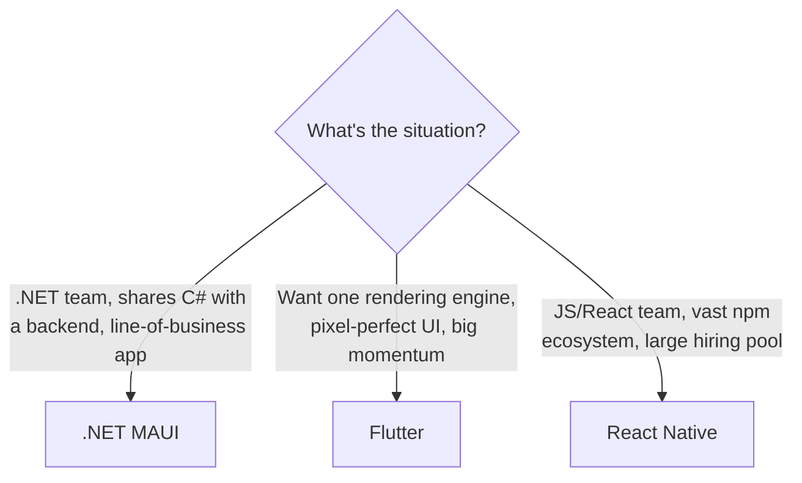

# Where to Go Next

Look at the distance you covered. You can describe a UI in **XAML** and arrange it with **layouts**. You can place **controls** and wire them to data with **binding**. You can structure an app the real way with **MVVM** — a View that's all markup, a ViewModel that holds state and commands, `INotifyPropertyChanged` keeping them in sync. You can move between screens with **Shell**, call **APIs** with `HttpClient`, and keep data around with **Preferences and SQLite**. You can reach into **platform features** — sensors, permissions, per-platform code — and you know the shape of getting a build into the stores.

That's a native, cross-platform app, written in C#, running on Android, iOS, macOS, and Windows from one codebase — a real skill.

So this last phase isn't more APIs to memorize — it's the map: where MAUI sits next to the other cross-platform frameworks, ways to reuse what you already know, the backend it pairs with, and one concrete thing to go build.

## MAUI vs Flutter and React Native

You'll get asked this, maybe in an interview: "Why MAUI instead of Flutter?" The honest answer isn't "MAUI is better" — it's "they're aimed at different teams and different jobs." Pick the tool that fits the work and the people, not the loudest one.



Here's the honest breakdown:

- **.NET MAUI** — you build the UI in **C#**, render with **native controls**, and ship one codebase to four platforms. Its sweet spot is **.NET teams** and **line-of-business apps**, especially ones that share code with a .NET backend — no second language, no second toolchain, one debugger across the stack.
- **Flutter** — written in **Dart**, with **its own rendering engine** rather than native controls. That buys remarkable UI consistency across platforms and a lot of momentum, with a large, energetic mobile community.
- **React Native** — written in **JavaScript/React**, with a **huge ecosystem** and a big hiring pool. If your team already lives in JS and React, it meets you where you are.

💡 MAUI shines for C# shops and apps that share code with a .NET backend — that shared-language advantage is genuinely large. But be honest: **Flutter and React Native have larger mobile communities** — more packages, more tutorials, more people who've already hit your bug. None of these is "the bad one"; they all build native apps, just for different teams. If you internalized View + ViewModel + binding here, you've learned the hard part of any of them.

## Reuse what you already know

You don't have to choose between "web skills" and "native app." MAUI gives you two ways to bring more to the table.

**Blazor Hybrid.** A MAUI app can host a `BlazorWebView`, which runs real **Blazor** components — the same ones you'd build for the web — *inside* the native shell. A web-skilled team can reuse their UI and Razor know-how, and still mix in native MAUI pages where it matters. If you've gone through [Blazor From Zero](/guides/blazor-from-zero), that knowledge ports directly in.

**CommunityToolkit.Maui.** Before you hand-build a control or a converter, check the toolkit. **CommunityToolkit.Maui** adds extra controls, behaviors, converters, and helpers that fill the gaps in the box. Add it early — it saves you from reinventing pieces the community already polished.

## It pairs with ASP.NET Core

Most real apps talk to a backend, and MAUI has a natural partner. [ASP.NET Core From Zero](/guides/aspnet-core-from-zero) is the other half of this stack: the API your app calls for data, auth, and sync. The payoff for staying in one language is real here — you can **share C# model classes and DTOs** between app and server, so the shape your API returns is the exact type your ViewModel binds to. No duplicating models in a second language, no drift between client and server.

## What to build next

Reading more won't make this stick — finishing one real thing will. Pick either path.

**Path A — finish the notes app.** You built it phase by phase. Now take it the last mile:

- Persist notes locally with **SQLite** so they survive a restart.
- **Sync** with a backend API so notes follow the user across devices.
- Add a couple of **platform features** — a share action, a notification, a sensor — to make it feel native.
- Drop in **CommunityToolkit.Maui** for the controls and helpers you've been missing.
- Then **publish it to a store**. Going through that gauntlet once teaches you more than any tutorial.

**Path B — a small CRUD app on your own API.** Build create / read / update / delete end to end: a MAUI front end against an **ASP.NET Core** backend you write, sharing the same C# DTOs. Add auth so users see their own data — it exercises nearly everything you learned, plus the backend it leans on.

Remember the throughline that ran under every phase: **XAML describes the UI, a ViewModel holds the state and behavior, and binding wires them together** — one codebase, native everywhere. Go ship one of these, put it on a real device, and show someone. You're ready.

## Recap

1. **You can ship a native cross-platform app in C#** — XAML and layouts, controls and binding, MVVM, Shell navigation, APIs and local storage, platform features and deployment. That's a real skill, not a toy.
2. **MAUI vs Flutter vs React Native is about fit, not winners** — MAUI wins for .NET teams and line-of-business apps that share C# with a backend; Flutter (Dart, its own renderer) and React Native (JS, huge ecosystem) have larger mobile communities. Be honest about the tradeoff.
3. **Reuse what you know** — Blazor Hybrid runs real Blazor components inside a MAUI shell via `BlazorWebView`; CommunityToolkit.Maui adds controls, behaviors, converters, and helpers worth pulling in early.
4. **It pairs with ASP.NET Core** — the backend your app talks to, with shared C# models and DTOs so client and server stay in sync without duplication.
5. **Build one app and finish it** — finish the notes app (SQLite + API sync + platform features) and publish it, or a small CRUD app on your own ASP.NET Core API. Shipping cements the whole guide.

## Quick check

Three decisions to take with you as you leave this guide:

```quiz
[
  {
    "q": "A .NET team is building an internal line-of-business app and wants to share their C# model classes with the backend. Which choice fits the reasoning best?",
    "choices": [
      "React Native, because it always has the smallest app size",
      ".NET MAUI, because the UI is C# and shares language, types, and DTOs with the backend",
      "Flutter, because line-of-business apps require Dart",
      "It makes no difference; all three are interchangeable"
    ],
    "answer": 1,
    "explain": "MAUI's big win for a .NET team is building the app in C# and sharing models and DTOs with an ASP.NET Core backend. Flutter and React Native are strong choices too, especially for teams already in Dart or JS, or wanting larger mobile communities."
  },
  {
    "q": "Your team has strong Blazor and web skills and wants to reuse that UI inside a native MAUI app. What lets you do that?",
    "choices": [
      "CommunityToolkit.Maui",
      "Shell routing",
      "A BlazorWebView hosting Blazor components (Blazor Hybrid)",
      "Preferences"
    ],
    "answer": 2,
    "explain": "Blazor Hybrid uses a BlazorWebView to run real Blazor web components inside a MAUI app, so a web-skilled team reuses its UI and Razor skills while still mixing in native MAUI pages."
  },
  {
    "q": "You want extra ready-made controls, behaviors, and converters instead of hand-building them in MAUI. What do you reach for?",
    "choices": [
      "Flutter",
      "CommunityToolkit.Maui",
      "HttpClient",
      "InteractiveAuto"
    ],
    "answer": 1,
    "explain": "CommunityToolkit.Maui adds extra controls, behaviors, converters, and helpers that fill gaps in the box. Add it early so you stop reinventing pieces the community already built."
  }
]
```

---

[← Phase 7: Platform Features & Deployment](07-platform-features-and-deployment.md) · [Guide overview](_guide.md)
