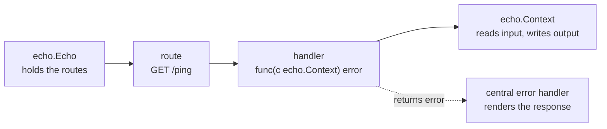

# What Echo Is & Your First Server

You already know [Go](/guides/go-from-zero), and you've maybe met [Gin](/guides/gin-from-zero) - the
most popular Go web framework. Echo is its closest peer: another fast, focused layer over the standard
library's `net/http`. Echo, like Gin, handles the repetitive parts - routing, JSON, middleware - without
hiding what's underneath.

So why pick Echo over Gin? One design choice, mostly: in Echo, **a handler returns an error**. Not
`func(c *gin.Context)` with no return value, where you write the error response by hand - but
`func(c echo.Context) error`, where you hand the error back and a central handler turns it into an HTTP
response. In a real codebase with dozens of endpoints, that's the difference between every handler
re-implementing "how do I report a failure" and every handler saying `return err` - less boilerplate, and
errors that come out consistent because one place renders them all.

💡 **Echo is net/http with helpers *and* opinions about errors.** The helpers make it fast to write; the
error-return style makes it stay clean as it grows. That's the whole pitch.

## The mental model: instance holds routes, context handles the request, handlers return errors

Before any code, hold three things in your head. They are the entire framework.

📝 **The instance** (`*echo.Echo`, made with `echo.New()`) is your application. You create it once,
register all your routes and middleware on it, and start it.

📝 **The context** (`echo.Context`) is one value handed to you for *each incoming request*. It carries
the request, the response writer, the path and query params, and every helper you use to read input and
write output. Note that `echo.Context` is an *interface*, not a struct - good to know, won't matter today.

📝 **The handler returns an error.** Every handler you write has the shape `func(c echo.Context) error`.
You do your work, then `return c.JSON(...)` on success or `return someError` on failure. Echo's central
error handler decides what the client actually sees.

Say it once: **the instance holds the routes, the context handles the request, and the handler returns
an error.** Everything else in Echo is detail.



*One idea:* the instance matches an incoming request to a route, calls that route's handler, and the
handler uses the context to send a response - or returns an error for the central handler to render.
Every Echo endpoint flows along those arrows.

## Your first server

First, install Echo into your module. From inside your Go project:

```bash
go get github.com/labstack/echo/v4
```

*What just happened:* `go get` downloaded Echo (the `/v4` is the current major version) and added it to
your `go.mod`/`go.sum`. The import path is `github.com/labstack/echo/v4`; you refer to it in code as the
`echo` package.

Now the smallest server that does something real. Create a file called `main.go`:

```go
package main

import (
    "net/http"

    "github.com/labstack/echo/v4"
)

func main() {
    e := echo.New()
    e.GET("/ping", func(c echo.Context) error {
        return c.JSON(http.StatusOK, map[string]string{"message": "pong"})
    })
    e.Logger.Fatal(e.Start(":1323"))
}
```

*What just happened:* line by line - 
- `echo.New()` creates the **instance** and returns a `*echo.Echo`. We name it `e`.
- `e.GET("/ping", ...)` registers a **route**: when a `GET` request arrives for `/ping`, run the
  function we pass. That function is the **handler**, and its signature - `func(c echo.Context) error` - 
  is the shape every Echo handler has.
- Inside the handler, `c.JSON(http.StatusOK, ...)` uses the **context** to write the response: sets the
  status to `200`, sets `Content-Type` to `application/json`, serializes the value, and sends it.
  `c.JSON` *returns an error*, and we `return` it - so if writing the response fails, Echo knows. On the
  happy path it returns `nil`, which Echo reads as "all good."
- `http.StatusOK` is the standard library's name for `200`. Echo leans on `net/http`'s constants rather
  than inventing its own.
- `e.Start(":1323")` starts the server listening on port 1323 (Echo's docs use that port; nothing magic
  about it). It blocks until you stop the program. We wrap it in `e.Logger.Fatal(...)` so that if `Start`
  returns an error - say the port is already taken - it's logged and the program exits.

Run it like any Go program:

```bash
go run main.go
```

```console
$ go run main.go

   ____    __
  / __/___/ /  ___
 / _// __/ _ \/ _ \
/___/\__/_//_/\___/  v4
⇨ http server started on [::]:1323
```

*What just happened:* `go run` compiled and started your program, and `e.Start` brought up the server.
Leave it running and, in another terminal, hit the route:

```console
$ curl localhost:1323/ping
{"message":"pong"}
```

*What just happened:* `curl` sent a `GET /ping`. The instance matched it to your route, called your
handler, and the handler used the context to write back JSON - returning `nil` to signal success.

## The error-returning handler, and why it's different

This is the one place Echo and Gin diverge in a way worth pausing on. Put the two handler shapes side by
side:

```go
// Gin: no return value - you write the response (and any error) yourself.
func(c *gin.Context) {
    c.JSON(200, gin.H{"message": "pong"})
}

// Echo: return an error - success or failure flows back to a central handler.
func(c echo.Context) error {
    return c.JSON(http.StatusOK, map[string]string{"message": "pong"})
}
```

*What just happened:* both write the same JSON. But the Echo version *returns* - and that return value is
the hook. When something goes wrong, you don't write a status code and an error body by hand every time.
You return an error, and Echo's central error handler renders it. Echo even gives you a purpose-built
error type for this:

```go
e.GET("/secret", func(c echo.Context) error {
    return echo.NewHTTPError(http.StatusUnauthorized, "you shall not pass")
})
```

*What just happened:* instead of manually setting a `401` status and writing a JSON body, you returned
an `*echo.HTTPError` describing the failure. Echo's default error handler turns it into a clean `401`
response with a JSON message - every endpoint gets the same consistent shape, no copy-pasted error code.

⚠️ Don't worry about *configuring* that central handler yet - that's Phase 6's job, where we wire up a
custom `HTTPErrorHandler` for the books API. For now, just internalize the habit: **in Echo, you
`return` your result, success or failure.** Forgetting the `return` is the rookie Echo bug - the handler
compiles, but nothing gets sent and you stare at a hung request wondering why.

## Adding Logger and Recover middleware

Here's a sharp difference from Gin worth knowing on day one. Gin's `gin.Default()` hands you a Logger and
a Recovery handler already wired up. **Echo's `echo.New()` does not** - it gives you a bare instance.
Logging and panic-recovery are opt-in. Most apps want both, so you add them yourself:

```go
package main

import (
    "net/http"

    "github.com/labstack/echo/v4"
    "github.com/labstack/echo/v4/middleware"
)

func main() {
    e := echo.New()

    e.Use(middleware.Logger())  // a tidy log line per request
    e.Use(middleware.Recover()) // catch panics, return 500, stay alive

    e.GET("/ping", func(c echo.Context) error {
        return c.JSON(http.StatusOK, map[string]string{"message": "pong"})
    })

    e.Logger.Fatal(e.Start(":1323"))
}
```

*What just happened:* `e.Use(...)` registers **middleware** - code that runs around every request. We
imported `github.com/labstack/echo/v4/middleware` (a separate package from `echo`) and added two pieces:
- **`middleware.Logger()`** prints a line for every request - method, path, status, how long it took.
- **`middleware.Recover()`** catches a panic inside any handler, turns it into a clean `500` response,
  and keeps the server running. Without it, one panicking handler takes down the whole process.

We'll cover the middleware signature and write our own in Phase 5. ⚠️ Unlike Gin, Echo doesn't include
these by default - if your server runs silent or dies on a panic, it's because you haven't added them yet.

## The running example: a books API

We won't keep writing throwaway `/ping` routes. Across this guide we'll grow one real service: a small
**books API**. The core of it is a single type - a book with an id, a title, and an author:

```go
type Book struct {
    ID     int    `json:"id"`
    Title  string `json:"title"`
    Author string `json:"author"`
}
```

*What just happened:* we declared the `Book` struct the whole guide builds on. Those `json:"..."`
**struct tags** tell Echo what to call each field in JSON - so `Title` becomes `"title"`, not `"Title"`.
Tags work both directions; binding incoming JSON in Phase 3 leans on them too. Here's the type returning
itself through the now-familiar flow:

```go
e.GET("/books/sample", func(c echo.Context) error {
    b := Book{ID: 1, Title: "The Go Programming Language", Author: "Donovan & Kernighan"}
    return c.JSON(http.StatusOK, b)
})
```

*What just happened:* the handler built a `Book`, and `return c.JSON(...)` serialized it using those
tags - no map needed when you already have a struct.

```console
$ curl localhost:1323/books/sample
{"id":1,"title":"The Go Programming Language","author":"Donovan & Kernighan"}
```

By the end of the guide this grows into full create/read/update/delete over a real collection of books,
with centralized error handling and tests. For now you've met the cast: an **instance**, a **route**, a
**handler that returns an error**, a **context**, and the **`Book`** we'll turn into a proper REST API.
Next up: routing - path params, query params, and grouping routes so they don't sprawl.

## Recap

- **Echo is a fast Go web framework over `net/http`** - a close peer of Gin. It does the repetitive
  parts (routing, JSON, middleware) without hiding the standard library underneath.
- **The mental model is three things:** the **instance** (`*echo.Echo`, from `echo.New()`) holds your
  routes; the **context** (`echo.Context`, an interface) handles each request; the **handler returns an
  error** - `func(c echo.Context) error`.
- **Echo's signature trait is the error-returning handler.** You `return c.JSON(...)` on success or
  `return echo.NewHTTPError(...)` on failure, and a central handler renders it. ⚠️ Forgetting the
  `return` is the classic Echo bug.
- **A first server is tiny:** `echo.New()` makes the instance, `e.GET(path, handler)` registers a route,
  `c.JSON(http.StatusOK, ...)` writes the response, and `e.Start(":1323")` listens. Run with
  `go run main.go`, test with `curl`.
- **Unlike Gin, Echo includes no middleware by default.** Add `middleware.Logger()` and
  `middleware.Recover()` yourself (from `github.com/labstack/echo/v4/middleware`) for request logging
  and crash protection.
- **The throughline:** instance → route → handler → context → response, with errors flowing to a central
  handler. We'll grow one **books API** along that path for the rest of the guide.

## Quick check

Three questions on the ideas that have to stick - what Echo is, the instance/context split, and the
error-returning handler:

```quiz
[
  {
    "q": "What is Echo's signature difference from Gin in how handlers work?",
    "choices": [
      "An Echo handler returns an error (func(c echo.Context) error), and a central handler renders it; a Gin handler returns nothing and writes errors by hand",
      "Echo handlers take no arguments at all",
      "Echo handlers must return a string that becomes the response body",
      "Echo handlers run in a separate goroutine automatically"
    ],
    "answer": 0,
    "explain": "Echo handlers are func(c echo.Context) error. You return c.JSON(...) on success or return an error on failure, and Echo's central error handler turns errors into responses. Gin's func(c *gin.Context) has no return value, so you write error responses yourself."
  },
  {
    "q": "What does echo.New() give you that gin.Default() includes but echo.New() does not?",
    "choices": [
      "Nothing extra - echo.New() returns a bare instance, so you add Logger and Recover middleware yourself with e.Use(...)",
      "A built-in database connection",
      "Automatic HTTPS certificates",
      "Logger and Recover middleware, already wired up like gin.Default()"
    ],
    "answer": 0,
    "explain": "echo.New() returns a bare *echo.Echo with no middleware. Unlike gin.Default() (which ships Logger + Recovery), in Echo you opt in: e.Use(middleware.Logger()) and e.Use(middleware.Recover()) from github.com/labstack/echo/v4/middleware."
  },
  {
    "q": "In the mental model, what are the roles of the instance and the context?",
    "choices": [
      "The instance (*echo.Echo) holds your routes and is started once; the context (echo.Context) is handed to a handler for each request to read input and write output",
      "They are the same object with two names",
      "The context holds the routes and the instance handles each request",
      "The instance is the JSON serializer and the context is the router"
    ],
    "answer": 0,
    "explain": "Instance holds the routes, context handles the request. You create one *echo.Echo, register routes on it, and start it; each incoming request gets an echo.Context carrying the request, response writer, params, and helpers. Every handler is func(c echo.Context) error."
  }
]
```

---

[Guide overview](_guide.md) · [Phase 2: Routing & Groups →](02-routing-and-groups.md)
