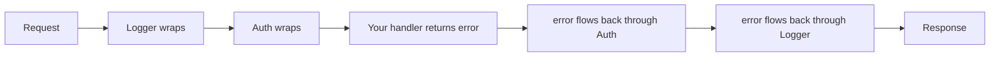

# Middleware

Here's the part of a web framework that earns its keep: not the routing, but everything that runs *around* every request. Logging. Auth. Panic recovery. Timing. CORS headers. You don't want to paste those into all forty of your handlers — you write them once and have them wrap the whole app.

That wrapper is **middleware**. Echo's take on it is a little different from what you may have seen in Gin, and once the shape clicks, every middleware pattern in Echo is the same shape.

## The mental model: a function that wraps a handler

> 💡 In Echo, a middleware is a function that *takes* your handler and *returns* a new handler that wraps it. It's literally `func(next) handler`. You decide what happens before you call `next`, what happens after, and whether you call `next` at all.

Picture an onion. Your handler sits in the center. Each middleware is a layer wrapped around it: the request travels inward through every layer to reach your handler, then the result travels back outward through those same layers. The thing that travels back out is the **`error`** your handler returned — and because each middleware *calls* `next(c)` and gets that error back, every layer can inspect or transform it on the way out.



That's the whole idea. Gin gives you one flat handler and a `c.Next()` seam to mark "before vs. after." Echo gives you a *wrapper* — you hold a reference to `next` and call it yourself. The "before" code is whatever you write before that call; the "after" code is whatever you write after it.

## The signature, and the three ways to register

A middleware in Echo is an `echo.MiddlewareFunc`, which is exactly this type:

```go
type MiddlewareFunc func(next echo.HandlerFunc) echo.HandlerFunc
```

So you write a function that receives the `next` handler and returns a replacement handler. The classic example is a request timer:

```go
func Timer(next echo.HandlerFunc) echo.HandlerFunc {
    return func(c echo.Context) error {
        start := time.Now()
        err := next(c)               // run the rest of the chain
        log.Printf("%s %s %v", c.Request().Method, c.Path(), time.Since(start))
        return err
    }
}
```

*What just happened:* `Timer` takes `next` and hands back a brand-new `echo.HandlerFunc`. Inside it, `start := time.Now()` runs on the way *in*. The call `err := next(c)` runs everything deeper in the chain — your actual handler writes its response and returns an error (often `nil`). Only *then* does `log.Printf` run, capturing the full duration. Finally we `return err` so the error keeps flowing outward to whatever wrapped *us*. Forwarding that `err` is not optional — swallow it and Echo's error handler never sees the failure.

You attach a middleware in one of three scopes:

```go
e := echo.New()

// 1. Global — runs for EVERY route on this instance.
e.Use(Timer)

// 2. Per-group — runs only for routes in this group.
api := e.Group("/api/v1")
api.Use(Timer)
// (or pass it when you create the group:)
admin := e.Group("/admin", Timer)

// 3. Per-route — runs only for this one route. List middleware after the handler.
e.GET("/health", healthHandler, Timer)
```

*What just happened:* same middleware, three reaches. `e.Use` wraps the whole app; `group.Use` (or passing it to `e.Group`) wraps a subtree of routes — this is how you protect `/api/v1/*` without touching public routes; and listing it after the handler in `e.GET` wraps exactly one endpoint. Pick the narrowest scope that does the job. Notice that you pass `Timer` itself, not `Timer()` — Echo's middleware *is* the function, you're not calling it to produce one.

> 📝 Order matters. Middleware runs in the order you register it. `e.Use(A); e.Use(B)` makes A the outermost layer: A's "before" code runs first, and A's "after" code runs *last*, because A wraps B which wraps your handler.

## The built-ins: opt in to what you need

Echo ships a generous set of middleware in `github.com/labstack/echo/v4/middleware`. Unlike some frameworks, Echo adds **none** of them by default — `echo.New()` gives you a bare instance, and you opt in to each one. The ones you'll reach for first:

```go
import "github.com/labstack/echo/v4/middleware"

e := echo.New()
e.Use(middleware.Logger())   // logs method, path, status, latency per request
e.Use(middleware.Recover())  // catches panics, logs the stack, returns 500
e.Use(middleware.CORS())     // adds CORS headers for browser cross-origin calls
e.Use(middleware.Gzip())     // gzip-compresses responses
```

*What just happened:* four lines, four cross-cutting concerns handled for the whole app. `Logger()` is the per-request line you see in your terminal. `Recover()` is the one you should almost never skip — without it, a single nil-pointer dereference in any handler panics and kills the process for *every* user; with it, that one request gets a 500 and the server keeps serving. `CORS()` and `Gzip()` are situational (you add CORS when a browser front-end on another origin calls your API). There are more in the same package — `middleware.RateLimiter(...)` to throttle clients, plus `middleware.JWT(...)` and `middleware.BasicAuth(...)` for authentication.

> ⚠️ Because Echo opts you in to nothing, you can ship a server with no panic recovery and never notice. If you write `echo.New()` and stop there, one panic anywhere takes the whole process down. Add `middleware.Recover()` unless you have a deliberate reason not to.

## Writing an auth middleware for the books group

Now the real one. Most custom middleware you write will be an auth check: read a credential, reject the request if it's missing or bad, otherwise stash who the user is and let the request through. In Echo you reject by **returning** an error — specifically `echo.NewHTTPError(401, ...)` — and you pass data downstream with `c.Set` / `c.Get`.

```go
func Auth(next echo.HandlerFunc) echo.HandlerFunc {
    return func(c echo.Context) error {
        token := c.Request().Header.Get("Authorization")
        if token == "" {
            // Return the error — DON'T call next. The chain stops here.
            return echo.NewHTTPError(http.StatusUnauthorized, "missing Authorization header")
        }

        user := lookupUser(token) // returns "" if the token is invalid
        if user == "" {
            return echo.NewHTTPError(http.StatusUnauthorized, "invalid token")
        }

        c.Set("user", user) // hand the user to downstream handlers
        return next(c)       // let the request through
    }
}
```

*What just happened:* this is the whole pattern. There's no separate "abort" call like Gin's `c.Abort()` — in Echo you stop the chain by **not calling `next(c)`** and returning an error instead. Both failure paths `return echo.NewHTTPError(...)`, which Echo's error handler turns into a clean JSON 401 (you'll meet that central handler in the next phase). On success we `c.Set("user", user)` to stash the user, then `return next(c)` to run the rest of the chain. The handler downstream never re-does auth — this middleware is the single place that knows how.

Now wire it onto the `/api/v1` books group and read the user inside a handler:

```go
func main() {
    e := echo.New()
    e.Use(middleware.Logger(), middleware.Recover())

    api := e.Group("/api/v1")
    api.Use(Auth) // every route under /api/v1 now requires a valid token

    books := api.Group("/books")
    books.GET("", listBooks)

    e.Logger.Fatal(e.Start(":8080"))
}

func listBooks(c echo.Context) error {
    user := c.Get("user").(string) // we KNOW Auth ran and set this
    return c.JSON(http.StatusOK, echo.Map{
        "user":  user,
        "books": []string{"The Go Programming Language", "Designing Data-Intensive Applications"},
    })
}
```

*What just happened:* because `Auth` is attached to the `api` group, every route under `/api/v1` is protected — no token, no entry. Inside `listBooks`, `c.Get("user")` retrieves what the middleware stashed; the `.(string)` is a type assertion because `Get` returns `any`. We assert directly because `Auth` guarantees the value is there. If you weren't certain a value had been set, you'd guard it: `user, ok := c.Get("user").(string)` and check `ok` before using it.

Try it: `curl localhost:8080/api/v1/books` gets a 401, while `curl -H "Authorization: valid-token" localhost:8080/api/v1/books` gets the list.

> 💡 Coming from Gin? The contrast is the whole lesson. Gin middleware is a flat `func(c *gin.Context)` that calls `c.Next()` to continue and `c.Abort()` to stop. Echo middleware *wraps* — it receives `next` and **calls it** to continue, or **doesn't call it (and returns an error)** to stop. Same onion, different mechanics: Gin marks a seam in one function; Echo hands you the inner function to wrap. Once you internalize "call `next` to go deeper, return an error to bail," Echo middleware stops feeling foreign.

## Recap

- A middleware is an `echo.MiddlewareFunc` = `func(next echo.HandlerFunc) echo.HandlerFunc`: it receives the next handler and returns a wrapper. Code before `next(c)` runs on the way in; code after runs on the way out.
- Register it three ways: `e.Use()` (global), `group.Use()` or `e.Group(path, mw)` (a subtree like `/api/v1`), or after the handler on a route (`e.GET("/x", h, mw)`). Registration order is execution order.
- Always `return` the error from `next(c)` so failures keep flowing out to Echo's error handler — don't swallow it.
- Echo adds **no** middleware by default. Opt in to built-ins from `.../echo/v4/middleware`: `Logger()`, `Recover()`, `CORS()`, `Gzip()`, `RateLimiter()`, `JWT()`, `BasicAuth()`. Keep `Recover()` unless you really mean to drop it.
- Stop the chain by **not calling `next` and returning `echo.NewHTTPError(code, msg)`** — there's no `Abort`. Pass data downstream with `c.Set("user", v)` and read it with `c.Get("user")`.
- Versus Gin: Gin calls `c.Next()` / `c.Abort()` inside one flat handler; Echo wraps `next` and either calls it or returns an error.

## Quick check

Lock in the one idea that matters most — the wrap-and-return shape:

```quiz
[
  {
    "q": "What is an echo.MiddlewareFunc?",
    "choices": ["func(c echo.Context)", "func(next echo.HandlerFunc) echo.HandlerFunc", "func(c echo.Context) error", "An interface with a Handle method"],
    "answer": 1,
    "explain": "Echo middleware takes the next handler and returns a new handler that wraps it: func(next echo.HandlerFunc) echo.HandlerFunc. You call next(c) to continue the chain."
  },
  {
    "q": "In an Echo middleware, how do you stop the chain when auth fails?",
    "choices": ["Call c.Abort()", "Call next(nil)", "Don't call next(c) — return echo.NewHTTPError(401, ...) instead", "Call c.Next() with a 401"],
    "answer": 2,
    "explain": "Echo has no Abort. You stop the chain by not calling next(c) and returning an error; echo.NewHTTPError lets the central error handler render a clean 401."
  },
  {
    "q": "Which built-in middleware does echo.New() attach for you automatically?",
    "choices": ["Logger and Recover", "Recover only", "CORS and Gzip", "None — Echo opts you in to all of them"],
    "answer": 3,
    "explain": "Echo adds no middleware by default. You opt in with e.Use(middleware.Logger()), middleware.Recover(), etc. Keep Recover() unless you have a deliberate reason not to."
  }
]
```

[← Phase 4: Responses & Rendering](04-responses-and-rendering.md) · [Guide overview](_guide.md) · [Phase 6: A REST API with Error Handling →](06-rest-api-and-errors.md)