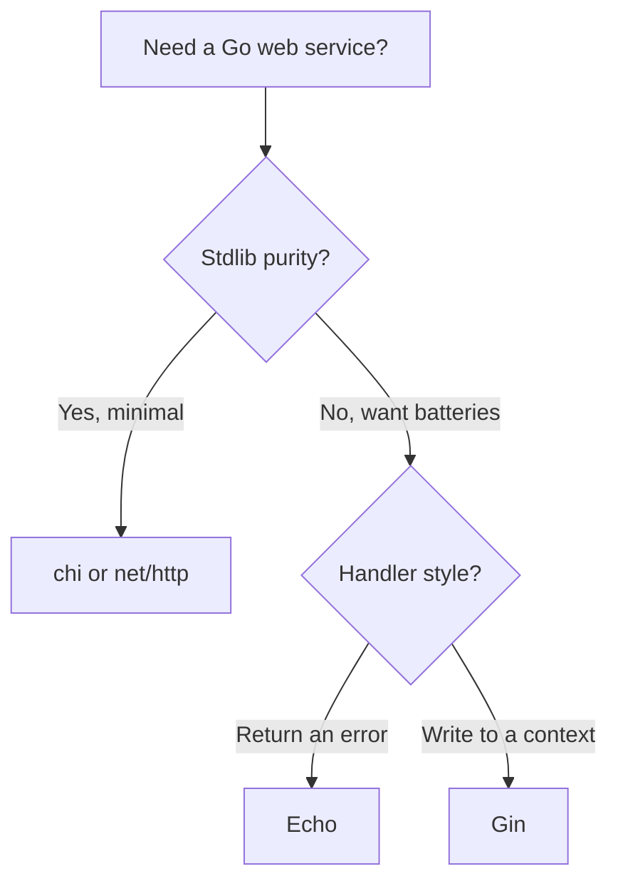

# Where to Go Next

Look at what you can actually do now. You can spin up an Echo server, route requests with
path and query parameters, group routes, bind and validate JSON into structs with `c.Bind`,
shape responses with `c.JSON` and the right status codes, write and chain middleware, build
full CRUD for a resource, and let Echo's central `HTTPErrorHandler` turn returned errors into
clean HTTP responses - then test the whole thing with `httptest` and ship it with graceful
shutdown. That's a real REST API, not a toy.

And here's the quieter win. Echo is a thin, error-clean layer over `net/http`. An
**instance** (`echo.New()`) holds your routes and middleware, an **`echo.Context`** carries
each request, and your handlers `func(c echo.Context) error` *return* their failures for one
central handler to render. Nothing was hidden behind magic - so when something breaks at
2am, you can reason about it.

So this last phase isn't more handlers. It's the map: where Echo sits among the other Go
web frameworks, the layer you'll almost certainly add next, and one concrete thing to go build.

## Echo vs the field

You now know enough to choose a framework *on purpose* rather than by reputation. The good
news in Go: these frameworks are far more alike than the JavaScript world's are. They all sit
on (or near) `net/http`, they all do routing, params, and middleware. The differences are
about *feel*, not whole different universes.



A line on each:

- **Echo** - error-returning handlers (`func(c echo.Context) error`), a generous set of
  built-in middleware, and a central `HTTPErrorHandler` that renders failures in one place.
  If you like writing handlers that hand their errors *up* rather than writing the response
  by hand, this is your framework. (You're here.)
- **Gin** - the most popular Go web framework, with the biggest ecosystem and the most Stack
  Overflow answers. The main stylistic difference: handlers take a `*gin.Context` and *write*
  to it instead of returning an error. See [Gin From Zero](/guides/gin-from-zero).
- **chi** - minimal and proudly so. It's a router that stays *pure* `net/http` - handlers are
  plain `http.HandlerFunc`, middleware is standard `func(http.Handler) http.Handler`. Nothing
  to unlearn, nothing locked in. See [chi From Zero](/guides/chi-from-zero).
- **The standard library alone** - for many services, `net/http` plus modern Go's routing is
  genuinely enough. Knowing what Echo saves you starts with knowing what you'd write by hand.
  See [Web Services With Only net/http](/guides/web-services-with-only-net-http).

> 💡 How to pick: Echo and Gin are *very* close - same speed class, same batteries-included
> spirit. The real choice between them is taste: do you prefer handlers that **return an error**
> (Echo) or ones that **write to a context** (Gin), and which built-in middleware you want out
> of the box. Reach for **chi or net/http** instead when you want stdlib purity and zero lock-in.

📝 None of these is "the best." They're aimed at slightly different tastes. The senior instinct
isn't memorizing a winner - it's asking "best for *this* job and *this* team?"

## The layer you'll add next: a real database

Every API in this guide stored books in memory. That's perfect for learning and useless in
production - restart the server and the data's gone. The very next thing almost every real Echo
service grows is a **database**.

Here's the reassuring part: your handlers barely change. Remember how Phase 6 kept the HTTP
logic separate from where the data lived? That paid off. The handler still binds JSON, validates,
calls a store, and returns a response (or an error). All that swaps underneath is the store - 
from a map to a database-backed one.

[GORM From Zero](/guides/gorm-from-zero) is the natural next read. GORM is Go's most popular ORM:
you define your `Book` struct, point it at SQLite (or Postgres later), and your create/read/
update/delete calls become real persistence. The shape of your Phase 6 handlers stays intact - 
you're replacing the bottom layer, not rewriting the top.

## What to build

Reading more won't make this stick. Building one real thing will. Take the **books API** you
grew across this guide and carry it all the way home:

- **Swap the in-memory store for GORM + SQLite** so books survive a restart. The handlers stay;
  the store changes. ([GORM From Zero](/guides/gorm-from-zero) walks the persistence part.)
- **Add JWT auth** with Echo's built-in `middleware.JWT` so each request proves who it is, and
  books belong to a user. This is exactly the middleware pattern from Phase 5, applied to a real job.
- **Add request logging** (and, when you're ready, basic metrics) so you can see what your service
  is doing in production - Echo ships a Logger middleware to start from.
- **Generate API docs** with OpenAPI/Swagger so other people - and future you - can read the contract.
- **Tidy up config** so secrets and ports come from the environment, not hardcoded values.
- **Deploy it** somewhere you can hit from your phone, with the graceful shutdown from Phase 7 wired up.

If the books API feels too familiar, build something small and new end to end instead - a
**notes API** or a **bookmarks API**. Same muscles: routes, binding, a store, middleware, tests,
deploy. Finishing one project completely teaches more than three more tutorials would.

## The clear-eyed close

Echo was never magic. Strip the helpers away and it's a handful of things you now understand
completely: an **instance** that holds your routes, a **context** that carries each request, a
**middleware chain** that wraps it all, and handlers that **return errors** for a central handler
to render - all sitting on the same `net/http` you could write by hand if you had to.

That's why you can read the machine now, and reason about it when it misbehaves. Go finish the
books API, give it a database, lock it behind JWT, deploy it, and show someone. You're ready.

## Recap

1. **You can ship a real Echo API** - routed, bound and validated, middleware-wrapped, tested,
   and deployed - and you understand *why*, because Echo hid nothing behind magic.
2. **Echo and Gin are close cousins** - same speed class and batteries; pick by handler style
   (Echo returns errors, Gin writes to a context) and which built-in middleware you want.
3. **Reach for chi or net/http** when you want stdlib purity and zero lock-in instead of batteries.
4. **A database is the next layer** - most Echo services add one, and with the Phase 6 separation
   in place your handlers barely change; you swap the in-memory store for GORM.
5. **Build and finish one thing** - carry the books API to GORM + SQLite, JWT auth, request logging,
   OpenAPI docs, real config, and a deploy. Or build a small notes / bookmarks API end to end.

## Quick check

Three decisions to take with you as you leave this guide:

```quiz
[
  {
    "q": "You like writing handlers that return an error for one central handler to render, and you want generous built-in middleware. Which framework fits best?",
    "choices": [
      "chi, because it's minimal",
      "Echo, with its error-returning handlers and central HTTPErrorHandler",
      "net/http alone, always",
      "Gin, because it writes to a context"
    ],
    "answer": 1,
    "explain": "Echo's whole personality is handlers that return an error (func(c echo.Context) error) for a central HTTPErrorHandler, plus a generous set of built-in middleware. Gin writes to a context instead; chi and net/http favor stdlib purity over batteries."
  },
  {
    "q": "How should you plainly choose between Echo and Gin?",
    "choices": [
      "Gin is always faster, so pick Gin",
      "They're very close - pick by handler style (return an error vs write to a context) and which built-in middleware you want",
      "Echo is built on fasthttp, so it can't use net/http middleware",
      "Echo is for beginners and Gin is for experts"
    ],
    "answer": 1,
    "explain": "Echo and Gin are in the same speed and batteries class. The real difference is taste: error-returning handlers (Echo) versus writing to a context (Gin), and which built-in middleware each gives you. Both sit on net/http."
  },
  {
    "q": "You're adding a real database to your books API from Phase 6. What mostly changes?",
    "choices": [
      "Every handler must be rewritten from scratch",
      "Only the store layer swaps from an in-memory map to a GORM-backed one; the handlers stay roughly the same",
      "You must abandon Echo and switch to chi",
      "Nothing - Echo stores data in a database automatically"
    ],
    "answer": 1,
    "explain": "Because the HTTP logic was kept separate from where data lives, the handlers still bind, validate, call a store, and return a response or error. You swap the store from a map to GORM + a database - the bottom layer changes, the top stays."
  }
]
```

---

[← Phase 7: Testing & Production](07-testing-and-production.md) · [Guide overview](_guide.md)
