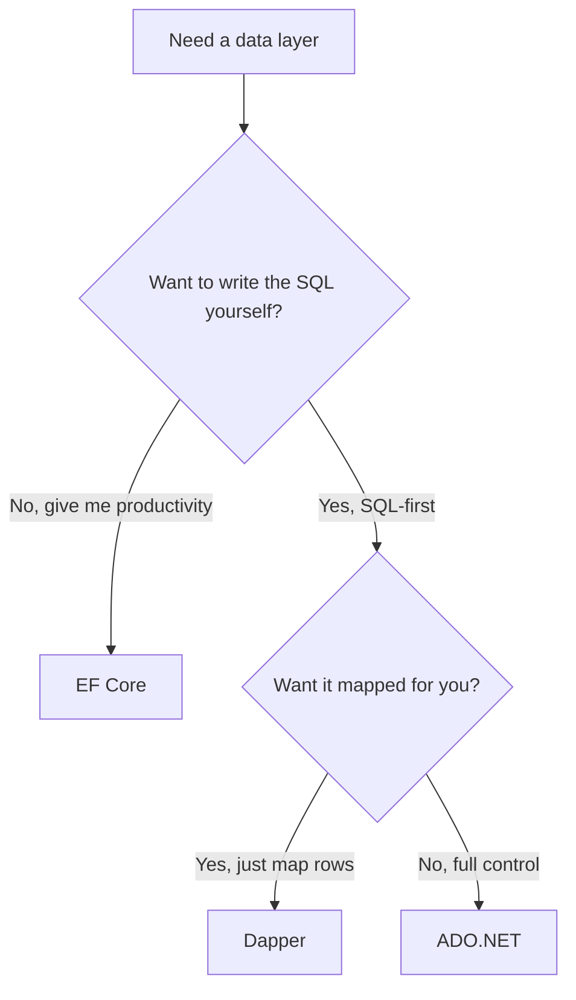

# EF Core in the Real World & Where to Go Next

Look at the distance you've covered. You can model a table as a C# class and let a migration build it. You can `Add` a record and `SaveChanges`, then read it back with `Find`, `First`, or `Single`. You can chain `Where`, `OrderBy`, `Select`, and `Include` into the exact query you mean. You understand change tracking — that the `DbContext` quietly watches the objects it hands you and batches every edit into one round-trip. You can model one-to-many and many-to-many relationships, spot an N+1 explosion before it ships and reach for `Include`, wrap a sequence of writes in a transaction, and reason about migrations in production.

And most of all — the whole point of learning EF Core this way — you can read the SQL underneath. With logging on, EF Core stopped being a magic box and became a SQL generator whose output you can predict and debug. That skill outlives any single library.

This last phase isn't new mechanics. It's where EF Core actually lives in real .NET codebases, where it isn't the right tool, and what to build to make all of this stick.

## When to drop to raw SQL

Worth saying out loud, since it surprises people who expect an ORM to be a cage: **EF Core never traps you.** Any time the generated SQL gets awkward, go SQL-first for that one query and keep using EF Core for everything else.

When does that moment arrive?

- **Complex reporting queries** — a seven-way join, window functions, a recursive CTE. The ORM fights you here, and you shouldn't fight back.
- **Database-specific features** — something only your engine offers that EF Core's portable layer doesn't expose cleanly.
- **Performance-critical paths** — a hot query where the generated SQL is suboptimal and you want to hand-tune every clause.

The friendliest door is `FromSql`. Pass an interpolated string and EF Core turns the interpolation holes into real SQL parameters — and you get back tracked entities, exactly as if you'd queried normally:

```csharp
var posts = ctx.Posts
    .FromSql($"SELECT * FROM Posts WHERE Title = {title}")
    .ToList();
```

📝 That `{title}` is **not** string concatenation. The interpolated `FromSql` parameterizes the value for you — the same protection against SQL injection as LINQ. If you need to build parameters yourself, `FromSqlRaw` lets you pass them manually (and puts the safety on you). For writes that don't return rows, use `ExecuteSql`:

```csharp
ctx.Database.ExecuteSql($"UPDATE Posts SET Published = {true} WHERE BlogId = {blogId}");
```

Drop to raw SQL, yes; drop your guard, no.

## EF Core vs Dapper vs ADO.NET

EF Core is the default in .NET, but not the only way to talk to a database — knowing the landscape helps you pick well and read other people's code.

- **EF Core** — a full ORM. You describe data as classes, query with LINQ, and it writes the SQL, tracks changes, and manages migrations. It optimizes for productivity.
- **Dapper** — a *micro-ORM*. You write the SQL yourself; Dapper maps the result rows onto your objects. No change tracking, no LINQ-to-SQL — fast, predictable, and you own every query.
- **ADO.NET** — the lowest level: raw commands, readers, and parameters by hand. Maximum control, maximum boilerplate. Both EF Core and Dapper sit on top of it.



💡 The honest rule: reach for **EF Core when you want productivity** — fast CRUD, relationships handled, migrations baked in, covering most apps. Reach for **Dapper on hot read paths** or when you want SQL-first control without an ORM in the way. The part people miss: **they coexist beautifully.** A very common production setup is EF Core for writes and the everyday model, with Dapper dropped in for a handful of heavy read queries.

## The caveats, honestly — and ASP.NET Core

A battle-hardened friend tells you where the dragons are. The short list of EF Core's, all of which you've already met:

- **The detached-entity trap (Phase 5).** An object that didn't come from *this* context isn't tracked, so editing it and calling `SaveChanges` does nothing until you `Attach` or `Update` it. Know which context an entity belongs to.
- **Forgetting `Include` → N+1 (Phase 7).** Load a list, then touch each item's navigation property, and you fire one query per row. Eager-load with `Include` and watch the count collapse.
- **Generated SQL can be suboptimal.** EF Core aims for correctness and portability, not always the leanest query. Keep logging on and read what it emits. When a query is slow, the logged SQL is your first clue — see [Why Is My Query Slow?](/guides/why-is-my-query-slow).

Now, the place EF Core most often lives: as the data layer of an [ASP.NET Core](/guides/aspnet-core-from-zero) app. You register the context with the dependency injection container once at startup:

```csharp
builder.Services.AddDbContext<BlogContext>(o => o.UseSqlite(conn));
```

📝 `AddDbContext` registers the context as **Scoped** — one instance per HTTP request. Inject it into your endpoints or services and use it for that request; the framework disposes it when the request ends. **Don't share a `DbContext` across threads or requests** — a context is a unit of work for one request, not a long-lived singleton; sharing one is how you get tangled change-tracking and concurrency bugs.

## What to build

Reading got you here. Building is what makes it last. If you've done the [ASP.NET Core](/guides/aspnet-core-from-zero) guide, you built a products (or blog) API backed by an in-memory repository in Phase 6. Swap that repository for an EF Core-backed one and point it at a real database.

Concretely:

- **Back it with EF Core + a real DB.** Register the context with `AddDbContext`, inject it into your endpoints, and let your `POST`/`GET`/`PUT`/`DELETE` handlers do real CRUD against the database.
- **Go async everywhere.** Use `ToListAsync`, `FirstOrDefaultAsync`, and `SaveChangesAsync` so requests don't block a thread while the database works.
- **Tune reads.** Add `AsNoTracking` to read-only queries so EF Core skips change-tracking overhead, and reach for compiled queries on the hottest paths.
- **Use a real provider.** SQLite is a fine sandbox; for production, move to SQL Server or PostgreSQL (via Npgsql). The model and your LINQ stay the same — only the provider and connection string change.

Then deploy it somewhere, even a tiny instance. Keep logging on and watch your endpoints turn into SQL as requests come in. Whatever you build, **finish one** — a small API you actually debugged and deployed teaches more than three half-built ones.

You came in seeing an ORM as a trick that turned objects into rows somehow. You're leaving able to model, migrate, query with LINQ, track changes, relate, beat N+1, transact — and, when the ORM gets in your way, drop to the SQL it was writing all along. A **`DbContext` is a change-tracking session**, **`DbSet`s are your tables**, **LINQ becomes SQL** — and you can always see that SQL and reach past it.

## Recap

1. **EF Core never locks you in.** Drop to raw SQL with `ctx.Posts.FromSql($"...")` (interpolated → parameterized, returns tracked entities), `FromSqlRaw` for manual params, and `ctx.Database.ExecuteSql($"...")` for non-queries — for reporting, DB-specific features, or hot paths.
2. **Know the alternatives.** EF Core is the full ORM for productivity; **Dapper** is the micro-ORM where you write SQL and it maps rows; **ADO.NET** is the raw layer underneath both. They coexist — EF for writes, Dapper for heavy reads is common.
3. **Remember the caveats.** The detached-entity trap, forgetting `Include` and triggering N+1, and occasionally suboptimal generated SQL — all manageable once you keep logging on and read what EF emits.
4. **With ASP.NET Core, register via `AddDbContext`.** The context is **Scoped** (one per request) — inject it, don't share it across threads or requests.
5. **Build for real:** take the ASP.NET Core products/blog API, back it with EF Core and a real DB, add async + `AsNoTracking` reads, and deploy. Finish one.

## Quick check

One last check — on how EF Core shows up in real .NET apps:

```quiz
[
  {
    "q": "You need a gnarly reporting query — a multi-table join with window functions — and EF Core's LINQ gets awkward. What's the mature move?",
    "choices": [
      "Use ctx.Posts.FromSql($\"...\") for that one query (interpolated, so it stays parameterized) and keep using EF Core everywhere else",
      "Abandon EF Core entirely and rewrite the whole app on raw ADO.NET",
      "Force it through Include no matter how many queries it fires",
      "Build the SQL string by concatenating the user's input directly into FromSqlRaw"
    ],
    "answer": 0,
    "explain": "EF Core never traps you. Use FromSql with an interpolated string for the awkward query — it parameterizes the values and returns tracked entities — and keep the ORM for the rest. ExecuteSql covers non-query writes."
  },
  {
    "q": "Your app is mostly EF Core, but one read-heavy endpoint is hot and you want hand-tuned SQL mapped straight onto objects, with no change tracking. What fits?",
    "choices": [
      "Dapper — a micro-ORM where you write the SQL and it maps rows to objects; it coexists fine alongside EF Core",
      "EF Core only — never mix data libraries in one app",
      "ADO.NET, rewriting every other query by hand too",
      "Migrations — that's a schema tool, not a query layer"
    ],
    "answer": 0,
    "explain": "Dapper is the SQL-first micro-ORM: you write the query, it maps the rows, no tracking. EF for writes plus Dapper for heavy reads is a common, healthy production setup — they coexist."
  },
  {
    "q": "How should you register and use EF Core's DbContext in an ASP.NET Core app?",
    "choices": [
      "builder.Services.AddDbContext<BlogContext>(...) registers it as Scoped — one per request; inject it and don't share it across threads or requests",
      "Register it as a singleton and share one context across every request for speed",
      "Create a new DbContext manually inside each LINQ statement",
      "Skip DI entirely and store the context in a static field"
    ],
    "answer": 0,
    "explain": "AddDbContext registers the context as Scoped — one instance per HTTP request. Inject it into endpoints/services and let the framework dispose it. A DbContext is a unit of work for one request; sharing it across threads or requests causes tracking and concurrency bugs."
  }
]
```

---

[← Phase 8: Transactions & Migrations in Production](08-transactions-and-migrations.md) · [Guide overview](_guide.md)
