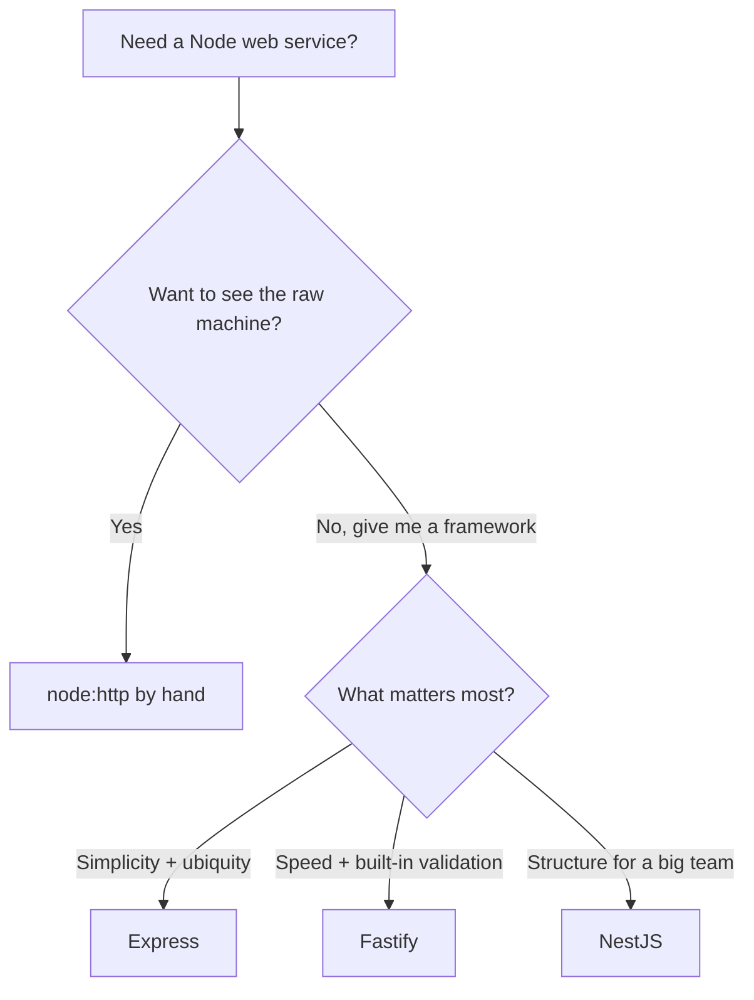

# Where to Go Next

Stop for a second and look at what you can actually do now. You can spin up an Express server, route requests by method and path with params and query strings, write and order middleware in the `(req, res, next)` chain, read a request body and shape a response with `res.json` and the right status code, validate input, build full CRUD for a resource, catch failures in one error-handling middleware, structure the app past a single file, and test it with supertest before shipping it with real config. That's a working REST API, not a toy.

And here's the quieter win. Because Express is so small, you didn't only learn a framework — you saw what one *is*. Strip the helpers away and an Express app is a single idea repeated everywhere: **a pipeline of `(req, res, next)` functions over Node's built-in HTTP server.** Routes are middleware bound to a method and path. Parsers are middleware. Auth is middleware. The error handler is middleware with one extra argument. Nothing was hidden behind magic, which means when something breaks at 2am, you can actually reason about it.

So this last phase isn't more handlers. It's the map: where Express sits among the other Node web frameworks, the version note worth knowing, the ecosystem you'll add next, and one concrete thing to go build.

## Express vs the field

You now know enough to choose a framework *on purpose* rather than by reputation. The honest truth is that these tools aren't competing for the same exact spot — they're aimed at different sizes of problem and different tastes.



A line on each:

- **Express** — minimal and everywhere. A thin layer over `node:http` that gives you routing and the middleware chain, then leaves the rest (body parsing, auth, validation, templating) to middleware you assemble yourself. The biggest ecosystem, the most tutorials and Stack Overflow answers, and the framework you're most likely to meet in a Node job. (You're here.)
- **Fastify** — built for speed and built around *schemas*. You declare a JSON schema for a route's body and reply, and Fastify uses it for both validation and fast serialization. It has a plugin system instead of bare middleware. If raw throughput and built-in validation matter to you, this is the one to feel. See [Fastify From Zero](/guides/fastify-from-zero).
- **NestJS** — opinionated and TypeScript-first. It brings structure: dependency injection, modules, controllers, decorators — an Angular-flavored architecture that pays off when an app and a team get large. More to learn up front, more guardrails once you're moving. See [NestJS From Zero](/guides/nestjs-from-zero).
- **The bare foundation** — `node:http` itself, with no framework at all. Knowing what Express saves you starts with knowing what you'd otherwise write by hand. See [Build a Server With node:http](/guides/build-a-server-with-node-http).

> 💡 How to pick: reach for **Express** when you want simplicity and ubiquity and you're happy assembling the pieces yourself. Reach for **Fastify** when you want speed plus validation and serialization baked in. Reach for **NestJS** when you want enforced structure for a large app or team. None of these is "the best" — the senior instinct isn't memorizing a winner, it's asking "best for *this* job?" and answering honestly. You have the pieces for that now.

## A note on Express 5

📝 While you were learning, the goalposts moved in a good way. **Express 5 is now the current major version.** It's mostly compatible with the Express 4 you've been writing — most code carries over untouched — but it ships one quality-of-life win that's worth calling out, because it directly touches Phase 6.

In Express 4, an error thrown inside an `async` route handler would *not* reach your error-handling middleware on its own — you had to catch it and pass it to `next(err)` yourself, or wrap every handler. In **Express 5, async errors are forwarded automatically**: if a promise rejects in your handler, Express routes it to your error handler for you. The one consistent error shape you built in Phase 6 now catches async failures with no extra wrapping. Less boilerplate, fewer silently-swallowed rejections. When you start a new project, start it on Express 5.

## The ecosystem you'll reach for

Express stays small on purpose, so a real app is Express plus a handful of well-worn libraries. You don't need all of these on day one — but you'll recognize them, and you'll know where each one slots into the chain.

- **A real database, via an ORM.** Every API in this guide stored tasks in memory — perfect for learning, gone the moment you restart. The next thing almost every Express app grows is persistence. The popular choices are **Prisma** and **Drizzle** (modern, TypeScript-first), with **TypeORM** and **Sequelize** still widely used, and query builders like **Knex** if you want to stay closer to SQL. They all do the same core job — turn rows into objects and back. The concept itself is worth understanding before you pick one: [How an ORM Works](/guides/how-an-orm-works).
- **Auth.** **Passport** is the long-standing middleware for plugging in login strategies (sessions, OAuth, and more); for token-based APIs, a JWT library lets each request prove who it is. Either way, it's the same middleware pattern from Phase 3 — a function in the chain that checks the request and either calls `next()` or rejects.
- **Validation.** You hand-rolled checks in Phase 4; in real apps you'd lean on a library. **zod** is the modern favorite (define a schema, parse the body, get typed data or a clean error), with **joi** and **express-validator** also common.
- **API docs.** `swagger-jsdoc` generates an OpenAPI spec from comments so others — and future you — can read the contract.
- **TypeScript.** Express works great with TypeScript: add `@types/express` and your `req`, `res`, and `next` are typed. Most new Express code today is TypeScript, and everything you learned maps over directly.

## What to build

Reading more won't make this stick. Building one real thing will. So here's the assignment, and it's deliberately concrete.

Take the **tasks API** you grew across this guide and carry it all the way home:

- **Swap the in-memory store for a real database** through an ORM (Prisma or Drizzle are great starting points) so tasks survive a restart. If you kept your data access separate the way Phase 7 nudged, your routes barely change — you replace the bottom layer, not the top. ([How an ORM Works](/guides/how-an-orm-works) explains the concept first.)
- **Add auth** — a JWT or session middleware so each request proves who it is, and tasks belong to a user. This is exactly the Phase 3 middleware pattern doing a real job.
- **Validate with zod** instead of hand-written checks, returning the consistent error shape from Phase 6.
- **Add request logging** so you can see what your service is doing.
- **Deploy it** somewhere you can hit from your phone, wired up the way Phase 8 showed.

If the tasks API feels too familiar, build something small and new end to end instead — a **URL shortener** or a **notes API**. Same muscles: routes, middleware, a store, validation, tests, deploy.

And if you're curious how the trade-offs *feel*, here's a fun one: **rebuild the same tasks API in Fastify or NestJS.** Nothing teaches you what a framework gives and costs like porting an app you already understand. You'll feel Fastify's schemas and Nest's structure in your hands instead of reading about them.

The honest close is the same idea you've held since Phase 0. An Express app is a chain of `(req, res, next)` functions running over `node:http` — and now that you can see that chain, you can read *any* Node backend, not just the ones you wrote. Go give the tasks API a database, lock it behind auth, deploy it, and show someone. You're ready.

## Recap

1. **You can ship a real Express API** — routed, parsed, validated, middleware-wrapped, structured, tested, and deployed — and you understand *why* each piece works, because Express hid nothing.
2. **Express is a pipeline of `(req, res, next)` functions** over `node:http`. Routes, parsers, auth, and the error handler are all that one shape in different costumes.
3. **Choose a framework on purpose** — Express for simplicity and ubiquity, Fastify for speed plus built-in validation, NestJS for structure on a large app or team, bare `node:http` to see the raw machine.
4. **Express 5 is the current major** — mostly compatible with 4, with the big win that async errors are forwarded to your error handler automatically.
5. **The ecosystem fills the gaps** — an ORM (Prisma, Drizzle, TypeORM) for persistence, Passport or JWT for auth, zod for validation, swagger-jsdoc for docs, and TypeScript via `@types/express`.
6. **Build and finish one thing** — carry the tasks API to a database, auth, validation, logging, and a deploy; or port it to Fastify/Nest to feel the trade-offs.

## Quick check

Three decisions to take with you as you leave this guide:

```quiz
[
  {
    "q": "You want maximum throughput and you like declaring a schema once and getting both request validation and fast response serialization from it. Which framework fits best?",
    "choices": [
      "Express, because it's the most popular",
      "Fastify, which is schema-first and built for speed",
      "NestJS, because it uses TypeScript",
      "Bare node:http, always"
    ],
    "answer": 1,
    "explain": "Fastify is built around speed and schemas — one JSON schema drives validation and serialization. Express is minimal and ubiquitous; NestJS brings structure for large apps; node:http is the raw foundation."
  },
  {
    "q": "What is the notable improvement in Express 5 that touches your Phase 6 error handling?",
    "choices": [
      "It removes middleware entirely",
      "Async errors are forwarded to the error-handling middleware automatically, no manual next(err) wrapping needed",
      "It replaces node:http with fasthttp",
      "It makes res.json mandatory"
    ],
    "answer": 1,
    "explain": "In Express 4 you had to catch errors in async handlers and call next(err) yourself. Express 5 forwards rejected promises to your error handler automatically, so your one consistent error shape catches async failures with no extra wrapping."
  },
  {
    "q": "You're adding a real database to your tasks API and you kept data access separate as Phase 7 suggested. What mostly changes?",
    "choices": [
      "Every route handler must be rewritten from scratch",
      "Mainly the store layer swaps from an in-memory object to an ORM-backed one; the routes stay roughly the same",
      "You must abandon Express and switch to NestJS",
      "Nothing — Express persists data to a database automatically"
    ],
    "answer": 1,
    "explain": "Because the HTTP logic was kept separate from where data lives, your routes still parse, validate, call a store, and respond. You swap the store from an in-memory object to an ORM plus a database — the bottom layer changes, the top stays."
  }
]
```

---

[← Phase 8: Testing & Production](08-testing-and-production.md) · [Guide overview](_guide.md)
