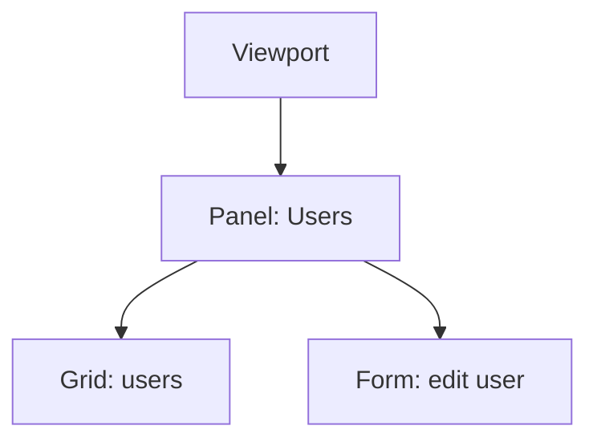

# Components & the Containment Tree

[The last phase](02-the-class-system.md) covered how Ext JS classes are declared - 
`Ext.define`, `extend`, the `config` block, `xtype`. Now we use those classes to build
something you can actually see, via the one idea that makes a sprawling legacy Ext JS
app readable instead of terrifying.

💡 **The mental model: your UI is a tree, and you only ever write the tree - never the
DOM.** No appending `<div>`s, no `appendChild`. You write a nested config object that
says "a viewport containing a panel, and that panel contains a grid and a form," and
the framework walks that tree, instantiates each node, lays it out, and renders the
real HTML for you. The structure you write *is* the structure of the screen. When you
inherit an Ext JS codebase, you are reading someone's tree.

Here's that tree as a config, for our running **users admin** screen - a grid of users on
the left, an edit form on the right:

```javascript
Ext.create('Ext.container.Viewport', {
    layout: 'border',
    items: [
        {
            xtype: 'panel',
            region: 'center',
            title: 'Users',
            items: [
                { xtype: 'grid', /* ...the users grid... */ },
                { xtype: 'form', /* ...the edit form...  */ }
            ]
        }
    ]
});
```

*What just happened:* we described a screen, we didn't build one. The `Viewport` is the
root node (it fills the browser window). Its `items` array holds one panel; that panel's
`items` array holds a grid and a form. `xtype` names the class for each node so the
framework knows what to instantiate. `items` nesting *is* the layout wiring - no HTML
touched anywhere.

The same tree, drawn out:



📝 Keep that picture in your head for the whole framework. A grid is a node. A form field
is a node. A button inside a toolbar inside a panel - all nodes. Phase 5's stores feed
data *into* these nodes, but the skeleton is always this containment tree.

## Component vs Container vs Panel

Three classes form a ladder, and almost every widget you'll meet sits on a rung.

- **`Ext.Component`** is the base of *every visible thing*. It owns a lifecycle, a position
  in the tree, an element it renders to, show/hide, and so on. A plain component is a leaf - 
  it does not hold children.
- **`Ext.container.Container`** *is* a component that can hold child components, in its
  **`items`** array. It adds the machinery to manage children and arrange them with a
  **layout** (Phase 4). Anything with `items` is a container.
- **`Ext.panel.Panel`** is the container you'll see most often: a container plus a
  **header/title**, a **border**, and **tools** (the little buttons in the header), docked
  toolbars, collapsibility, and so on. Grids, forms, windows, and tab panels all **extend
  Panel** - which is why they all have titles and borders "for free."

```javascript
// Leaf component - no items, just renders something:
{ xtype: 'component', html: 'Just some markup, no children.' }

// Container - holds children, arranges them, but no chrome:
{ xtype: 'container', items: [ { xtype: 'button', text: 'A' },
                               { xtype: 'button', text: 'B' } ] }

// Panel - a container WITH a title, border, and header tools:
{ xtype: 'panel', title: 'Users', items: [ /* ...children... */ ] }
```

*What just happened:* same `items` mechanism each step up the ladder; the difference is
purely what each class adds. The bare `component` has no `items` because it can't hold any.
The `container` holds children but draws no header - useful for invisible grouping. The
`panel` is the same thing dressed up with the chrome users expect. When you see a class in
legacy code, ask "is it a Component (leaf), a Container (holds items), or a Panel
(container with chrome)?" - that one question tells you most of what it does.

## The lifecycle, and why "hidden" is not "destroyed"

A component isn't just a config blob - it goes through a fixed sequence of life stages, and
knowing them is how you debug "my setup code ran too early" and "why is the app leaking memory."

The Classic toolkit lifecycle, in order:

`constructor` → **`initComponent`** → `render` → `afterRender` → ... (lives, reacts to
events) ... → `destroy`

The one you override constantly is **`initComponent`** - the canonical place to set up
config and build `items` *before* the component renders.

```javascript
Ext.define('App.view.UsersGrid', {
    extend: 'Ext.grid.Panel',
    xtype: 'usersgrid',

    initComponent: function () {
        this.title = 'Users';
        this.columns = [
            { text: 'Name',  dataIndex: 'name',  flex: 1 },
            { text: 'Email', dataIndex: 'email', flex: 2 }
        ];
        this.callParent(arguments); // ⚠️ never skip this
    }
});
```

*What just happened:* we subclassed a grid and used `initComponent` to assemble its config
just before render - handy when a value has to be computed (a default title, columns built
from a variable) rather than written as a static literal. The critical line is
`this.callParent(arguments)`: it runs the parent's `initComponent`, which is what actually
wires up the component. Forget it and your component half-initializes and fails in
confusing ways. (The Modern toolkit leans on the `config` block and an `initialize` method
instead, but the override-and-`callParent` discipline is the same idea.)

⚠️ **The part that bites people: hiding a component does not destroy it.** `cmp.hide()`
just sets it invisible - the instance, its DOM, event listeners, and any store bindings
all still exist, consuming memory. If your code creates components over and over (open a
window, close it, open it again...) and only *hides* them, you have a **memory leak** and
stale listeners firing on ghosts. To truly free a component you must **`destroy`** it.

```javascript
win.hide();      // invisible, but fully alive - listeners still attached, DOM still there
win.destroy();   // tears down DOM + listeners + child components; the instance is gone
```

*What just happened:* `hide()` is for "I'll show this again in a second." `destroy()` is for
"I'm done with this forever." A container's `destroy()` cascades - destroying a panel
destroys its grid and form too. Rule of thumb for inherited code: things created repeatedly
but never destroyed mean a leak.

## Adding and removing children at runtime

The tree isn't frozen at startup - containers grow and shrink while the app runs. This is
how a "+ Add User" button makes a new form appear, or how closing a tab removes a panel.

```javascript
var panel = Ext.getCmp('mainPanel'); // (shown for illustration - see the warning below)

panel.add({ xtype: 'form', title: 'Edit User' }); // append a child to items
panel.remove(someChildComponent);                 // remove one child (destroys it by default)
panel.removeAll();                                 // clear every child
```

*What just happened:* `add` takes a config object (or a real component) and slots it into
the container's `items`, then re-runs the layout so it appears. `remove` pulls one child out
 - and by default **destroys** it, which is usually what you want (no leak). `removeAll`
empties the container, and each call re-lays-out the container so children rearrange
automatically. Notice we had to *find* `panel` first - the next, and most important, skill.

## Finding components - done right

The single most useful skill for navigating an inherited Ext JS codebase: grabbing a
component to read its value, refresh its store, or react to a click. There's a wrong way
that's all over old code, and a right way.

### ⚠️ The trap: `Ext.getCmp` and global ids

```javascript
// DON'T build code around this:
var grid = Ext.getCmp('usersGrid'); // requires a hand-assigned id: 'usersGrid'
```

*What just happened:* `Ext.getCmp(id)` looks up a component by a manual `id:` you set in its
config. It *works* - but `id` must be **globally unique across the entire app**, forever. The
moment two instances of the same view exist (two tabs, a reused window), their ids collide
and the lookup returns the wrong one or breaks outright. It's a well-known anti-pattern - 
recognize it in legacy code, and don't add more of it.

### The safe local id: `itemId`

If you need a stable handle inside one container, use **`itemId`** - it's scoped to that
container, so it can't collide globally - and reach it with `down('#...')`:

```javascript
{ xtype: 'panel', items: [ { xtype: 'textfield', itemId: 'emailField' } ] }
// later, from the panel:
var field = panel.down('#emailField'); // '#' targets an itemId, scoped to this panel
```

*What just happened:* `itemId` is the leak-free cousin of `id` - two copies of this panel can
each have their own `emailField` without conflict, because the lookup is relative to the
container, not the whole page.

### The right way: `reference` + `lookupReference`

In a modern MVVM app (Phase 7), you tag a child with **`reference`** and look it up from the
view's **ViewController** with **`lookupReference`** (or `view.lookup` in newer versions):

```javascript
// In the view:
{ xtype: 'textfield', reference: 'emailField' }

// In the ViewController:
onSaveClick: function () {
    var field = this.lookupReference('emailField'); // newer: this.lookup('emailField')
    console.log(field.getValue());
}
```

*What just happened:* `reference` names a child *within its view*, and the ViewController
resolves it locally. No global namespace, no collisions, and the wiring lives right next to
the logic that uses it. When you see `reference` in a view and `lookup`/`lookupReference` in
a controller, they're two ends of the same string.

### Walking the tree: `up()` and `down()`

Often you already have *one* component (the button that was clicked) and need its
neighbor - walk the tree relative to where you are:

- **`cmp.up('selector')`** - the nearest **ancestor** that matches.
- **`cmp.down('selector')`** - the first **descendant** that matches.

```javascript
onDeleteClick: function (button) {
    var grid = button.up('grid');                    // nearest grid ancestor of the button
    var emailField = grid.up('panel')               // hop up to the surrounding panel...
                         .down('textfield[name=email]'); // ...then down to a field in it
}
```

*What just happened:* `up('grid')` climbs from the button toward the root until it hits a
grid - no id needed, just "the grid I live inside." `down('textfield[name=email]')`
descends to the first text field whose `name` is `email`. This is how event handlers find
their context: start from what you were handed, navigate by relationship.

### Querying anywhere: `Ext.ComponentQuery`

The selectors above (`'grid'`, `'#emailField'`, `'textfield[name=email]'`) are **component
queries** - CSS-like selectors matching over **xtypes and component attributes** instead of
HTML tags and classes. `up`/`down` run them relative to a component; `Ext.ComponentQuery.query`
runs one globally:

```javascript
Ext.ComponentQuery.query('grid');                  // every grid in the app
Ext.ComponentQuery.query('panel > grid');          // grids that are direct children of a panel
Ext.ComponentQuery.query('textfield[name=email]'); // all email fields anywhere
```

*What just happened:* same selector grammar as `up`/`down`, returning an **array** of every
match across the whole component tree. `xtype` is the "tag", `[attr=value]` filters by config,
`>` means direct child - read it like CSS for components. In a strange codebase this is your
flashlight: query for the component you can see on screen, inspect what comes back, and
you've found where it lives in the tree.

💡 The practical hierarchy of "how do I get a component," best first: **`reference` +
`lookupReference`** (or a relative `up`/`down`) for everyday view logic; **`itemId` +
`down('#...')`** when you need a stable local handle; **`Ext.ComponentQuery`** for ad-hoc
spelunking and debugging; and **`Ext.getCmp` only** when you're reading old code that already
uses it - never as the way you write new code.

## Recap

- **Your UI is a tree of components**, and `items` is the only nesting you write - the
  framework instantiates the tree and renders the real DOM. Reading an Ext JS app means
  reading its containment tree.
- **Component → Container → Panel** is a ladder: every visible thing is a `Component`; a
  `Container` adds child `items` and a layout; a `Panel` adds a header/title/border. Grids,
  forms, and windows extend Panel.
- The Classic **lifecycle** is `constructor` → `initComponent` → `render` → `afterRender` →
  `destroy`; override `initComponent` to set up config and always call `callParent`.
- **`hide()` ≠ `destroy()`** - hidden components keep their DOM, listeners, and bindings
  alive. Destroy what you're done with, or leak memory.
- Containers change at runtime with **`add`**, **`remove`**, and **`removeAll`**.
- **Find components the right way:** prefer `reference` + `lookupReference` and relative
  `up()`/`down()`; use `itemId` for safe local handles and `Ext.ComponentQuery` for
  exploration. Treat `Ext.getCmp` and global `id` as a legacy anti-pattern.

## Quick check

Lock in how the tree fits together and how to navigate it:

```quiz
[
  {
    "q": "What is the difference between Ext.container.Container and Ext.panel.Panel?",
    "choices": [
      "Container renders HTML; Panel does not",
      "A Container holds child components via items; a Panel is a Container that also adds a header/title and border",
      "Panel is the base class that Container extends",
      "They are aliases for the same class"
    ],
    "answer": 1,
    "explain": "Container adds the items machinery to Component; Panel is a Container with chrome (header, title, border). Grids and forms extend Panel."
  },
  {
    "q": "You call cmp.hide() on a window and reopen a fresh one each time the user clicks a button, never destroying the old ones. What happens?",
    "choices": [
      "Nothing - hide() fully frees the component",
      "Ext JS automatically garbage-collects hidden components",
      "The old instances stay alive with their DOM and listeners, leaking memory",
      "The new window reuses the hidden one automatically"
    ],
    "answer": 2,
    "explain": "hide() only makes a component invisible. Its DOM, listeners, and bindings stay alive until you destroy() it - so repeatedly hiding instead of destroying leaks."
  },
  {
    "q": "Which is the recommended way to get a child component in modern Ext JS, and which is the anti-pattern to avoid?",
    "choices": [
      "Recommended: Ext.getCmp('id'); avoid: reference + lookupReference",
      "Recommended: reference + lookupReference (or up()/down()); avoid: Ext.getCmp with a global id",
      "Recommended: document.querySelector; avoid: Ext.ComponentQuery",
      "Both Ext.getCmp and reference are equally fine"
    ],
    "answer": 1,
    "explain": "Global ids must be unique forever and collide on reuse. Prefer reference + lookupReference (or relative up()/down()); Ext.getCmp is a legacy anti-pattern."
  }
]
```

---

[← Phase 2: The Class System](02-the-class-system.md) · [Guide overview](_guide.md) · [Phase 4: Layouts: How Things Get Positioned →](04-layouts.md)
