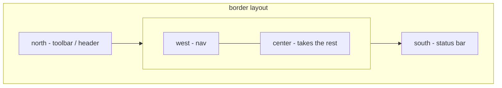

# Layouts: How Things Get Positioned

Here's the one idea that, once it lands, makes Ext JS layouts stop fighting you: **you do not size things with CSS. The parent's `layout` sizes its children.**

Coming from the web, that's backwards. Normally you slap `width: 50%` on a div and you're done. In Ext JS, you can set `width` and `height` on a component and still watch it render at zero pixels — or vanish entirely — because a *container* doesn't ask its children how big they want to be. It runs its **layout**, and the layout decides each child's box. The child is a passenger; the parent's `layout` drives.

> 💡 Every layout below is just a different *strategy a parent uses to size and place its `items`.* `fit` means "one child, fill me." `hbox` means "lay children left to right." `border` means "children claim edges." Same job, different rule.

Every container has a `layout` config. Skip it and you get the default — `auto` — which is exactly where beginners get burned.

## The default `auto` layout (and why it disappoints)

A container with no `layout` set uses `layout: 'auto'`, which does almost nothing: it stacks children as plain block-level elements, top to bottom, each taking its natural content height with **no managed width or height at all**.

```javascript
Ext.create('Ext.panel.Panel', {
    renderTo: Ext.getBody(),
    title: 'Users',
    height: 400,
    // no layout specified -> 'auto'
    items: [
        { xtype: 'grid', /* ...columns, store... */ },
        { xtype: 'form', /* ...fields... */ }
    ]
});
```

*What just happened:* the panel is 400px tall, but `auto` doesn't divide that 400px between the grid and the form — it drops them in as unsized blocks. The grid, having no managed height, often collapses to almost nothing, leaving an empty panel with no obvious cause. Nothing is broken; the parent never told the grid how tall to be. This single misunderstanding is behind most "my Ext JS screen is blank" panic.

The fix is always the same shape: **pick a layout that actually sizes the children.**

## `fit` — one child, fill the box

`fit` is the simplest useful layout. The container has **exactly one child**, and that child is stretched to fill the container completely — full width, full height.

```javascript
Ext.create('Ext.panel.Panel', {
    renderTo: Ext.getBody(),
    title: 'Users',
    height: 400,
    width: 600,
    layout: 'fit',
    items: [
        { xtype: 'grid', /* columns, store */ }
    ]
});
```

*What just happened:* the grid now fills the entire 600×400 panel because `fit` told it to. This is the canonical pattern for "a panel that wraps a single grid," and you'll see it constantly in legacy code as a window whose only job is to frame one component.

> ⚠️ `fit` is built for **one** child. If you give it multiple `items`, only the **first** one shows — the rest are still created but laid out on top / hidden behind it. If you put two things in a `fit` container and the second vanished, that's not a bug, that's `fit` doing exactly what it says. You wanted `hbox`/`vbox` or `card`.

## `hbox` / `vbox` — rows and columns with `flex`

The box layouts are your workhorses. `hbox` lays children out in a **horizontal row**; `vbox` lays them in a **vertical column**. The magic ingredient is **`flex`**: a number on each child that says how to divide the *available space along the main axis* proportionally.

```javascript
Ext.create('Ext.panel.Panel', {
    renderTo: Ext.getBody(),
    title: 'Users',
    height: 400,
    width: 800,
    layout: {
        type: 'hbox',
        align: 'stretch'   // stretch children on the cross-axis (full height)
    },
    items: [
        { xtype: 'grid', flex: 2 /* ...columns, store... */ },
        { xtype: 'form', flex: 1 /* ...fields... */ }
    ]
});
```

*What just happened:* `hbox` puts the grid and form side by side. `flex: 2` and `flex: 1` split the horizontal space two-to-one, so the grid gets twice the width of the form. `align: 'stretch'` is the part beginners forget — it stretches both children to the **full height** of the panel on the cross-axis. Without it, each child is only as tall as its own content, and the grid could collapse again. For `vbox`, swap the roles: `flex` divides the *height*, and `align: 'stretch'` gives children full *width*.

Two more knobs worth knowing:

- **`flex`** vs fixed size: mix them freely. A child with a fixed `width` (in `hbox`) keeps that width, and the `flex` children share whatever's left over.
- **`pack` and `align`**: `pack` controls distribution along the main axis (`'start'`, `'center'`, `'end'`) — handy for right-aligning toolbar buttons. `align` controls the cross-axis (`'stretch'`, `'top'`/`'left'`, `'middle'`/`'center'`, `'bottom'`).

> 💡 Mental shortcut: in `hbox`, `flex` is about *width* and `align` is about *height*. In `vbox`, flip them. The "main axis" is the direction the box lays children out; the "cross axis" is the other one.

## `border` — the classic app shell

`border` is the layout that screams "this is an Ext JS app." Children declare a **`region`** — one of `'north'`, `'south'`, `'east'`, `'west'`, or `'center'` — and the layout pins them to the edges of the container. `center` soaks up whatever space is left.



Here's the users admin shell — a west nav and a center work area:

```javascript
Ext.create('Ext.container.Viewport', {
    layout: 'border',
    items: [
        {
            xtype: 'panel',
            region: 'west',
            title: 'Navigation',
            width: 220,
            collapsible: true,
            split: true,         // draggable splitter between west and center
            html: 'Users · Roles · Settings'
        },
        {
            xtype: 'panel',
            region: 'center',    // REQUIRED — takes all remaining space
            title: 'Users',
            layout: 'fit',
            items: [ { xtype: 'grid' /* columns, store */ } ]
        }
    ]
});
```

*What just happened:* the `Viewport` fills the whole browser window, and `border` carves it up. The west nav gets a fixed `width: 220`, `collapsible: true` gives it a collapse tool, and `split: true` adds a draggable splitter so the user can resize it. The center region claims everything that's left and, via its own `layout: 'fit'`, hands all that space to the grid. North/south regions take a fixed `height`; east/west take a fixed `width`; center never gets a size from you — it just absorbs the remainder.

> ⚠️ **A `border` layout must have exactly one `center` region.** This is non-negotiable — leave out `center` and Ext JS throws an error (older versions) or renders a broken, empty shell. If a `border` screen is blank, check for a `center` first. You can have multiple north/south/east/west regions in some setups, but **one and only one** center, always.

## `card` — show one child at a time

`card` stacks all its children in the same space but shows **only one at a time** — think wizards, step-by-step flows, or the body of a tab panel. Switch which child is visible with `setActiveItem`.

```javascript
var wizard = Ext.create('Ext.panel.Panel', {
    renderTo: Ext.getBody(),
    width: 500,
    height: 300,
    layout: 'card',
    activeItem: 0,   // start on the first card
    items: [
        { xtype: 'form', title: 'Step 1: Account' },
        { xtype: 'form', title: 'Step 2: Profile' },
        { xtype: 'form', title: 'Step 3: Confirm' }
    ]
});

// later, on a "Next" button:
wizard.getLayout().setActiveItem(1);
```

*What just happened:* all three forms exist, but only card 0 is visible at first. `setActiveItem(1)` swaps the display to the second form — no re-creation, just a visibility switch. You've likely used this without knowing it: **`Ext.tab.Panel` uses a `card` layout under the hood**, and clicking a tab is just `setActiveItem` for that tab's body.

## `anchor` — sizing relative to the container

`anchor` sizes children as a percentage (or offset) of the container. You'll meet it in older code:

```javascript
{
    xtype: 'panel',
    layout: 'anchor',
    items: [
        { xtype: 'textfield', anchor: '100%' },     // full width
        { xtype: 'grid',      anchor: '100% 50%' }  // full width, half height
    ]
}
```

*What just happened:* `anchor: '100%'` makes the textfield span the container's full width; `anchor: '100% 50%'` gives the grid full width and half the container's height. It works, but it's the older approach — **box layouts (`hbox`/`vbox`) are usually preferred** for new work because `flex` handles proportional sizing more cleanly. Recognize `anchor` in legacy screens; reach for box layouts when writing fresh ones.

## Layouts nest — and that's the whole trick

No single layout builds a real screen — real screens are layouts inside layouts. The users admin is the textbook case: a `border` viewport whose **center region is itself a `vbox`** holding the grid above the form.

```javascript
Ext.create('Ext.container.Viewport', {
    layout: 'border',
    items: [
        {
            xtype: 'panel',
            region: 'west',
            title: 'Navigation',
            width: 220,
            split: true,
            collapsible: true
        },
        {
            xtype: 'panel',
            region: 'center',
            title: 'Users',
            layout: { type: 'vbox', align: 'stretch' },  // nested layout
            items: [
                { xtype: 'grid', flex: 1 /* the users list */ },
                { xtype: 'form', height: 180 /* edit selected user */ }
            ]
        }
    ]
});
```

*What just happened:* the outer `border` handles the app shell (nav on the left, work area filling the rest). The center region then runs *its own* `vbox`: the grid gets `flex: 1` so it grows to fill the leftover vertical space, while the form keeps a fixed `height: 180` at the bottom. `align: 'stretch'` makes both span the full width of the center region. Each container only worries about its own children — nest them and arbitrarily complex screens fall out of simple rules.

## ⚠️ "Nothing shows up" — the troubleshooting section

> 💡 **If a component is invisible or zero-size, suspect the PARENT'S layout first — not the component.** Nine times out of ten the child is fine; the parent never gave it a box.

When something won't render, walk this checklist in order:

1. **Is the parent on `auto` layout?** No `layout` config means `auto`, which doesn't size children — a grid or panel with no managed height collapses to nothing. Give the parent a real layout (`fit`, `vbox`, `border`...).
2. **Is there a `border` layout with no `center`?** Missing `center` breaks the whole container. Add exactly one `center` region.
3. **Is a child missing its `region`?** In a `border` layout, every child needs a `region`, or it won't lay out.
4. **Box layout with no size on the cross-axis?** In `hbox`/`vbox`, children with no `flex` and no fixed size on the main axis get zero, and without `align: 'stretch'` they get zero on the cross-axis too. Add `flex`, a fixed `width`/`height`, or `align: 'stretch'`.

> ⚠️ A telltale sign: the component shows up in the DOM and in the component tree (you can find it), but it's 0px tall or 0px wide. That is *always* a layout problem, never a "the component is broken" problem. Stop inspecting the child's config — go look at how its parent lays things out.

## Recap

- **The parent's `layout` sizes its children — not CSS.** This is the core mental model; setting `width`/`height` on a child often does nothing because the layout overrides it.
- The default **`auto`** layout barely sizes anything, which is why unconfigured panels look empty. Pick a real layout.
- **`fit`** = one child fills the box; **`hbox`/`vbox`** = rows/columns sized by **`flex`** (and `align: 'stretch'` on the cross-axis); **`border`** = edge `region`s with exactly one required **`center`**; **`card`** = one child visible at a time via `setActiveItem`.
- Layouts **nest** — a `border` center region can hold a `vbox`, and that's how real screens (like the users admin) get built.
- When **"nothing shows up,"** check the **parent's layout** first: `auto` layout, a missing `center`, a missing `region`, or a box child with no size are the usual culprits.

## Quick check

Test what sizes a child, and how to read a blank screen:

```quiz
[
  {
    "q": "You put a grid in a panel, give the grid height: 300, and it still renders at zero height. What's the most likely cause?",
    "choices": ["The grid's store is empty", "The parent panel's layout (probably 'auto') isn't sizing the grid", "You forgot renderTo", "Grids can't have a fixed height"],
    "answer": 1,
    "explain": "In Ext JS the parent's layout sizes children. An 'auto' layout doesn't manage height, so the child collapses no matter what height you set on it."
  },
  {
    "q": "Which statement about the border layout is correct?",
    "choices": ["You must have exactly one 'center' region", "The 'center' region needs a fixed width", "You can have at most one 'west' region and no 'center'", "Regions are optional and default to 'north'"],
    "answer": 0,
    "explain": "A border layout requires exactly one center region; it absorbs the space left after the edge regions take their fixed sizes."
  },
  {
    "q": "In an hbox layout, what does flex: 2 on one child and flex: 1 on another do?",
    "choices": ["Stretches both to full height", "Splits the available WIDTH two-to-one between them", "Splits the available HEIGHT two-to-one", "Shows only the first child"],
    "answer": 1,
    "explain": "In hbox, flex divides the available space along the main (horizontal) axis, so flex 2 vs 1 gives the first child twice the width. Cross-axis height is controlled by align: 'stretch'."
  }
]
```

---

[← Phase 3: Components & the Containment Tree](03-components-and-containers.md) · [Guide overview](_guide.md) · [Phase 5: The Data Package →](05-the-data-package.md)
