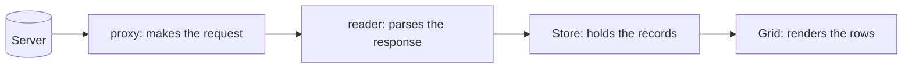

# The Data Package

[The last phase](04-layouts.md) got components to *show up* in the right places. But an empty
grid with three columns and no rows isn't an app — it's a picture of one. Every Ext JS screen
you'll ever inherit is, underneath the chrome, a pipe that pulls rows off a server and pushes
edits back. That pipe is the **data package**, and it's the single biggest source of "why is my
grid empty?" and "why didn't my save go through?" tickets in legacy code.

💡 **The mental model — four pieces, one sentence: a *Model* is the shape of one record, a *Store*
is the collection of records, a *proxy* is where they come from and go back to, and a *reader*
is how the server's response gets parsed into records.** That quartet is the heart of every Ext JS
app. Internalize it and the rest of this phase is just syntax.

Here's the pipe, drawn out — server data flows left to right until it lands in a grid you can see:



*What just happened:* the proxy talks to the server. The reader takes whatever comes back (usually
JSON) and turns it into **Model instances**. The Store collects those instances. The grid binds to
the Store and paints a row per record. When a grid is empty, the bug is somewhere on this line.

📝 The proxy is the only piece here that knows about HTTP. If you're shaky on URLs, GET vs POST, or
what a JSON response body looks like, skim
[HTTP & JSON API basics](/guides/http-and-json-api-basics) first — the data package sits directly
on top of those ideas.

## The Model: the shape of one record

A **`Ext.data.Model`** describes what one record looks like — its fields and their types. It's the
schema for a single row. Here's the `User` model we'll use for the rest of this phase:

```javascript
Ext.define('MyApp.model.User', {
    extend: 'Ext.data.Model',
    fields: [
        { name: 'id',     type: 'int' },
        { name: 'name' },                       // type defaults to 'auto' (string-ish)
        { name: 'email' },
        { name: 'active', type: 'boolean' }
    ]
});
```

*What just happened:* we declared a class with `Ext.define` (the same class system from
[Phase 2](02-the-class-system.md)) that `extend`s `Ext.data.Model`. The `fields` array names each
property a `User` record carries and, optionally, its `type` — `int`, `boolean`, `string`, `date`,
`float`. The type matters: a field declared `type: 'int'` coerces the server's `"42"` string into
a real number `42` on the way in, so your renderers and comparisons behave. A `User` instance
isn't a plain object — it's a record with methods (`get`, `set`, dirty tracking) we'll use shortly.

💡 Models can do more than fields: they can declare **validators**, and **associations**
(`hasMany` / `belongsTo`) so a `User` can reach its `Orders`, and a model can even carry its own
`proxy` so it knows how to load and save itself. You'll see all of these in older codebases; for
now, fields are enough to get rows on screen.

## The Store: the collection of records

A **`Ext.data.Store`** is an in-memory collection of Model instances — *the* data source you bind
to a grid, a combo box, a tree, or a list. Create one, point it at a model, give it a proxy that
knows where the data lives, and tell it to load:

```javascript
var usersStore = Ext.create('Ext.data.Store', {
    model: 'MyApp.model.User',
    proxy: {
        type: 'ajax',                  // make an HTTP request to one url
        url: '/api/users',
        reader: {
            type: 'json',
            rootProperty: 'data',      // ⚠️ where the array of rows lives in the response
            totalProperty: 'total'     // total count, for paging
        }
    },
    autoLoad: true                     // fire the load() automatically on creation
});
```

*What just happened:* we built a store of `User` records. The **`proxy`** with `type: 'ajax'`
says "go GET `/api/users`." The **`reader`** with `type: 'json'` says "the body is JSON." The line
that bites everyone is **`rootProperty: 'data'`** — it tells the reader *where in the response the
array of rows is*. With `autoLoad: true`, the store fires its load the moment it's created; leave
it off and nothing happens until something calls `store.load()`.

For that reader config to work, the server has to return JSON shaped like this:

```javascript
{
    "total": 2,
    "data": [
        { "id": 1, "name": "Ada Lovelace",  "email": "ada@example.com",  "active": true  },
        { "id": 2, "name": "Alan Turing",   "email": "alan@example.com", "active": false }
    ]
}
```

*What just happened:* the reader looks at `rootProperty: 'data'`, finds that array, and builds one
`User` record per element — coercing `id` to int and `active` to boolean per the model. `total`
feeds paging. ⚠️ This is the #1 empty-grid bug: if the server actually returns `{ "users": [...] }`
or a bare top-level array, your `rootProperty: 'data'` finds nothing and the grid stays empty with
no error. When a grid is blank, open the network tab, check the real response body, and confirm
`rootProperty` matches the key the array actually sits under.

### Picking a proxy

The proxy is *where* the store reads and writes. Common ones:

- **`ajax`** — one `url`, fires HTTP requests; the everyday read-from-a-server proxy.
- **`rest`** — like `ajax`, but maps CRUD onto HTTP verbs on a REST url: GET to read, POST to
  create, PUT to update, DELETE to destroy. This is what you want when the store also *saves*.
- **`memory`** — data already on the page (a JS array), no server. Great for static lookups.
- **`localstorage`** — persists records in the browser's local storage.

Every proxy has a **`reader`** (parse responses coming in) and, for the writing proxies, a
**`writer`** (serialize records going out).

## Loading is asynchronous — the bug everyone hits once

The trap that has cost more Ext JS developers an afternoon than anything else on this page:
`store.load()` kicks off a network request and **returns immediately** — the records are *not*
there on the next line. The data shows up later, when the response arrives.

```javascript
usersStore.load();
console.log(usersStore.getCount()); // ⚠️ logs 0 — the request hasn't come back yet!
```

*What just happened:* `load()` started the request and moved on. `getCount()` ran microseconds
later, long before the server replied, so it sees an empty store — not a bug, just asynchrony. Any
code that needs the loaded records must wait for the load to finish. Use the **`callback`**:

```javascript
usersStore.load({
    callback: function (records, operation, success) {
        if (success) {
            console.log('Loaded', records.length, 'users'); // now they're really here
        } else {
            console.warn('Load failed:', operation.getError());
        }
    }
});
```

*What just happened:* the `callback` runs *after* the response is parsed into records. `records` is
the array that just arrived, `operation` carries status and errors, and `success` is the boolean
you should always check before trusting the data. Any logic that depends on loaded rows belongs
inside this callback (or in a `load` event listener) — never on the line right after `load()`.

💡 Stores are **observable**: besides the load callback, they fire events you can listen to —
`load` (data arrived), `datachanged` (the collection changed), `update` (a record was edited),
`add`, and `remove`. In MVVM code ([Phase 7](07-mvvm-and-binding.md)) you mostly let *binding*
react to these for you, but in older MVC code you'll see explicit `store.on('load', ...)` handlers
everywhere.

## Working with records once they're loaded

A loaded store isn't read-only — you read and write records through it, and those edits get
tracked so you can push them back to the server later. The everyday store methods:

```javascript
usersStore.getCount();                       // how many records
usersStore.getAt(0);                         // the record at index 0
usersStore.each(function (rec) { /* ... */ });   // iterate all records
var ada = usersStore.findRecord('email', 'ada@example.com'); // find by field value
```

*What just happened:* these are the read operations you'll reach for constantly when navigating an
inherited screen — count the rows, grab one by position, loop them, or look one up by a field. None
touch the server; they work on records already in memory.

Now the writing side. A record exposes `get` and `set`, and **`set` marks the record dirty** —
Ext JS remembers it was changed but hasn't persisted yet:

```javascript
var rec = usersStore.getAt(0);
console.log(rec.get('name'));    // 'Ada Lovelace' — read a field
rec.set('name', 'Ada King');     // edit it — the record is now DIRTY
console.log(rec.dirty);          // true — pending, not yet saved to the server
```

*What just happened:* `get('name')` reads a field; `set('name', ...)` changes it and flips the
record's **dirty** flag to `true`. Dirty means "edited in memory, not yet on the server." This
tracking is the whole point — it lets Ext JS know exactly which records need saving, so it can
send only the changes instead of re-uploading everything.

Adding and removing records works at the store level, and those also count as pending changes:

```javascript
usersStore.add({ name: 'Grace Hopper', email: 'grace@example.com', active: true }); // pending create
usersStore.remove(rec);                                                              // pending destroy
```

*What just happened:* `add` appends a new record (a pending *create*) and `remove` pulls one out (a
pending *destroy*). Like `set`, these stage changes in memory — nothing has hit the server yet. The
grid bound to this store updates instantly, reacting to `add`/`remove` events, but the backend
doesn't know a thing until you sync.

## Pushing changes back: `record.save()` and `store.sync()`

Staged edits become persisted edits through the proxy's **writer**. Two ways to fire it:

```javascript
rec.save();          // save THIS one record through its proxy

usersStore.sync();   // push ALL pending creates/updates/destroys in one batch
```

*What just happened:* `record.save()` persists a single record. `store.sync()` is the workhorse: it
walks every dirty/added/removed record in the store and sends them through the proxy and writer —
creates as POSTs, updates as PUTs, deletes as DELETEs (with a `rest` proxy). After a successful
sync, the records are no longer dirty — the same proxy that *read* the data is what *writes* it
back.

For sync to actually save, the store needs a writing proxy. Swap the `ajax` proxy for a `rest` one
so CRUD maps cleanly onto HTTP verbs:

```javascript
var usersStore = Ext.create('Ext.data.Store', {
    model: 'MyApp.model.User',
    proxy: {
        type: 'rest',                  // CRUD -> GET / POST / PUT / DELETE
        url: '/api/users',
        reader: { type: 'json', rootProperty: 'data', totalProperty: 'total' }
    },
    autoLoad: true
});

// ...user edits a row in the grid, then clicks Save:
usersStore.sync({
    success: function () { console.log('All pending changes saved.'); },
    failure: function () { console.warn('Sync failed — records stay dirty.'); }
});
```

*What just happened:* with a `rest` proxy, `sync()` translates each pending change into the right
verb against `/api/users`: a new record POSTs, an edited record PUTs to `/api/users/{id}`, a removed
record DELETEs. The `success`/`failure` handlers let you confirm the round trip — and on failure
the records *stay dirty*, so nothing is silently lost and a retry will resend them. If REST
conventions (verbs, status codes, resource URLs) are fuzzy, [REST APIs explained](/guides/rest-apis-explained)
is the companion read; the `rest` proxy is essentially a REST client wired straight into your grid.

⚠️ One more legacy gotcha: dirty changes live only in the browser. If the user edits five rows and
the page reloads before a `sync()` (or the sync fails and nobody retries), those edits are gone.
When you inherit a "my changes didn't save" screen, check that *something* actually calls `sync()`
or `save()` — a surprising amount of legacy code stages edits and never sends them.

## Recap

- The **data package** is the pipe from server to screen, and it's four pieces: **Model** (shape of
  one record), **Store** (collection of records), **proxy** (where data comes from / goes to), and
  **reader** (how the response is parsed). Memorize the quartet — it explains every store you'll meet.
- A **Model** (`Ext.define` + `extend: 'Ext.data.Model'`) declares `fields` with types that coerce
  incoming values; it can also carry validators, associations, and its own proxy.
- A **Store** binds a model to a proxy + reader. **`rootProperty`** tells the JSON reader where the
  array of rows lives — a mismatch here is the classic empty-grid bug.
- **`store.load()` is asynchronous**: records aren't available on the next line. Use the `callback`
  (or the `load` event) for anything that depends on loaded data, and check `success`.
- **`record.set()` marks a record dirty**; `store.add`/`remove` stage pending changes. Nothing
  reaches the server until **`record.save()`** or **`store.sync()`** pushes it through the proxy's
  writer — use a `rest` proxy to map CRUD onto HTTP verbs.

## Quick check

Lock in where rows come from, and why edits do or don't save:

```quiz
[
  {
    "q": "In the data package, what is the job of each piece?",
    "choices": [
      "Model loads data, Store renders it, proxy validates it, reader caches it",
      "Model is the shape of one record, Store is the collection of records, proxy is where data comes from / goes to, reader parses the response",
      "Model and Store are the same thing; proxy and reader are optional",
      "Store defines fields, Model holds the rows, proxy renders the grid"
    ],
    "answer": 1,
    "explain": "Model = shape of one record, Store = collection of records, proxy = transport (where it comes from / goes to), reader = how the response is parsed into records."
  },
  {
    "q": "You call usersStore.load() and on the very next line read usersStore.getCount(). It returns 0 even though the server has rows. Why?",
    "choices": [
      "The store model is misconfigured",
      "load() is asynchronous — the request hasn't returned yet, so the records aren't there on the next line",
      "getCount() only counts dirty records",
      "autoLoad must be true for getCount() to work"
    ],
    "answer": 1,
    "explain": "load() fires the request and returns immediately. The records arrive later, so code that needs them must run in the load callback or a load event handler."
  },
  {
    "q": "A user edits two grid rows (rec.set(...)) but the changes never reach the server. What is most likely missing?",
    "choices": [
      "A call to store.sync() (or record.save()) to push the pending dirty changes through a writing proxy",
      "A second reader on the store",
      "rootProperty set to 'data'",
      "autoLoad set to false"
    ],
    "answer": 0,
    "explain": "set() only marks records dirty in memory. Nothing persists until store.sync() or record.save() sends the staged creates/updates/destroys through the proxy's writer (e.g. a rest proxy)."
  }
]
```

---

[← Phase 4: Layouts: How Things Get Positioned](04-layouts.md) · [Guide overview](_guide.md) · [Phase 6: The Grid & Forms →](06-the-grid-and-forms.md)
