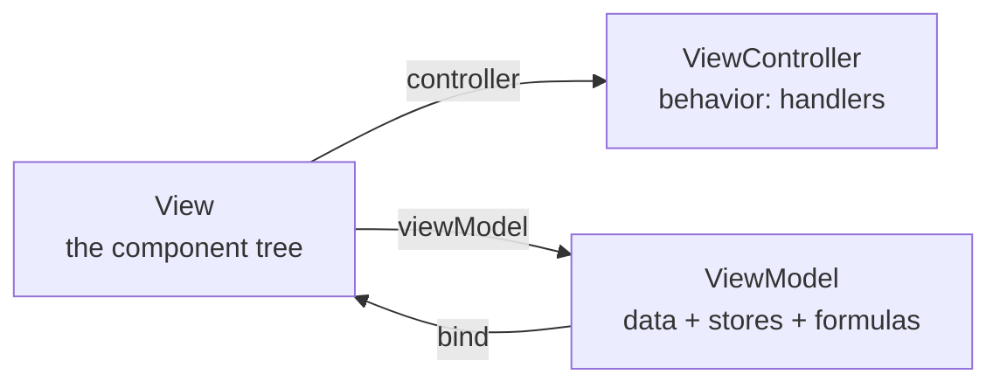

# MVVM: ViewControllers, ViewModels & Binding

Up to now you've been building *views* — panels, grids, forms, all described as config trees. But a real screen has to *do* things: handle a button click, know which row is selected, keep a form in sync with that row. The question every Ext JS app eventually has to answer is **where does that logic and that state live?** In Ext JS 5 and up, the answer has a name — **MVVM** — and it comes down to one clean split.

> 💡 **The whole mental model in one line: a ViewController is the view's *behavior*, a ViewModel is the view's *data*, and `bind` is the *wire* that connects the data to the widgets.** Three boxes. Behavior, data, wire. Hold those three and every config in this phase has an obvious home.

Why does this matter for maintaining a legacy app? The *old* way (Ext JS 4) put all logic in big global controllers that lived nowhere in particular, with hand-written glue for all the syncing. MVVM was Sencha's answer to the spaghetti that resulted. You'll meet both — the modern way first, since it's how you *should* think, then the legacy version so you can read old screens.



## ViewController — the view's behavior

A **`ViewController`** is a class that holds the *logic* for one view: its event handlers and helper methods. Define it with `Ext.define`, extend `Ext.app.ViewController`, and give it an `alias` of the form `controller.<name>`. The view then points at it with `controller: '<name>'`.

```javascript
Ext.define('MyApp.view.users.UsersController', {
    extend: 'Ext.app.ViewController',
    alias: 'controller.users',          // referenced as controller: 'users'

    onDeleteUser: function () {
        var grid = this.lookup('userGrid'),       // find child by its reference
            record = grid.getSelection()[0];      // the selected record

        if (record) {
            grid.getStore().remove(record);       // remove it from the store
        }
    }
});
```

*What just happened:* we defined a controller class scoped to the users view. `this.lookup('userGrid')` reaches a child component tagged with `reference: 'userGrid'` in the view — the *sanctioned* way to find components, the clean replacement for the `Ext.getCmp` trap from phase 3. `this` inside any handler is the ViewController instance, so `this.getView()` gives you the view it belongs to, and `this.lookup(...)` (or its longer alias `this.lookupReference(...)`) gives you any referenced child. No global state, no `Ext.getCmp('someId')` — everything resolves relative to *this* view instance.

Now wire that handler up. Two ways, and you'll see both.

**Option A — `listeners` declared in the view**, naming the controller method as a string:

```javascript
Ext.define('MyApp.view.users.UsersPanel', {
    extend: 'Ext.panel.Panel',
    xtype: 'userspanel',
    controller: 'users',                // attach the ViewController

    layout: { type: 'vbox', align: 'stretch' },
    items: [
        { xtype: 'grid', reference: 'userGrid', flex: 1 /* columns, store */ },
        {
            xtype: 'button',
            text: 'Delete',
            listeners: { click: 'onDeleteUser' }   // string => method on the ViewController
        }
    ]
});
```

*What just happened:* `controller: 'users'` attaches our ViewController to this panel. The button's `listeners: { click: 'onDeleteUser' }` uses a **string**, not a function — Ext JS resolves that string against the view's ViewController and calls `onDeleteUser` there. That string-instead-of-function detail is the giveaway you're looking at MVVM wiring, not an inline callback.

**Option B — a `control` block inside the ViewController**, which wires events by *selector* instead of touching the view:

```javascript
Ext.define('MyApp.view.users.UsersController', {
    extend: 'Ext.app.ViewController',
    alias: 'controller.users',

    control: {
        'button[action=delete]': {      // component query selector
            click: 'onDeleteUser'
        },
        'grid': {
            selectionchange: 'onSelectionChange'
        }
    },

    onDeleteUser: function () { /* ... */ },
    onSelectionChange: function (sel, records) { /* ... */ }
});
```

*What just happened:* the `control` block maps **component query selectors** (the same selector syntax `ComponentQuery` uses — `'button[action=delete]'` matches a button whose `action` config is `'delete'`) to event-to-handler pairs. It's the inverse of putting `listeners` in the view: the controller declares "any matching component, when it fires this event, call this method." A `control` block is scoped to the controller's own view, so selectors only match components *inside this view* — you won't accidentally grab a button from some other screen. Use `listeners` for one-off wiring on a specific component, `control` to keep all event wiring in one place in the controller.

## ViewModel — the view's data

If the ViewController is behavior, the **`ViewModel`** is *state*. It holds three things: a **`data`** object (the view's local variables), inline **`stores`**, and **`formulas`** (derived values that recompute themselves). Attach it with `viewModel: { type: 'users' }` (referencing a defined class) or inline with `viewModel: { data: {...} }`.

```javascript
Ext.define('MyApp.view.users.UsersModel', {
    extend: 'Ext.app.ViewModel',
    alias: 'viewmodel.users',           // referenced as viewModel: { type: 'users' }

    data: {
        isAdmin: false,
        currentUser: null               // will hold the selected record
    },

    stores: {
        users: {
            model: 'MyApp.model.User',
            autoLoad: true
        }
    },

    formulas: {
        fullName: function (get) {
            var u = get('currentUser');
            return u ? get('currentUser.first') + ' ' + get('currentUser.last') : '';
        }
    }
});
```

*What just happened:* the ViewModel declares the view's data in one place. `data` holds plain values (`isAdmin`, `currentUser`). `stores` declares a `users` store *inline* — the ViewModel owns it, so it's automatically available for binding (no more hand-creating the store and wiring it to the grid yourself). `formulas` defines derived data: `fullName` is a function that receives a `get` helper, reads `currentUser.first` and `currentUser.last`, and returns the combined name. The payoff is that **a formula recomputes automatically** whenever any value it reads changes — set a new `currentUser` and `fullName` updates itself, no manual recalculation. Think of `formulas` as spreadsheet cells: a formula over other cells that refreshes on its own.

## Two-way `bind` — the wire, and the killer demo

The **`bind`** config connects a component to ViewModel data using `{path}` template syntax. Bind a single property as a shorthand string, or bind several properties with an object:

```javascript
// shorthand: bind the field's primary value
{ xtype: 'textfield', bind: '{currentUser.name}' }

// object form: bind several configs at once
{
    xtype: 'textfield',
    bind: {
        value: '{currentUser.name}',
        hidden: '{!isAdmin}'           // hide unless isAdmin is true
    }
}
```

*What just happened:* the ViewModel *publishes* its data; bound components subscribe. `bind: '{currentUser.name}'` ties the field's value to that path — and because a textfield is an input, the binding is **two-way**: type in the field and it publishes the new value *back* to `currentUser.name` in the ViewModel. The object form binds multiple configs; `hidden: '{!isAdmin}'` shows the negation operator working right inside the binding template, so the field hides itself whenever `isAdmin` is falsy. No event handlers, no manual `setValue` — the wire keeps both ends in sync.

Now the demo that makes people fall in love with MVVM. In phase 6 you'd select a grid row and then *manually* call `form.loadRecord(record)` in a `selectionchange` handler to push the record into the form — glue code, the exact kind binding deletes. Watch:

```javascript
Ext.define('MyApp.view.users.UsersPanel', {
    extend: 'Ext.panel.Panel',
    xtype: 'userspanel',
    controller: 'users',
    viewModel: { type: 'users' },

    layout: { type: 'vbox', align: 'stretch' },
    items: [
        {
            xtype: 'grid',
            reference: 'userGrid',
            flex: 1,
            bind: {
                store: '{users}',                // grid reads the ViewModel's store
                selection: '{currentUser}'       // selected row publishes INTO currentUser
            }
            /* columns... */
        },
        {
            xtype: 'form',
            height: 200,
            defaultType: 'textfield',
            items: [
                { fieldLabel: 'First', bind: '{currentUser.first}' },
                { fieldLabel: 'Last',  bind: '{currentUser.last}' },
                { fieldLabel: 'Email', bind: '{currentUser.email}' }
            ]
        }
    ]
});
```

*What just happened:* two bindings do all the work. `bind: { selection: '{currentUser}' }` on the grid says "whatever row is selected, publish it into the ViewModel as `currentUser`." The form's fields each bind to `{currentUser.first}`, `{currentUser.last}`, `{currentUser.email}`. So when you click a row, the grid publishes that record to `currentUser`, the ViewModel notifies everyone bound to it, and the three fields fill in automatically. **There is no `selectionchange` handler and no `loadRecord` call** — the data flowed through the ViewModel and the wires did the rest. And because the field bindings are two-way, edits in the form publish back into the record — the modern replacement for the manual wiring in phase 6.

> 💡 Read a bound screen by tracing the `{paths}`. Find which component publishes a path (the grid's `selection: '{currentUser}'`) and which components read it (the fields' `'{currentUser.*}'`). The ViewModel is the switchboard in the middle — you never have to find the wires by hand because the path *is* the wire.

> ⚠️ Bindings are **deferred**, not instant. The ViewModel batches changes and flushes them on a short timer (a scheduler tick), so the bound widget updates a beat after you set the data — not synchronously on the same line. If you set a value and immediately read the widget expecting the new state, you'll get the *old* one. This trips people debugging in the console: the data is right, the DOM just hasn't caught up.

## Legacy MVC controllers (Ext JS 4) — what you'll meet in old code

Plenty of apps you'll inherit predate MVVM. Ext JS 4 used **MVC** with a single, *global* `Ext.app.Controller` per concern, registered in the application's `controllers` array. Instead of a per-view ViewController, one controller reached across the whole app using **`refs`** (named component-query references) and **`control`** (event wiring):

```javascript
Ext.define('MyApp.controller.Users', {
    extend: 'Ext.app.Controller',

    refs: [
        { ref: 'userGrid', selector: 'grid' },        // creates this.getUserGrid()
        { ref: 'userForm', selector: 'form' }
    ],

    init: function () {
        this.control({
            'grid': {
                selectionchange: this.onSelectionChange
            },
            'button[action=delete]': {
                click: this.onDeleteUser
            }
        });
    },

    onSelectionChange: function (model, records) {
        this.getUserForm().loadRecord(records[0]);     // MANUAL glue — no binding
    },

    onDeleteUser: function () {
        var record = this.getUserGrid().getSelection()[0];
        this.getUserGrid().getStore().remove(record);
    }
});
```

*What just happened:* the controller declares `refs` — each entry generates a getter like `this.getUserGrid()` that runs the `selector` as a component query and returns the match. `init` calls `this.control({...})` to wire events by selector, just like the modern `control` block. The handlers do the work *by hand*: `onSelectionChange` calls `loadRecord` manually — exactly the glue MVVM binding eliminates. Functionally it works, and you'll see thousands of lines shaped like this.

> ⚠️ **The classic legacy gotcha: a global Ext JS 4 controller does not scope to a view instance.** Its `refs` and `control` selectors match across the *entire application*. If the same view appears twice on screen (two user panels, two tabs of the same type), the controller's `getUserGrid()` returns whichever component the query finds *first* — and an event from *either* instance fires the *same* handler with no clean way to tell which one. So a button in panel B can end up mutating panel A's grid — a frequent, maddening source of "why did the wrong panel update?" bugs. The modern ViewController fixes it precisely because it's bound to *one* view instance: `this.lookup('userGrid')` and `control` selectors only ever match *that* instance's children. If you're untangling a duplicated-view bug in an old app, this scoping difference is very often the root cause.

## Putting the three boxes together

When you open an MVVM view, sort every config into one of the three boxes and the file stops being a wall of code:

- **`controller: '...'`, `listeners: 'methodName'`, `reference: '...'`** → behavior. The logic lives in the ViewController; `this.lookup` reaches children; `control` or `listeners` wires events.
- **`viewModel: { ... }`, `data`, `stores`, `formulas`** → data. State lives in the ViewModel and recomputes itself.
- **`bind: '{...}'`** → the wire. Trace the paths to see what's connected to what.

That's the architecture modern Ext JS apps are built on, and the lens that turns even a sprawling legacy screen into something you can read line by line.

## Recap

- **ViewController = behavior, ViewModel = data, `bind` = the wire.** Sort every config into one of those three boxes and an MVVM view becomes readable.
- A **ViewController** (`Ext.app.ViewController`, `alias: 'controller.x'`) holds handlers; wire events via the view's `listeners: 'methodName'` or a `control` block; reach children with `this.lookup('ref')` / `this.getView()` — the clean replacement for `Ext.getCmp`.
- A **ViewModel** (`Ext.app.ViewModel`) holds `data`, inline `stores`, and `formulas` (derived values that recompute automatically when their inputs change).
- **Two-way `bind`** connects components to ViewModel paths. Binding a grid's `selection` into `{currentUser}` and binding the form to `{currentUser}` makes selecting a row fill the form **with no `loadRecord` glue** — the modern replacement for phase 6's manual wiring. (Bindings are deferred — they flush on a scheduler tick, not instantly.)
- **Legacy Ext JS 4 MVC** uses global `Ext.app.Controller`s with `refs` and `control`. The big trap: a global controller **doesn't scope to a view instance**, so with duplicated views its selectors match the wrong one — a common source of "wrong panel updated" bugs that ViewControllers fix.

## Quick check

Confirm the three boxes and the scoping gotcha stuck:

```quiz
[
  {
    "q": "In modern Ext JS MVVM, where does a view's data (local values, stores, derived fields) belong?",
    "choices": ["The ViewController", "The ViewModel", "The global Ext.app.Controller", "Directly on the component via Ext.getCmp"],
    "answer": 1,
    "explain": "The ViewModel holds the view's data: its data object, inline stores, and formulas. The ViewController holds behavior (handlers); bind is the wire between data and widgets."
  },
  {
    "q": "You bind a grid with selection: '{currentUser}' and bind a form's fields to '{currentUser.*}'. What happens when the user clicks a grid row?",
    "choices": ["Nothing until you call form.loadRecord(record)", "The selected record publishes to currentUser and the form fills in automatically", "The grid throws because selection can't be bound", "Only the first field updates"],
    "answer": 1,
    "explain": "The grid publishes the selected record into currentUser, the ViewModel notifies the bound form fields, and they populate themselves — no selectionchange handler or loadRecord glue needed."
  },
  {
    "q": "Why can a global Ext JS 4 Controller misbehave when the same view appears twice on screen?",
    "choices": ["Global controllers can't define refs", "Its refs/control selectors match across the whole app, so they can hit the wrong instance", "ViewModels override the controller", "Duplicated views aren't allowed in Ext JS 4"],
    "answer": 1,
    "explain": "A global controller doesn't scope to a view instance — its component-query refs and control selectors match application-wide, so an event from one instance can run a handler that mutates another. ViewControllers fix this by scoping to one view."
  }
]
```

---

[← Phase 6: The Grid & Forms](06-the-grid-and-forms.md) · [Guide overview](_guide.md) · [Phase 8: Sencha Cmd, Theming & Surviving a Legacy Codebase →](08-sencha-cmd-and-survival.md)
