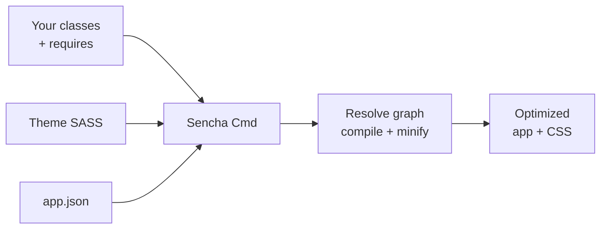

# Sencha Cmd, Theming & Surviving a Legacy Codebase

Look back at where you started: a legacy Ext JS app, a wall of nested objects full of `xtype` and `items`, nothing looking like the JavaScript you knew.

Now look at what you can do. You can read a tree of components and know that containers hold items. You can follow the data: a **Model** describes a record, a **Store** holds the rows, a **proxy** fetches them from the server. You can find any component live with `Ext.ComponentQuery`, you know "nothing renders" is almost always a layout problem, and you know a ViewController holds the logic while a ViewModel holds the state two-way `bind` watches. The framework that once felt like a curse is now legible - it was never magic, it's a system, and you can read it.

This last phase is the survival kit: the build tool that trips up newcomers, theming in brief, a practical field guide for orienting in someone else's codebase, a clear word on where Ext JS lives in 2026, and what to do next.

## Sencha Cmd and `app.json`: the build tool nobody explained

A thing that surprises people: an Ext JS app is not a pile of `<script>` tags you load in order. The class system you met in [the class system phase](02-the-class-system.md) - `Ext.define`, `requires`, `Ext.Loader` - builds a **dependency graph**. Something has to walk that graph, pull in exactly the classes you use, and stitch them into a production bundle. That something is **Sencha Cmd**.

Sencha Cmd is the official command-line build tool. It scaffolds new apps (`sencha generate app`), resolves the dependency graph from your `requires` declarations, compiles your code, compiles the theme, minifies everything, and produces an optimized production build. The two commands you'll live in:

```bash
# Dev: starts a local server and live-rebuilds as you save
sencha app watch

# Production: the optimized, minified build for deploy
sencha app build
```

> ⚠️ Two real frictions to brace for. First, **Sencha Cmd is a Java application** - it needs a JDK installed, which catches people off guard ("why does my JavaScript build want Java?"). Second, **the builds are slow** compared to the npm tooling you may know from React or Vue, and a full build can take a while. That's the tool, not you.

The project's control panel is **`app.json`** - the manifest that declares what the app *is*:

```json
{
  "name": "UsersAdmin",
  "toolkit": "classic",
  "theme": "theme-triton",
  "requires": ["font-awesome"],
  "js":  [{ "path": "app.js", "bundle": true }],
  "css": [{ "path": "${build.out.css.path}" }]
}
```

The parts that matter: **`toolkit`** picks `classic` or `modern` (back to that [Classic vs Modern](01-what-extjs-is.md) split - this is where the choice gets *compiled in*, deciding which widget package builds); **`theme`** names the theme package; and the `js`/`css`/`requires` entries declare resources and packages. For shops running several apps side by side, a **`workspace.json`** ties them together. 📝 If you ever wonder "where does this app's config actually live?" - `app.json` is the first file to open.

Here's the whole pipeline in one picture:



💡 Newer Ext JS also ships **`@sencha/ext` with open tooling via npm**, so you *can* build with familiar npm workflows on recent versions. But the overwhelming majority of existing codebases - the ones you're likely to inherit - use Sencha Cmd. Learn to recognize both; expect Cmd.

## Theming, in brief

Ext JS theming is **SASS-based**, and it's more pleasant than you'd fear. Themes ship as **packages** - names like **Triton, Crisp, Neptune, Graphite,** and **Material**. To restyle an app, override SASS variables and let Sencha Cmd compile the CSS:

```javascript
// in your theme's SASS, e.g. _vars.scss
$base-color: #2b5797;
$font-family: 'Inter', sans-serif;
```

Beyond global variables, most components accept a **`ui`** config that selects a visual variant - the same button drawn several ways:

```javascript
{ xtype: 'button', text: 'Save',   ui: 'action' }
{ xtype: 'button', text: 'Delete', ui: 'decline' }
```

That's the whole mental model: variables for the broad strokes, `ui` for per-component variants, Sencha Cmd to compile it all. You don't need to master SASS to read a theme - just know *which file* the colors come from when someone asks you to change the blue.

## Surviving a legacy codebase

You've been handed an unfamiliar Ext JS app. Here's how to get your bearings instead of drowning.

**Orient yourself first - find the map.** Five moves, in order:

1. **Find the entry point.** Look for `Ext.application({...})` (usually in `app.js`) - `main()` for an Ext JS app, naming the app and its `mainView`.
2. **Follow the convention folders.** MVC/MVVM apps lay out as `app/view`, `app/model`, `app/store`, `app/controller` (and ViewControllers/ViewModels alongside views). Folder names tell you what each file *is*.
3. **Follow the `xtype`s.** When a view references `xtype: 'usergrid'`, search the codebase for `usergrid` - the `alias`/`xtype` declaration leads you straight to that component's definition.
4. **Identify the toolkit.** Check `app.json`'s `toolkit` so you know whether you're in Classic or Modern widgets - it changes which APIs exist.
5. **Trace one screen end to end** before touching anything: view → its ViewController → the ViewModel/`bind` → the Store → the proxy → the server. One full trace teaches you the app's shape faster than reading ten files at random.

**Then debug live in the console.** An Ext JS app is fully inspectable at runtime from your browser devtools - you don't have to guess:

```javascript
// Find components live, by xtype or selector (phase 3)
Ext.ComponentQuery.query('grid')          // every grid on the page
Ext.ComponentQuery.query('usergrid')[0]   // your specific one

// Walk the containment tree from a component you grabbed
cmp.up('panel')      // nearest ancestor panel
cmp.down('button')   // first matching descendant

// Inspect the data (phase 5)
var store = cmp.getStore();
store.getData();         // what rows are actually loaded?
store.getCount();        // how many?

// Inspect a record's unsaved/dirty state
record.getChanges();     // fields changed since last sync
record.dirty;            // is it modified?
```

A few reflexes worth burning in, each tied to something you already learned:

- 💡 **Nothing renders?** Suspect a **layout problem** before a data problem ([layouts phase](04-layouts.md)) - a missing or wrong `layout` config silently produces a zero-size component far more often than missing data does.
- ⚠️ **"It's defined but Ext can't find it"?** That's usually a **missing `requires`** ([class system phase](02-the-class-system.md)) - a build-time/loader breakage, not a logic bug. The class never got pulled into the graph.
- 📝 **Lost on the page?** `Ext.ComponentQuery.query(...)` in the console answers "what's actually here right now?" without reading a line of source. Grab the component, then `.up()`/`.down()` your way around. Framework logging can surface load and lifecycle warnings too.

The pattern across all of it: stop theorizing and *ask the running app*. Ext JS will tell you what it has - you only have to know the questions.

## Where Ext JS actually sits - and what to do next

Ext JS is **mature and genuinely powerful** for what it's best at: data-dense internal applications - grids with thousands of rows, complex forms, dashboards, trading desks, admin consoles. For that job, few things match it out of the box.

But be clear-eyed. As **React, Angular, and Vue** ([what a framework even is](/guides/what-a-framework-even-is) sets the family in context) won developer mindshare, the Ext JS ecosystem shrank. Licensing is **commercial**, the community is smaller, hiring is harder, and **greenfield projects on it are rare** in 2026 - nobody's reaching for it to start a new side project.

And yet - it still runs an enormous amount of enterprise software, much of it business-critical, and that software needs people who can read and maintain it. That makes this skill **valuable and durable** for exactly the situation you're probably in: maintenance, contract, and "the person who got handed the legacy app" work. It's a quiet, well-paid, under-supplied skill, not a dead one.

So where to next? Three concrete moves:

- **Open your app's `app.js` today** and find the `Ext.application` entry. Name the `mainView`. You now have the thread to pull.
- **Trace one real screen end to end** - view → ViewController → ViewModel/`bind` → Store → proxy. Do it with the console open, querying as you go. That single exercise turns "I'm lost" into "I know how this works."
- **Bookmark the official Sencha docs and the Kitchen Sink examples.** The Kitchen Sink is a live gallery of every component with source - when you need to know how a thing is configured, it's faster than guessing.

You opened that codebase once and saw nothing but noise. Now you can name the entry point, follow the `xtype`s, read the data flow, and interrogate the live app when it misbehaves. It's a system - describe a tree of components, point them at stores, let the framework run it - and you can read it now. Go open the file.

## Recap

1. **Sencha Cmd** is the official CLI that resolves the class dependency graph, compiles, minifies, and builds. Live in `sencha app watch` for dev and `sencha app build` for production. ⚠️ It's a Java app (needs a JDK) and the builds are slow - that's the tool, not you.
2. **`app.json`** is the project manifest: it declares the `toolkit` (classic/modern), `theme`, and resources; `workspace.json` ties multi-app workspaces together. Newer Ext JS also offers `@sencha/ext` npm tooling, but most legacy code uses Cmd.
3. **Theming is SASS-based** - override variables like `$base-color`, pick a theme package (Triton, Crisp, Neptune, Graphite, Material), and use each component's `ui` config for variants. Sencha Cmd compiles the CSS.
4. **To survive a legacy app:** find `Ext.application` in `app.js`, follow the `view`/`model`/`store` convention folders, chase `xtype`s to definitions, check the toolkit, and trace one screen end to end.
5. **Debug live in the console:** `Ext.ComponentQuery.query(...)` to find components, `.up()`/`.down()` to walk the tree, `store.getData()` to inspect data, `record.getChanges()`/`record.dirty` for unsaved state. "Nothing renders" = layout; "can't find the class" = missing `requires`.
6. **Real place in the world:** Ext JS is powerful for data-dense internal apps but past its mindshare peak, commercially licensed, and rare for greenfield - yet it still runs huge amounts of enterprise software, so the maintenance skill is durable and valuable.

## Quick check

Three things to remember:

```quiz
[
  {
    "q": "Your teammate is surprised the Ext JS build wants Java installed. What's the accurate explanation?",
    "choices": [
      "The app is secretly written in Java, not JavaScript",
      "Sencha Cmd, the official build tool, is itself a Java application and needs a JDK",
      "Java is required to run the Ext JS code in the browser",
      "It's a bug; Ext JS never needs Java"
    ],
    "answer": 1,
    "explain": "Sencha Cmd is a Java app, so it needs a JDK installed even though your code is JavaScript. That surprise, plus slow builds, is normal friction with the tool."
  },
  {
    "q": "You've inherited an Ext JS app and a grid isn't showing up at all on the page. What should you suspect first?",
    "choices": [
      "The server returned no data",
      "A layout problem - a missing or wrong layout config often produces a zero-size component",
      "The theme SASS failed to compile",
      "Java is out of date"
    ],
    "answer": 1,
    "explain": "\"Nothing renders\" in Ext JS is almost always a layout problem before it's a data problem. A missing/incorrect layout config silently gives a component no size."
  },
  {
    "q": "From the browser console, how do you find a live grid component and inspect the rows its store currently holds?",
    "choices": [
      "document.querySelector('grid').rows",
      "Ext.ComponentQuery.query('grid')[0].getStore().getData()",
      "Ext.build('grid').data",
      "console.log(grid) - Ext exposes every component as a global"
    ],
    "answer": 1,
    "explain": "Ext.ComponentQuery.query('grid') finds components live; grab one, call getStore() for its Store, and getData() to see the loaded records. This is the core legacy-debugging move."
  }
]
```

---

[← Phase 7: MVVM: ViewControllers, ViewModels & Binding](07-mvvm-and-binding.md) · [Guide overview](_guide.md)
