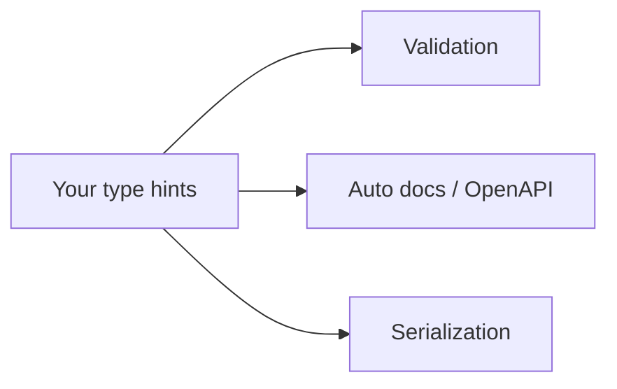

# What FastAPI Is & Your First App

You know Python. You've written functions, maybe touched [REST APIs](/guides/rest-apis-explained),
and now you want to *serve* something over HTTP — a little book API, say, that other programs can call.
There are a dozen Python web frameworks that'll do it. This guide is about the one that has, in a few
short years, become the default answer for new Python API projects: **FastAPI**.

The thing to hold in your head before any code: FastAPI's whole personality comes from one decision —
**your Python type hints are the source of truth.** You annotate a function with the types it expects,
and FastAPI uses those same annotations to parse incoming requests, validate them, generate
documentation, and serialize what you send back. One thing you write; four jobs it does. Once that
clicks, the rest of FastAPI is detail.

## What FastAPI actually is

📝 **FastAPI** — a modern, asynchronous Python web framework for building APIs. It doesn't reinvent
the world; it stands on two well-tested libraries: **Starlette** handles the web machinery (routing,
requests, responses), and **Pydantic** handles data validation. FastAPI is the friendly layer that
wires them together around your type hints.

It speaks a protocol called **ASGI**, and that word is worth thirty seconds because it explains the
"async" in the name and the "fast" in the brand.

📝 **WSGI vs ASGI** — WSGI (Web Server Gateway Interface) is the older Python standard: one request,
one worker, blocked until the work is done. ASGI (the *A* is for **Asynchronous**) is the modern
successor — it can handle a request, hit a slow database or external API, and *while waiting* go serve
other requests instead of sitting idle. Same idea as Python's `async`/`await`, applied to a whole web
server.

💡 If you've read [Python's async chapter](/guides/python-from-zero), this is where it pays off:
FastAPI is built to let your handlers be `async def`, so an app waiting on I/O can stay busy. (Plain
`def` handlers work too — FastAPI runs them safely in a threadpool. You don't have to go async on day
one.)

So the one-liner: **FastAPI = Starlette (web) + Pydantic (validation), speaking ASGI, all driven by
type hints.** Let's make one.

## Install it and write your first app

One install. The `[standard]` extra pulls in the server and a few niceties you'll want immediately:

```bash
pip install "fastapi[standard]"
```

*What just happened:* you installed FastAPI plus its recommended companions — most importantly
**Uvicorn**, the ASGI server that actually listens on a port and runs your app. (Quote the string;
some shells treat `[` and `]` as special characters otherwise.)

Now the smallest app that does something. Create a file called `main.py`:

```python
from fastapi import FastAPI

app = FastAPI()


@app.get("/")
def read_root():
    return {"message": "The book API is alive"}
```

*What just happened:* `app = FastAPI()` is your application object — the thing the server runs. The
`@app.get("/")` decorator says "when someone sends a `GET` request to the path `/`, run the function
below." Your function returns a plain Python `dict`, and FastAPI turns it into a JSON response for you.
No JSON library calls, no manual `Content-Type` header — returning a dict is enough.

⚠️ This is app code, not a runnable script in the usual sense — running `python main.py` won't start a
server. FastAPI apps need an ASGI server to run them. That's the next step.

Start the server with Uvicorn, pointing it at `main:app` (the `app` object inside `main.py`):

```bash
uvicorn main:app --reload
```

The `--reload` flag restarts the server whenever you save a file — exactly what you want while
developing. (FastAPI also ships a shortcut, `fastapi dev main.py`, which does the same thing with
reload on by default. Use whichever you like.)

```console
$ uvicorn main:app --reload
INFO:     Uvicorn running on http://127.0.0.1:8000 (Press CTRL+C to quit)
INFO:     Started reloader process using WatchFiles
INFO:     Application startup complete.
```

*What just happened:* Uvicorn bound to `127.0.0.1:8000` and is now waiting for requests. Open
`http://127.0.0.1:8000/` in a browser, or hit it from the terminal:

```http
GET http://127.0.0.1:8000/
```

```json
{
  "message": "The book API is alive"
}
```

*What just happened:* the request matched the `GET /` route, FastAPI called `read_root()`, took the
dict it returned, and serialized it to JSON on the way out. You have a working API in five lines of
real code.

## The wow moment: docs you didn't write

Here's the feature that makes people switch frameworks. Leave the server running and visit:

```http
GET http://127.0.0.1:8000/docs
```

You'll see **Swagger UI** — a full, interactive documentation page listing every endpoint, with a
"Try it out" button that sends real requests to your running app. There's a second flavour at
`/redoc` (ReDoc) if you prefer a cleaner reading layout. You wrote zero lines of documentation to get
either.

💡 **Both pages are generated from a single machine-readable document FastAPI builds automatically: the
OpenAPI schema** (served at `/openapi.json`). OpenAPI is the industry-standard way to describe an API
— what paths exist, what they accept, what they return. Tools across the ecosystem can read it to
generate client libraries, run tests, or import the API into other software.

And *why* can FastAPI produce all this from nothing? Because your type hints already told it
everything it needed: the paths come from your decorators, and (as you'll see in the next phase) the
parameters and response shapes come from the types you annotate. **Your code already is the spec** —
FastAPI just reads it.

## Type hints as the source of truth

This is the mental model that makes FastAPI *FastAPI*, so let it land properly.

📝 **The core idea:** you annotate your function with Python types, and FastAPI uses those annotations
for four jobs at once — **parsing** incoming data into the right types, **validating** it (rejecting
bad input with a clear error), **documenting** it (in those auto-generated docs), and **serializing**
your return value back out. One declaration, kept honest in four places.



The payoff is that these things can't drift apart. In a framework where you write validation by hand
*and* write docs by hand, the two slowly disagree — the docs say one thing, the code does another.
With FastAPI there's a single source, so the validation rules, the docs, and your editor's autocomplete
all describe the same truth.

You can feel the spirit of this with pure Python, no framework involved — a function whose type hints
describe exactly what it takes and gives back:

```python runnable
def describe_book(title: str, year: int, price: float) -> str:
    return f"{title} ({year}) — ${price:.2f}"

# The hints document the function: title is text, year is a whole number, price is a decimal.
print(describe_book("Dune", 1965, 9.99))
print(describe_book.__annotations__)   # the hints are real data Python can read
```

```console
Dune (1965) — $9.99
{'title': <class 'str'>, 'year': <class 'int'>, 'price': <class 'float'>, 'return': <class 'str'>}
```

*What just happened:* the type hints (`title: str`, `year: int`, `price: float`) aren't decoration —
they're stored on the function in `__annotations__`, readable by any program. That's the lever FastAPI
pulls: it inspects those same annotations on your handlers and turns them into validation rules and
documentation automatically. In the next phase you'll annotate a real `GET /books/{id}` handler and
watch FastAPI parse and check the `id` for you, purely from the hint.

## Where FastAPI fits

FastAPI isn't the only Python framework, and it isn't always the right one. The honest comparison:

- **Flask** — minimal and sync-first. It hands you routing and not much else; you bring your own
  validation, your own serialization, your own docs. Wonderful for tiny apps and total control, more
  manual work as the API grows.
- **Django** — batteries included. A full stack with an ORM, admin panel, templating, auth — built for
  large database-backed websites. Powerful, but a lot of machine for a focused JSON API.
- **FastAPI** — purpose-built for **modern APIs**: async-capable, with validation and interactive docs
  baked in *because* of the type hints. The sweet spot when you're building an API (rather than a
  server-rendered website) and want correctness and documentation without hand-rolling them.

💡 If you're not yet sure what "REST API" even means — what `GET`, `POST`, paths, and status codes are
— read [REST APIs explained](/guides/rest-apis-explained) alongside this guide. FastAPI will make a lot
more sense once those terms are second nature, and this guide will lean on them from the next phase on.

That next phase is where the type-hint magic becomes concrete: **path operations and parameters** —
how `GET /books/{id}?year=1965` maps to a function with typed arguments that FastAPI parses and
validates for you.

## Recap

1. **FastAPI** is a modern, async Python web framework for building APIs, built on **Starlette** (web)
   + **Pydantic** (validation), speaking **ASGI**.
2. **ASGI** is the async successor to WSGI: a server that can keep serving other requests while one
   waits on slow I/O — the foundation for FastAPI's `async def` handlers.
3. A first app is tiny: `app = FastAPI()`, a `@app.get("/")` function returning a dict, run with
   `uvicorn main:app --reload` (or `fastapi dev`).
4. The standout feature is **automatic interactive docs** — Swagger UI at `/docs`, ReDoc at `/redoc`,
   and an **OpenAPI** schema at `/openapi.json` — all generated from your code, no doc-writing.
5. **Type hints are the single source of truth:** FastAPI reads your annotations to parse, validate,
   document, and serialize — so those four things never drift apart.
6. FastAPI's niche is **modern APIs**: lighter than Django, less manual than Flask, with validation and
   docs built in.

## Quick check

Three questions on the ideas that have to stick — what FastAPI is, where its docs come from, and the
type-hint model:

```quiz
[
  {
    "q": "What is the single design idea that drives most of FastAPI's features?",
    "choices": [
      "Your Python type hints are the source of truth — used to parse, validate, document, and serialize",
      "It compiles your Python to C for speed",
      "It generates a separate documentation file you maintain by hand",
      "It replaces HTTP with a faster custom protocol"
    ],
    "answer": 0,
    "explain": "FastAPI reads your type annotations and reuses them for validation, the OpenAPI docs, and serialization — one declaration kept consistent across all of them."
  },
  {
    "q": "You start your app with `uvicorn main:app --reload` and visit `/docs`. Where did that interactive documentation page come from?",
    "choices": [
      "FastAPI generated it automatically from your code's OpenAPI schema",
      "You have to write the HTML for it yourself before it appears",
      "Uvicorn ships a generic docs page unrelated to your app",
      "It only appears after you deploy to production"
    ],
    "answer": 0,
    "explain": "FastAPI builds an OpenAPI schema from your routes and type hints, and serves Swagger UI (/docs) and ReDoc (/redoc) from it automatically — no doc-writing required."
  },
  {
    "q": "What does ASGI give FastAPI that the older WSGI standard does not?",
    "choices": [
      "The ability to handle other requests while one is waiting on slow I/O (async support)",
      "Automatic conversion of Python to machine code",
      "A built-in database and admin panel",
      "Encryption of all responses by default"
    ],
    "answer": 0,
    "explain": "ASGI is the asynchronous successor to WSGI. It lets the server keep serving requests while one awaits slow I/O, which is what makes FastAPI's async def handlers worthwhile."
  }
]
```

---

[Guide overview](_guide.md) · [Phase 2: Path Operations & Parameters →](02-path-operations-and-parameters.md)
