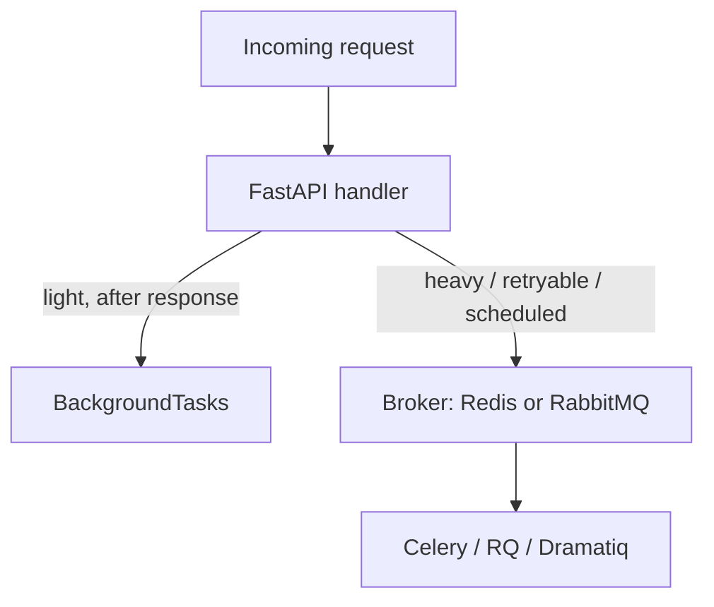

# Production & Where to Go Next

Take a second and look at what you can actually do now. You can stand up a FastAPI app, parse and validate requests straight from type hints, shape responses with Pydantic models, hide internal fields with response models, return honest status codes, inject dependencies for auth and database sessions with `Depends()`, persist data through SQLModel, lock endpoints down with OAuth2 and JWT, and prove the whole thing works with `TestClient` and pytest. That's not a toy. That's the shape of a real backend service — and the part that makes it *yours* is that you understand **why** each piece works. It all falls out of one idea: your **types are the contract**, and validation, docs, serialization, and DI are that one idea wearing different hats.

This last phase isn't more decorators — it's getting the thing onto the internet, a couple of patterns you'll reach for soon, the one async mistake that bites people in production, and an honest map of where to go next.

## Deploying it — uvicorn, workers, and a proxy

📝 In development you've been running `uvicorn main:app --reload`. That `--reload` flag and the single default worker are **dev-only** — reload watches your files and restarts on every save, which is wonderful locally and a liability in production. For real traffic you want **multiple worker processes** so requests run in parallel across CPU cores.

Two common ways to get there:

```bash
# Option A: uvicorn manages its own workers
uvicorn main:app --host 0.0.0.0 --port 8000 --workers 4

# Option B: gunicorn as the process manager, uvicorn workers underneath
gunicorn main:app -w 4 -k uvicorn.workers.UvicornWorker --bind 0.0.0.0:8000
```

Uvicorn is the **ASGI server** that actually speaks HTTP to your app; gunicorn is a battle-tested process manager that keeps a pool of uvicorn workers alive and restarts them if they die. Either works — gunicorn is the traditional choice when you want robust process supervision.

⚠️ You don't expose that directly to the world. In front of it goes a **reverse proxy** like nginx, handling TLS, serving static files, buffering slow clients, and forwarding the rest to your workers. And the cleanest way to ship the whole bundle is to **containerize it with Docker**, so the same image runs on your laptop and your server.

This is exactly the territory two other guides cover in depth: [Ship Your Side Project](/guides/ship-your-side-project) walks the deployment path end to end, and [Docker Without the Magic](/guides/docker-without-the-magic) demystifies the container part so it stops feeling like incantations.

## Background tasks and beyond

Sometimes you want to do a little work *after* the response goes out — send a welcome email, write an audit log line — without making the user wait for it. FastAPI has a built-in tool for that:

```python runnable
# Conceptually, this is what BackgroundTasks does:
def send_welcome_email(address: str):
    print(f"(later) sent welcome email to {address}")

def signup(address: str, queue: list):
    queue.append((send_welcome_email, address))
    return {"status": "created"}

# FastAPI returns the response, THEN runs queued tasks:
tasks = []
print(signup("ada@example.com", tasks))
for fn, arg in tasks:
    fn(arg)
```

📝 In real FastAPI you write `def signup(background_tasks: BackgroundTasks)` and call `background_tasks.add_task(send_welcome_email, address)`. It's perfect for **light, fire-and-forget** work that runs in the same process after responding.

It is **not** for heavy lifting. If the work is slow, needs to be retried on failure, must survive a restart, or runs on a schedule, you want a real **external worker**: Celery, RQ, or Dramatiq, fronted by a **message broker** (Redis or RabbitMQ). Your API drops a job on the broker and returns immediately; a separate worker process picks it up.



*What this shows:* two honest branches. Trivial follow-up work stays in-process with `BackgroundTasks`; anything that needs reliability or muscle goes to an external worker through a broker.

A few more doors, one line each: **WebSockets** let you hold an open two-way connection for live updates; **streaming responses** let you send a body in chunks instead of all at once; and **middleware** wraps every request and response, the right home for cross-cutting concerns like logging or custom headers.

## The async pitfalls, in one place

⚠️ Here's the one that actually bites in production, straight from Phase 6: **don't block the event loop.** When you write `async def`, your handler shares a single thread with every other in-flight request. Call a slow *blocking* function inside it — a synchronous database driver, `time.sleep()`, a heavy CPU loop — and you don't slow down one request, you freeze *all* of them at once.

The rules that keep you out of trouble:

- Use `async def` when you `await` genuinely async libraries. Use a plain `def` for ordinary blocking code — FastAPI runs `def` handlers in a threadpool so they can't stall the loop.
- If you go full-async, pair it with an **async database driver** (async SQLAlchemy, `asyncpg`). An `async def` handler calling a *blocking* DB call is the worst of both worlds.

💡 The vast majority of FastAPI performance complaints come down to one of two things: a **blocked event loop**, or an **N+1 query** quietly firing one database call per row. Neither is a framework flaw — both are fixable once you know to look for them.

## Where to go next — an honest framework map

FastAPI is a sharp tool for a specific job. It's the right pick for **APIs, microservices, and serving ML models** behind an endpoint — anywhere you want a fast, typed, well-documented interface. But it isn't the only Python web framework, and pretending it's always the answer would be dishonest:

- **Django** when you want **batteries included** — an admin panel, a mature ORM, templating, auth, and a thousand conventions — for a full web application, not just an API. If you'd otherwise rebuild half of Django by hand, use Django.
- **Flask** for something **tiny and simple** — a small service or a quick prototype where FastAPI's machinery is more than you need.

(Each of those has its own guide when you're ready.)

As for what to build: take the **book API** you've been growing through this guide and carry it all the way home. Add real authentication, a real database, a real test suite, wrap it in Docker, and **deploy it** somewhere you can hit it from your phone. That single project exercises nearly everything you learned. Or point FastAPI at a different problem entirely — load a trained ML model on startup and **serve predictions** behind a clean, typed endpoint. That's one of the things FastAPI does best.

When you want the canonical reference, the **official FastAPI documentation and tutorial** are genuinely excellent — clear, example-driven, and maintained by the people who build it. Bookmark them.

And remember the through-line: none of this was magic. The validation, the docs, the serialization, the dependency injection — every "it just works" came from one place. The magic was your **type hints** all along. You can read what's underneath now, build a real service on top, and reason about it when it breaks. Go finish the book API, deploy it, and show someone. You're ready.

## Recap

1. **You can build and ship a real FastAPI service** — validated, authenticated, tested, database-backed — and you understand *why* each layer works, because types are the contract underneath all of it.
2. **Deploy with an ASGI server and workers** — `uvicorn --workers` or gunicorn with uvicorn workers, behind a reverse proxy like nginx, packaged in Docker. `--reload` and a single worker are dev-only.
3. **Pick the right tool for background work** — `BackgroundTasks` for light fire-and-forget after the response; an external worker (Celery / RQ / Dramatiq) plus a broker for heavy, retryable, or scheduled jobs.
4. **Don't block the event loop** — match `async def` vs `def` to your code, use an async DB driver if you go full-async, and remember most perf problems are a blocked loop or an N+1.
5. **Know the framework map** — FastAPI for APIs/microservices/ML-serving, Django when you want batteries-included for a full app, Flask for tiny things.
6. **Build one thing and finish it** — carry the book API to a deployed, authenticated, tested, Dockerized service, or serve an ML model behind FastAPI. The magic was your type hints all along.

## Quick check

Test yourself on the decisions that matter most as you leave this guide:

```quiz
[
  {
    "q": "Why are `--reload` and a single uvicorn worker considered dev-only?",
    "choices": [
      "Reload restarts on file changes and one worker can't use multiple cores — production wants stable, multi-worker processes",
      "They are deprecated and removed in recent FastAPI versions",
      "They disable automatic docs, which production needs",
      "They only work on Windows"
    ],
    "answer": 0,
    "explain": "Reload watches your files and restarts on every save — great locally, a liability in production. For real traffic you run multiple workers (uvicorn --workers, or gunicorn with uvicorn workers) behind a reverse proxy."
  },
  {
    "q": "You need to send a heavy report email that must be retried if it fails and survive a restart. What fits best?",
    "choices": [
      "FastAPI's BackgroundTasks, since it runs after the response",
      "An external worker (Celery / RQ / Dramatiq) backed by a broker like Redis or RabbitMQ",
      "An async def handler that awaits the email send inline",
      "A WebSocket connection to the mail server"
    ],
    "answer": 1,
    "explain": "BackgroundTasks is for light, fire-and-forget work in the same process. Anything heavy, retryable, scheduled, or that must survive a restart belongs on an external worker fronted by a broker."
  },
  {
    "q": "What is the classic async mistake that freezes a whole FastAPI app under load?",
    "choices": [
      "Calling a slow, blocking function inside an async def handler, which stalls the shared event loop for every request",
      "Using too many Pydantic models in one endpoint",
      "Returning a response model instead of a dict",
      "Adding a reverse proxy in front of uvicorn"
    ],
    "answer": 0,
    "explain": "An async def handler shares one thread with all in-flight requests. A blocking call inside it freezes them all. Use plain def for blocking code (FastAPI threadpools it), and an async DB driver if you go full-async."
  }
]
```

---

[← Phase 9: Testing & Project Structure](09-testing-and-project-structure.md) · [Guide overview](_guide.md)
