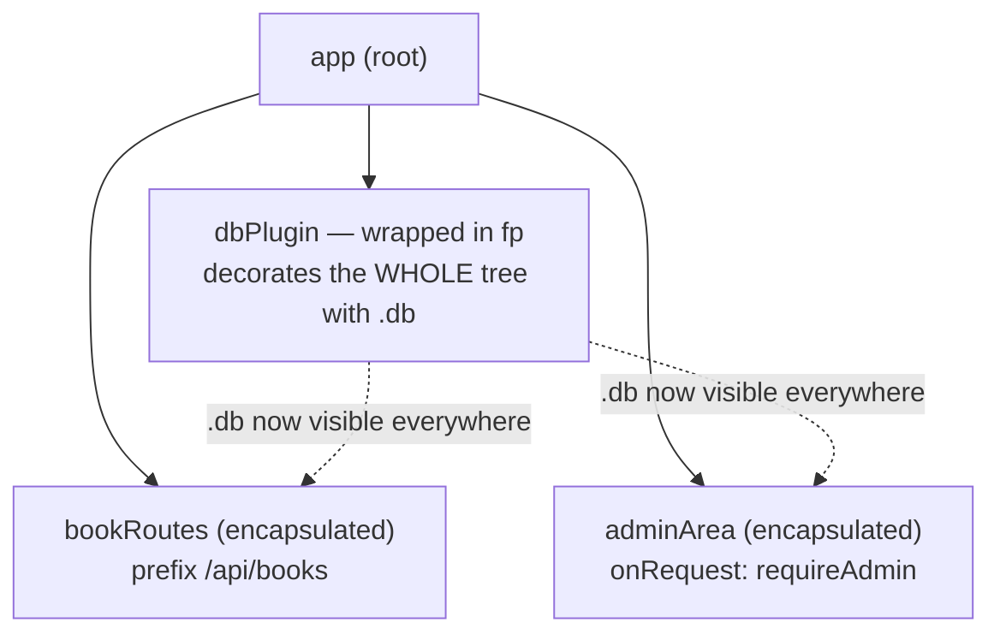

# The Plugin System

Here's the one sentence that makes Fastify click: **your whole app is a tree of plugins.** Not "an app that *can use* plugins" — the app itself, every route, every shared bit of logic, is a plugin or lives inside one. Once you hold that picture, the things that confuse newcomers (why a decorator "disappears," why two halves of the app can't see each other) stop being mysteries and become the system working exactly as designed.

> 💡 The mental model for this whole phase: **a tree of little worlds.** Each plugin is a node. Each node gets its own scope — its own routes, hooks, and decorators — and by default that scope is sealed off from its siblings and its parent. You opt *out* of the sealing on purpose, not into it.

In the last two phases you wrote routes directly on `app`. That works for a toy. The moment you have a books section, a users section, and a shared database, you want them in separate files that don't trip over each other. That's what plugins give you.

## What a plugin actually is

A plugin is just a function. Two shapes are allowed:

```javascript
// async style (preferred — Fastify awaits it)
async function myPlugin(fastify, opts) {
  // register routes, hooks, decorators here
}

// callback style (call done() when finished)
function myPlugin(fastify, opts, done) {
  // ...
  done();
}
```

*What just happened:* Fastify handed your function a `fastify` instance and an `opts` object (whatever you passed at registration time). That `fastify` argument is **not** the same object as the top-level app — it's a *child* instance scoped to this plugin. Hold that thought; it's the whole reason encapsulation works.

## Writing a real plugin: book routes

Let's pull our books routes into their own plugin. Put this in `book-routes.js`:

```javascript
async function bookRoutes(fastify, opts) {
  fastify.get('/', async () => listBooks());

  fastify.get('/:id', async (req, reply) => {
    const book = getBook(req.params.id);
    if (!book) {
      reply.code(404);
      return { error: 'Not found' };
    }
    return book;
  });

  fastify.post('/', async (req, reply) => {
    reply.code(201);
    return createBook(req.body);
  });
}

module.exports = bookRoutes;
```

*What just happened:* nothing here registers on the global app — every `fastify.get`/`fastify.post` attaches to the *child* instance for this plugin. The routes don't exist anywhere until someone registers `bookRoutes`. Notice the paths are relative (`/`, `/:id`) — we'll give them a home in the next step.

## Mounting it with `register` and a `prefix`

Back in your main file, you bring the plugin into the tree with `app.register`:

```javascript
const Fastify = require('fastify');
const bookRoutes = require('./book-routes');

const app = Fastify({ logger: true });

app.register(bookRoutes, { prefix: '/api/books' });

app.listen({ port: 3000 });
```

*What just happened:* `register` created a child instance, ran `bookRoutes` against it, and the `prefix: '/api/books'` option scoped every route inside the plugin to that path. So the plugin's `'/'` becomes `GET /api/books`, and `'/:id'` becomes `GET /api/books/:id`. The plugin doesn't know or care what prefix it lives under — you decide that at the mount point. That's reusability: register the same plugin twice under two prefixes and you get two mounted copies.

> 📝 `register` is **asynchronous** and deferred. Fastify doesn't run your plugin the instant you call `register` — it queues it and boots the whole tree when you call `listen` (or `ready`). If you ever need something to be fully wired up before continuing, `await app.ready()`.

## Encapsulation: the sealed-off scope

Here's the part that surprises people, so let's hit it head-on. Anything you register **inside** a plugin — routes, hooks, decorators, even sub-plugins — is visible to that plugin and its **children**, but invisible to its **siblings and its parent**.

Picture two plugins registered on the same app:

```javascript
app.register(async function adminArea(fastify) {
  fastify.addHook('onRequest', requireAdmin);   // auth hook
  fastify.get('/admin/stats', statsHandler);
});

app.register(async function publicArea(fastify) {
  fastify.get('/health', healthHandler);
});
```

*What just happened:* the `requireAdmin` hook is registered *inside* `adminArea`, so it guards `/admin/stats` — and **only** that subtree. It does not touch `/health`, because `publicArea` is a sibling, not a child. The auth check can't leak across. This is the feature that lets a 200-route app stay sane: each section's middleware, error handling, and decorations stay contained in its own little world. No "global middleware accidentally ran on the wrong route" bugs.

> 💡 Why this matters: in frameworks without encapsulation, registering middleware is a global act and order-of-registration becomes a minefield. In Fastify, scope is structural — where a thing lives in the tree *is* its reach.

## `decorate`: sharing things on the instance

You'll want shared resources — a database connection, a config object, a helper — available to handlers without importing them everywhere. That's `decorate`:

```javascript
const db = await connectToDatabase();

app.decorate('db', db);

app.get('/books/:id', async (req) => {
  return req.server.db.findBook(req.params.id);   // fastify.db, reachable via req.server
});
```

*What just happened:* `decorate('db', db)` hung a `db` property on the Fastify instance, so any handler in scope can reach it as `fastify.db` (and inside a handler, via `req.server.db` or by closing over `app`). There are two siblings for the request and reply objects:

```javascript
app.decorateRequest('user', null);   // adds req.user, default null
app.decorateReply('sendError', function (msg) {
  this.code(400).send({ error: msg });
});
```

*What just happened:* `decorateRequest` and `decorateReply` add properties/methods to every `request` and `reply`. Declaring `req.user` up front (with a default) is the right pattern — a hook later fills it in. And here's the catch that sets up the next section: **decorations follow the exact same encapsulation rules as everything else.** Decorate inside a plugin, and only that plugin's subtree sees it.

## The `fastify.db is undefined` trap — and `fp`

This is the single most common Fastify "why?!" moment, so let's make sure you never lose an hour to it.

You write a tidy database plugin:

```javascript
// db.js
async function dbPlugin(fastify, opts) {
  const conn = await connectToDatabase(opts.url);
  fastify.decorate('db', conn);
}

module.exports = dbPlugin;
```

Then you register it and try to use it from a sibling:

```javascript
app.register(dbPlugin, { url: process.env.DB_URL });
app.register(bookRoutes, { prefix: '/api/books' });

// inside bookRoutes: fastify.db  →  undefined  💥
```

*What just happened:* `dbPlugin` decorated its **own child instance** with `db`. By the encapsulation rules, that decoration is sealed inside `dbPlugin`'s scope. `bookRoutes` is a *sibling*, not a child — so it never sees `db`. Everything is behaving correctly; the connection is just trapped one level too deep.

⚠️ The fix is to **deliberately break encapsulation** for this one plugin using `fastify-plugin` (conventionally imported as `fp`). Wrapping a plugin in `fp` tells Fastify "don't create a sealed child scope for this — apply its decorations and hooks to the parent instead":

```javascript
// db.js
const fp = require('fastify-plugin');

async function dbPlugin(fastify, opts) {
  const conn = await connectToDatabase(opts.url);
  fastify.decorate('db', conn);
}

module.exports = fp(dbPlugin);   // ← decorations now reach the whole app
```

*What just happened:* `fp` removed the wall around `dbPlugin`. Now `decorate('db', conn)` lands on the parent app, so `bookRoutes` and every other sibling can reach `fastify.db`. This is the canonical use of `fastify-plugin`: shared infrastructure (database, auth, config) that the *whole* app legitimately needs.

> 💡 The decision rule: **leave a plugin encapsulated when it's a self-contained feature** (a routes section, an isolated subsystem). **Reach for `fp` when the plugin exists to share something app-wide.** Encapsulation is the default; `fp` is the explicit, intentional exception. If you wrap *everything* in `fp`, you've thrown away the one feature that keeps large Fastify apps from collapsing into spaghetti.

Here's the tree we just built, with the books API wired up properly:



## Recap

- **Everything is a plugin.** Your app is a *tree* of plugins; `app.register(plugin, opts)` adds a node, and a plugin is just `async (fastify, opts) => {}` (or a callback form ending in `done()`).
- A `prefix` option on `register` scopes a plugin's routes under a path — the plugin stays unaware of where it's mounted, so it's reusable.
- **Encapsulation** is the core idea: routes, hooks, and decorators registered inside a plugin reach that plugin and its children only — never siblings or the parent. That's how big apps stay isolated.
- `decorate` adds shared things to the instance (`fastify.db`); `decorateRequest`/`decorateReply` add to every request/reply. All of them obey encapsulation.
- ⚠️ A decorator trapped in a plugin's scope is the classic `fastify.db is undefined` bug. Wrap the plugin in **`fastify-plugin` (`fp`)** to deliberately share across the whole app — use it for app-wide infrastructure, not for ordinary feature plugins.

## Quick check

```quiz
[
  {
    "q": "You register dbPlugin (it calls fastify.decorate('db', conn)) and, as a sibling, bookRoutes. Inside bookRoutes, fastify.db is undefined. Why?",
    "choices": [
      "decorate only works on request objects, not the instance",
      "The decoration is sealed inside dbPlugin's encapsulated scope, and bookRoutes is a sibling, not a child",
      "You must call decorate after listen()",
      "prefix erases decorations on registered plugins"
    ],
    "answer": 1,
    "explain": "Decorations follow encapsulation. dbPlugin decorated its own child instance, so a sibling plugin never sees it. Wrapping dbPlugin in fastify-plugin (fp) applies the decoration to the parent so the whole app can use it."
  },
  {
    "q": "What does the prefix option do in app.register(bookRoutes, { prefix: '/api/books' })?",
    "choices": [
      "Renames the plugin function",
      "Mounts every route inside bookRoutes under /api/books",
      "Makes the plugin's decorators global",
      "Delays the plugin until app.ready()"
    ],
    "answer": 1,
    "explain": "prefix scopes the plugin's routes to a path, so the plugin's '/' becomes GET /api/books. The plugin itself stays unaware of its mount point, which is what makes it reusable."
  },
  {
    "q": "When should you wrap a plugin in fastify-plugin (fp)?",
    "choices": [
      "Always — every plugin should use fp",
      "Never — fp is deprecated",
      "When the plugin provides something app-wide (db, auth, config) that siblings legitimately need to share",
      "Only for plugins that define routes"
    ],
    "answer": 2,
    "explain": "fp deliberately breaks encapsulation so a plugin's decorators/hooks reach the whole tree. Use it for shared infrastructure. Wrapping everything in fp throws away the isolation that keeps large apps maintainable."
  }
]
```

---

[← Phase 2: Routing & Schemas](02-routing-and-schemas.md) · [Guide overview](_guide.md) · [Phase 4: Hooks & the Lifecycle →](04-hooks-and-lifecycle.md)