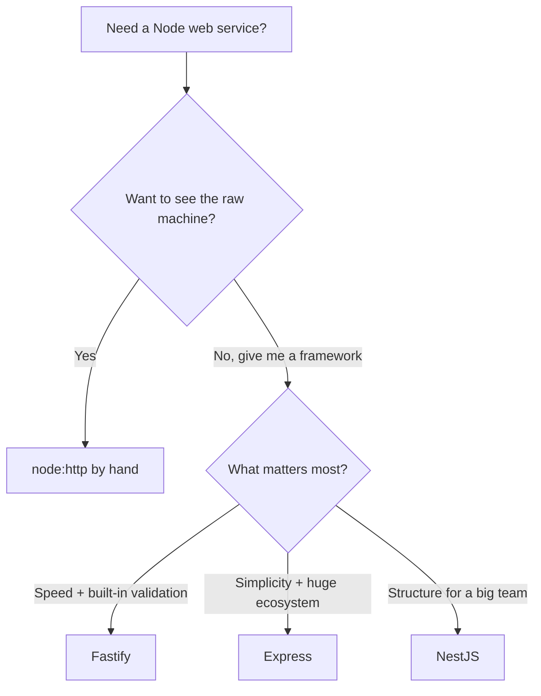

# Where to Go Next

Stop for a second and look at what you can actually do now. You can stand up a Fastify instance, declare a route as a handler plus a JSON schema and get request validation and fast response serialization for free, register encapsulated plugins so a big app stays a tidy tree instead of a tangle, hook into the request/reply lifecycle (`onRequest`, `preHandler`, and friends), build full CRUD for a resource, catch failures in one `setErrorHandler`, and test the whole thing with `app.inject()` before shipping it with real logging and config. That's a production-shaped REST API, not a toy.

And here's the quieter win. You didn't only learn one framework's API — you internalized its *personality*. Fastify is two ideas repeated everywhere: **a route is a handler plus a schema, and the app is a tree of encapsulated plugins.** Validation comes from the schema. Serialization comes from the schema. Docs can come from the schema. Structure comes from encapsulation. Once you see those two patterns, the rest of Fastify stops being a pile of features and becomes a shape you can reason about — including at 2am when something's on fire.

So this last phase isn't more handlers. It's the map: where Fastify sits among the other Node web frameworks, the plugin ecosystem you'll reach for, the TypeScript payoff that makes Fastify shine, and one concrete thing to go build.

## Fastify vs the field

You now know enough to choose a framework *on purpose* rather than by reputation. The honest truth is these tools aren't fighting over one spot — they're aimed at different sizes of problem and different tastes.



A line on each:

- **Fastify** — fast, and built around *schemas*. You declare a JSON schema once and Fastify uses it for both validation and quick serialization, with an encapsulated plugin system instead of a flat middleware list. Reach for it when raw throughput and baked-in validation matter. (You're here.)
- **Express** — minimal and everywhere. A thin layer over `node:http` that gives you routing and a `(req, res, next)` middleware chain, then leaves body parsing, auth, and validation to libraries you assemble. The biggest ecosystem and the most likely framework to meet in a Node job. See [Express From Zero](/guides/express-from-zero).
- **NestJS** — opinionated and TypeScript-first. It brings dependency injection, modules, and decorators — structure that pays off when an app and a team get large. 💡 And here's the lovely twist: Nest can run *on Fastify* as its HTTP adapter, so the speed you learned here lives underneath Nest's structure. See [NestJS From Zero](/guides/nestjs-from-zero).
- **The bare foundation** — `node:http` itself, no framework at all. Knowing what Fastify saves you starts with knowing what you'd otherwise write by hand. See [Build a Server With node:http](/guides/build-a-server-with-node-http).

> 💡 How to pick: reach for **Fastify** when you want performance plus validation and serialization built in, **Express** when you want simplicity and the largest ecosystem and you're happy wiring the pieces yourself, and **NestJS** when you want enforced structure for a large app or team. None of these is "the best" — the senior instinct isn't memorizing a winner, it's asking "best for *this* job?" and answering honestly. You can do that now.

## The plugin ecosystem you'll reach for

Fastify stays lean on purpose, and the official `@fastify/*` packages fill the gaps. They're real plugins, so they slot into the encapsulation model you already know — register them where you want their effect to apply, and that scope is respected.

- **`@fastify/cors`** — handle cross-origin requests so a browser front-end can call your API.
- **`@fastify/helmet`** — sensible security headers, set for you.
- **`@fastify/jwt`** — sign and verify JSON Web Tokens for auth. Pair it with a `preHandler` hook and you've got the same "check the request, allow or reject" pattern from Phase 4, doing a real job.
- **`@fastify/rate-limit`** — cap how often a client can hammer your routes.
- **`@fastify/postgres`** / **`@fastify/mongodb`** — a database connection decorated onto your instance, ready to use in handlers.
- **`@fastify/swagger`** — and this one is the payoff. 💡 Because your routes already carry JSON schemas, `@fastify/swagger` reads those schemas and generates an OpenAPI spec — interactive API docs — *for free*. The schema-first work you did in Phase 2 wasn't only validation insurance; it was documentation you didn't know you were writing.

That last point is worth sitting with. In Express you'd bolt on a separate tool and hand-write doc comments to describe a contract the code already knows. In Fastify, the schema *is* the single source of truth, and several plugins read from it.

## TypeScript and type providers

Fastify has strong TypeScript support out of the box, but the standout feature is the **type provider**. Normally a JSON schema gives you runtime validation, and your TypeScript types are a *separate* declaration you keep in sync by hand — two descriptions of the same shape, free to drift apart.

A type provider collapses that into one. Using `@fastify/type-provider-typebox` (or `json-schema-to-ts`), you write the schema once and Fastify *derives* the static types from it. One schema, two payoffs: runtime validation **and** compile-time types that can never disagree with what actually gets validated.

```javascript
import Fastify from 'fastify'
import { TypeBoxTypeProvider, Type } from '@fastify/type-provider-typebox'

const app = Fastify().withTypeProvider<TypeBoxTypeProvider>()

app.post('/books', {
  schema: {
    body: Type.Object({
      title: Type.String(),
      year: Type.Number()
    })
  }
}, async (request) => {
  // request.body is typed { title: string; year: number } — inferred from the schema
  return { created: request.body.title }
})
```

> 💡 If you're choosing a framework for a new TypeScript service, this is a genuine reason to pick Fastify. You stop writing the same shape twice.

For data that outlives a restart, pair Fastify with a database via an ORM or a driver — **Prisma** and **Drizzle** are popular TypeScript-first picks, and `@fastify/postgres` is right there if you want to stay close to SQL. The concept underneath them all is worth understanding before you choose one: [How an ORM Works](/guides/how-an-orm-works).

## What to build

Reading more won't make this stick. Building one real thing will. So here's the assignment, and it's deliberately concrete.

Take the **books API** you grew across this guide and carry it home:

- **Add `@fastify/swagger`** and watch it generate live docs straight from the schemas you already wrote. This is the fastest "whoa" moment in the whole stack.
- **Add `@fastify/jwt`** plus a `preHandler` hook so each request proves who it is and books can belong to a user — the Phase 4 lifecycle doing real work.
- **Swap the in-memory store for a real database** through an ORM or `@fastify/postgres` so books survive a restart. If you kept data access in its own plugin the way the guide nudged, your routes barely change — you replace the bottom layer, not the top. ([How an ORM Works](/guides/how-an-orm-works) explains the concept first.)
- **If you're in TypeScript, add a type provider** so your schemas drive your types too.

And if you want to *feel* the trade-offs instead of reading about them, here's a great exercise: **port the books API to or from [Express](/guides/express-from-zero).** Nothing teaches you what a framework gives and costs like rebuilding an app you already understand. You'll feel Express's flexibility and Fastify's schemas in your hands instead of on a comparison chart.

The honest close is the same idea you've held since Phase 0. A route is a handler plus a schema, and the app is a tree of encapsulated plugins — and now that you can see that shape, you can read *any* Fastify codebase, not only the ones you wrote. Go give the books API real docs, lock it behind auth, hand it a database, deploy it, and show someone. This is fast, validated Node, and you command it now.

## Recap

1. **You can ship a real Fastify API** — schema-validated routing, encapsulated plugins, lifecycle hooks, full CRUD, one error handler, and tests via `app.inject()` — and you understand *why* each piece works.
2. **Fastify is two ideas** — a route is a handler plus a schema, and the app is a tree of encapsulated plugins. Validation, serialization, and docs all flow from the schema.
3. **Choose a framework on purpose** — Fastify for speed plus built-in validation, Express for simplicity and the largest ecosystem, NestJS for enforced structure (and Nest can even run *on* Fastify), bare `node:http` to see the raw machine.
4. **The `@fastify/*` ecosystem fills the gaps** — cors, helmet, jwt, rate-limit, a database plugin, and `@fastify/swagger`, which turns your existing schemas into OpenAPI docs for free.
5. **Type providers are the TypeScript payoff** — write a schema once and get runtime validation *and* inferred compile-time types that can't drift apart.
6. **Build and finish one thing** — add swagger, jwt, and a database to the books API (plus a type provider in TS), or port it to/from Express to feel the trade-offs.

## Quick check

Three decisions to take with you as you leave this guide:

```quiz
[
  {
    "q": "You already declared JSON schemas on your routes. Which @fastify/* plugin turns that work into interactive API documentation for free?",
    "choices": [
      "@fastify/cors",
      "@fastify/swagger, which generates an OpenAPI spec from your route schemas",
      "@fastify/rate-limit",
      "@fastify/helmet"
    ],
    "answer": 1,
    "explain": "@fastify/swagger reads the JSON schemas your routes already carry and produces an OpenAPI spec — the schema-first payoff. cors handles cross-origin requests, rate-limit caps request frequency, and helmet sets security headers."
  },
  {
    "q": "What does a Fastify type provider (like @fastify/type-provider-typebox) give you?",
    "choices": [
      "It replaces JSON schemas with TypeScript-only validation at runtime",
      "It derives compile-time TypeScript types from your JSON schema, so one schema drives both runtime validation and static types",
      "It compiles your app to native code for speed",
      "It generates the database layer automatically"
    ],
    "answer": 1,
    "explain": "A type provider infers static types from the same JSON schema Fastify already uses for validation. You write the shape once and get both runtime validation and compile-time types that can't drift apart — a standout reason to pick Fastify in TypeScript."
  },
  {
    "q": "Your team wants NestJS's structure but doesn't want to give up Fastify's speed. What's true?",
    "choices": [
      "You can't — NestJS and Fastify are mutually exclusive",
      "NestJS can run on Fastify as its HTTP adapter, so you get Nest's structure with Fastify underneath",
      "You must rewrite Fastify schemas as Express middleware first",
      "Fastify only works with bare node:http, never inside another framework"
    ],
    "answer": 1,
    "explain": "NestJS supports Fastify as its HTTP adapter, so the performance you learned here can live underneath Nest's dependency injection and module structure. Choose the layer of structure you need without abandoning the fast core."
  }
]
```

---

[← Phase 7: Testing & Production](07-testing-and-production.md) · [Guide overview](_guide.md)
