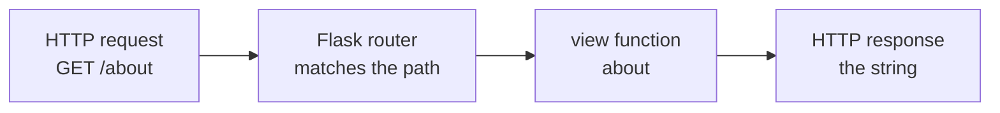

# What Flask Is & Your First App

You know [Python](/guides/python-from-zero). You can write functions, and now you want to put
something on the web — let's say a small **notes app**, where each note has a title and some
content. You could reach for a big framework that hands you a database, a login system, and an
admin panel on day one. Or you could reach for the one that hands you almost nothing on purpose,
and lets you add exactly the pieces you need: **Flask**.

Here's the one idea to hold in your head before any code. Flask's whole personality comes from a
single decision: **ship a small core and stay out of your way.** Routing, requests and responses,
and HTML templating — that's the box. Databases, authentication, forms? Those are *your* choices,
added as extensions when (and if) you need them. The payoff is total flexibility and a framework
small enough to understand top to bottom. The price is that you make more decisions yourself.

## The micro-framework philosophy

📝 **Flask** — a *micro-framework*. The "micro" doesn't mean it's for toy projects; it means the
**core is small and unopinionated**. Flask gives you URL routing, a request/response system, and
the Jinja2 template engine. Everything beyond that — talking to a database, validating forms,
logging users in — you bolt on yourself, usually via a Flask *extension* you pick.

The contrast with its sibling frameworks in this library makes "micro" concrete:

- [**Django**](/guides/django-from-zero) is *batteries-included*: an ORM, migrations, an admin
  site, and auth all ship in one box. Great for full database-backed websites, in exchange for
  learning Django's conventions.
- [**FastAPI**](/guides/fastapi-from-zero) is *API-first and async*: your type hints become
  validation and auto-generated docs. Built for modern JSON APIs.
- **Flask** is *minimal, assemble-your-own*: a tiny core you extend deliberately, piece by piece.

💡 The trade, stated honestly: a micro-framework gives you fewer conventions to learn and complete
freedom to assemble — but it also gives you more decisions to make and more wiring to do by hand as
the app grows. For a small notes app, a prototype, or learning how web frameworks actually work,
that's often exactly the right deal.

## What's under the hood

Flask isn't magic, and it didn't build everything from scratch. It stands on two well-worn
libraries, and naming them now means nothing will feel like a black box later.

📝 **Werkzeug** — the WSGI/HTTP toolkit Flask is built on. It handles the low-level web machinery:
parsing incoming requests, building responses, matching URLs to code. When Flask talks HTTP, it's
really Werkzeug doing the talking.

📝 **Jinja2** — Flask's template engine. It turns HTML files with `{{ placeholders }}` into finished
pages by filling in your data. (We'll use it properly when we render notes in a later phase.)

And one protocol ties it to the wider Python world:

📝 **WSGI** (Web Server Gateway Interface) — the standard "handshake" between a Python web app and
the web server that runs it. Flask speaks WSGI through Werkzeug; that's how a production server can
run your app without knowing it's Flask. (WSGI is a foundational concept worth a closer look on its
own — for now, just know it's the contract Flask fulfills.)

So the one-liner: **Flask = Werkzeug (web/HTTP) + Jinja2 (templates), speaking WSGI, with a small
routing layer on top.** Let's build the smallest possible one.

## Your first app

One install gets you everything in that core:

```bash
pip install flask
```

*What just happened:* `pip` pulled down Flask and its dependencies — including Werkzeug and Jinja2,
since Flask is built on them. You now have the whole micro-framework available to import.

Now the smallest app that does something. Create a file called `app.py`:

```python
from flask import Flask

app = Flask(__name__)


@app.route("/")
def index():
    return "The notes app is alive"
```

*What just happened:* `app = Flask(__name__)` creates your application object — the thing the server
runs. (`__name__` tells Flask where your app lives, so it can find templates and static files later.)
The `@app.route("/")` decorator says "when someone requests the path `/`, run the function below."
That function — called a **view** — returns a plain string, and Flask wraps it in a proper HTTP
response for you. No headers to set, no response object to build by hand.

Now run it. Flask ships a command-line tool for development:

```bash
flask run
```

```console
$ flask run
 * Serving Flask app 'app'
 * Debug mode: off
 * Running on http://127.0.0.1:5000 (Press CTRL+C to quit)
```

*What just happened:* `flask run` found your `app.py`, started a small development web server, and
bound it to `http://127.0.0.1:5000`. Open that URL in a browser (or hit it from the terminal) and
you'll get your string back:

```console
$ curl http://127.0.0.1:5000/
The notes app is alive
```

*What just happened:* the request for `/` matched your route, Flask called `index()`, took the
string it returned, and sent it back as the response body. You have a working web app in six lines
of real code.

⚠️ **The dev server is for development only.** The server `flask run` starts is convenient — it
auto-reloads when you save and shows helpful error pages — but it is *not* built for real traffic.
Don't put it in front of users. Phase 9 covers running Flask in production behind a proper WSGI
server. (There's also `app.run()` you can call from inside the script, but `flask run` is the
modern default; stick with it.)

## The decorator routing model

That `@app.route("/")` line is Flask's signature move, so let's name what it's doing.

📝 **Routing** — mapping a URL path to the function that should handle it. In Flask you do this with
the `@app.route("/path")` **decorator** placed directly above a view function. The decorator
*registers* the function with Flask's URL map; you never call the function yourself.

That last point is the whole mental model. You don't write a loop that reads the URL and decides
what to run — **Flask** reads the URL and decides which of *your* functions to call. This is the
classic [framework relationship](/guides/what-a-framework-even-is): *"don't call us, we'll call
you."* You fill in the blanks (the views); Flask runs the show and calls them at the right moment.
That's **inversion of control**, and `@app.route` is how you hand Flask the blanks to fill.

Add a second route and the pattern repeats:

```python
@app.route("/")
def index():
    return "The notes app is alive"


@app.route("/about")
def about():
    return "A tiny app for keeping notes."
```

*What just happened:* two paths, two functions, two decorators. A request to `/` runs `index()`; a
request to `/about` runs `about()`. Flask matched each incoming URL to the right view by consulting
the map those decorators built. Add a hundred routes and it's the same idea a hundred times.

Here's the path every request takes:



*One idea:* a request comes in, Flask's router matches its path against the routes you registered,
calls the matching view function, and turns whatever that view returns into the response. Every
Flask page you ever build flows along that arrow.

## Why Flask

You've now seen what makes Flask *Flask*: a small core, built on Werkzeug and Jinja2, with
decorator routing on top. So when do you reach for it?

💡 **The honest fit.** Flask shines for **small apps, prototypes, microservices, and learning.**
Because its surface is so small, almost nothing is hidden from you — which makes it arguably the
best framework for *seeing how a web framework actually works*. There's no magic ORM or auto-generated
admin obscuring the request-to-response flow; it's just routes, views, and templates you can read
end to end. (Reach for [Django](/guides/django-from-zero) when you want batteries included for a
full website, or [FastAPI](/guides/fastapi-from-zero) when you're building a typed, async JSON API.)

That small surface is exactly why it's a great place to learn. Next, we go deeper on the piece you
just met — **routing and views** — so that paths can carry data (like a note's id), handle different
HTTP methods, and return more than a bare string.

## Recap

1. **Flask is a micro-framework:** its small core is routing + request/response + Jinja2 templates.
   Databases, auth, and forms are extensions *you* choose and add.
2. The trade vs. siblings: **Django** is batteries-included (full websites), **FastAPI** is
   async/API-first (typed JSON APIs), **Flask** is minimal assemble-your-own (max flexibility, more
   decisions).
3. Under the hood, Flask is built on **Werkzeug** (WSGI/HTTP toolkit) and **Jinja2** (templates),
   and speaks **WSGI** — the standard contract between a Python app and the server that runs it.
4. A first app is tiny: `app = Flask(__name__)`, an `@app.route("/")` view returning a string, run
   with `flask run`. ⚠️ The dev server is for development only — never production.
5. **Decorator routing** is Flask's signature: `@app.route("/path")` maps a URL to a view function.
   Flask calls your view — *"don't call us, we'll call you"* — the inversion-of-control idea.
6. **Flask fits** small apps, prototypes, microservices, and learning — its small surface means
   little is hidden, so it's the clearest framework for seeing how web frameworks work.

## Quick check

Three questions on the ideas that have to stick — what "micro" means, how routing works, and what
Flask is built on:

```quiz
[
  {
    "q": "What does it mean that Flask is a 'micro-framework'?",
    "choices": [
      "Its core is small — routing, requests/responses, and templates — and you add things like a database or auth yourself via extensions",
      "It can only be used for tiny, throwaway projects",
      "It ships an ORM, admin panel, and auth in one box like Django",
      "It runs faster because it's compiled to machine code"
    ],
    "answer": 0,
    "explain": "'Micro' means the core is small and unopinionated, not that the apps must be small. Flask gives you routing, request/response, and Jinja2 templates; databases, auth, and forms are extensions you choose and add."
  },
  {
    "q": "What does the `@app.route(\"/about\")` decorator do?",
    "choices": [
      "Registers the function below it as the view that runs when a request comes in for the path /about",
      "Immediately calls the function and prints its return value",
      "Creates a new database table named 'about'",
      "Starts the development web server on the /about path"
    ],
    "answer": 0,
    "explain": "@app.route maps a URL path to a view function by registering it in Flask's URL map. You never call the view yourself — Flask matches the incoming URL and calls it for you. That's inversion of control."
  },
  {
    "q": "Which two libraries is Flask built on, and what does each handle?",
    "choices": [
      "Werkzeug (WSGI/HTTP machinery) and Jinja2 (HTML templates)",
      "Starlette (web) and Pydantic (validation)",
      "Django ORM (database) and SQLite (storage)",
      "Uvicorn (server) and asyncio (concurrency)"
    ],
    "answer": 0,
    "explain": "Flask stands on Werkzeug, which handles the low-level WSGI/HTTP work (parsing requests, building responses, matching URLs), and Jinja2, its template engine. Starlette + Pydantic is FastAPI's stack, not Flask's."
  }
]
```

---

[Guide overview](_guide.md) · [Phase 2: Routing & Views →](02-routing-and-views.md)
