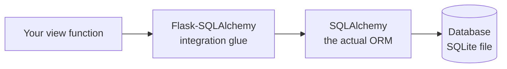

# Working with a Database

Until now our notes have lived in a Python list, so they evaporate the instant you restart the server. That was fine for learning request handling, but no real app remembers its data by holding it in a variable. We need to *persist* — write notes somewhere that survives a restart, a crash, a deploy. That somewhere is a database, and this phase teaches Flask to talk to one.

📝 **Flask has no built-in database layer.** Unlike Django, which ships its own ORM as part of the framework, Flask's core knows nothing about SQL, tables, or rows — deliberately. Flask is a small core plus whatever you choose to bolt on. Want a database? You *add* an extension. This phase is the clearest, most concrete look you'll get at that philosophy: "Flask = small core + chosen extensions," played out with the most popular choice, Flask-SQLAlchemy.

## The extension philosophy, made concrete

📝 An **ORM** (Object-Relational Mapper) maps your objects to database rows and back. You work with a `Note` object in Python; the ORM figures out the `INSERT`, `SELECT`, and `UPDATE` statements that move it in and out of a table. If that idea is new, the [Hibernate & JPA guide](/guides/hibernate-and-jpa-from-zero) walks through the object-vs-table "impedance mismatch" in depth (Java, but the concept is identical), and [what a database actually is](/guides/what-a-database-is) covers the tables-rows-columns foundation underneath it.

Python's premier ORM is **SQLAlchemy** — a standalone library that works with or without Flask. **Flask-SQLAlchemy** is a thin *integration layer*: it doesn't reinvent the ORM, it wires SQLAlchemy into Flask's app and request lifecycle so the two cooperate cleanly. SQLAlchemy does the heavy lifting; Flask-SQLAlchemy just makes it feel native to Flask.



*What just happened:* the diagram is the whole stack. Your view talks to Flask-SQLAlchemy, the glue; the glue hands off to SQLAlchemy, the real ORM; SQLAlchemy generates SQL and runs it against the database. Flask itself isn't in this chain — it gained database powers purely by *adding an extension*.

First, install it (this pulls SQLAlchemy in as a dependency):

```console
$ pip install Flask-SQLAlchemy
```

*What just happened:* one package, and your Flask app can now speak to a database. Nothing about Flask's core changed — you extended it from the outside.

## Setup: wiring the extension into the app

The extension needs two things: where the database lives, and a handle (`db`) you'll use everywhere to talk to it.

```python
from flask import Flask
from flask_sqlalchemy import SQLAlchemy

app = Flask(__name__)

# Where the database lives. SQLite = a single file on disk, perfect for learning.
app.config["SQLALCHEMY_DATABASE_URI"] = "sqlite:///notes.db"

# Create the extension and bind it to this app.
db = SQLAlchemy(app)
```

*What just happened:* the config line is a **connection URI** — `sqlite:///notes.db` means "use SQLite, stored in a file called `notes.db` next to the app." (Swap that string for a `postgresql://...` URI later and almost nothing else changes.) `db = SQLAlchemy(app)` creates the extension and hands it the app so it can hook into Flask's lifecycle: a database **session per request** — a fresh workspace that opens when a request arrives and closes when the response goes out. You don't manage that plumbing; the extension does.

💡 That `db` object is your gateway to everything — defining models, querying, saving. By convention it lives at module level so the rest of your app can import it.

## Defining a model

A model is a Python class that describes one table. Our notes app needs exactly one: a `Note` with an id, a title, and some content.

```python
class Note(db.Model):
    id = db.Column(db.Integer, primary_key=True)
    title = db.Column(db.String(120), nullable=False)
    content = db.Column(db.Text, nullable=False)

    def __repr__(self):
        return f"<Note {self.id}: {self.title}>"
```

*What just happened:* by inheriting from `db.Model`, `Note` becomes a mapped entity — SQLAlchemy now knows this class corresponds to a table. Each `db.Column` is one column: `id` is an auto-incrementing integer **primary key**, `title` is a short string capped at 120 characters, and `content` is `Text` for longer, unbounded writing. `nullable=False` means the database refuses to store a note missing that field. `__repr__` is just for readable debugging.

That class *implies* a table. The `CREATE TABLE` SQLAlchemy generates for it looks like this:

```sql
CREATE TABLE note (
    id INTEGER NOT NULL PRIMARY KEY,
    title VARCHAR(120) NOT NULL,
    content TEXT NOT NULL
);
```

*What just happened:* this is the table your `Note` class describes, written in the database's own language. The mapping is one-to-one: class → table (`note`), attribute → column, `db.String(120)` → `VARCHAR(120)`, `nullable=False` → `NOT NULL`. You never write this SQL by hand. To actually create the table:

```python
with app.app_context():
    db.create_all()
```

*What just happened:* `db.create_all()` looks at every model you've defined and creates any tables that don't yet exist. It runs inside an **app context** because the extension needs to know *which* app's database to build against — a detail that matters once you have more than one app, covered next phase.

## CRUD: the four things you do to data

CRUD is Create, Read, Update, Delete — the four operations every data-backed app performs. With the model in place, each one is a few lines, and the SQL stays invisible. Let's wire them into the note views from [Phase 4](04-forms-and-request-data.md), where notes used to go into a list.

**Create** — make an object, add it to the session, commit:

```python
@app.route("/notes", methods=["POST"])
def create_note():
    note = Note(title=request.form["title"], content=request.form["content"])
    db.session.add(note)      # stage it in the session
    db.session.commit()       # write it to the database for real
    return redirect(url_for("list_notes"))
```

*What just happened:* you build a plain `Note` object from the submitted form data, then `db.session.add(note)` *stages* it — pending, not yet saved. `db.session.commit()` is the moment it actually hits the database (SQLAlchemy generates the `INSERT`). After commit, `note.id` is populated automatically. The redirect-after-POST pattern from Phase 4 still applies.

**Read** — fetch all notes, or one:

```python
@app.route("/notes")
def list_notes():
    notes = Note.query.all()                     # SELECT * FROM note
    return render_template("notes.html", notes=notes)

@app.route("/notes/<int:note_id>")
def show_note(note_id):
    note = Note.query.get_or_404(note_id)        # fetch by PK, or 404
    return render_template("note.html", note=note)
```

*What just happened:* `Note.query` is your query entry point. `.all()` runs a `SELECT` and returns every row as a list of `Note` objects — the ORM's whole promise. `.get_or_404(note_id)` looks up a single note by primary key and, if none exists, raises a 404 instead of returning `None` and letting a later line crash. Need to filter on a non-key column? `Note.query.filter_by(title="Groceries").all()` runs a `SELECT ... WHERE title = ?`.

**Update and Delete** — both go through the session and finish with a commit:

```python
# Update: change the object, then commit.
note = Note.query.get_or_404(note_id)
note.title = "Updated title"
db.session.commit()           # SQLAlchemy notices the change and runs UPDATE

# Delete: remove from the session, then commit.
db.session.delete(note)
db.session.commit()           # runs DELETE
```

*What just happened:* for an update you don't call a "save" method — you just *mutate the object* and commit. SQLAlchemy tracks which loaded objects changed and generates the `UPDATE` for exactly those. Delete is symmetric with add: `db.session.delete(note)` stages the removal, and `commit()` makes it real. The session is the common thread through all four operations.

## The session, migrations, and the gotchas worth knowing now

📝 **`db.session` is the unit of work.** Think of it as a notepad of pending changes — adds, deletes, and modifications to loaded objects. Nothing touches the real database until you `commit()`. This is the single most important habit:

⚠️ **No commit, no persistence.** Forget `db.session.commit()` and your `add` quietly does nothing durable — the request ends, the session is discarded, and your note is gone. The mirror-image habit is `db.session.rollback()`: if something goes wrong mid-request, roll back to throw away the half-finished pending changes so the next request starts clean. Commit on success; roll back on error.

⚠️ **`create_all()` only creates *missing* tables — it never alters existing ones.** Add a `created_at` column to `Note` and `create_all()` will see the already-existing `note` table and do nothing. Schema changes to a live table are handled by **Flask-Migrate** (a Flask wrapper around Alembic, SQLAlchemy's migration tool), which generates and versions the `ALTER TABLE` steps. `create_all()` is a fine starting line; it's not how you change a schema later.

⚠️ **The N+1 trap is still here.** The moment your `Note` grows a relationship — say each note belongs to a notebook — looping over notes and touching `note.notebook` can fire one extra query *per note*. One query becomes N+1, and your list page slows to a crawl as data grows. It's the most common ORM performance bug across every language; the [why is my query slow](/guides/why-is-my-query-slow) guide unpacks how to spot and fix it.

💡 Your notes app *persists* now — restart the server and they're still there. You got there by **adding an extension** and letting it integrate cleanly: Flask's defining philosophy, worked end to end. That same pattern — small core, chosen extensions — is what the next phase scales up.

## Recap

1. **Flask ships no ORM** — unlike Django, you add one. This is the purest example of "Flask = small core + chosen extensions."
2. **Flask-SQLAlchemy is integration glue** over SQLAlchemy (Python's real ORM); it wires a per-request session into Flask's lifecycle so the ORM feels native.
3. **A model is a class** inheriting `db.Model`, with `db.Column` attributes mapping one-to-one to table columns; `db.create_all()` builds the tables.
4. **CRUD flows through `db.session`**: `add` + `commit` to create, `Note.query.all()` / `get_or_404()` / `filter_by()` to read, mutate-then-commit to update, `delete` + `commit` to remove.
5. ⚠️ **No commit, no persistence** — `db.session` holds pending changes until you `commit()`; `rollback()` on error. And `create_all()` never alters existing tables — schema changes need Flask-Migrate (Alembic).
6. ⚠️ The **N+1 query trap** applies the moment you add relationships — the same ORM gotcha you'd hit in any language.

## Quick check

Three questions on the ideas that have to stick before Phase 6:

```quiz
[
  {
    "q": "Why does Flask need Flask-SQLAlchemy at all, instead of having a database layer built in?",
    "choices": [
      "Flask's core ships no ORM by design — it's a small core, and you add database support as an extension",
      "Flask has a built-in ORM but it's deprecated, so you replace it with Flask-SQLAlchemy",
      "Flask-SQLAlchemy is required to run any Flask app, database or not",
      "Flask can only talk to SQLite, so the extension adds support for other databases"
    ],
    "answer": 0,
    "explain": "Unlike Django, Flask deliberately ships no ORM. It's a small core plus chosen extensions; Flask-SQLAlchemy is the extension you add to gain database support, integrating the standalone SQLAlchemy ORM into Flask's lifecycle."
  },
  {
    "q": "You call db.session.add(note) in a view but never call commit(). What happens to the note?",
    "choices": [
      "Nothing durable — the change stays pending in the session and is discarded when the request ends, so the note is not saved",
      "It is saved immediately, because add() writes to the database right away",
      "Flask raises an error at the end of the request forcing you to commit",
      "It is saved, but only to memory, and reloaded automatically next startup"
    ],
    "answer": 0,
    "explain": "db.session is the unit of work: add() only stages a pending change. Nothing hits the database until commit(). Without it, the session is discarded at request's end and the note is lost — commit on success, rollback on error."
  },
  {
    "q": "You add a new column to your Note model and run db.create_all() again. The column doesn't appear. Why?",
    "choices": [
      "create_all() only creates tables that don't already exist — it never alters an existing table; schema changes need a migration tool like Flask-Migrate",
      "You forgot to commit the session after create_all()",
      "create_all() can only be run once per database, ever",
      "SQLite doesn't support adding columns, so you must switch to PostgreSQL"
    ],
    "answer": 0,
    "explain": "create_all() builds only missing tables. The note table already exists, so it does nothing. Evolving an existing schema (adding columns, etc.) is handled by Flask-Migrate (Alembic), which generates versioned ALTER TABLE steps."
  }
]
```

---

[← Phase 4: Forms & Request Data](04-forms-and-request-data.md) · [Guide overview](_guide.md) · [Phase 6: Blueprints & the App Factory →](06-blueprints-and-app-factory.md)