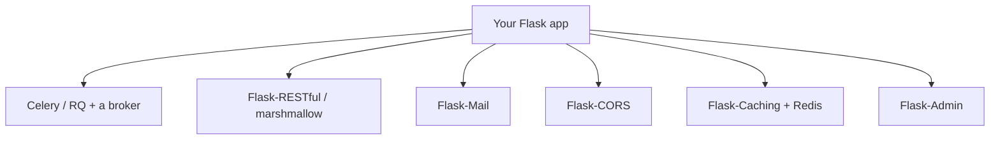

# Where to Go Next

Stop and look at what you can actually do now. You can stand up a Flask app, route URLs to view functions, read the request and shape the response, render HTML with Jinja2, handle forms with CSRF protection, persist data through Flask-SQLAlchemy, structure a growing project with blueprints and an app factory, log people in with sessions and Flask-Login, serve a JSON API with `jsonify`, and prove it all works with the test client and pytest before deploying behind a real WSGI server. That's not a toy — that's a real application.

Here's the quietly bigger win: because Flask's core is so small, you didn't just learn a framework — you saw what a framework *is*. A router mapping URLs to functions, a request coming in, a response going out, templates for HTML, everything else bolted on as an extension you chose. Nothing was hidden behind a wall of conventions.

So this last phase isn't more decorators. It's the map: the extensions you'll reach for next, an honest word about async, where Flask sits among the other Python frameworks, and one concrete thing to go build.

## The extension landscape

Flask gives you a small core, and *you* compose the stack you need from extensions — why the ecosystem matters as much as the framework. Here are the branches you'll meet first.



A line on each:

- **Celery / RQ** — background and scheduled work. When a job is slow, needs retrying, or must survive a restart (sending a batch of emails, processing an upload), hand it to an external worker fronted by a **message broker** (usually Redis). Your view drops the job and returns immediately.
- **Flask-RESTful / marshmallow** — richer APIs. Once your JSON endpoints grow past `jsonify`, these give you structured resources, request parsing, and serialization/validation schemas.
- **Flask-Mail** — sending email, with sensible defaults for SMTP and attachments.
- **Flask-CORS** — cross-origin requests, added the day a separate frontend needs to call your API from the browser.
- **Flask-Caching** — caching expensive results, usually backed by **Redis**, to take load off your database.
- **Flask-Admin** — a quick admin interface over your models, without building one from scratch.

💡 You don't need any of these on day one. The skill is recognizing the *shape* of the problem and knowing there's a well-worn extension for it.

## A word on async

You'll eventually hear that Flask "supports async," and that's true — you can write `async def` view functions in modern Flask. But be honest about what's underneath: Flask is a **WSGI** framework, synchronous at heart. It runs your async view by spinning up an event loop for that one request, which helps for the occasional `await` but doesn't turn Flask into a high-concurrency async server.

📝 If your workload is genuinely async-heavy — lots of concurrent connections, streaming, talking to many slow services at once — you'll be happier on an **ASGI** framework built for it from the ground up, like [FastAPI](/guides/fastapi-from-zero). Flask's async support is a convenience, not a foundation.

## The honest framework map

You now know enough to choose a framework *on purpose* rather than by habit. None of these is "better" — they're aimed at different jobs. 💡 The honest version:

- **Flask** — small apps, prototypes, microservices, and learning. Pick it for a small core and full control over the stack. (You're here.)
- **Django** — when you want **batteries included**: a built-in admin, a mature ORM, auth, and a thousand conventions for a big application. If you'd otherwise rebuild half of Django out of Flask extensions, just use [Django](/guides/django-from-zero).
- **FastAPI** — async, validation-heavy **APIs**, where type hints drive request parsing, response shaping, and auto-generated docs. See [FastAPI From Zero](/guides/fastapi-from-zero).

Knowing all three means you stop arguing about which is "best" and start asking "best for *this*?" That's a senior instinct, and you've got the pieces for it now.

## What to build next

Reading more won't make this stick. Building one real thing will. Here's the assignment, and it's deliberately concrete.

Take the **notes app** you grew across this guide and carry it all the way home:

- Add **authentication** so each user has their own notes (Flask-Login, sessions, hashed passwords).
- Add a **JSON API** alongside the HTML pages, so the same data is available to other clients.
- Add a **test suite** with pytest and the test client, covering the routes that matter.
- **Structure** it properly with **blueprints** and an **app factory**, the way a real Flask project is laid out.
- **Deploy** it with **gunicorn**, `DEBUG=False`, behind a reverse proxy — somewhere you can hit it from your phone.

That single project exercises nearly everything you learned, and finishing it teaches you more than three more tutorials would. When you want the canonical reference, the **official Flask documentation** is excellent and genuinely readable, and **the Flask Mega-Tutorial** (Miguel Grinberg's) is the long-form, build-along classic the community sends everyone to.

Flask's smallness wasn't a limitation, it was the lesson. Because nothing was hidden, you now see the whole machine — the router, the request, the response, the template, and the extensions you chose to bolt on. Go finish the notes app, deploy it, and show someone. You're ready.

## Recap

1. **You can ship a real Flask app** — routed, templated, form-handling, database-backed, blueprint-structured, authenticated, tested, and deployed — plus a JSON API. And you understand *why* each piece works, because Flask hid nothing.
2. **Compose your stack from extensions** — Celery/RQ for background work, Flask-RESTful/marshmallow for richer APIs, Flask-Mail, Flask-CORS, Flask-Caching (Redis), Flask-Admin. The skill is matching the problem's shape to the right extension.
3. **Async, honestly** — Flask runs `async def` views, but it's a synchronous WSGI framework at heart. For genuinely async-heavy workloads, an ASGI framework like FastAPI fits better.
4. **Choose a framework on purpose** — Flask for small/prototype/microservice/full-control, Django for batteries-included big apps, FastAPI for async validation-heavy APIs. Knowing all three lets you pick for *this* job.
5. **Build one thing and finish it** — carry the notes app to a deployed, authenticated, tested, JSON-API-having, blueprint-structured app served by gunicorn. Lean on the official docs and the Flask Mega-Tutorial.

## Quick check

Three decisions to take with you as you leave this guide:

```quiz
[
  {
    "q": "You need to send a batch of emails that's slow, must be retried on failure, and must survive a restart. What fits best in a Flask app?",
    "choices": [
      "An async def view that awaits the email send inline",
      "An external worker like Celery or RQ fronted by a broker such as Redis",
      "A Jinja2 template that renders the emails",
      "Flask-CORS, since email crosses origins"
    ],
    "answer": 1,
    "explain": "Slow, retryable, restart-surviving work belongs on an external worker (Celery / RQ) backed by a message broker like Redis. The view drops the job on the broker and returns immediately."
  },
  {
    "q": "Which statement about Flask and async is the honest one?",
    "choices": [
      "Flask is fully async and matches FastAPI for concurrency",
      "Flask cannot run async def views at all",
      "Flask supports async def views but is a synchronous WSGI framework at heart; for async-heavy workloads an ASGI framework like FastAPI fits better",
      "Async views in Flask require Django"
    ],
    "answer": 2,
    "explain": "Modern Flask runs async def views by spinning up an event loop per request, but it's WSGI and synchronous underneath. Heavily concurrent/async workloads are a better fit for an ASGI framework like FastAPI."
  },
  {
    "q": "You're building a large web application and want a built-in admin, a mature ORM, and auth handed to you out of the box. Which framework is the on-purpose choice?",
    "choices": [
      "Flask, because it's the micro-framework",
      "Django, because it's batteries-included",
      "FastAPI, because it's async",
      "It doesn't matter; they're interchangeable"
    ],
    "answer": 1,
    "explain": "Django is batteries-included: admin, ORM, auth, and conventions for a full application. Flask shines for small apps and full control; FastAPI for async, validation-heavy APIs."
  }
]
```

---

[← Phase 9: Testing & Production](09-testing-and-production.md) · [Guide overview](_guide.md)
