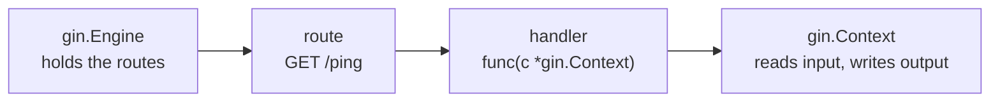

# What Gin Is & Your First Server

You know [Go](/guides/go-from-zero), and you want to put something on the web. Here's the honest
truth: Go can already do that with nothing but its standard library. The `net/http` package gives you
a working HTTP server in a handful of lines — no framework required. We even have a whole guide on it:
[Web Services with Only net/http](/guides/web-services-with-only-net-http).

So why reach for Gin at all? Because once you go past "hello world," the stdlib makes you hand-roll the
boring, repetitive parts: your own routing logic to tell `/tasks/42` apart from `/tasks`, JSON marshalled
by hand with the `Content-Type` header set every time, your own middleware plumbing for logging and panic
recovery. None of it is *hard*, exactly — it's just the same wiring, written again, on every project.

💡 **Gin does the boring parts and stays out of the way.** It's the most popular Go web framework: a
*thin, fast* layer over `net/http` that hands you a real router, JSON helpers, and middleware — without
hiding the standard library underneath. Gin is small. Once you've seen it, it reads as "net/http with
the tedious bits done for you," not magic.

## The mental model: engine holds the routes, context handles the request

Before any code, hold these two things in your head. They are the whole framework.

📝 **The engine** (`*gin.Engine`) is your application. It's the object you create once, register all
your routes on, and then run. When people say "the Gin app," they mean the engine.

📝 **The context** (`*gin.Context`) is one value handed to you for *each incoming request*. It carries
the request, the response writer, the URL parameters, and all the helpers you use to read input and
write output. Every handler you write takes exactly one argument: a `*gin.Context`.

Say it to yourself once: **engine holds the routes, context handles the request.** With those two
ideas, the rest of Gin is just details.



*One idea:* the engine matches an incoming request to a route, calls that route's handler, and the
handler uses the context to send a response. Every Gin endpoint you ever build flows along that arrow.

## Your first server

First, install Gin into your module. From inside your Go project:

```bash
go get github.com/gin-gonic/gin
```

*What just happened:* `go get` downloaded Gin and added it to your `go.mod`/`go.sum`. The import path
is `github.com/gin-gonic/gin`, and you refer to it in code as the `gin` package. That one command is
the whole install.

Now the smallest server that does something real. Create a file called `main.go`:

```go
package main

import "github.com/gin-gonic/gin"

func main() {
	r := gin.Default()
	r.GET("/ping", func(c *gin.Context) {
		c.JSON(200, gin.H{"message": "pong"})
	})
	r.Run(":8080") // listens on :8080
}
```

*What just happened:* line by line —
- `gin.Default()` creates the **engine** and returns a `*gin.Engine`. We name it `r` (for "router").
- `r.GET("/ping", ...)` registers a **route**: when a `GET` request arrives for the path `/ping`, run
  the function we pass. That function is the **handler**, and its signature — `func(c *gin.Context)` —
  is the shape every Gin handler has.
- Inside the handler, `c.JSON(200, ...)` uses the **context** to write the response: it sets the
  HTTP status to `200`, sets the `Content-Type` to `application/json`, serializes the value to JSON,
  and sends it. Three chores, one call.
- `gin.H{"message": "pong"}` is the body. `gin.H` is Gin's shorthand for `map[string]any` — a quick
  way to build a JSON object without declaring a struct.
- `r.Run(":8080")` starts the server listening on port 8080. It blocks here, handling requests until
  you stop the program.

Run it like any Go program:

```bash
go run main.go
```

```console
$ go run main.go
[GIN-debug] Listening and serving HTTP on :8080
```

*What just happened:* `go run` compiled and started your program, and `r.Run` brought up the server.
Gin printed some startup logs (we trimmed them) and is now waiting for requests. Leave it running and,
in another terminal, hit the route:

```console
$ curl localhost:8080/ping
{"message":"pong"}
```

*What just happened:* `curl` sent a `GET /ping`. The engine matched it to your route, called your
handler, and the handler used the context to write back JSON. You have a working JSON API in twelve
lines of real code.

💡 `r.Run(addr)` is a small convenience over the standard library's `http.ListenAndServe` — same
result, less typing. With no argument, `r.Run()` defaults to `:8080`. Passing `":8080"` is just being
explicit about it.

## `gin.Default()` vs `gin.New()`

You'll see two ways to create the engine, and the difference is worth knowing on day one.

📝 **`gin.New()`** returns a *bare* engine — no extra behavior, just routing. **`gin.Default()`**
returns an engine with two pieces of **middleware** already attached: a **Logger** and a **Recovery**
handler. (Middleware is code that runs around every request; Phase 5 covers it properly.)

What those two give you:
- **Logger** prints a tidy line for every request — method, path, status code, and how long it took.
  That's the `[GIN]` output you saw scrolling by. It's how you *see* your server working.
- **Recovery** catches a panic inside any handler, turns it into a clean `500` response, and keeps
  the server alive. Without it, one panicking handler takes down the whole process.

```go
r := gin.Default() // Logger + Recovery, already wired
// vs.
r := gin.New()     // bare engine, you add what you want
```

*What just happened:* both give you a `*gin.Engine` you register routes on; `Default()` additionally starts
you with the two pieces of middleware almost every app wants. ⚠️ For learning and most apps, reach for
`gin.Default()`. Use `gin.New()` only when you deliberately want to control the middleware stack
yourself — otherwise you'll lose request logging and crash protection and wonder why your server
went quiet (or died).

## A second route, to make the flow stick

Engine → route → context → JSON. Add one more route and watch the same pattern repeat:

```go
func main() {
	r := gin.Default()

	r.GET("/ping", func(c *gin.Context) {
		c.JSON(200, gin.H{"message": "pong"})
	})

	r.GET("/health", func(c *gin.Context) {
		c.JSON(200, gin.H{"status": "ok", "service": "tasks-api"})
	})

	r.Run(":8080")
}
```

*What just happened:* a second `r.GET` registered a second route on the same engine. A request to
`/health` runs its own handler, which builds a slightly bigger `gin.H` and sends it as JSON:

```console
$ curl localhost:8080/health
{"status":"ok","service":"tasks-api"}
```

Two routes, two handlers, one engine — and the context does the response work in both. Add a hundred
routes and it's the same idea a hundred times. That repetition is the point: once you've got the
shape, every endpoint is familiar.

## The running example: a tasks API

We won't keep writing throwaway `/ping` routes. Across this guide we'll grow one real service: a
small **tasks API**. The core of it is a single type — a task with an id, a title, and a done flag:

```go
type Task struct {
	ID    int    `json:"id"`
	Title string `json:"title"`
	Done  bool   `json:"done"`
}
```

*What just happened:* we declared the `Task` struct that the whole guide builds on. Those `json:"..."`
**struct tags** tell Gin what to call each field when it reads or writes JSON — so `Title` becomes
`"title"` in the response, not `"Title"`. (Tags do real work in both directions; binding incoming JSON
in Phase 3 leans on them too.) Here's the type returning itself through the now-familiar flow:

```go
r.GET("/tasks/sample", func(c *gin.Context) {
	t := Task{ID: 1, Title: "Read the Gin guide", Done: false}
	c.JSON(200, t)
})
```

*What just happened:* the handler built a `Task`, and `c.JSON` serialized it using those tags — no
`gin.H` needed when you already have a struct. Hit it and you get clean JSON back:

```console
$ curl localhost:8080/tasks/sample
{"id":1,"title":"Read the Gin guide","done":false}
```

By the end of the guide this grows into full create/read/update/delete over a real collection of
tasks. For now, you've met the cast: an **engine**, a **route**, a **handler**, a **context**, and
the **`Task`** we'll spend the next eight phases turning into a proper REST API. Next up: routing —
path params, query params, wildcards, and grouping routes so they don't sprawl.

## Recap

- **Gin is a thin, fast layer over `net/http`.** Go can serve HTTP with just the stdlib, but Gin does
  the repetitive parts — routing, JSON, middleware — without hiding what's underneath.
- **The mental model is two things:** the **engine** (`*gin.Engine`) holds your routes; the
  **context** (`*gin.Context`) handles each request. Every handler is `func(c *gin.Context)`.
- **A first server is tiny:** `gin.Default()` makes the engine, `r.GET(path, handler)` registers a
  route, `c.JSON(200, ...)` writes the response, and `r.Run(":8080")` starts listening. Run with
  `go run main.go`, test with `curl`.
- **`gin.Default()` vs `gin.New()`:** `Default()` ships with Logger (per-request log lines) and
  Recovery (catch panics, return 500, stay alive). `New()` is bare. ⚠️ Prefer `Default()` unless you
  have a reason not to.
- **`gin.H` is `map[string]any`** — quick JSON without a struct. For real data, define a struct with
  `json:"..."` tags and pass it straight to `c.JSON`.
- **The throughline:** engine → route → handler → context → response. We'll grow one **tasks API**
  along that arrow for the rest of the guide.

## Quick check

Three questions on the ideas that have to stick — what Gin is, the engine/context split, and how a
first server fits together:

```quiz
[
  {
    "q": "What is the relationship between the engine (*gin.Engine) and the context (*gin.Context)?",
    "choices": [
      "The engine is the application that holds your routes; the context is handed to a handler for each request and carries the request and response helpers",
      "The engine and context are the same object with two names",
      "The context holds the routes and the engine handles each request",
      "The context is a database connection and the engine is the HTTP server"
    ],
    "answer": 0,
    "explain": "Engine holds the routes, context handles the request. You create one engine, register routes on it, and run it; each incoming request gets a *gin.Context with the request, response writer, params, and helpers. Every handler is func(c *gin.Context)."
  },
  {
    "q": "What does `gin.Default()` give you that `gin.New()` does not?",
    "choices": [
      "Logger and Recovery middleware already attached — per-request log lines, plus catching panics into a 500 instead of crashing",
      "A built-in database and ORM",
      "Faster routing because it compiles routes to machine code",
      "Automatic HTTPS certificates"
    ],
    "answer": 0,
    "explain": "gin.New() returns a bare engine. gin.Default() returns one with Logger (the per-request log lines) and Recovery (turns a handler panic into a clean 500 and keeps the server alive) already wired up. Most apps want Default()."
  },
  {
    "q": "In `c.JSON(200, gin.H{\"message\": \"pong\"})`, what is `gin.H`?",
    "choices": [
      "Shorthand for map[string]any, a quick way to build a JSON object without declaring a struct",
      "A required header that every Gin response must set",
      "The name of the HTTP handler function",
      "A special Gin type that connects to the database"
    ],
    "answer": 0,
    "explain": "gin.H is just an alias for map[string]any. It's a convenient way to assemble a JSON body inline. When you already have a struct (with json tags), you can pass it straight to c.JSON instead."
  }
]
```

---

[Guide overview](_guide.md) · [Phase 2: Routing & Route Groups →](02-routing-and-groups.md)
