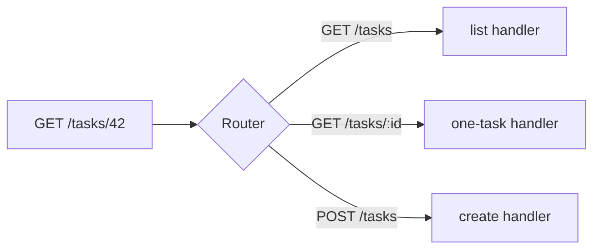

# Routing & Route Groups

In Phase 1 you got a server running with a single route. Now we make it answer many requests, each one different. The whole job of a router is one decision, made very fast, on every request: *which handler runs?* Get the mental model for that decision and routing stops feeling like a pile of syntax and starts feeling like a lookup table you control.

## The mental model: method + path → handler

A route is a tiny rule with three parts: an **HTTP method**, a **path**, and a **handler**. When a request arrives, Gin reads the method and the path off it and finds the one route whose method and path match. That handler runs. Nothing else does.



> 📝 The same path with a different method is a *different* route. `GET /tasks` (list them) and `POST /tasks` (create one) live side by side, each with its own handler. That's not a quirk — it's how REST works, and Gin leans into it.

Two things make Gin's router pleasant. First, it's fast: under the hood it's a **radix tree** (think of it as a prefix-shared lookup tree), so matching stays quick even with hundreds of routes. Second, the path can contain **placeholders** — `/tasks/:id` matches `/tasks/42` *and* `/tasks/99` — so you don't register a route per task. We'll get there in a moment.

## Registering methods

Every HTTP method has a method on the engine. They all take the same two arguments: a path and a handler.

```go
package main

import "github.com/gin-gonic/gin"

type Task struct {
	ID    int    `json:"id"`
	Title string `json:"title"`
	Done  bool   `json:"done"`
}

var tasks = []Task{
	{ID: 1, Title: "Write the routing chapter", Done: true},
	{ID: 2, Title: "Ship the tasks API", Done: false},
}

func main() {
	r := gin.Default()

	r.GET("/tasks", func(c *gin.Context) {
		c.JSON(200, tasks)
	})

	r.POST("/tasks", func(c *gin.Context) {
		c.JSON(201, gin.H{"message": "created (we'll wire this up in Phase 3)"})
	})

	r.Run(":8080")
}
```

*What just happened:* We registered two routes that share the path `/tasks` but differ by method. `r.GET` answers list requests; `r.POST` answers create requests. `gin.H` is just Gin's shorthand for `map[string]interface{}` — a quick way to hand back a JSON object. The full set of method helpers is `r.GET`, `r.POST`, `r.PUT`, `r.PATCH`, `r.DELETE`, `r.HEAD`, and `r.OPTIONS`. There's also `r.Any(path, handler)` to match *every* method on one path, and `r.Handle(method, path, handler)` if you want to pass the method as a string.

Run it and try both:

```bash
go run main.go
# in another terminal:
curl http://localhost:8080/tasks
curl -X POST http://localhost:8080/tasks
```

> 💡 Reach for `r.Any` rarely. Being explicit about methods is a feature — it means a `DELETE` to a read-only endpoint gets a clean 405 instead of silently running your read handler.

## Path params: the `:name` placeholder

To fetch one task you need its id *from the URL*. That's what a path param is for. Put a colon before a segment name and Gin captures whatever sits there.

```go
r.GET("/tasks/:id", func(c *gin.Context) {
	id := c.Param("id") // a string, always

	for _, t := range tasks {
		if fmt.Sprintf("%d", t.ID) == id {
			c.JSON(200, t)
			return
		}
	}
	c.JSON(404, gin.H{"error": "task not found"})
})
```

*What just happened:* `:id` is a named slot. A request to `/tasks/2` makes `c.Param("id")` return the string `"2"`. We compare it against each task's id and return the match, or a 404 if nothing matches. The key detail: **`c.Param` always gives you a string** — the URL has no idea your ids are integers. When you need a real `int`, convert it yourself with `strconv.Atoi` (and handle the error, because someone *will* request `/tasks/banana`).

```bash
curl http://localhost:8080/tasks/2
# {"id":2,"title":"Ship the tasks API","done":false}
curl http://localhost:8080/tasks/999
# {"error":"task not found"}
```

> ⚠️ A path param matches exactly *one* segment. `/tasks/:id` matches `/tasks/2` but **not** `/tasks/2/comments` — that's a different route you'd register separately. When you genuinely need to match the rest of the path, you need a wildcard.

### Wildcards: matching the rest of the path

Sometimes the tail of the URL is open-ended — serving files, say, where the path can be `reports/q1/summary.pdf`. A `*name` segment captures everything from that point on.

```go
r.GET("/files/*filepath", func(c *gin.Context) {
	c.JSON(200, gin.H{"requested": c.Param("filepath")})
})
```

*What just happened:* `*filepath` is a catch-all. A request to `/files/reports/q1.pdf` sets `c.Param("filepath")` to `/reports/q1.pdf`. Two things to remember: it must be the **last** segment in the path, and **the captured value includes the leading slash**. Use it deliberately — for one id, `:id` is the right tool; the wildcard is for genuinely variable tails.

## Query params: everything after the `?`

Path params identify *which* resource. Query params tune *how* you want it — filters, pagination, search terms. They live after the `?` in the URL and Gin reads them off the context, never out of the path.

```go
r.GET("/tasks", func(c *gin.Context) {
	done := c.Query("done")            // "" if the param is absent
	page := c.DefaultQuery("page", "1") // falls back to "1"
	wantTags := c.QueryArray("tag")     // repeated ?tag=a&tag=b -> ["a", "b"]

	c.JSON(200, gin.H{
		"filter_done": done,
		"page":        page,
		"tags":        wantTags,
	})
})
```

*What just happened:* For a request to `/tasks?done=true&tag=work&tag=urgent`, `c.Query("done")` returns `"true"`, `c.DefaultQuery("page", "1")` returns `"1"` (since `page` wasn't sent), and `c.QueryArray("tag")` returns `["work", "urgent"]`. The three helpers cover the cases you actually hit: `c.Query` for an optional value (empty string when missing), `c.DefaultQuery` when absence has a sensible default, and `c.QueryArray` for a param that can repeat.

```bash
curl "http://localhost:8080/tasks?done=true&tag=work&tag=urgent"
# {"filter_done":"true","page":"1","tags":["work","urgent"]}
```

> 💡 Need to tell "absent" apart from "sent but empty" — `?q=` versus no `q` at all? Use `value, ok := c.GetQuery("q")`. The `ok` is `false` only when the param is truly missing, which matters for things like a search box that legitimately sends an empty string.

Like `c.Param`, every query helper returns a **string**. Converting `"true"` into a real `bool` or `"1"` into an `int` is your job — and that conversion-and-validation work is exactly what Phase 3 hands off to Gin's binding system, so you'll write less of it by hand soon.

## Route groups: stop repeating yourself

Real APIs version their URLs — `/api/v1/tasks`, `/api/v1/tasks/:id`, and so on. Typing `/api/v1` in front of every route is tedious and easy to get wrong. A **route group** is a shared path prefix: declare it once, register routes against the group, and Gin glues the prefix onto each.

```go
func main() {
	r := gin.Default()

	v1 := r.Group("/api/v1")
	{
		v1.GET("/tasks", listTasks)
		v1.GET("/tasks/:id", getTask)
		v1.POST("/tasks", createTask)
	}

	r.Run(":8080")
}
```

*What just happened:* `r.Group("/api/v1")` returns a group whose prefix is `/api/v1`. Every route registered on `v1` inherits that prefix, so `v1.GET("/tasks", ...)` actually serves `GET /api/v1/tasks`. The `{ }` braces are pure style — Go doesn't require them — but they visually bundle the group's routes together, which most Gin codebases do. Change the version in one place and every route moves with it.

Groups **nest**, too. You can group inside a group when one slice of your API needs a deeper prefix:

```go
v1 := r.Group("/api/v1")
admin := v1.Group("/admin")
admin.GET("/tasks", listAllTasks) // GET /api/v1/admin/tasks
```

*What just happened:* `admin` is a group built from `v1`, so its prefix stacks: `/api/v1` + `/admin`. The route ends up at `/api/v1/admin/tasks`. Prefixes compose exactly the way you'd hope — each level adds its piece.

There's one more reason groups matter, and it's the bigger one: a group can carry its own **middleware** with `v1.Use(...)`, so every route in that group runs the same auth check, logger, or rate limiter without you wiring it onto each handler. That's the whole point of grouping `/api/v1/admin` separately — it's where the "must be an admin" check lives. We'll build middleware properly in [Phase 5](05-middleware.md); for now, just hold the idea that *a group is a shared prefix and a shared pipeline*.

> ⚠️ **The classic startup panic.** Gin's radix-tree router won't let you register a static segment and a wildcard that conflict at the same spot. Declaring both `r.GET("/tasks/new", ...)` and `r.GET("/tasks/:id", ...)` is fine (Gin resolves `new` before falling back to `:id`), but mixing a wildcard with a param at the same level — like `/files/:name` and `/files/*path` together — **panics when the server starts**, not when a request arrives. The upside: you find out the instant you run it, not in production.

## Recap

- A route is **method + path → handler**; the same path under a different HTTP method is a separate route, each with its own handler.
- Every method has a helper (`r.GET`, `r.POST`, `r.PUT`, `r.PATCH`, `r.DELETE`, `r.HEAD`, `r.OPTIONS`), plus `r.Any` and `r.Handle`.
- Path params (`:id`, read with `c.Param("id")`) capture one segment; a wildcard (`*filepath`) captures the rest of the path and includes the leading slash. Both come back as strings.
- Query params come from after the `?`: `c.Query` (empty if absent), `c.DefaultQuery` (with a fallback), `c.QueryArray` (repeated values), and `c.GetQuery` (value + an `ok` for "was it sent?").
- A route group is a shared path prefix you declare once; groups nest and can carry their own middleware — the foundation for versioning like `/api/v1`.
- Conflicting wildcard/param routes at the same level panic at startup, so you catch the mistake immediately.

## Quick check

Test the mental model before moving on:

```quiz
[
  {
    "q": "A request comes in as POST /tasks. Which route handles it?",
    "choices": ["r.GET(\"/tasks\", ...)", "r.POST(\"/tasks\", ...)", "Both, in registration order", "Whichever was registered first"],
    "answer": 1,
    "explain": "A route is method + path. POST /tasks only matches the route registered with r.POST on that path; the GET route on the same path is a separate route."
  },
  {
    "q": "For a request to /tasks/42, what does c.Param(\"id\") return given the route /tasks/:id?",
    "choices": ["The integer 42", "The string \"42\"", "nil until you convert it", "An error you must handle"],
    "answer": 1,
    "explain": "Path params always come back as strings. If you need a real int, convert it yourself with strconv.Atoi and handle the error."
  },
  {
    "q": "You write v1 := r.Group(\"/api/v1\") then v1.GET(\"/tasks\", ...). What URL does that route serve?",
    "choices": ["/tasks", "/v1/tasks", "/api/v1/tasks", "/api/tasks"],
    "answer": 2,
    "explain": "A group prepends its prefix to every route registered on it, so v1.GET(\"/tasks\") serves GET /api/v1/tasks."
  }
]
```

---

[← Phase 1: What Gin Is & Your First Server](01-what-gin-is.md) · [Guide overview](_guide.md) · [Phase 3: Binding & Validating Input →](03-binding-and-validation.md)